# 🏪 Livraria Virtual UCP

> **Demonstração de Comércio Autônomo com Agentes de IA**
>
> 📍 Apresentado no [**AI Tinkerers São Paulo**](https://saopaulo.aitinkerers.org/)
>
> 👤 **Author:** Thiago Mascarenhas

🇺🇸 **English version available:** [README_ENG.md](README_ENG.md)

[](https://github.com/anthropics/ucp)
[](https://google.github.io/A2A/)
[](https://github.com/anthropics/ap2)
[](https://modelcontextprotocol.io/)

---

## 🌍 A Transformação Cognitiva do Comércio

Estamos vivendo uma **mudança de paradigma**. Assim como a internet transformou o comércio físico em e-commerce, os agentes de IA estão transformando o e-commerce em **comércio cognitivo** (ou agêntico).

```
1995: Catálogos físicos → Sites de e-commerce
2025: Sites para humanos → Protocolos para agentes
```

### Demo


Uploading VIDEO-2026-02-10-08-35-28.mp4…


> 🎬 [Download Demo Video](docs/VIDEO-2026-02-10-08-35-28.mp4)

### O Problema Atual

Hoje, mesmo com LLMs avançados, fazer uma compra online requer:
- Um humano navegando interfaces visuais
- Copiar/colar informações entre sistemas
- Digitar dados de cartão manualmente
- Aprovar cada transação individualmente

**Os agentes de IA não conseguem participar do comércio de forma autônoma.**

### A Solução: Protocolos Abertos

Este projeto demonstra como **três protocolos complementares** resolvem esse problema:

| Protocolo | Problema que Resolve | Analogia |
|-----------|---------------------|----------|
| **UCP** | Como um agente descobre e interage com lojas? | "DNS do comércio" |
| **A2A** | Como agentes conversam entre si? | "HTTP dos agentes" |
| **AP2** | Como autorizar pagamentos sem credenciais? | "OAuth dos pagamentos" |

### Impacto no Comércio

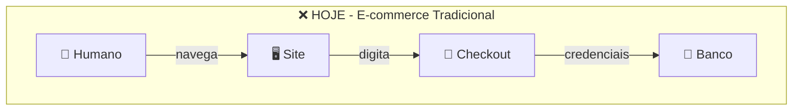

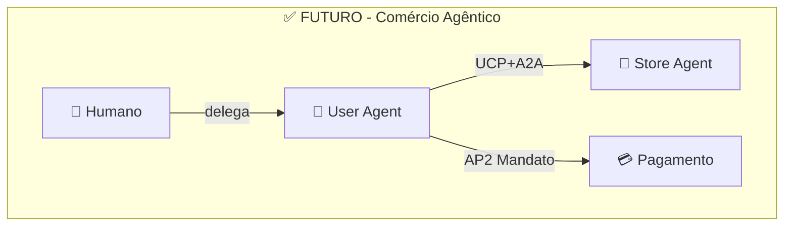

**Diferenças:**
| Aspecto | Hoje | Futuro |
|---------|------|--------|
| Interface | Visual obrigatória | Sem interface |
| Credenciais | Expostas | Mandatos criptográficos |
| Aprovação | Manual por transação | Limites pré-autorizados |

### Por que isso importa?

1. **Escala** - Agentes podem comparar 1000 lojas em segundos
2. **Eficiência** - Compras recorrentes totalmente automatizadas
3. **Segurança** - Mandatos com escopo limitado, não senhas
4. **Acessibilidade** - Pessoas com dificuldades podem delegar compras
5. **Novos negócios** - Lojas "API-first" sem frontend

---

## 🎯 O Projeto

Uma implementação **funcional e completa** de uma livraria virtual que demonstra:

- **UCP Server**: Backend compatível com o Universal Commerce Protocol
- **Store Agent**: Agente da loja com LangGraph + LLM (Gemini)
- **User Agent**: Cliente autônomo com CLI e API
- **Frontend**: Interface React para visualização e testes
- **FlowVisualizer**: Demonstração animada de uma venda real

### Cenário Demonstrado

> *"Quero comprar um livro de Python"*

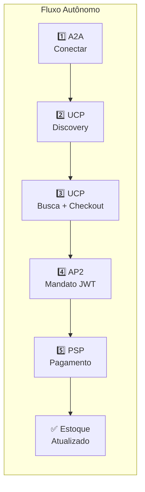

**Tudo isso acontece autonomamente, sem intervenção humana.**

---

## 🏗️ Arquitetura

### Visão de Contexto

O sistema suporta **dois modos de interação** - essa é a chave do comércio agêntico:

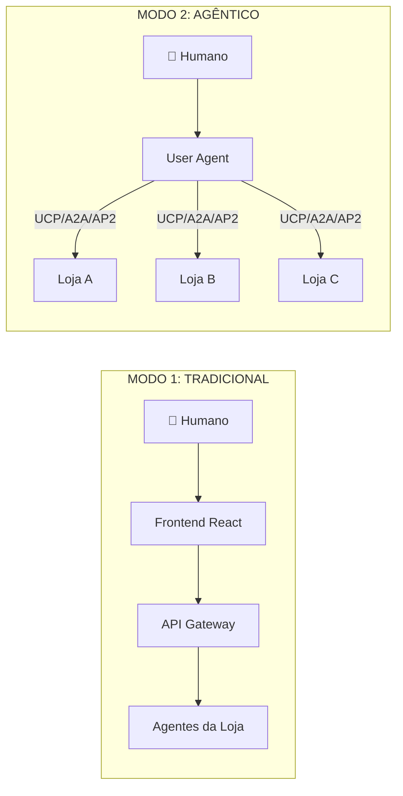

### Diagrama de Componentes

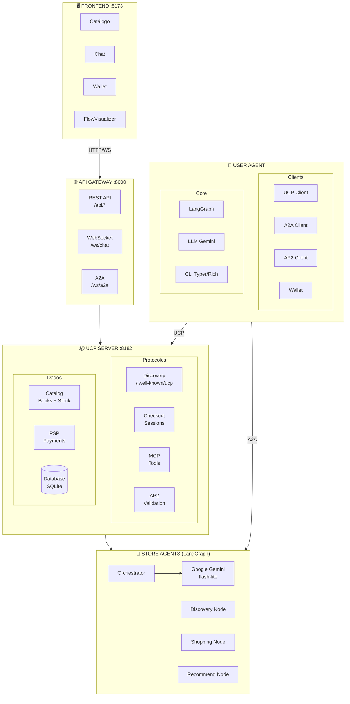

### Sequência Completa de uma Compra Autônoma

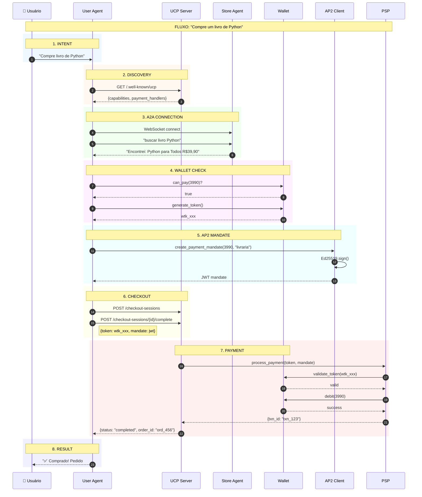

### Fluxo de Protocolos

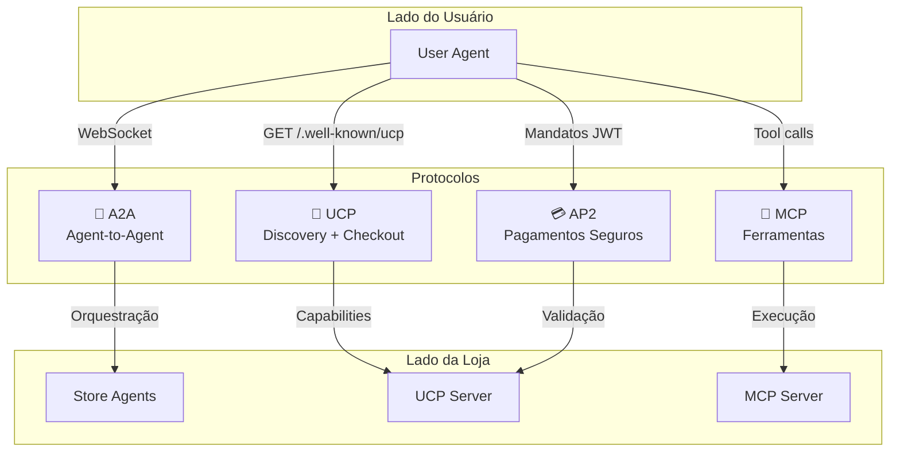

### Protocolos por Fase

| Fase | Protocolo | Ação | Segurança |
|------|-----------|------|-----------|
| 1. Intent | - | Usuário expressa desejo | - |
| 2. Discovery | **UCP** | `GET /.well-known/ucp` | TLS |
| 3. Comunicação | **A2A** | WebSocket bidirecional | Agent Cards |
| 4. Saldo | Wallet API | Verificar e gerar token | Token interno |
| 5. Autorização | **AP2** | Mandato JWT (Ed25519) | Assinatura criptográfica |
| 6. Checkout | **UCP** | Session + Complete | Headers UCP |
| 7. Pagamento | PSP | Processar com token | Validação AP2 |
| 8. Resultado | A2A/CLI | Notificar usuário | - |

### Vantagens do Modelo Agêntico

| Aspecto | E-commerce Tradicional | Comércio Agêntico |
|---------|------------------------|-------------------|
| **Interface** | Obrigatória (GUI) | Opcional (pode ser só API) |
| **Descoberta** | Manual, loja por loja | Automática via UCP |
| **Comparação** | Usuário abre N abas | Agente consulta N lojas em paralelo |
| **Checkout** | Preencher formulários | Automático com mandato |
| **Pagamento** | Credenciais expostas | Mandato com escopo limitado |
| **Multi-loja** | Processos separados | Unificado pelo agente |

📖 **Arquitetura completa:** [`docs/architecture/`](docs/architecture/)

---

## 🔌 Protocolos Implementados

### 🛒 UCP - Universal Commerce Protocol

> *"O DNS do Comércio"*

O **UCP** resolve o problema fundamental: **como um agente descobre e interage com uma loja?**

Hoje, cada e-commerce tem sua própria API (ou nenhuma). Um agente precisaria ser programado especificamente para cada loja. O UCP padroniza isso:

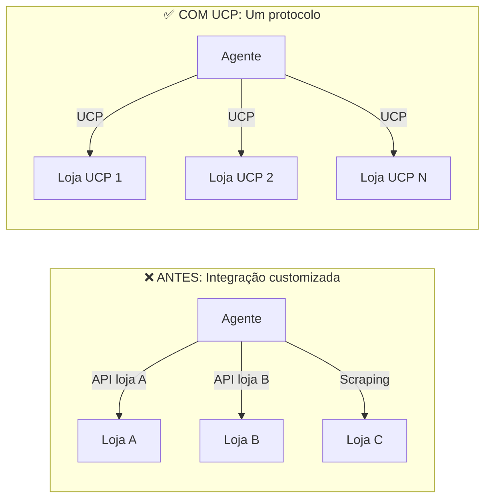

**Funcionalidades implementadas:**
- **Discovery**: `/.well-known/ucp` expõe capacidades
- **Catálogo**: Busca e navegação padronizadas
- **Checkout Sessions**: Carrinho, preços, impostos
- **Payment Handlers**: Integração com processadores

```bash
# Descobrir capacidades de uma loja
curl http://localhost:8182/.well-known/ucp

# Resposta: versão, endpoints, payment handlers...
```

📖 **Spec oficial:** [github.com/anthropics/ucp](https://github.com/anthropics/ucp) | **Documentação:** [`backend/src/ucp_server/ucp.md`](backend/src/ucp_server/ucp.md)

---

### 🤖 A2A - Agent-to-Agent Protocol

> *"O HTTP dos Agentes"*

O **A2A** resolve: **como agentes conversam entre si?**

LLMs precisam de contexto, intenções, capacidades. REST não foi feito para isso. A2A define:

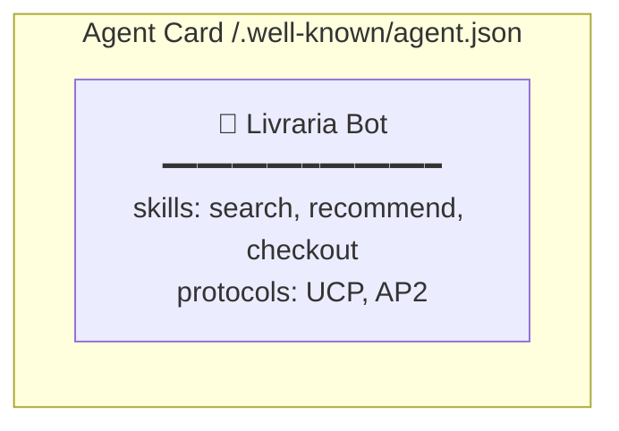

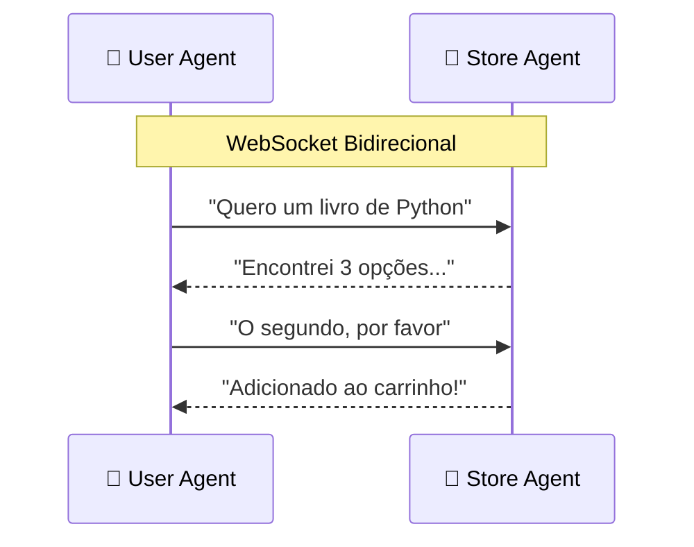

**Funcionalidades implementadas:**
- **Agent Cards**: Autodescoberta de capacidades
- **WebSocket**: Conexão persistente para diálogo
- **Skills**: Ações tipadas (buscar, recomendar, comprar)
- **Streaming**: Respostas em tempo real

```python
# User Agent conectando ao Store Agent
client = A2AClient("http://localhost:8000")
await client.connect()
response = await client.request("search", {"query": "Python"})
```

📖 **Spec oficial:** [google.github.io/A2A](https://google.github.io/A2A/) | **Documentação:** [`backend/src/agents/a2a/a2a.md`](backend/src/agents/a2a/a2a.md)

---

### 💳 AP2 - Agent Payments Protocol v2

> *"O OAuth dos Pagamentos"*

O **AP2** resolve o problema mais crítico: **como um agente paga sem ter suas credenciais?**

Você não daria seu cartão de crédito a um bot. Mas e se pudesse dar um **mandato limitado**?

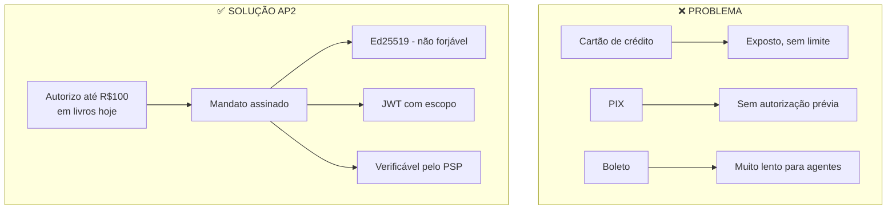

**Fluxo de 3 Mandatos:**

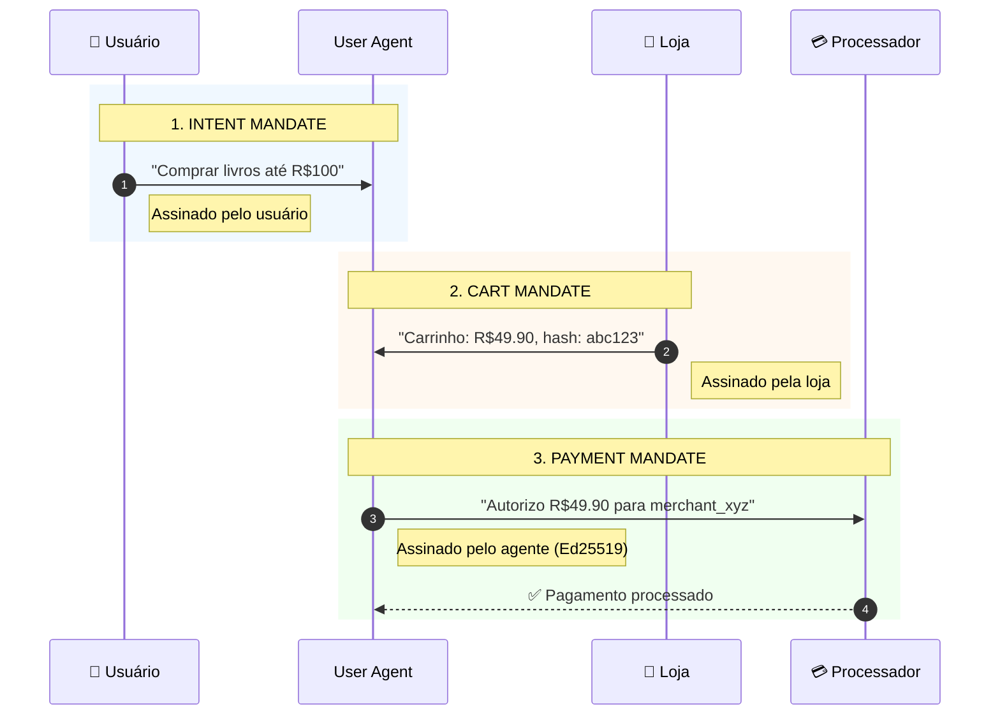

**Tecnologia:**
- **Ed25519** - Assinaturas EdDSA (mais seguras que RSA)
- **JWT** - Claims estruturados e verificáveis
- **Escopo** - Limite de valor, merchant, tempo
- Validação criptográfica end-to-end

```python
# Criar mandato de pagamento
mandate = ap2.create_payment_mandate(
    cart_id="sess_123",
    cart_total=3990,
    merchant_id="http://livraria.local"
)
# mandate.jwt contém a autorização assinada
```

📖 **Documentação:** [`user_agent/src/security/ap2.md`](user_agent/src/security/ap2.md)

---

### 🔧 MCP - Model Context Protocol

O **MCP** (da Anthropic) permite que LLMs acessem ferramentas externas de forma padronizada, com progressive disclosure.

**Ferramentas Disponíveis:**
| Ferramenta | Descrição |
|------------|-----------|
| `search_books` | Buscar livros por termo |
| `get_book_details` | Detalhes de um livro |
| `add_to_cart` | Adicionar ao carrinho |
| `view_cart` | Ver carrinho atual |
| `apply_discount` | Aplicar cupom |
| `create_checkout` | Iniciar checkout |
| `complete_checkout` | Finalizar compra |

📖 **Documentação:** [`backend/src/mcp/tools/tools.md`](backend/src/mcp/tools/tools.md)

---

## 🎬 Demonstração Interativa (FlowVisualizer)

O projeto inclui uma **demonstração visual interativa** que mostra o fluxo completo de uma venda real usando todos os protocolos.

### Como Acessar

1. Acesse http://localhost:5173
2. Clique no botão **"Demonstração Interativa: Venda Real com A2A + UCP + AP2"**
3. Clique em **Play** para iniciar a animação

### Fluxo Completo (27 Passos)

O FlowVisualizer executa uma **venda real** enquanto anima visualmente cada passo:

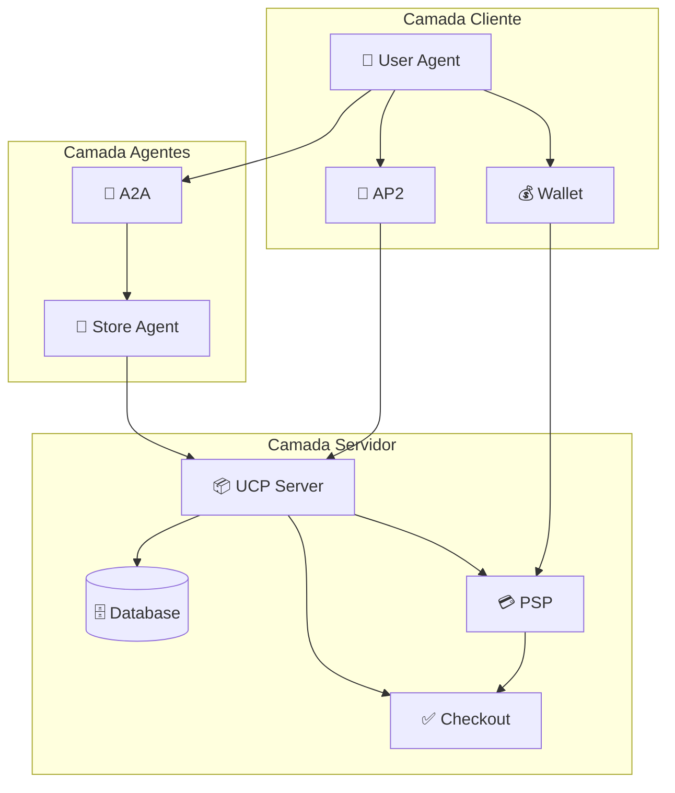

#### Fase 1: Conexão e Discovery (Passos 1-4)
| # | De | Para | Protocolo | Ação |
|---|-----|------|-----------|------|
| 1 | User Agent | A2A | A2A | Conectar ao Store Agent |
| 2 | A2A | Store Agent | A2A | Handshake |
| 3 | Store Agent | UCP | UCP | Discovery (`GET /.well-known/ucp`) |
| 4 | UCP | Store Agent | UCP | Retorna capabilities |

#### Fase 2: Busca e Seleção (Passos 5-8)
| # | De | Para | Protocolo | Ação |
|---|-----|------|-----------|------|
| 5 | User Agent | Store Agent | A2A | Buscar produto |
| 6 | Store Agent | UCP | UCP | Search products |
| 7 | UCP | Store Agent | UCP | Retorna lista |
| 8 | User Agent | Store Agent | A2A | Selecionar item |

#### Fase 3: Carteira e Token (Passos 9-12)
| # | De | Para | Protocolo | Ação |
|---|-----|------|-----------|------|
| 9 | User Agent | Wallet | Wallet | Verificar saldo |
| 10 | Wallet | User Agent | Wallet | Saldo OK |
| 11 | User Agent | Wallet | Wallet | Gerar token |
| 12 | Wallet | User Agent | Wallet | Token criado (`wtk_xxx`) |

#### Fase 4: Mandatos AP2 (Passos 13-14)
| # | De | Para | Protocolo | Ação |
|---|-----|------|-----------|------|
| 13 | User Agent | AP2 | AP2 | Intent Mandate (assinatura Ed25519) |
| 14 | User Agent | AP2 | AP2 | Payment Mandate (JWT) |

#### Fase 5: Checkout UCP (Passos 15-17)
| # | De | Para | Protocolo | Ação |
|---|-----|------|-----------|------|
| 15 | Store Agent | UCP | UCP | Create Checkout Session |
| 16 | UCP | Store Agent | UCP | Session criada (`sess_xxx`) |
| 17 | AP2 | UCP | UCP+AP2 | Complete Checkout com mandato |

#### Fase 6: Pagamento PSP (Passos 18-23)
| # | De | Para | Protocolo | Ação |
|---|-----|------|-----------|------|
| 18 | UCP | PSP | PSP | Process Payment |
| 19 | PSP | Wallet | PSP | Validar token |
| 20 | Wallet | PSP | PSP | Token válido |
| 21 | PSP | Wallet | PSP | Debitar carteira |
| 22 | Wallet | PSP | PSP | Débito confirmado |
| 23 | PSP | UCP | PSP | Pagamento completo (`txn_xxx`) |

#### Fase 7: Finalização (Passos 24-27)
| # | De | Para | Protocolo | Ação |
|---|-----|------|-----------|------|
| 24 | UCP | Database | SQL | Debitar estoque |
| 25 | Database | UCP | SQL | Estoque atualizado |
| 26 | UCP | Checkout | UCP | Checkout completo |
| 27 | User Agent | Wallet | Wallet | Registrar transação |

### Resultado

Ao final da demonstração:
- ✅ **Venda real executada** no backend
- ✅ **Estoque decrementado** no banco de dados
- ✅ **Saldo debitado** da carteira virtual
- ✅ **Transação registrada** no PSP

📖 **Documentação:** [`frontend/front.md`](frontend/front.md) (seção FlowVisualizer)

---

## 🚀 Início Rápido

### Pré-requisitos

| Software | Versão |
|----------|--------|
| Python | 3.11+ |
| Node.js | 18+ |
| npm | 9+ |
| Git | 2.30+ |

### Instalação e Execução

```bash
# 1. Clonar repositório
git clone <repo-url>
cd FuturesUCP

# 2. Tornar scripts executáveis
chmod +x scripts/*.sh

# 3. Executar setup completo
./scripts/setup.sh

# 4. Iniciar demo (todos os serviços)
./scripts/demo.sh
```

### Executar Individualmente

```bash
# Terminal 1: Backend (API + UCP + Agents)
./scripts/start_backend.sh

# Terminal 2: Frontend (React)
./scripts/start_frontend.sh

# Terminal 3: User Agent CLI (opcional)
./scripts/start_user_agent.sh
```

---

## 📍 Endpoints

| Serviço | URL | Descrição |
|---------|-----|-----------|
| **Frontend** | http://localhost:5173 | Interface web React |
| **API Gateway** | http://localhost:8000 | API REST + WebSocket |
| **UCP Server** | http://localhost:8182 | Servidor UCP |
| **UCP Discovery** | http://localhost:8182/.well-known/ucp | Perfil da loja |
| **Agent Card** | http://localhost:8000/.well-known/agent.json | Capacidades do agente |

---

## 💬 Usando o Sistema

### Interface Web

1. Acesse http://localhost:5173
2. Navegue pelo catálogo de livros
3. Converse com o assistente via chat
4. Adicione livros ao carrinho
5. Finalize a compra com checkout UCP

### Comandos do Chat

```
"buscar livros de Python"
"me recomende ficção científica"
"adicionar ao carrinho"
"ver meu carrinho"
"aplicar cupom PROMO10"
"finalizar compra"
```

### User Agent CLI

```bash
# Chat interativo
python -m src.cli chat --store http://localhost:8182

# Descobrir loja
python -m src.cli discover http://localhost:8182

# Buscar produtos
python -m src.cli search "python" --store http://localhost:8182

# Comprar diretamente
python -m src.cli buy book_001 --qty 2
```

---

## 📁 Estrutura do Projeto

```
FuturesUCP/
├── backend/                    # Backend Python
│   └── src/
│       ├── agents/            # Store Agents (LangGraph + Gemini)
│       ├── ucp_server/        # Servidor UCP completo
│       ├── mcp/               # Servidor MCP (7 ferramentas)
│       ├── security/          # AP2 Security (Ed25519 + JWT)
│       └── db/                # SQLite + repositories
│
├── frontend/                   # Frontend React
│   └── src/
│       ├── components/        # React components
│       ├── hooks/             # Custom hooks (WebSocket, Checkout)
│       └── store/             # Zustand state
│
├── user_agent/                 # User Agent (Cliente Autônomo)
│   └── src/
│       ├── agent/             # LangGraph agent
│       ├── clients/           # UCP, A2A, MCP clients
│       ├── security/          # AP2 client
│       └── wallet/            # Carteira virtual
│
├── docs/                       # Documentação completa
│   ├── guide.md               # Guia de instalação
│   ├── techSpec.md            # Especificação técnica
│   ├── CHANGELOG.md           # Histórico de mudanças
│   ├── listdocs.md            # Lista de documentações
│   └── architecture/          # Diagramas C4
│
└── scripts/                    # Scripts de execução
```

---

## 📚 Documentação Completa

### Guias
| Documento | Descrição |
|-----------|-----------|
| [`docs/guide.md`](docs/guide.md) | Guia completo de instalação e execução |
| [`docs/techSpec.md`](docs/techSpec.md) | Especificação técnica detalhada |
| [`docs/listdocs.md`](docs/listdocs.md) | Índice de todas as documentações |

### Arquitetura (Modelo C4)
| Documento | Nível | Descrição |
|-----------|-------|-----------|
| [`docs/architecture/README.md`](docs/architecture/README.md) | Índice | Visão geral da arquitetura |
| [`docs/architecture/overview.md`](docs/architecture/overview.md) | C4 L1 | Diagrama de Contexto |
| [`docs/architecture/containers.md`](docs/architecture/containers.md) | C4 L2 | Diagrama de Containers |
| [`docs/architecture/components.md`](docs/architecture/components.md) | C4 L3 | Diagrama de Componentes |
| [`docs/architecture/flows.md`](docs/architecture/flows.md) | - | Diagramas de Sequência |
| [`docs/architecture/data-model.md`](docs/architecture/data-model.md) | - | Modelo de Dados |

### Backend
| Documento | Descrição |
|-----------|-----------|
| [`backend/src/src.md`](backend/src/src.md) | Visão geral do backend |
| [`backend/src/ucp_server/ucp.md`](backend/src/ucp_server/ucp.md) | Servidor UCP |
| [`backend/src/agents/agents.md`](backend/src/agents/agents.md) | Sistema de agentes |
| [`backend/src/mcp/mcp.md`](backend/src/mcp/mcp.md) | Servidor MCP |
| [`backend/src/security/security.md`](backend/src/security/security.md) | Segurança AP2 |

### User Agent
| Documento | Descrição |
|-----------|-----------|
| [`user_agent/userAgent.md`](user_agent/userAgent.md) | Agente autônomo principal |
| [`user_agent/src/agent/agent.md`](user_agent/src/agent/agent.md) | Core LangGraph |
| [`user_agent/src/clients/client.md`](user_agent/src/clients/client.md) | Clientes de protocolo |
| [`user_agent/src/security/ap2.md`](user_agent/src/security/ap2.md) | Cliente AP2 |
| [`user_agent/src/wallet/wallet.md`](user_agent/src/wallet/wallet.md) | Carteira virtual |

### Frontend
| Documento | Descrição |
|-----------|-----------|
| [`frontend/front.md`](frontend/front.md) | Documentação completa React |

---

## 🧪 Cupons de Teste

| Código | Desconto |
|--------|----------|
| `PROMO10` | 10% off |
| `LIVROS20` | 20% off |
| `FRETE` | R$ 15 off |
| `TECH25` | 25% off (min R$ 100) |
| `NOVO50` | R$ 50 off (min R$ 200) |

---

## 🛠️ Tecnologias

### Backend
- **Python 3.11+** com FastAPI e Uvicorn
- **LangGraph** para orquestração de agentes
- **Google Gemini** como LLM principal (OpenAI/Anthropic como fallback)
- **SQLite** com aiosqlite para persistência
- **Cryptography** + PyJWT para AP2

### Frontend
- **React 18** com TypeScript
- **Vite** para build
- **Tailwind CSS** para estilização
- **Zustand** para estado global

### Protocolos e SDKs
- **ucp-python** - SDK oficial UCP
- **ap2-repo** - SDK oficial AP2 (Google)
- **a2a-sdk** - SDK oficial A2A
- **fastmcp** - Servidor MCP

---

## 🔗 Referências Oficiais

| Protocolo | Especificação | SDK |
|-----------|--------------|-----|
| **UCP** | [Universal Commerce Protocol](https://github.com/anthropics/ucp) | ucp-python |
| **A2A** | [Agent-to-Agent Protocol](https://github.com/anthropics/a2a) | a2a-sdk |
| **AP2** | [Agent Payments Protocol v2](https://github.com/anthropics/ap2) | ap2-repo |
| **MCP** | [Model Context Protocol](https://modelcontextprotocol.io/) | mcp + fastmcp |

---

## 📄 License

MIT License - Copyright (c) 2026 **Thiago Mascarenhas**

This project was created as a contribution to **AI Tinkerers São Paulo**.

Permission is hereby granted, free of charge, to any person obtaining a copy
of this software and associated documentation files (the "Software"), to deal
in the Software without restriction, including without limitation the rights
to use, copy, modify, merge, publish, distribute, sublicense, and/or sell
copies of the Software, and to permit persons to whom the Software is
furnished to do so, subject to the following conditions:

The above copyright notice and this permission notice shall be included in all
copies or substantial portions of the Software.

THE SOFTWARE IS PROVIDED "AS IS", WITHOUT WARRANTY OF ANY KIND, EXPRESS OR
IMPLIED, INCLUDING BUT NOT LIMITED TO THE WARRANTIES OF MERCHANTABILITY,
FITNESS FOR A PARTICULAR PURPOSE AND NONINFRINGEMENT. IN NO EVENT SHALL THE
AUTHORS OR COPYRIGHT HOLDERS BE LIABLE FOR ANY CLAIM, DAMAGES OR OTHER
LIABILITY, WHETHER IN AN ACTION OF CONTRACT, TORT OR OTHERWISE, ARISING FROM,
OUT OF OR IN CONNECTION WITH THE SOFTWARE OR THE USE OR OTHER DEALINGS IN THE
SOFTWARE.

See [LICENSE](LICENSE) for the full license text.

---

## 🤝 Contribuindo

Contribuições são bem-vindas! Consulte o [Guia de Instalação](docs/guide.md) para configurar o ambiente de desenvolvimento.

---

*Last updated: 2026-02-10*
