# 🏪 Livraria Virtual UCP

> **Demonstração de Comércio Autônomo com Agentes de IA**
>
> 📍 Apresentado no [**AI Tinkerers São Paulo**](https://saopaulo.aitinkerers.org/)

[](https://github.com/anthropics/ucp)
[](https://google.github.io/A2A/)
[](https://github.com/anthropics/ap2)
[](https://modelcontextprotocol.io/)

---

## 🌍 A Transformação Cognitiva do Comércio

Estamos vivendo uma **mudança de paradigma**. Assim como a internet transformou o comércio físico em e-commerce, os agentes de IA estão transformando o e-commerce em **comércio cognitivo** (ou agêntico).

```
1995: Catálogos físicos → Sites de e-commerce
2025: Sites para humanos → Protocolos para agentes
```

### O Problema Atual

Hoje, mesmo com LLMs avançados, fazer uma compra online requer:
- Um humano navegando interfaces visuais
- Copiar/colar informações entre sistemas
- Digitar dados de cartão manualmente
- Aprovar cada transação individualmente

**Os agentes de IA não conseguem participar do comércio de forma autônoma.**

### A Solução: Protocolos Abertos

Este projeto demonstra como **três protocolos complementares** resolvem esse problema:

| Protocolo | Problema que Resolve | Analogia |
|-----------|---------------------|----------|
| **UCP** | Como um agente descobre e interage com lojas? | "DNS do comércio" |
| **A2A** | Como agentes conversam entre si? | "HTTP dos agentes" |
| **AP2** | Como autorizar pagamentos sem credenciais? | "OAuth dos pagamentos" |

### Impacto no Comércio

```mermaid
flowchart LR
    subgraph hoje [❌ HOJE - E-commerce Tradicional]
        direction LR
        H1[👤 Humano] -->|navega| S1[🖥️ Site]
        S1 -->|digita| C1[📝 Checkout]
        C1 -->|credenciais| B1[🏦 Banco]
    end
```

```mermaid
flowchart LR
    subgraph futuro [✅ FUTURO - Comércio Agêntico]
        direction LR
        H2[👤 Humano] -->|delega| UA[🤖 User Agent]
        UA -->|UCP+A2A| SA[🏪 Store Agent]
        UA -->|AP2 Mandato| PSP[💳 Pagamento]
    end
```





**Diferenças:**
| Aspecto | Hoje | Futuro |
|---------|------|--------|
| Interface | Visual obrigatória | Sem interface |
| Credenciais | Expostas | Mandatos criptográficos |
| Aprovação | Manual por transação | Limites pré-autorizados |

### Por que isso importa?

1. **Escala** - Agentes podem comparar 1000 lojas em segundos
2. **Eficiência** - Compras recorrentes totalmente automatizadas
3. **Segurança** - Mandatos com escopo limitado, não senhas
4. **Acessibilidade** - Pessoas com dificuldades podem delegar compras
5. **Novos negócios** - Lojas "API-first" sem frontend

---

## 🎯 O Projeto

Uma implementação **funcional e completa** de uma livraria virtual que demonstra:

- **UCP Server**: Backend compatível com o Universal Commerce Protocol
- **Store Agent**: Agente da loja com LangGraph + LLM (Gemini)
- **User Agent**: Cliente autônomo com CLI e API
- **Frontend**: Interface React para visualização e testes
- **FlowVisualizer**: Demonstração animada de uma venda real

### Cenário Demonstrado

> *"Quero comprar um livro de Python"*

```mermaid
flowchart LR
    subgraph demo [Fluxo Autônomo]
        A[1️⃣ A2A<br/>Conectar] --> B[2️⃣ UCP<br/>Discovery]
        B --> C[3️⃣ UCP<br/>Busca + Checkout]
        C --> D[4️⃣ AP2<br/>Mandato JWT]
        D --> E[5️⃣ PSP<br/>Pagamento]
        E --> F[✅ Estoque<br/>Atualizado]
    end
```



**Tudo isso acontece autonomamente, sem intervenção humana.**

---

## 🏗️ Arquitetura

### Visão de Contexto

O sistema suporta **dois modos de interação** - essa é a chave do comércio agêntico:

```mermaid
flowchart LR
    subgraph modo1 [MODO 1: TRADICIONAL]
        H1[👤 Humano] --> F[Frontend React]
        F --> API[API Gateway]
        API --> SA[Agentes da Loja]
    end

    subgraph modo2 [MODO 2: AGÊNTICO]
        H2[👤 Humano] --> UA[User Agent]
        UA --> |UCP/A2A/AP2| L1[Loja A]
        UA --> |UCP/A2A/AP2| L2[Loja B]
        UA --> |UCP/A2A/AP2| L3[Loja C]
    end
```



### Diagrama de Componentes


### Sequência Completa de uma Compra Autônoma


### Fluxo de Protocolos

```mermaid
flowchart TB
    subgraph user [Lado do Usuário]
        UA[User Agent]
    end

    subgraph protocols [Protocolos]
        UCP[🛒 UCP<br/>Discovery + Checkout]
        A2A[🤖 A2A<br/>Agent-to-Agent]
        AP2[💳 AP2<br/>Pagamentos Seguros]
        MCP[🔧 MCP<br/>Ferramentas]
    end

    subgraph store [Lado da Loja]
        SA[Store Agents]
        UCPS[UCP Server]
        MCPS[MCP Server]
    end

    UA -->|GET /.well-known/ucp| UCP
    UCP -->|Capabilities| UCPS

    UA -->|WebSocket| A2A
    A2A -->|Orquestração| SA

    UA -->|Mandatos JWT| AP2
    AP2 -->|Validação| UCPS

    UA -->|Tool calls| MCP
    MCP -->|Execução| MCPS
```



### Protocolos por Fase

| Fase | Protocolo | Ação | Segurança |
|------|-----------|------|-----------|
| 1. Intent | - | Usuário expressa desejo | - |
| 2. Discovery | **UCP** | `GET /.well-known/ucp` | TLS |
| 3. Comunicação | **A2A** | WebSocket bidirecional | Agent Cards |
| 4. Saldo | Wallet API | Verificar e gerar token | Token interno |
| 5. Autorização | **AP2** | Mandato JWT (Ed25519) | Assinatura criptográfica |
| 6. Checkout | **UCP** | Session + Complete | Headers UCP |
| 7. Pagamento | PSP | Processar com token | Validação AP2 |
| 8. Resultado | A2A/CLI | Notificar usuário | - |

### Vantagens do Modelo Agêntico

| Aspecto | E-commerce Tradicional | Comércio Agêntico |
|---------|------------------------|-------------------|
| **Interface** | Obrigatória (GUI) | Opcional (pode ser só API) |
| **Descoberta** | Manual, loja por loja | Automática via UCP |
| **Comparação** | Usuário abre N abas | Agente consulta N lojas em paralelo |
| **Checkout** | Preencher formulários | Automático com mandato |
| **Pagamento** | Credenciais expostas | Mandato com escopo limitado |
| **Multi-loja** | Processos separados | Unificado pelo agente |

📖 **Arquitetura completa:** [`docs/architecture/`](docs/architecture/)

---

## 🔌 Protocolos Implementados

### 🛒 UCP - Universal Commerce Protocol

> *"O DNS do Comércio"*

O **UCP** resolve o problema fundamental: **como um agente descobre e interage com uma loja?**

Hoje, cada e-commerce tem sua própria API (ou nenhuma). Um agente precisaria ser programado especificamente para cada loja. O UCP padroniza isso:

```mermaid
flowchart LR
    subgraph antes [❌ ANTES: Integração customizada]
        A1[Agente] -->|API loja A| LA[Loja A]
        A1 -->|API loja B| LB[Loja B]
        A1 -->|Scraping| LC[Loja C]
    end

    subgraph depois [✅ COM UCP: Um protocolo]
        A2[Agente] -->|UCP| L1[Loja UCP 1]
        A2 -->|UCP| L2[Loja UCP 2]
        A2 -->|UCP| L3[Loja UCP N]
    end
```



**Funcionalidades implementadas:**
- **Discovery**: `/.well-known/ucp` expõe capacidades
- **Catálogo**: Busca e navegação padronizadas
- **Checkout Sessions**: Carrinho, preços, impostos
- **Payment Handlers**: Integração com processadores

```bash
# Descobrir capacidades de uma loja
curl http://localhost:8182/.well-known/ucp

# Resposta: versão, endpoints, payment handlers...
```

📖 **Spec oficial:** [github.com/anthropics/ucp](https://github.com/anthropics/ucp) | **Documentação:** [`backend/src/ucp_server/ucp.md`](backend/src/ucp_server/ucp.md)

---

### 🤖 A2A - Agent-to-Agent Protocol

> *"O HTTP dos Agentes"*

O **A2A** resolve: **como agentes conversam entre si?**

LLMs precisam de contexto, intenções, capacidades. REST não foi feito para isso. A2A define:

```mermaid
flowchart LR
    subgraph agentCard [Agent Card /.well-known/agent.json]
        direction TB
        AC["🤖 Livraria Bot<br/>━━━━━━━━━━━━━━━━<br/>skills: search, recommend, checkout<br/>protocols: UCP, AP2"]
    end
```

```mermaid
sequenceDiagram
    participant UA as 👤 User Agent
    participant SA as 🏪 Store Agent

    Note over UA,SA: WebSocket Bidirecional

    UA->>SA: "Quero um livro de Python"
    SA-->>UA: "Encontrei 3 opções..."
    UA->>SA: "O segundo, por favor"
    SA-->>UA: "Adicionado ao carrinho!"
```





**Funcionalidades implementadas:**
- **Agent Cards**: Autodescoberta de capacidades
- **WebSocket**: Conexão persistente para diálogo
- **Skills**: Ações tipadas (buscar, recomendar, comprar)
- **Streaming**: Respostas em tempo real

```python
# User Agent conectando ao Store Agent
client = A2AClient("http://localhost:8000")
await client.connect()
response = await client.request("search", {"query": "Python"})
```

📖 **Spec oficial:** [google.github.io/A2A](https://google.github.io/A2A/) | **Documentação:** [`backend/src/agents/a2a/a2a.md`](backend/src/agents/a2a/a2a.md)

---

### 💳 AP2 - Agent Payments Protocol v2

> *"O OAuth dos Pagamentos"*

O **AP2** resolve o problema mais crítico: **como um agente paga sem ter suas credenciais?**

Você não daria seu cartão de crédito a um bot. Mas e se pudesse dar um **mandato limitado**?

```mermaid
flowchart TB
    subgraph problema [❌ PROBLEMA]
        P1[Cartão de crédito] --> R1[Exposto, sem limite]
        P2[PIX] --> R2[Sem autorização prévia]
        P3[Boleto] --> R3[Muito lento para agentes]
    end

    subgraph solucao [✅ SOLUÇÃO AP2]
        S1["Autorizo até R$100<br/>em livros hoje"] --> M1[Mandato assinado]
        M1 --> V1[Ed25519 - não forjável]
        M1 --> V2[JWT com escopo]
        M1 --> V3[Verificável pelo PSP]
    end
```



**Fluxo de 3 Mandatos:**

```mermaid
sequenceDiagram
    autonumber
    participant U as 👤 Usuário
    participant UA as User Agent
    participant L as 🏪 Loja
    participant PSP as 💳 Processador

    rect rgb(240, 248, 255)
        Note over U,UA: 1. INTENT MANDATE
        U->>UA: "Comprar livros até R$100"
        Note right of U: Assinado pelo usuário
    end

    rect rgb(255, 248, 240)
        Note over L,UA: 2. CART MANDATE
        L->>UA: "Carrinho: R$49.90, hash: abc123"
        Note right of L: Assinado pela loja
    end

    rect rgb(240, 255, 240)
        Note over UA,PSP: 3. PAYMENT MANDATE
        UA->>PSP: "Autorizo R$49.90 para merchant_xyz"
        Note right of UA: Assinado pelo agente (Ed25519)
        PSP-->>UA: ✅ Pagamento processado
    end
```



**Tecnologia:**
- **Ed25519** - Assinaturas EdDSA (mais seguras que RSA)
- **JWT** - Claims estruturados e verificáveis
- **Escopo** - Limite de valor, merchant, tempo
- Validação criptográfica end-to-end

```python
# Criar mandato de pagamento
mandate = ap2.create_payment_mandate(
    cart_id="sess_123",
    cart_total=3990,
    merchant_id="http://livraria.local"
)
# mandate.jwt contém a autorização assinada
```

📖 **Documentação:** [`user_agent/src/security/ap2.md`](user_agent/src/security/ap2.md)

---

### 🔧 MCP - Model Context Protocol

O **MCP** (da Anthropic) permite que LLMs acessem ferramentas externas de forma padronizada, com progressive disclosure.

**Ferramentas Disponíveis:**
| Ferramenta | Descrição |
|------------|-----------|
| `search_books` | Buscar livros por termo |
| `get_book_details` | Detalhes de um livro |
| `add_to_cart` | Adicionar ao carrinho |
| `view_cart` | Ver carrinho atual |
| `apply_discount` | Aplicar cupom |
| `create_checkout` | Iniciar checkout |
| `complete_checkout` | Finalizar compra |

📖 **Documentação:** [`backend/src/mcp/tools/tools.md`](backend/src/mcp/tools/tools.md)

---

## 🎬 Demonstração Interativa (FlowVisualizer)

O projeto inclui uma **demonstração visual interativa** que mostra o fluxo completo de uma venda real usando todos os protocolos.

### Como Acessar

1. Acesse http://localhost:5173
2. Clique no botão **"Demonstração Interativa: Venda Real com A2A + UCP + AP2"**
3. Clique em **Play** para iniciar a animação

### Fluxo Completo (27 Passos)

O FlowVisualizer executa uma **venda real** enquanto anima visualmente cada passo:


#### Fase 1: Conexão e Discovery (Passos 1-4)
| # | De | Para | Protocolo | Ação |
|---|-----|------|-----------|------|
| 1 | User Agent | A2A | A2A | Conectar ao Store Agent |
| 2 | A2A | Store Agent | A2A | Handshake |
| 3 | Store Agent | UCP | UCP | Discovery (`GET /.well-known/ucp`) |
| 4 | UCP | Store Agent | UCP | Retorna capabilities |

#### Fase 2: Busca e Seleção (Passos 5-8)
| # | De | Para | Protocolo | Ação |
|---|-----|------|-----------|------|
| 5 | User Agent | Store Agent | A2A | Buscar produto |
| 6 | Store Agent | UCP | UCP | Search products |
| 7 | UCP | Store Agent | UCP | Retorna lista |
| 8 | User Agent | Store Agent | A2A | Selecionar item |

#### Fase 3: Carteira e Token (Passos 9-12)
| # | De | Para | Protocolo | Ação |
|---|-----|------|-----------|------|
| 9 | User Agent | Wallet | Wallet | Verificar saldo |
| 10 | Wallet | User Agent | Wallet | Saldo OK |
| 11 | User Agent | Wallet | Wallet | Gerar token |
| 12 | Wallet | User Agent | Wallet | Token criado (`wtk_xxx`) |

#### Fase 4: Mandatos AP2 (Passos 13-14)
| # | De | Para | Protocolo | Ação |
|---|-----|------|-----------|------|
| 13 | User Agent | AP2 | AP2 | Intent Mandate (assinatura Ed25519) |
| 14 | User Agent | AP2 | AP2 | Payment Mandate (JWT) |

#### Fase 5: Checkout UCP (Passos 15-17)
| # | De | Para | Protocolo | Ação |
|---|-----|------|-----------|------|
| 15 | Store Agent | UCP | UCP | Create Checkout Session |
| 16 | UCP | Store Agent | UCP | Session criada (`sess_xxx`) |
| 17 | AP2 | UCP | UCP+AP2 | Complete Checkout com mandato |

#### Fase 6: Pagamento PSP (Passos 18-23)
| # | De | Para | Protocolo | Ação |
|---|-----|------|-----------|------|
| 18 | UCP | PSP | PSP | Process Payment |
| 19 | PSP | Wallet | PSP | Validar token |
| 20 | Wallet | PSP | PSP | Token válido |
| 21 | PSP | Wallet | PSP | Debitar carteira |
| 22 | Wallet | PSP | PSP | Débito confirmado |
| 23 | PSP | UCP | PSP | Pagamento completo (`txn_xxx`) |

#### Fase 7: Finalização (Passos 24-27)
| # | De | Para | Protocolo | Ação |
|---|-----|------|-----------|------|
| 24 | UCP | Database | SQL | Debitar estoque |
| 25 | Database | UCP | SQL | Estoque atualizado |
| 26 | UCP | Checkout | UCP | Checkout completo |
| 27 | User Agent | Wallet | Wallet | Registrar transação |

### Resultado

Ao final da demonstração:
- ✅ **Venda real executada** no backend
- ✅ **Estoque decrementado** no banco de dados
- ✅ **Saldo debitado** da carteira virtual
- ✅ **Transação registrada** no PSP

📖 **Documentação:** [`frontend/front.md`](frontend/front.md) (seção FlowVisualizer)

---

## 🚀 Início Rápido

### Pré-requisitos

| Software | Versão |
|----------|--------|
| Python | 3.11+ |
| Node.js | 18+ |
| npm | 9+ |
| Git | 2.30+ |

### Instalação e Execução

```bash
# 1. Clonar repositório
git clone <repo-url>
cd FuturesUCP

# 2. Tornar scripts executáveis
chmod +x scripts/*.sh

# 3. Executar setup completo
./scripts/setup.sh

# 4. Iniciar demo (todos os serviços)
./scripts/demo.sh
```

### Executar Individualmente

```bash
# Terminal 1: Backend (API + UCP + Agents)
./scripts/start_backend.sh

# Terminal 2: Frontend (React)
./scripts/start_frontend.sh

# Terminal 3: User Agent CLI (opcional)
./scripts/start_user_agent.sh
```

---

## 📍 Endpoints

| Serviço | URL | Descrição |
|---------|-----|-----------|
| **Frontend** | http://localhost:5173 | Interface web React |
| **API Gateway** | http://localhost:8000 | API REST + WebSocket |
| **UCP Server** | http://localhost:8182 | Servidor UCP |
| **UCP Discovery** | http://localhost:8182/.well-known/ucp | Perfil da loja |
| **Agent Card** | http://localhost:8000/.well-known/agent.json | Capacidades do agente |

---

## 💬 Usando o Sistema

### Interface Web

1. Acesse http://localhost:5173
2. Navegue pelo catálogo de livros
3. Converse com o assistente via chat
4. Adicione livros ao carrinho
5. Finalize a compra com checkout UCP

### Comandos do Chat

```
"buscar livros de Python"
"me recomende ficção científica"
"adicionar ao carrinho"
"ver meu carrinho"
"aplicar cupom PROMO10"
"finalizar compra"
```

### User Agent CLI

```bash
# Chat interativo
python -m src.cli chat --store http://localhost:8182

# Descobrir loja
python -m src.cli discover http://localhost:8182

# Buscar produtos
python -m src.cli search "python" --store http://localhost:8182

# Comprar diretamente
python -m src.cli buy book_001 --qty 2
```

---

## 📁 Estrutura do Projeto

```
FuturesUCP/
├── backend/                    # Backend Python
│   └── src/
│       ├── agents/            # Store Agents (LangGraph + Gemini)
│       ├── ucp_server/        # Servidor UCP completo
│       ├── mcp/               # Servidor MCP (7 ferramentas)
│       ├── security/          # AP2 Security (Ed25519 + JWT)
│       └── db/                # SQLite + repositories
│
├── frontend/                   # Frontend React
│   └── src/
│       ├── components/        # React components
│       ├── hooks/             # Custom hooks (WebSocket, Checkout)
│       └── store/             # Zustand state
│
├── user_agent/                 # User Agent (Cliente Autônomo)
│   └── src/
│       ├── agent/             # LangGraph agent
│       ├── clients/           # UCP, A2A, MCP clients
│       ├── security/          # AP2 client
│       └── wallet/            # Carteira virtual
│
├── docs/                       # Documentação completa
│   ├── guide.md               # Guia de instalação
│   ├── techSpec.md            # Especificação técnica
│   ├── CHANGELOG.md           # Histórico de mudanças
│   ├── listdocs.md            # Lista de documentações
│   └── architecture/          # Diagramas C4
│
└── scripts/                    # Scripts de execução
```

---

## 📚 Documentação Completa

### Guias
| Documento | Descrição |
|-----------|-----------|
| [`docs/guide.md`](docs/guide.md) | Guia completo de instalação e execução |
| [`docs/techSpec.md`](docs/techSpec.md) | Especificação técnica detalhada |
| [`docs/listdocs.md`](docs/listdocs.md) | Índice de todas as documentações |

### Arquitetura (Modelo C4)
| Documento | Nível | Descrição |
|-----------|-------|-----------|
| [`docs/architecture/README.md`](docs/architecture/README.md) | Índice | Visão geral da arquitetura |
| [`docs/architecture/overview.md`](docs/architecture/overview.md) | C4 L1 | Diagrama de Contexto |
| [`docs/architecture/containers.md`](docs/architecture/containers.md) | C4 L2 | Diagrama de Containers |
| [`docs/architecture/components.md`](docs/architecture/components.md) | C4 L3 | Diagrama de Componentes |
| [`docs/architecture/flows.md`](docs/architecture/flows.md) | - | Diagramas de Sequência |
| [`docs/architecture/data-model.md`](docs/architecture/data-model.md) | - | Modelo de Dados |

### Backend
| Documento | Descrição |
|-----------|-----------|
| [`backend/src/src.md`](backend/src/src.md) | Visão geral do backend |
| [`backend/src/ucp_server/ucp.md`](backend/src/ucp_server/ucp.md) | Servidor UCP |
| [`backend/src/agents/agents.md`](backend/src/agents/agents.md) | Sistema de agentes |
| [`backend/src/mcp/mcp.md`](backend/src/mcp/mcp.md) | Servidor MCP |
| [`backend/src/security/security.md`](backend/src/security/security.md) | Segurança AP2 |

### User Agent
| Documento | Descrição |
|-----------|-----------|
| [`user_agent/userAgent.md`](user_agent/userAgent.md) | Agente autônomo principal |
| [`user_agent/src/agent/agent.md`](user_agent/src/agent/agent.md) | Core LangGraph |
| [`user_agent/src/clients/client.md`](user_agent/src/clients/client.md) | Clientes de protocolo |
| [`user_agent/src/security/ap2.md`](user_agent/src/security/ap2.md) | Cliente AP2 |
| [`user_agent/src/wallet/wallet.md`](user_agent/src/wallet/wallet.md) | Carteira virtual |

### Frontend
| Documento | Descrição |
|-----------|-----------|
| [`frontend/front.md`](frontend/front.md) | Documentação completa React |

---

## 🧪 Cupons de Teste

| Código | Desconto |
|--------|----------|
| `PROMO10` | 10% off |
| `LIVROS20` | 20% off |
| `FRETE` | R$ 15 off |
| `TECH25` | 25% off (min R$ 100) |
| `NOVO50` | R$ 50 off (min R$ 200) |

---

## 🛠️ Tecnologias

### Backend
- **Python 3.11+** com FastAPI e Uvicorn
- **LangGraph** para orquestração de agentes
- **Google Gemini** como LLM principal (OpenAI/Anthropic como fallback)
- **SQLite** com aiosqlite para persistência
- **Cryptography** + PyJWT para AP2

### Frontend
- **React 18** com TypeScript
- **Vite** para build
- **Tailwind CSS** para estilização
- **Zustand** para estado global

### Protocolos e SDKs
- **ucp-python** - SDK oficial UCP
- **ap2-repo** - SDK oficial AP2 (Google)
- **a2a-sdk** - SDK oficial A2A
- **fastmcp** - Servidor MCP

---

## 🔗 Referências Oficiais

| Protocolo | Especificação | SDK |
|-----------|--------------|-----|
| **UCP** | [Universal Commerce Protocol](https://github.com/anthropics/ucp) | ucp-python |
| **A2A** | [Agent-to-Agent Protocol](https://github.com/anthropics/a2a) | a2a-sdk |
| **AP2** | [Agent Payments Protocol v2](https://github.com/anthropics/ap2) | ap2-repo |
| **MCP** | [Model Context Protocol](https://modelcontextprotocol.io/) | mcp + fastmcp |

---

## 📄 Licença

Este projeto é uma demonstração educacional dos protocolos UCP, A2A, AP2 e MCP para comércio autônomo com agentes de IA.

---

## 🤝 Contribuindo

Contribuições são bem-vindas! Consulte o [Guia de Instalação](docs/guide.md) para configurar o ambiente de desenvolvimento.

---

*Última atualização: 2026-02-03*
