# 🏪 UCP Virtual Bookstore

> **Autonomous Commerce Demonstration with AI Agents**
>
> 📍 Presented at [**AI Tinkerers São Paulo**](https://saopaulo.aitinkerers.org/)
>
> 👤 **Author:** Thiago Mascarenhas

[](https://github.com/anthropics/ucp)
[](https://google.github.io/A2A/)
[](https://github.com/anthropics/ap2)
[](https://modelcontextprotocol.io/)

🇧🇷 **Portuguese version available:** [README.md](README.md)

---

## 🌍 The Cognitive Transformation of Commerce

We are experiencing a **paradigm shift**. Just as the internet transformed physical commerce into e-commerce, AI agents are transforming e-commerce into **cognitive commerce** (or agentic commerce).

```
1995: Physical catalogs → E-commerce websites
2025: Websites for humans → Protocols for agents
```

### The Current Problem

Today, even with advanced LLMs, making an online purchase requires:
- A human navigating visual interfaces
- Copy/paste information between systems
- Manually typing card data
- Approving each transaction individually

**AI agents cannot participate in commerce autonomously.**

### The Solution: Open Protocols

This project demonstrates how **three complementary protocols** solve this problem:

| Protocol | Problem Solved | Analogy |
|----------|----------------|---------|
| **UCP** | How does an agent discover and interact with stores? | "Commerce DNS" |
| **A2A** | How do agents communicate with each other? | "HTTP for agents" |
| **AP2** | How to authorize payments without credentials? | "OAuth for payments" |

### Impact on Commerce

```mermaid
flowchart LR
    subgraph today [❌ TODAY - Traditional E-commerce]
        direction LR
        H1[👤 Human] -->|browses| S1[🖥️ Website]
        S1 -->|types| C1[📝 Checkout]
        C1 -->|credentials| B1[🏦 Bank]
    end
```

```mermaid
flowchart LR
    subgraph future [✅ FUTURE - Agentic Commerce]
        direction LR
        H2[👤 Human] -->|delegates| UA[🤖 User Agent]
        UA -->|UCP+A2A| SA[🏪 Store Agent]
        UA -->|AP2 Mandate| PSP[💳 Payment]
    end
```





**Differences:**
| Aspect | Today | Future |
|--------|-------|--------|
| Interface | Visual required | No interface |
| Credentials | Exposed | Cryptographic mandates |
| Approval | Manual per transaction | Pre-authorized limits |

### Why This Matters?

1. **Scale** - Agents can compare 1000 stores in seconds
2. **Efficiency** - Recurring purchases fully automated
3. **Security** - Mandates with limited scope, not passwords
4. **Accessibility** - People with difficulties can delegate purchases
5. **New businesses** - "API-first" stores without frontend

---

## 🎯 The Project

A **functional and complete** implementation of a virtual bookstore that demonstrates:

- **UCP Server**: Backend compatible with Universal Commerce Protocol
- **Store Agent**: Store agent with LangGraph + LLM (Gemini)
- **User Agent**: Autonomous client with CLI and API
- **Frontend**: React interface for visualization and testing
- **FlowVisualizer**: Animated demonstration of a real sale

### Demonstrated Scenario

> *"I want to buy a Python book"*

```mermaid
flowchart LR
    subgraph demo [Autonomous Flow]
        A[1️⃣ A2A<br/>Connect] --> B[2️⃣ UCP<br/>Discovery]
        B --> C[3️⃣ UCP<br/>Search + Checkout]
        C --> D[4️⃣ AP2<br/>JWT Mandate]
        D --> E[5️⃣ PSP<br/>Payment]
        E --> F[✅ Stock<br/>Updated]
    end
```



**All this happens autonomously, without human intervention.**

---

## 🏗️ Architecture

### Context View

The system supports **two interaction modes** - this is the key to agentic commerce:


### Component Diagram


### Complete Sequence of an Autonomous Purchase


### Protocol Flow

```mermaid
flowchart TB
    subgraph user [User Side]
        UA[User Agent]
    end

    subgraph protocols [Protocols]
        UCP[🛒 UCP<br/>Discovery + Checkout]
        A2A[🤖 A2A<br/>Agent-to-Agent]
        AP2[💳 AP2<br/>Secure Payments]
        MCP[🔧 MCP<br/>Tools]
    end

    subgraph store [Store Side]
        SA[Store Agents]
        UCPS[UCP Server]
        MCPS[MCP Server]
    end

    UA -->|GET /.well-known/ucp| UCP
    UCP -->|Capabilities| UCPS

    UA -->|WebSocket| A2A
    A2A -->|Orchestration| SA

    UA -->|JWT Mandates| AP2
    AP2 -->|Validation| UCPS

    UA -->|Tool calls| MCP
    MCP -->|Execution| MCPS
```



### Protocols by Phase

| Phase | Protocol | Action | Security |
|-------|----------|--------|----------|
| 1. Intent | - | User expresses desire | - |
| 2. Discovery | **UCP** | `GET /.well-known/ucp` | TLS |
| 3. Communication | **A2A** | Bidirectional WebSocket | Agent Cards |
| 4. Balance | Wallet API | Check and generate token | Internal token |
| 5. Authorization | **AP2** | JWT Mandate (Ed25519) | Cryptographic signature |
| 6. Checkout | **UCP** | Session + Complete | UCP Headers |
| 7. Payment | PSP | Process with token | AP2 Validation |
| 8. Result | A2A/CLI | Notify user | - |

### Advantages of the Agentic Model

| Aspect | Traditional E-commerce | Agentic Commerce |
|--------|------------------------|------------------|
| **Interface** | Required (GUI) | Optional (can be API only) |
| **Discovery** | Manual, store by store | Automatic via UCP |
| **Comparison** | User opens N tabs | Agent queries N stores in parallel |
| **Checkout** | Fill forms | Automatic with mandate |
| **Payment** | Exposed credentials | Mandate with limited scope |
| **Multi-store** | Separate processes | Unified by agent |

📖 **Complete architecture:** [`docs/architecture/`](docs/architecture/)

---

## 🔌 Implemented Protocols

### 🛒 UCP - Universal Commerce Protocol

> *"The DNS of Commerce"*

**UCP** solves the fundamental problem: **how does an agent discover and interact with a store?**

Today, each e-commerce has its own API (or none). An agent would need to be programmed specifically for each store. UCP standardizes this:

```mermaid
flowchart LR
    subgraph before [❌ BEFORE: Custom integration]
        A1[Agent] -->|Store A API| LA[Store A]
        A1 -->|Store B API| LB[Store B]
        A1 -->|Scraping| LC[Store C]
    end

    subgraph after [✅ WITH UCP: One protocol]
        A2[Agent] -->|UCP| L1[UCP Store 1]
        A2 -->|UCP| L2[UCP Store 2]
        A2 -->|UCP| L3[UCP Store N]
    end
```



**Implemented features:**
- **Discovery**: `/.well-known/ucp` exposes capabilities
- **Catalog**: Standardized search and navigation
- **Checkout Sessions**: Cart, prices, taxes
- **Payment Handlers**: Integration with processors

```bash
# Discover store capabilities
curl http://localhost:8182/.well-known/ucp

# Response: version, endpoints, payment handlers...
```

📖 **Official spec:** [github.com/anthropics/ucp](https://github.com/anthropics/ucp) | **Documentation:** [`backend/src/ucp_server/ucp.md`](backend/src/ucp_server/ucp.md)

---

### 🤖 A2A - Agent-to-Agent Protocol

> *"The HTTP for Agents"*

**A2A** solves: **how do agents communicate with each other?**

LLMs need context, intentions, capabilities. REST wasn't made for this. A2A defines:

```mermaid
flowchart LR
    subgraph agentCard [Agent Card /.well-known/agent.json]
        direction TB
        AC["🤖 Bookstore Bot<br/>━━━━━━━━━━━━━━━━<br/>skills: search, recommend, checkout<br/>protocols: UCP, AP2"]
    end
```

```mermaid
sequenceDiagram
    participant UA as 👤 User Agent
    participant SA as 🏪 Store Agent

    Note over UA,SA: Bidirectional WebSocket

    UA->>SA: "I want a Python book"
    SA-->>UA: "Found 3 options..."
    UA->>SA: "The second one, please"
    SA-->>UA: "Added to cart!"
```





**Implemented features:**
- **Agent Cards**: Self-discovery of capabilities
- **WebSocket**: Persistent connection for dialogue
- **Skills**: Typed actions (search, recommend, buy)
- **Streaming**: Real-time responses

```python
# User Agent connecting to Store Agent
client = A2AClient("http://localhost:8000")
await client.connect()
response = await client.request("search", {"query": "Python"})
```

📖 **Official spec:** [google.github.io/A2A](https://google.github.io/A2A/) | **Documentation:** [`backend/src/agents/a2a/a2a.md`](backend/src/agents/a2a/a2a.md)

---

### 💳 AP2 - Agent Payments Protocol v2

> *"The OAuth for Payments"*

**AP2** solves the most critical problem: **how does an agent pay without having your credentials?**

You wouldn't give your credit card to a bot. But what if you could give a **limited mandate**?


**3 Mandates Flow:**


**Technology:**
- **Ed25519** - EdDSA signatures (more secure than RSA)
- **JWT** - Structured and verifiable claims
- **Scope** - Value limit, merchant, time
- End-to-end cryptographic validation

```python
# Create payment mandate
mandate = ap2.create_payment_mandate(
    cart_id="sess_123",
    cart_total=3990,
    merchant_id="http://bookstore.local"
)
# mandate.jwt contains the signed authorization
```

📖 **Documentation:** [`user_agent/src/security/ap2.md`](user_agent/src/security/ap2.md)

---

### 🔧 MCP - Model Context Protocol

**MCP** (from Anthropic) allows LLMs to access external tools in a standardized way, with progressive disclosure.

**Available Tools:**
| Tool | Description |
|------|-------------|
| `search_books` | Search books by term |
| `get_book_details` | Book details |
| `add_to_cart` | Add to cart |
| `view_cart` | View current cart |
| `apply_discount` | Apply coupon |
| `create_checkout` | Start checkout |
| `complete_checkout` | Complete purchase |

📖 **Documentation:** [`backend/src/mcp/tools/tools.md`](backend/src/mcp/tools/tools.md)

---

## 🎬 Interactive Demonstration (FlowVisualizer)

The project includes an **interactive visual demonstration** that shows the complete flow of a real sale using all protocols.

### How to Access

1. Go to http://localhost:5173
2. Click the button **"Interactive Demonstration: Real Sale with A2A + UCP + AP2"**
3. Click **Play** to start the animation

### Complete Flow (27 Steps)

The FlowVisualizer executes a **real sale** while visually animating each step:

```mermaid
flowchart TB
    subgraph top [Client Layer]
        W[💰 Wallet]
        UA[👤 User Agent]
        AP2[🔐 AP2]
    end

    subgraph middle [Agents Layer]
        A2A[📡 A2A]
        SA[🏪 Store Agent]
    end

    subgraph bottom [Server Layer]
        UCP[📦 UCP Server]
        DB[(🗄️ Database)]
        PSP[💳 PSP]
        CO[✅ Checkout]
    end

    UA --> W
    UA --> A2A
    UA --> AP2
    A2A --> SA
    SA --> UCP
    AP2 --> UCP
    UCP --> DB
    UCP --> PSP
    UCP --> CO
    W --> PSP
    PSP --> CO
```



#### Phase 1: Connection and Discovery (Steps 1-4)
| # | From | To | Protocol | Action |
|---|------|-----|----------|--------|
| 1 | User Agent | A2A | A2A | Connect to Store Agent |
| 2 | A2A | Store Agent | A2A | Handshake |
| 3 | Store Agent | UCP | UCP | Discovery (`GET /.well-known/ucp`) |
| 4 | UCP | Store Agent | UCP | Returns capabilities |

#### Phase 2: Search and Selection (Steps 5-8)
| # | From | To | Protocol | Action |
|---|------|-----|----------|--------|
| 5 | User Agent | Store Agent | A2A | Search product |
| 6 | Store Agent | UCP | UCP | Search products |
| 7 | UCP | Store Agent | UCP | Returns list |
| 8 | User Agent | Store Agent | A2A | Select item |

#### Phase 3: Wallet and Token (Steps 9-12)
| # | From | To | Protocol | Action |
|---|------|-----|----------|--------|
| 9 | User Agent | Wallet | Wallet | Check balance |
| 10 | Wallet | User Agent | Wallet | Balance OK |
| 11 | User Agent | Wallet | Wallet | Generate token |
| 12 | Wallet | User Agent | Wallet | Token created (`wtk_xxx`) |

#### Phase 4: AP2 Mandates (Steps 13-14)
| # | From | To | Protocol | Action |
|---|------|-----|----------|--------|
| 13 | User Agent | AP2 | AP2 | Intent Mandate (Ed25519 signature) |
| 14 | User Agent | AP2 | AP2 | Payment Mandate (JWT) |

#### Phase 5: UCP Checkout (Steps 15-17)
| # | From | To | Protocol | Action |
|---|------|-----|----------|--------|
| 15 | Store Agent | UCP | UCP | Create Checkout Session |
| 16 | UCP | Store Agent | UCP | Session created (`sess_xxx`) |
| 17 | AP2 | UCP | UCP+AP2 | Complete Checkout with mandate |

#### Phase 6: PSP Payment (Steps 18-23)
| # | From | To | Protocol | Action |
|---|------|-----|----------|--------|
| 18 | UCP | PSP | PSP | Process Payment |
| 19 | PSP | Wallet | PSP | Validate token |
| 20 | Wallet | PSP | PSP | Token valid |
| 21 | PSP | Wallet | PSP | Debit wallet |
| 22 | Wallet | PSP | PSP | Debit confirmed |
| 23 | PSP | UCP | PSP | Payment complete (`txn_xxx`) |

#### Phase 7: Finalization (Steps 24-27)
| # | From | To | Protocol | Action |
|---|------|-----|----------|--------|
| 24 | UCP | Database | SQL | Debit stock |
| 25 | Database | UCP | SQL | Stock updated |
| 26 | UCP | Checkout | UCP | Checkout complete |
| 27 | User Agent | Wallet | Wallet | Record transaction |

### Result

At the end of the demonstration:
- ✅ **Real sale executed** in the backend
- ✅ **Stock decremented** in the database
- ✅ **Balance debited** from virtual wallet
- ✅ **Transaction recorded** in the PSP

📖 **Documentation:** [`frontend/front.md`](frontend/front.md) (FlowVisualizer section)

---

## 🚀 Quick Start

### Prerequisites

| Software | Version |
|----------|---------|
| Python | 3.11+ |
| Node.js | 18+ |
| npm | 9+ |
| Git | 2.30+ |

### Installation and Execution

```bash
# 1. Clone repository
git clone <repo-url>
cd FuturesUCP

# 2. Make scripts executable
chmod +x scripts/*.sh

# 3. Run complete setup
./scripts/setup.sh

# 4. Start demo (all services)
./scripts/demo.sh
```

### Run Individually

```bash
# Terminal 1: Backend (API + UCP + Agents)
./scripts/start_backend.sh

# Terminal 2: Frontend (React)
./scripts/start_frontend.sh

# Terminal 3: User Agent CLI (optional)
./scripts/start_user_agent.sh
```

---

## 📍 Endpoints

| Service | URL | Description |
|---------|-----|-------------|
| **Frontend** | http://localhost:5173 | React web interface |
| **API Gateway** | http://localhost:8000 | REST API + WebSocket |
| **UCP Server** | http://localhost:8182 | UCP Server |
| **UCP Discovery** | http://localhost:8182/.well-known/ucp | Store profile |
| **Agent Card** | http://localhost:8000/.well-known/agent.json | Agent capabilities |

---

## 💬 Using the System

### Web Interface

1. Go to http://localhost:5173
2. Browse the book catalog
3. Chat with the assistant
4. Add books to cart
5. Complete purchase with UCP checkout

### Chat Commands

```
"search Python books"
"recommend science fiction"
"add to cart"
"view my cart"
"apply coupon PROMO10"
"checkout"
```

### User Agent CLI

```bash
# Interactive chat
python -m src.cli chat --store http://localhost:8182

# Discover store
python -m src.cli discover http://localhost:8182

# Search products
python -m src.cli search "python" --store http://localhost:8182

# Buy directly
python -m src.cli buy book_001 --qty 2
```

---

## 📁 Project Structure

```
FuturesUCP/
├── backend/                    # Python Backend
│   └── src/
│       ├── agents/            # Store Agents (LangGraph + Gemini)
│       ├── ucp_server/        # Complete UCP Server
│       ├── mcp/               # MCP Server (7 tools)
│       ├── security/          # AP2 Security (Ed25519 + JWT)
│       └── db/                # SQLite + repositories
│
├── frontend/                   # React Frontend
│   └── src/
│       ├── components/        # React components
│       ├── hooks/             # Custom hooks (WebSocket, Checkout)
│       └── store/             # Zustand state
│
├── user_agent/                 # User Agent (Autonomous Client)
│   └── src/
│       ├── agent/             # LangGraph agent
│       ├── clients/           # UCP, A2A, MCP clients
│       ├── security/          # AP2 client
│       └── wallet/            # Virtual wallet
│
├── docs/                       # Complete documentation
│   ├── guide.md               # Installation guide
│   ├── techSpec.md            # Technical specification
│   ├── CHANGELOG.md           # Change history
│   ├── listdocs.md            # Documentation list
│   └── architecture/          # C4 diagrams
│
└── scripts/                    # Execution scripts
```

---

## 📚 Complete Documentation

### Guides
| Document | Description |
|----------|-------------|
| [`docs/guide.md`](docs/guide.md) | Complete installation and execution guide |
| [`docs/techSpec.md`](docs/techSpec.md) | Detailed technical specification |
| [`docs/listdocs.md`](docs/listdocs.md) | Index of all documentation |

### Architecture (C4 Model)
| Document | Level | Description |
|----------|-------|-------------|
| [`docs/architecture/README.md`](docs/architecture/README.md) | Index | Architecture overview |
| [`docs/architecture/overview.md`](docs/architecture/overview.md) | C4 L1 | Context Diagram |
| [`docs/architecture/containers.md`](docs/architecture/containers.md) | C4 L2 | Containers Diagram |
| [`docs/architecture/components.md`](docs/architecture/components.md) | C4 L3 | Components Diagram |
| [`docs/architecture/flows.md`](docs/architecture/flows.md) | - | Sequence Diagrams |
| [`docs/architecture/data-model.md`](docs/architecture/data-model.md) | - | Data Model |

### Backend
| Document | Description |
|----------|-------------|
| [`backend/src/src.md`](backend/src/src.md) | Backend overview |
| [`backend/src/ucp_server/ucp.md`](backend/src/ucp_server/ucp.md) | UCP Server |
| [`backend/src/agents/agents.md`](backend/src/agents/agents.md) | Agent system |
| [`backend/src/mcp/mcp.md`](backend/src/mcp/mcp.md) | MCP Server |
| [`backend/src/security/security.md`](backend/src/security/security.md) | AP2 Security |

### User Agent
| Document | Description |
|----------|-------------|
| [`user_agent/userAgent.md`](user_agent/userAgent.md) | Main autonomous agent |
| [`user_agent/src/agent/agent.md`](user_agent/src/agent/agent.md) | Core LangGraph |
| [`user_agent/src/clients/client.md`](user_agent/src/clients/client.md) | Protocol clients |
| [`user_agent/src/security/ap2.md`](user_agent/src/security/ap2.md) | AP2 Client |
| [`user_agent/src/wallet/wallet.md`](user_agent/src/wallet/wallet.md) | Virtual wallet |

### Frontend
| Document | Description |
|----------|-------------|
| [`frontend/front.md`](frontend/front.md) | Complete React documentation |

---

## 🧪 Test Coupons

| Code | Discount |
|------|----------|
| `PROMO10` | 10% off |
| `LIVROS20` | 20% off |
| `FRETE` | $15 off |
| `TECH25` | 25% off (min $100) |
| `NOVO50` | $50 off (min $200) |

---

## 🛠️ Technologies

### Backend
- **Python 3.11+** with FastAPI and Uvicorn
- **LangGraph** for agent orchestration
- **Google Gemini** as main LLM (OpenAI/Anthropic as fallback)
- **SQLite** with aiosqlite for persistence
- **Cryptography** + PyJWT for AP2

### Frontend
- **React 18** with TypeScript
- **Vite** for build
- **Tailwind CSS** for styling
- **Zustand** for global state

### Protocols and SDKs
- **ucp-python** - Official UCP SDK
- **ap2-repo** - Official AP2 SDK (Google)
- **a2a-sdk** - Official A2A SDK
- **fastmcp** - MCP Server

---

## 🔗 Official References

| Protocol | Specification | SDK |
|----------|---------------|-----|
| **UCP** | [Universal Commerce Protocol](https://github.com/anthropics/ucp) | ucp-python |
| **A2A** | [Agent-to-Agent Protocol](https://github.com/anthropics/a2a) | a2a-sdk |
| **AP2** | [Agent Payments Protocol v2](https://github.com/anthropics/ap2) | ap2-repo |
| **MCP** | [Model Context Protocol](https://modelcontextprotocol.io/) | mcp + fastmcp |

---

## 📄 License

MIT License - Copyright (c) 2026 **Thiago Mascarenhas**

This project was created as a contribution to **AI Tinkerers São Paulo**.

Permission is hereby granted, free of charge, to any person obtaining a copy
of this software and associated documentation files (the "Software"), to deal
in the Software without restriction, including without limitation the rights
to use, copy, modify, merge, publish, distribute, sublicense, and/or sell
copies of the Software, and to permit persons to whom the Software is
furnished to do so, subject to the following conditions:

The above copyright notice and this permission notice shall be included in all
copies or substantial portions of the Software.

THE SOFTWARE IS PROVIDED "AS IS", WITHOUT WARRANTY OF ANY KIND, EXPRESS OR
IMPLIED, INCLUDING BUT NOT LIMITED TO THE WARRANTIES OF MERCHANTABILITY,
FITNESS FOR A PARTICULAR PURPOSE AND NONINFRINGEMENT. IN NO EVENT SHALL THE
AUTHORS OR COPYRIGHT HOLDERS BE LIABLE FOR ANY CLAIM, DAMAGES OR OTHER
LIABILITY, WHETHER IN AN ACTION OF CONTRACT, TORT OR OTHERWISE, ARISING FROM,
OUT OF OR IN CONNECTION WITH THE SOFTWARE OR THE USE OR OTHER DEALINGS IN THE
SOFTWARE.

See [LICENSE](LICENSE) for the full license text.

---

## 🤝 Contributing

Contributions are welcome! Check the [Installation Guide](docs/guide.md) to set up the development environment.

---

*Last updated: 2026-02-10*
