# Módulo A2A - Agent-to-Agent Communication

Este módulo implementa o protocolo **A2A (Agent-to-Agent)** para comunicação entre agentes de IA na Livraria Virtual UCP. Permite que agentes externos descubram, consultem e realizem compras na loja de forma autônoma.

## Visão Geral

O protocolo A2A permite:
- **Conexão de agentes externos** à loja via WebSocket
- **Comunicação bidirecional** em tempo real
- **Operações autônomas** de busca, consulta e compra
- **Registro de perfis** de agentes conectados

---

## Arquitetura do Módulo

```
backend/src/agents/a2a/
├── __init__.py     # Exports públicos do módulo
├── protocol.py     # Definições do protocolo A2A
├── handler.py      # Handler para processar mensagens
├── adapters.py     # Adaptadores para SDK oficial A2A
└── a2a.md          # Esta documentação
```

### Diagrama de Arquitetura

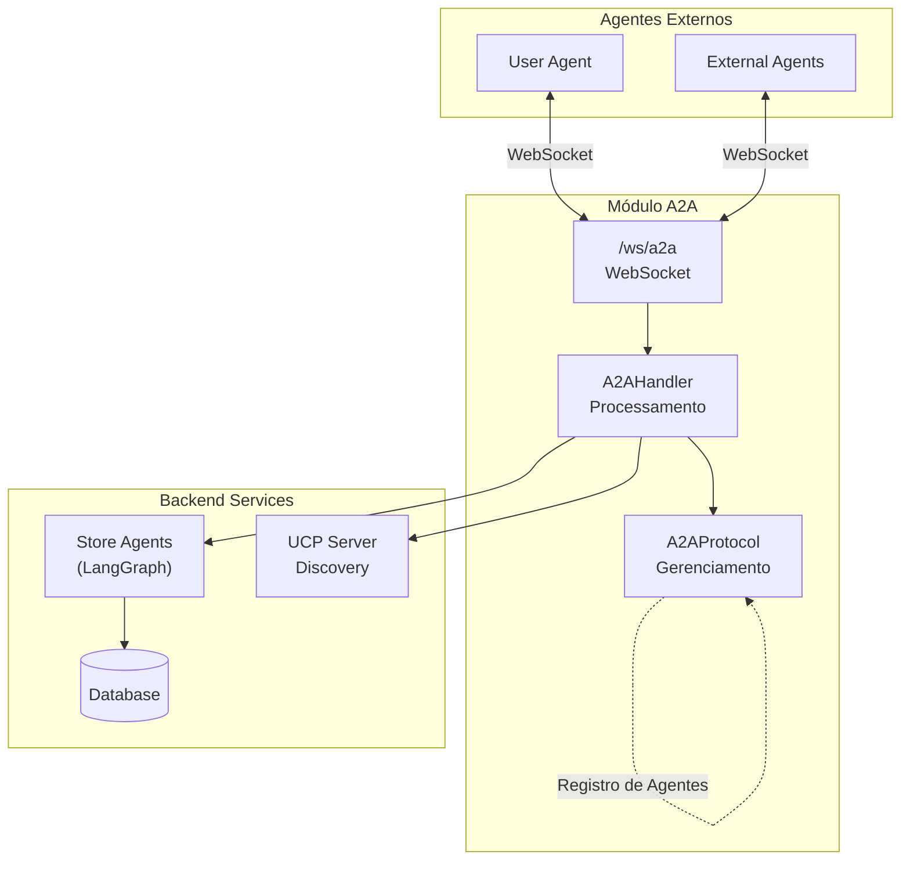

### Diagrama de Componentes

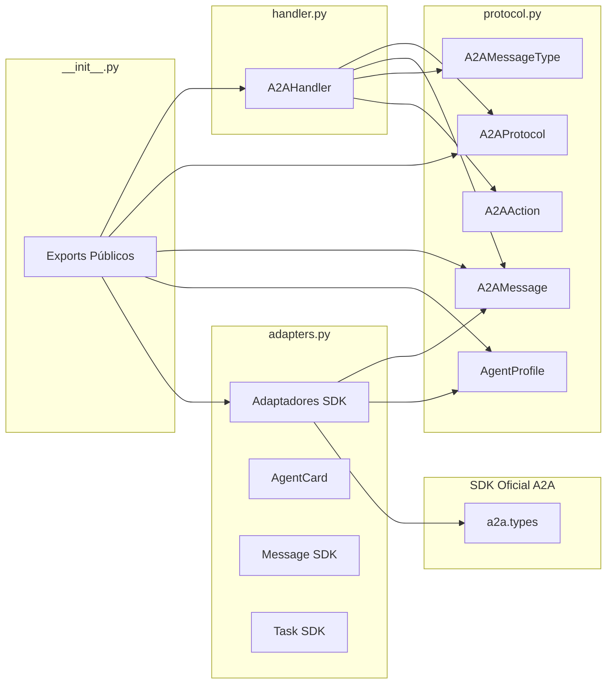

---

## Discovery Endpoint A2A

O módulo A2A agora suporta discovery via endpoint HTTP seguindo o padrão do SDK oficial.

### Endpoint: `/.well-known/agent.json`

Este endpoint permite que agentes externos descubram as capacidades da loja sem precisar conectar via WebSocket primeiro.

**Localização:** `GET http://localhost:8000/.well-known/agent.json`

**Resposta:**

```json
{
    "name": "Livraria Virtual UCP",
    "description": "Agente de e-commerce para livraria virtual com suporte a UCP e A2A",
    "version": "1.0.0",
    "url": "http://localhost:8000/a2a",
    "protocol_version": "0.2.1",
    "capabilities": {
        "streaming": false,
        "push_notifications": false
    },
    "skills": [
        {
            "id": "search",
            "name": "Buscar Livros",
            "description": "Busca livros no catálogo por título, autor ou categoria",
            "input_modes": ["text"],
            "output_modes": ["text"]
        },
        {
            "id": "recommend",
            "name": "Recomendar Livros",
            "description": "Recomenda livros baseado em preferências ou histórico",
            "input_modes": ["text"],
            "output_modes": ["text"]
        },
        {
            "id": "checkout",
            "name": "Processar Compra",
            "description": "Processa compras via UCP com suporte a AP2",
            "input_modes": ["text"],
            "output_modes": ["text"]
        },
        {
            "id": "get_categories",
            "name": "Listar Categorias",
            "description": "Lista todas as categorias de livros disponíveis",
            "input_modes": ["text"],
            "output_modes": ["text"]
        }
    ]
}
```

**Uso:**

```python
import httpx

async def discover_store_agent():
    async with httpx.AsyncClient() as client:
        response = await client.get("http://localhost:8000/.well-known/agent.json")
        agent_card = response.json()
        print(f"Agent: {agent_card['name']}")
        print(f"Skills: {[s['name'] for s in agent_card['skills']]}")
```

---

## Arquivos do Módulo

### `__init__.py`

Arquivo de inicialização que exporta os componentes públicos do módulo.

**Exports:**

| Componente | Tipo | Descrição |
|------------|------|-----------|
| `A2AMessage` | dataclass | Estrutura de mensagem A2A |
| `A2AMessageType` | Enum | Tipos de mensagem |
| `A2AAction` | Enum | Ações suportadas |
| `A2AProtocol` | class | Gerenciador do protocolo |
| `AgentProfile` | dataclass | Perfil de agente |
| `a2a_protocol` | instance | Instância global do protocolo |
| `A2AHandler` | class | Handler de mensagens |
| `a2a_handler` | instance | Instância global do handler |
| `is_a2a_sdk_available()` | function | Verifica se SDK oficial está disponível |
| `get_store_agent_card()` | function | Retorna AgentCard da loja |
| `local_agent_profile_to_sdk()` | function | Converte perfil local para SDK |
| `sdk_agent_card_to_local()` | function | Converte AgentCard SDK para local |
| `create_agent_card()` | function | Cria AgentCard compatível com SDK |
| `create_text_message()` | function | Cria mensagem de texto compatível |
| `create_task_response()` | function | Cria resposta de Task compatível |

---

### `protocol.py`

Define as estruturas de dados e o gerenciador do protocolo A2A.

#### Enum: `A2AMessageType`

Tipos de mensagem suportados pelo protocolo.

```python
class A2AMessageType(str, Enum):
    CONNECT = "a2a.connect"       # Conexão de agente
    DISCONNECT = "a2a.disconnect" # Desconexão de agente
    REQUEST = "a2a.request"       # Requisição do agente
    RESPONSE = "a2a.response"     # Resposta da loja
    EVENT = "a2a.event"           # Evento broadcast
    ERROR = "a2a.error"           # Mensagem de erro
```

#### Enum: `A2AAction`

Ações que podem ser executadas via A2A.

| Ação | Valor | Categoria | Descrição |
|------|-------|-----------|-----------|
| `SEARCH` | `search` | Discovery | Buscar produtos por termo |
| `GET_PRODUCTS` | `get_products` | Discovery | Obter detalhes de produtos |
| `GET_CATEGORIES` | `list_categories` | Discovery | Listar categorias |
| `CREATE_ORDER` | `create_order` | Shopping | Criar pedido |
| `GET_CHECKOUT` | `get_checkout` | Shopping | Obter sessão de checkout |
| `COMPLETE_CHECKOUT` | `complete_checkout` | Shopping | Finalizar compra |
| `RECOMMEND` | `recommend` | Recommendations | Obter recomendações |
| `GET_PROFILE` | `get_profile` | Info | Obter perfil da loja |
| `PING` | `ping` | Info | Verificar conectividade |

#### Dataclass: `A2AMessage`

Estrutura de uma mensagem A2A.

```python
@dataclass
class A2AMessage:
    type: A2AMessageType          # Tipo da mensagem
    message_id: str               # UUID único da mensagem
    timestamp: int                # Unix timestamp
    agent_id: Optional[str]       # ID do agente remetente
    action: Optional[str]         # Ação solicitada
    payload: Dict[str, Any]       # Dados da mensagem
    status: Optional[str]         # Status da resposta
    error: Optional[str]          # Mensagem de erro
```

**Métodos:**
- `to_dict()` - Converter para dicionário JSON-serializável
- `from_dict(data)` - Criar instância a partir de dicionário

**Exemplo de mensagem:**

```json
{
    "type": "a2a.request",
    "message_id": "550e8400-e29b-41d4-a716-446655440000",
    "timestamp": 1704067200,
    "agent_id": "user-agent-001",
    "action": "search",
    "payload": {
        "query": "python",
        "limit": 10
    },
    "status": null,
    "error": null
}
```

#### Dataclass: `AgentProfile`

Perfil de um agente externo conectado.

```python
@dataclass
class AgentProfile:
    agent_id: str                 # Identificador único
    name: str                     # Nome do agente
    version: str = "1.0"          # Versão do agente
    capabilities: list = []       # Capacidades do agente
```

#### Class: `A2AProtocol`

Gerenciador central do protocolo A2A.

**Atributos:**
- `connected_agents: Dict[str, AgentProfile]` - Agentes conectados

**Métodos:**

| Método | Descrição |
|--------|-----------|
| `register_agent(profile)` | Registrar novo agente |
| `unregister_agent(agent_id)` | Remover agente |
| `is_connected(agent_id)` | Verificar se agente está conectado |
| `get_agent(agent_id)` | Obter perfil do agente |
| `list_agents()` | Listar todos os agentes |
| `create_response(request, status, payload)` | Criar resposta |
| `create_event(event_type, payload)` | Criar evento broadcast |
| `create_error(request, error)` | Criar mensagem de erro |

---

### `handler.py`

Processa mensagens A2A recebidas via WebSocket.

#### Class: `A2AHandler`

Handler principal para requisições A2A.

**Métodos Públicos:**

```python
async def handle_message(
    self,
    message: A2AMessage,
    session_id: str
) -> A2AMessage:
    """
    Processar mensagem A2A.
    
    Args:
        message: Mensagem A2A recebida
        session_id: ID da sessão WebSocket
        
    Returns:
        Mensagem de resposta
    """
```

**Métodos Privados:**

| Método | Tipo de Mensagem | Descrição |
|--------|------------------|-----------|
| `_handle_connect()` | CONNECT | Registra agente e retorna perfil da loja |
| `_handle_disconnect()` | DISCONNECT | Remove agente do registro |
| `_handle_request()` | REQUEST | Roteia requisição para ação apropriada |

**Roteamento de Ações:**

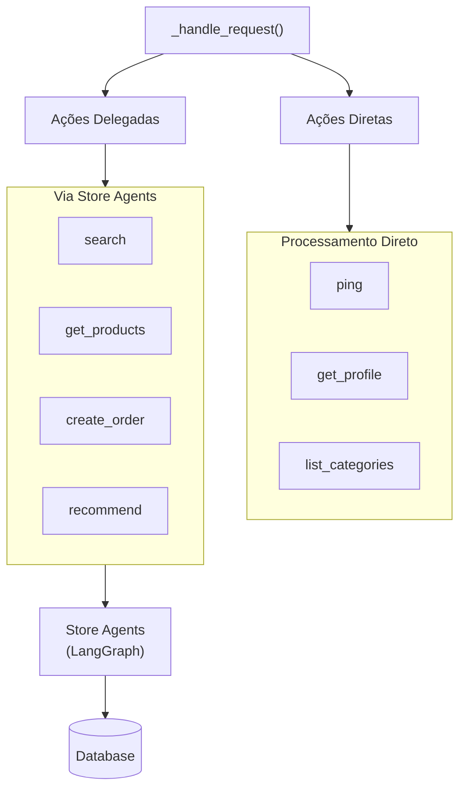

---

### `adapters.py`

Módulo de adaptadores para compatibilidade com o SDK oficial A2A (`a2a-sdk`).

#### Funcionalidades

O módulo fornece funções de conversão bidirecional entre os modelos customizados da loja e os modelos do SDK oficial A2A.

**Conversores Local → SDK:**

| Função | Descrição |
|--------|-----------|
| `local_agent_profile_to_sdk(profile)` | Converte `AgentProfile` para formato `AgentCard` do SDK |
| `local_message_to_sdk(message)` | Converte `A2AMessage` para formato `Message` do SDK |
| `local_message_to_task(message, task_id)` | Converte `A2AMessage` para formato `Task` do SDK |

**Conversores SDK → Local:**

| Função | Descrição |
|--------|-----------|
| `sdk_agent_card_to_local(card_data)` | Converte `AgentCard` do SDK para `AgentProfile` |
| `sdk_message_to_local(message_data)` | Converte `Message` do SDK para `A2AMessage` |
| `sdk_task_to_local(task_data)` | Converte `Task` do SDK para `A2AMessage` |

**Helpers:**

| Função | Descrição |
|--------|-----------|
| `get_store_agent_card()` | Retorna AgentCard da loja para discovery |
| `create_agent_card(...)` | Cria AgentCard compatível com SDK |
| `create_text_message(...)` | Cria mensagem de texto compatível |
| `create_task_response(...)` | Cria resposta de Task compatível |
| `is_a2a_sdk_available()` | Verifica se SDK oficial está instalado |

#### Diagrama de Conversão

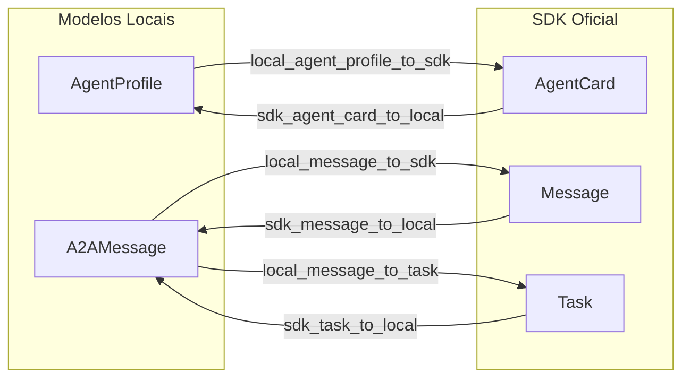

#### Exemplo de Uso

```python
from backend.src.agents.a2a.adapters import (
    get_store_agent_card,
    local_message_to_sdk,
    sdk_message_to_local,
    is_a2a_sdk_available
)

# Verificar se SDK está disponível
if is_a2a_sdk_available():
    # Obter AgentCard da loja
    agent_card = get_store_agent_card()
    
    # Converter mensagem local para SDK
    local_msg = A2AMessage(type=A2AMessageType.REQUEST, action="search")
    sdk_msg = local_message_to_sdk(local_msg)
    
    # Converter mensagem SDK para local
    local_msg_back = sdk_message_to_local(sdk_msg)
```

#### Mapeamento de Status

O módulo mapeia status entre os formatos local e SDK:

| Status Local | Status SDK (Task) |
|--------------|-------------------|
| `success` | `completed` |
| `error` | `failed` |
| `pending` | `working` |
| `connected` | `completed` |
| `disconnected` | `completed` |

**Nota:** O SDK oficial A2A (`a2a-sdk`) é opcional. O módulo funciona normalmente sem ele, mas os adaptadores só estarão disponíveis se o SDK estiver instalado.

---

### Diagrama de Classes

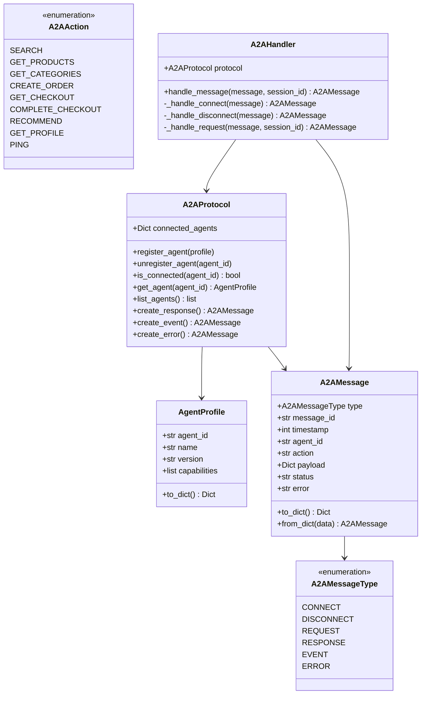

---

## Fluxo de Comunicação

### 1. Conexão de Agente

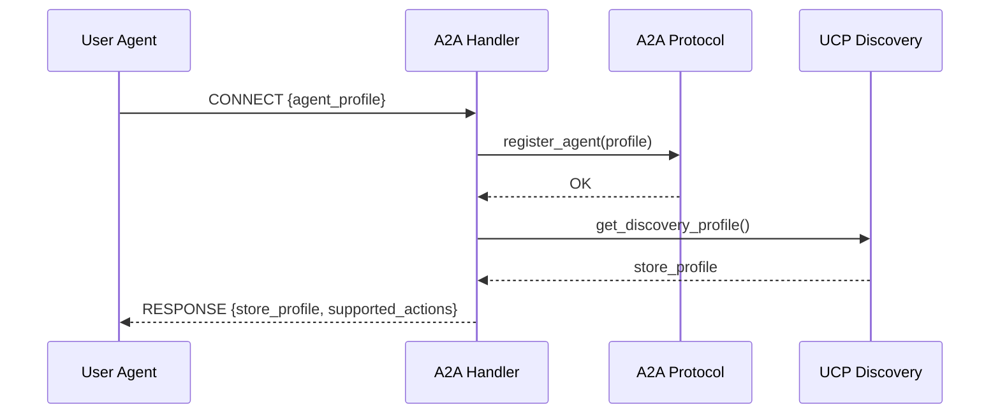

**Payload de Conexão:**

```json
{
    "type": "a2a.connect",
    "agent_id": "user-agent-001",
    "payload": {
        "agent_profile": {
            "agent_id": "user-agent-001",
            "name": "User Shopping Agent",
            "version": "1.0",
            "capabilities": ["search", "purchase", "recommend"]
        }
    }
}
```

**Resposta:**

```json
{
    "type": "a2a.response",
    "status": "connected",
    "payload": {
        "store_profile": {
            "name": "Livraria Virtual UCP",
            "version": "1.0",
            "capabilities": ["checkout", "discount", "fulfillment"]
        },
        "supported_actions": [
            "search", "get_products", "list_categories",
            "create_order", "get_checkout", "complete_checkout",
            "recommend", "get_profile", "ping"
        ]
    }
}
```

### 2. Busca de Produtos

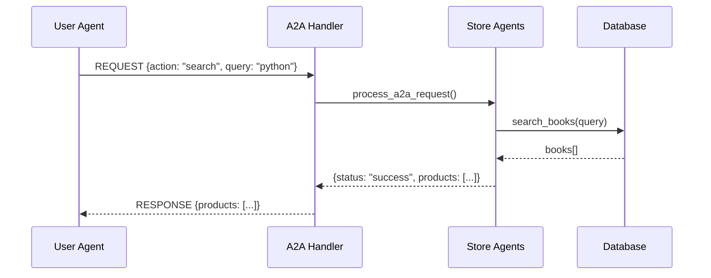

### 3. Criação de Pedido

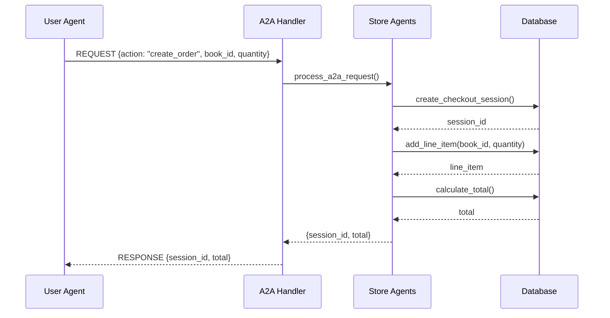

### 4. Fluxo Completo de Compra

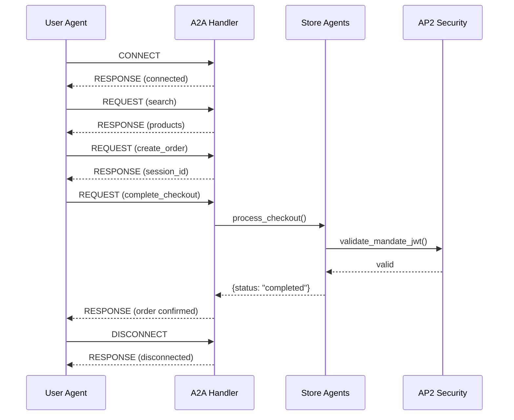

---

## Exemplos de Uso

### Buscar Produtos

```json
// Request
{
    "type": "a2a.request",
    "agent_id": "user-agent-001",
    "action": "search",
    "payload": {
        "query": "machine learning",
        "limit": 5
    }
}

// Response
{
    "type": "a2a.response",
    "status": "success",
    "payload": {
        "products": [
            {
                "id": "book_004",
                "title": "Machine Learning Pratico",
                "price": 7990,
                "category": "Inteligencia Artificial"
            }
        ]
    }
}
```

### Obter Categorias

```json
// Request
{
    "type": "a2a.request",
    "agent_id": "user-agent-001",
    "action": "list_categories",
    "payload": {}
}

// Response
{
    "type": "a2a.response",
    "status": "success",
    "payload": {
        "categories": [
            "Arquitetura",
            "Data Science",
            "DevOps",
            "Inteligencia Artificial",
            "Programacao",
            "Tecnologia"
        ]
    }
}
```

### Obter Recomendações

```json
// Request
{
    "type": "a2a.request",
    "agent_id": "user-agent-001",
    "action": "recommend",
    "payload": {
        "preferences": ["python", "machine learning"],
        "limit": 3
    }
}

// Response
{
    "type": "a2a.response",
    "status": "success",
    "payload": {
        "recommendations": [
            {"id": "book_003", "title": "Python para Todos", "score": 0.95},
            {"id": "book_004", "title": "Machine Learning Pratico", "score": 0.92},
            {"id": "book_014", "title": "Data Science com Python", "score": 0.88}
        ]
    }
}
```

---

### `adapters.py`

Módulo de adaptadores para compatibilidade com o SDK oficial A2A (`a2a-sdk`).

#### Funcionalidades

O módulo fornece funções de conversão bidirecional entre os modelos customizados da loja e os modelos do SDK oficial A2A.

**Conversores Local → SDK:**

| Função | Descrição |
|--------|-----------|
| `local_agent_profile_to_sdk(profile)` | Converte `AgentProfile` para formato `AgentCard` do SDK |
| `local_message_to_sdk(message)` | Converte `A2AMessage` para formato `Message` do SDK |
| `local_message_to_task(message, task_id)` | Converte `A2AMessage` para formato `Task` do SDK |

**Conversores SDK → Local:**

| Função | Descrição |
|--------|-----------|
| `sdk_agent_card_to_local(card_data)` | Converte `AgentCard` do SDK para `AgentProfile` |
| `sdk_message_to_local(message_data)` | Converte `Message` do SDK para `A2AMessage` |
| `sdk_task_to_local(task_data)` | Converte `Task` do SDK para `A2AMessage` |

**Helpers:**

| Função | Descrição |
|--------|-----------|
| `get_store_agent_card()` | Retorna AgentCard da loja para discovery |
| `create_agent_card(...)` | Cria AgentCard compatível com SDK |
| `create_text_message(...)` | Cria mensagem de texto compatível |
| `create_task_response(...)` | Cria resposta de Task compatível |
| `is_a2a_sdk_available()` | Verifica se SDK oficial está instalado |

#### Diagrama de Conversão


#### Exemplo de Uso

```python
from backend.src.agents.a2a.adapters import (
    get_store_agent_card,
    local_message_to_sdk,
    sdk_message_to_local,
    is_a2a_sdk_available
)

# Verificar se SDK está disponível
if is_a2a_sdk_available():
    # Obter AgentCard da loja
    agent_card = get_store_agent_card()
    
    # Converter mensagem local para SDK
    local_msg = A2AMessage(type=A2AMessageType.REQUEST, action="search")
    sdk_msg = local_message_to_sdk(local_msg)
    
    # Converter mensagem SDK para local
    local_msg_back = sdk_message_to_local(sdk_msg)
```

#### Mapeamento de Status

O módulo mapeia status entre os formatos local e SDK:

| Status Local | Status SDK (Task) |
|--------------|-------------------|
| `success` | `completed` |
| `error` | `failed` |
| `pending` | `working` |
| `connected` | `completed` |
| `disconnected` | `completed` |

---

## Integração com WebSocket

O módulo A2A é exposto via WebSocket no endpoint `/ws/a2a`.

**Conexão:**

```python
import websockets
import json

async def connect_to_store():
    async with websockets.connect("ws://localhost:8182/ws/a2a") as ws:
        # Enviar mensagem de conexão
        connect_msg = {
            "type": "a2a.connect",
            "agent_id": "my-agent",
            "payload": {
                "agent_profile": {
                    "name": "My Agent",
                    "version": "1.0"
                }
            }
        }
        await ws.send(json.dumps(connect_msg))
        
        # Receber resposta
        response = await ws.recv()
        print(json.loads(response))
```

---

### Diagrama de Estados - Ciclo de Vida da Conexão

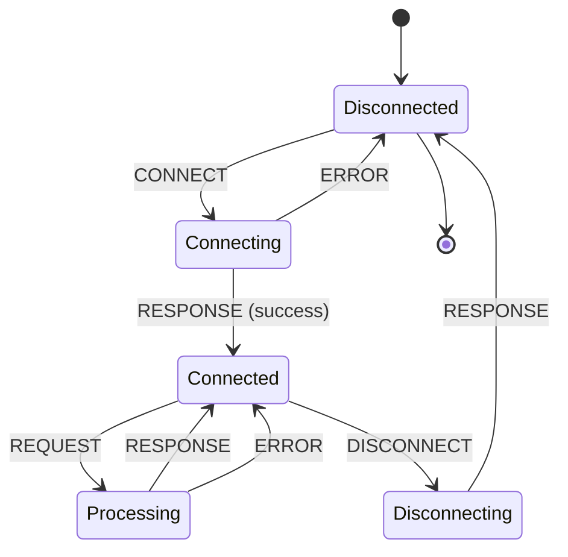

### Diagrama de Estados - Tipos de Mensagem

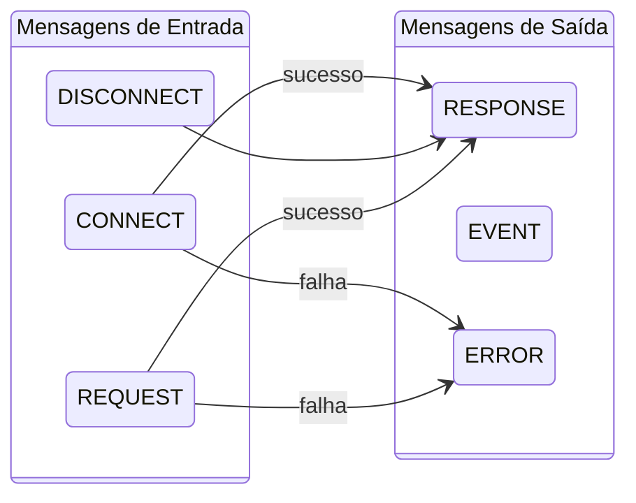

---

## Tratamento de Erros

Quando ocorre um erro, o handler retorna uma mensagem do tipo `ERROR`:

```json
{
    "type": "a2a.error",
    "message_id": "original-message-id",
    "agent_id": "store-agent",
    "action": "search",
    "status": "error",
    "error": "Invalid query parameter"
}
```

**Erros Comuns:**

| Erro | Descrição |
|------|-----------|
| `Unknown message type` | Tipo de mensagem não reconhecido |
| `Unknown action` | Ação não suportada |
| `Invalid payload` | Payload malformado |
| `Agent not found` | Agente não registrado |

---

## Visão Geral do Sistema

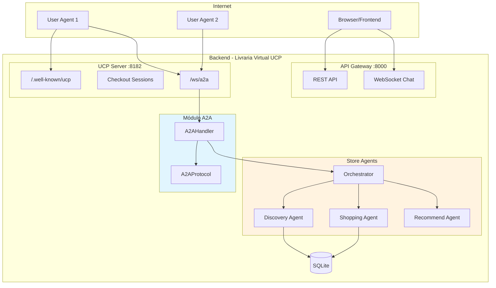

---

## Dependências Internas

O módulo A2A depende de:

| Módulo | Uso |
|--------|-----|
| `..graph` | `store_agent_runner` para delegação ao LangGraph |
| `...ucp_server.discovery` | `get_discovery_profile` para perfil UCP |
| `...db.products` | `products_repo` para consulta de categorias |
| `structlog` | Logging estruturado |
| `a2a.types` (opcional) | Tipos do SDK oficial A2A quando disponível |

**Nota:** O SDK oficial A2A (`a2a-sdk`) é opcional. O módulo funciona normalmente sem ele, mas os adaptadores só estarão disponíveis se o SDK estiver instalado.

---

## Instâncias Globais

O módulo exporta duas instâncias globais para uso em toda a aplicação:

```python
# Protocolo A2A (gerenciamento de agentes)
a2a_protocol = A2AProtocol()

# Handler A2A (processamento de mensagens)
a2a_handler = A2AHandler()
```

Essas instâncias devem ser importadas quando necessário:

```python
from backend.src.agents.a2a import a2a_handler, a2a_protocol

# Verificar agentes conectados
agents = a2a_protocol.list_agents()

# Processar mensagem
response = await a2a_handler.handle_message(message, session_id)
```
