# Módulo Agents - Store Agents LangGraph

Este módulo implementa o sistema de **agentes inteligentes** da Livraria Virtual UCP utilizando **LangGraph**. Os agentes processam mensagens de usuários e requisições A2A (Agent-to-Agent), orquestrando operações de busca, carrinho, checkout e recomendações.

## Visão Geral

O sistema de agentes da loja é composto por:
- **State** - Estado compartilhado entre todos os agentes
- **Graph** - Grafo LangGraph que orquestra o fluxo
- **Nodes** - Agentes especializados (Discovery, Shopping, Recommend)
- **LLM** - Integração com Google Gemini para respostas naturais
- **A2A** - Protocolo de comunicação Agent-to-Agent

---

## Arquitetura do Módulo

```
backend/src/agents/
├── __init__.py     # Exports públicos do módulo
├── state.py        # Estado compartilhado (StoreAgentState)
├── graph.py        # Grafo LangGraph e Runner
├── llm.py          # Integração com LLM (Gemini)
├── agents.md       # Esta documentação
├── nodes/          # Agentes especializados
│   ├── orchestrator.py
│   ├── discovery.py
│   ├── shopping.py
│   ├── recommend.py
│   └── nodes.md    # → Documentação detalhada
└── a2a/            # Protocolo Agent-to-Agent
    ├── protocol.py
    ├── handler.py
    └── a2a.md      # → Documentação detalhada
```

### Diagrama de Arquitetura Geral

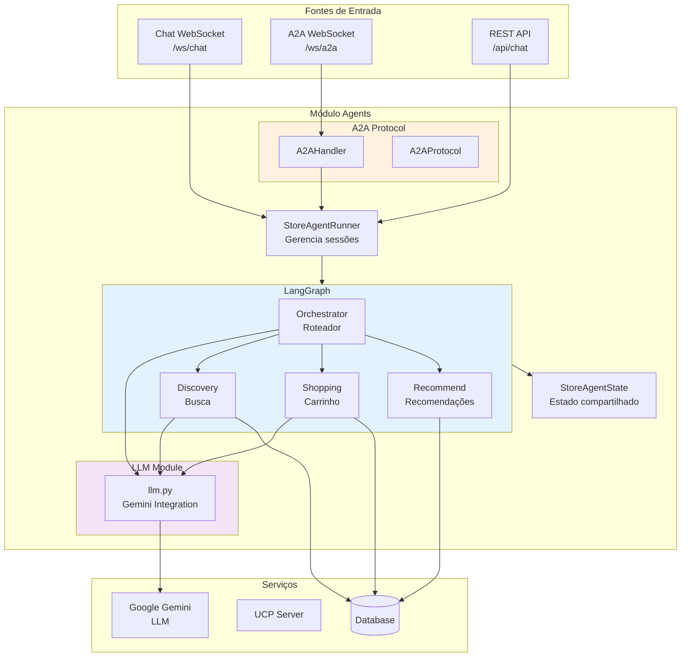
```mermaid
flowchart TB
    subgraph Input["Fontes de Entrada"]
        Chat["Chat WebSocket<br/>/ws/chat"]
        A2A["A2A WebSocket<br/>/ws/a2a"]
        API["REST API<br/>/api/chat"]
    end

    subgraph Agents["Módulo Agents"]
        Runner["StoreAgentRunner<br/>Gerencia sessões"]
        
        subgraph Graph["LangGraph"]
            Orch["Orchestrator<br/>Roteador"]
            Disc["Discovery<br/>Busca"]
            Shop["Shopping<br/>Carrinho"]
            Rec["Recommend<br/>Recomendações"]
        end
        
        State["StoreAgentState<br/>Estado compartilhado"]
        
        subgraph LLMModule["LLM Module"]
            LLM["llm.py<br/>Gemini Integration"]
        end
        
        subgraph A2AModule["A2A Protocol"]
            Handler["A2AHandler"]
            Protocol["A2AProtocol"]
        end
    end

    subgraph Services["Serviços"]
        DB[(Database)]
        UCP["UCP Server"]
        Gemini["Google Gemini<br/>LLM"]
    end

    Chat --> Runner
    API --> Runner
    A2A --> Handler
    Handler --> Runner
    
    Runner --> Graph
    Graph --> State
    
    Orch --> LLM
    Disc --> LLM
    Shop --> LLM
    
    Orch --> Disc
    Orch --> Shop
    Orch --> Rec
    
    Disc --> DB
    Shop --> DB
    Rec --> DB
    
    LLM --> Gemini
    
    style Graph fill:#e3f2fd
    style A2AModule fill:#fff3e0
    style LLMModule fill:#f3e5f5
```

### Fluxo de Processamento

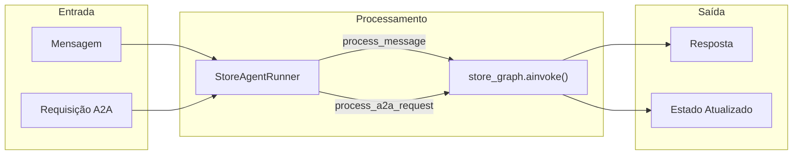
```mermaid
flowchart LR
    subgraph Entry["Entrada"]
        Msg["Mensagem"]
        A2AReq["Requisição A2A"]
    end

    subgraph Processing["Processamento"]
        Runner["StoreAgentRunner"]
        Graph["store_graph.ainvoke()"]
    end

    subgraph Output["Saída"]
        Response["Resposta"]
        State["Estado Atualizado"]
    end

    Msg --> Runner
    A2AReq --> Runner
    Runner -->|process_message| Graph
    Runner -->|process_a2a_request| Graph
    Graph --> Response
    Graph --> State
```

---

## Componentes Principais

### 1. LLM Module (`llm.py`)

Módulo de integração com Google Gemini para melhorar a experiência conversacional.

#### Funcionalidades

- **Detecção de Intenção** - Usa LLM para detectar intenções de forma mais inteligente
- **Geração de Respostas** - Gera respostas naturais e contextualizadas
- **Fallback para Regras** - Usa regras baseadas em keywords quando LLM não disponível

#### Diagrama de Integração

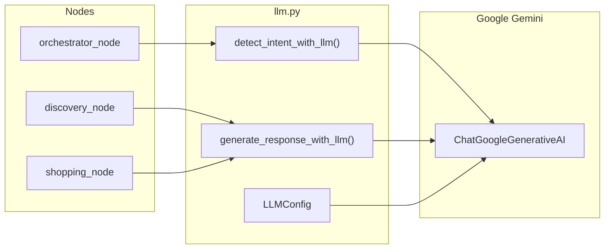
```mermaid
flowchart LR
    subgraph LLM["llm.py"]
        Detect["detect_intent_with_llm()"]
        Generate["generate_response_with_llm()"]
        Config["LLMConfig"]
    end
    
    subgraph Nodes["Nodes"]
        Orchestrator["orchestrator_node"]
        Discovery["discovery_node"]
        Shopping["shopping_node"]
    end
    
    subgraph Gemini["Google Gemini"]
        API["ChatGoogleGenerativeAI"]
    end
    
    Orchestrator --> Detect
    Discovery --> Generate
    Shopping --> Generate
    
    Detect --> API
    Generate --> API
    
    Config --> API
```

#### Funções Principais

| Função | Descrição | Retorno |
|--------|-----------|---------|
| `detect_intent_with_llm(message)` | Detecta intenção usando LLM | str \| None |
| `generate_response_with_llm(context, data, fallback)` | Gera resposta natural | str |
| `is_llm_enabled()` | Verifica se LLM está configurado | bool |
| `get_llm_status()` | Retorna status do LLM | Dict |

#### Configuração

O LLM usa configurações de `config.py`:

```python
# Configurações LLM
google_api_key: str = ""  # Chave da API do Google
llm_model: str = "gemini-2.0-flash-lite"
llm_temperature: float = 0.7
llm_max_tokens: int = 1024
```

#### Fluxo de Detecção de Intenção

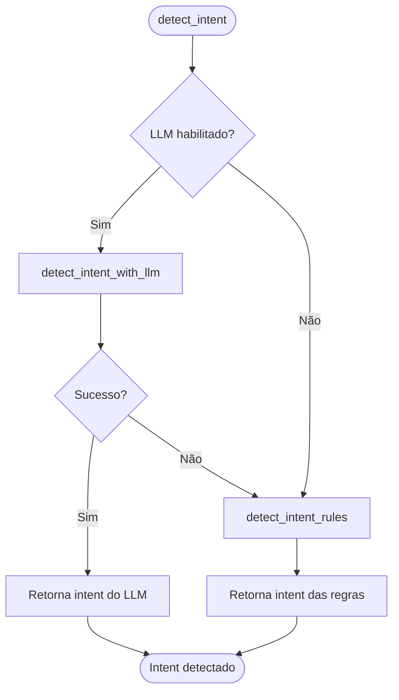
```mermaid
flowchart TD
    Start([detect_intent]) --> CheckLLM{LLM habilitado?}
    
    CheckLLM -->|Sim| TryLLM[detect_intent_with_llm]
    CheckLLM -->|Não| Rules[detect_intent_rules]
    
    TryLLM --> Success{Sucesso?}
    Success -->|Sim| ReturnLLM[Retorna intent do LLM]
    Success -->|Não| Rules
    
    Rules --> ReturnRules[Retorna intent das regras]
    
    ReturnLLM --> End([Intent detectado])
    ReturnRules --> End
```

#### Intenções Suportadas

| Intenção | Descrição | Exemplos |
|----------|-----------|----------|
| `buy` | Comprar livro específico | "quero comprar esse", "vou levar esse livro" |
| `search` | Buscar livros | "buscar livros de python" |
| `recommend` | Recomendações | "me recomende", "sugira livros" |
| `cart` | Manipular carrinho | "adicionar ao carrinho", "ver carrinho" |
| `checkout` | Finalizar compra | "finalizar pedido", "quero pagar" |
| `discount` | Aplicar cupom | "tenho cupom", "aplicar desconto" |
| `help` | Ajuda ou saudação | "olá", "ajuda", "como funciona" |

---

### 2. State (`state.py`)

Define o estado compartilhado entre todos os agentes usando TypedDict.

#### Diagrama de Estado

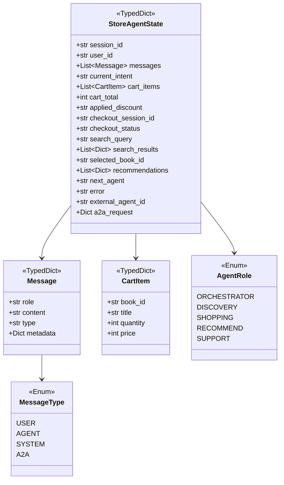
```mermaid
classDiagram
    class StoreAgentState {
        <<TypedDict>>
        +str session_id
        +str user_id
        +List~Message~ messages
        +str current_intent
        +List~CartItem~ cart_items
        +int cart_total
        +str applied_discount
        +str checkout_session_id
        +str checkout_status
        +str search_query
        +List~Dict~ search_results
        +str selected_book_id
        +List~Dict~ recommendations
        +str next_agent
        +str error
        +str external_agent_id
        +Dict a2a_request
    }
    
    class Message {
        <<TypedDict>>
        +str role
        +str content
        +str type
        +Dict metadata
    }
    
    class CartItem {
        <<TypedDict>>
        +str book_id
        +str title
        +int quantity
        +int price
    }
    
    class AgentRole {
        <<Enum>>
        ORCHESTRATOR
        DISCOVERY
        SHOPPING
        RECOMMEND
        SUPPORT
    }
    
    class MessageType {
        <<Enum>>
        USER
        AGENT
        SYSTEM
        A2A
    }
    
    StoreAgentState --> Message
    StoreAgentState --> CartItem
    StoreAgentState --> AgentRole
    Message --> MessageType
```

#### Categorias de Estado

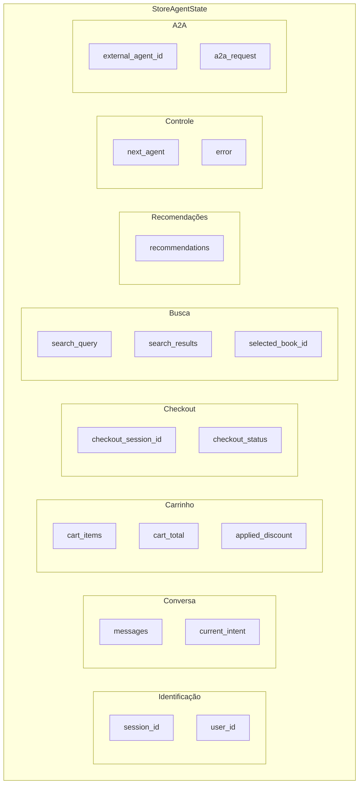
```mermaid
flowchart TB
    subgraph State["StoreAgentState"]
        subgraph ID["Identificação"]
            session_id
            user_id
        end
        
        subgraph Conv["Conversa"]
            messages
            current_intent
        end
        
        subgraph Cart["Carrinho"]
            cart_items
            cart_total
            applied_discount
        end
        
        subgraph Checkout["Checkout"]
            checkout_session_id
            checkout_status
        end
        
        subgraph Search["Busca"]
            search_query
            search_results
            selected_book_id
        end
        
        subgraph Recs["Recomendações"]
            recommendations
        end
        
        subgraph Flow["Controle"]
            next_agent
            error
        end
        
        subgraph A2A["A2A"]
            external_agent_id
            a2a_request
        end
    end
```

#### Funções Exportadas

| Função | Retorno | Descrição |
|--------|---------|-----------|
| `create_initial_state(session_id)` | StoreAgentState | Cria estado inicial zerado |

---

### 2. Graph (`graph.py`)

Configura e executa o grafo LangGraph.

#### Diagrama do Grafo

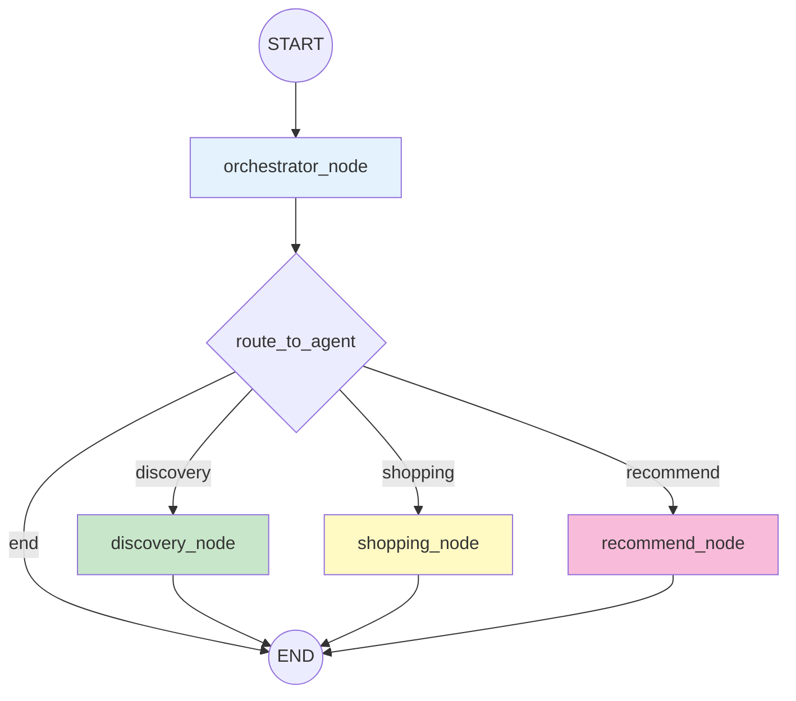
```mermaid
flowchart TD
    Start((START)) --> Orch["orchestrator_node"]
    
    Orch --> Router{route_to_agent}
    
    Router -->|"discovery"| Disc["discovery_node"]
    Router -->|"shopping"| Shop["shopping_node"]
    Router -->|"recommend"| Rec["recommend_node"]
    Router -->|"end"| End((END))
    
    Disc --> End
    Shop --> End
    Rec --> End
    
    style Orch fill:#e3f2fd
    style Disc fill:#c8e6c9
    style Shop fill:#fff9c4
    style Rec fill:#f8bbd9
```

#### Função `create_store_agents_graph()`

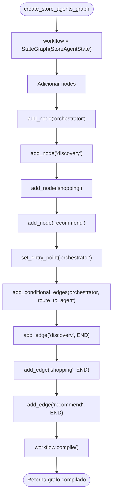
```mermaid
flowchart TD
    Start([create_store_agents_graph]) --> Create["workflow = StateGraph(StoreAgentState)"]
    
    Create --> AddNodes["Adicionar nodes"]
    AddNodes --> N1["add_node('orchestrator')"]
    N1 --> N2["add_node('discovery')"]
    N2 --> N3["add_node('shopping')"]
    N3 --> N4["add_node('recommend')"]
    
    N4 --> SetEntry["set_entry_point('orchestrator')"]
    
    SetEntry --> AddCond["add_conditional_edges(orchestrator, route_to_agent)"]
    
    AddCond --> AddEnd1["add_edge('discovery', END)"]
    AddEnd1 --> AddEnd2["add_edge('shopping', END)"]
    AddEnd2 --> AddEnd3["add_edge('recommend', END)"]
    
    AddEnd3 --> Compile["workflow.compile()"]
    Compile --> Return([Retorna grafo compilado])
```

#### Detecção de Intenção com LLM

O orchestrator agora usa LLM para detectar intenções de forma mais inteligente:

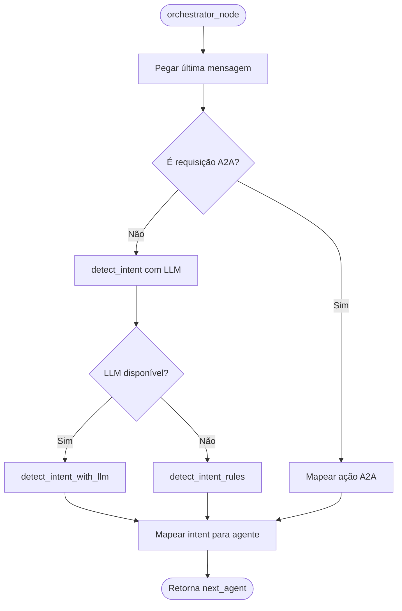
```mermaid
flowchart TD
    Start([orchestrator_node]) --> GetMessage[Pegar última mensagem]
    GetMessage --> CheckA2A{É requisição A2A?}
    
    CheckA2A -->|Sim| MapA2A[Mapear ação A2A]
    CheckA2A -->|Não| DetectIntent[detect_intent com LLM]
    
    DetectIntent --> CheckLLM{LLM disponível?}
    CheckLLM -->|Sim| LLMDetect[detect_intent_with_llm]
    CheckLLM -->|Não| RulesDetect[detect_intent_rules]
    
    LLMDetect --> MapIntent[Mapear intent para agente]
    RulesDetect --> MapIntent
    MapA2A --> MapIntent
    
    MapIntent --> Return([Retorna next_agent])
```

#### Classe `StoreAgentRunner`

Runner principal que gerencia sessões e executa o grafo.

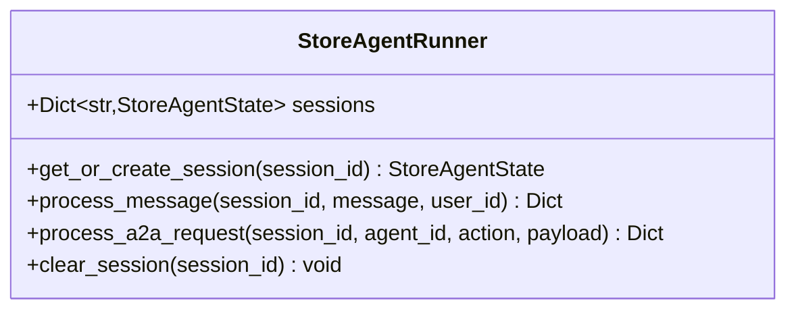
```mermaid
classDiagram
    class StoreAgentRunner {
        +Dict~str,StoreAgentState~ sessions
        +get_or_create_session(session_id) StoreAgentState
        +process_message(session_id, message, user_id) Dict
        +process_a2a_request(session_id, agent_id, action, payload) Dict
        +clear_session(session_id) void
    }
```

##### Métodos

| Método | Parâmetros | Retorno | Descrição |
|--------|------------|---------|-----------|
| `get_or_create_session` | session_id | StoreAgentState | Obtém ou cria sessão |
| `process_message` | session_id, message, user_id? | Dict | Processa mensagem de chat |
| `process_a2a_request` | session_id, agent_id, action, payload | Dict | Processa requisição A2A |
| `clear_session` | session_id | void | Remove sessão da memória |

##### Fluxo `process_message`

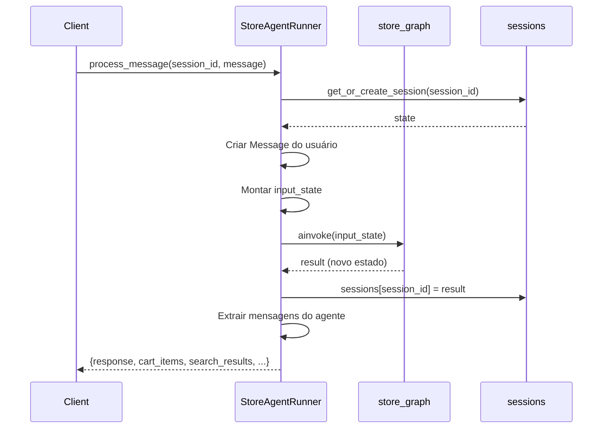
```mermaid
sequenceDiagram
    participant C as Client
    participant R as StoreAgentRunner
    participant G as store_graph
    participant S as sessions

    C->>R: process_message(session_id, message)
    R->>S: get_or_create_session(session_id)
    S-->>R: state
    
    R->>R: Criar Message do usuário
    R->>R: Montar input_state
    
    R->>G: ainvoke(input_state)
    G-->>R: result (novo estado)
    
    R->>S: sessions[session_id] = result
    R->>R: Extrair mensagens do agente
    
    R-->>C: {response, cart_items, search_results, ...}
```

##### Fluxo `process_a2a_request`

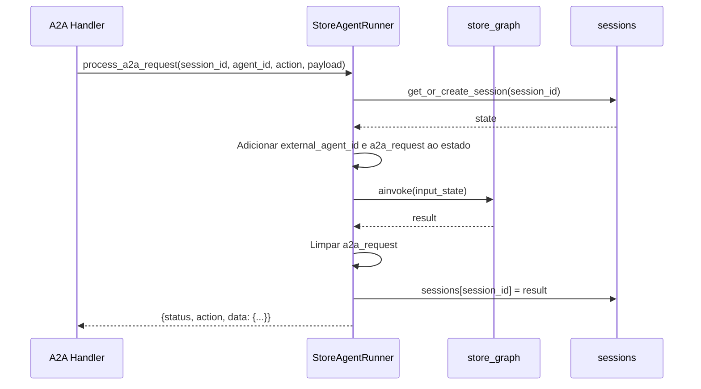
```mermaid
sequenceDiagram
    participant A as A2A Handler
    participant R as StoreAgentRunner
    participant G as store_graph
    participant S as sessions

    A->>R: process_a2a_request(session_id, agent_id, action, payload)
    R->>S: get_or_create_session(session_id)
    S-->>R: state
    
    R->>R: Adicionar external_agent_id e a2a_request ao estado
    
    R->>G: ainvoke(input_state)
    G-->>R: result
    
    R->>R: Limpar a2a_request
    R->>S: sessions[session_id] = result
    
    R-->>A: {status, action, data: {...}}
```

---

### 3. LLM Module (`llm.py`)

Módulo de integração com Google Gemini para melhorar a experiência conversacional dos agentes.

#### Diagrama de Classes

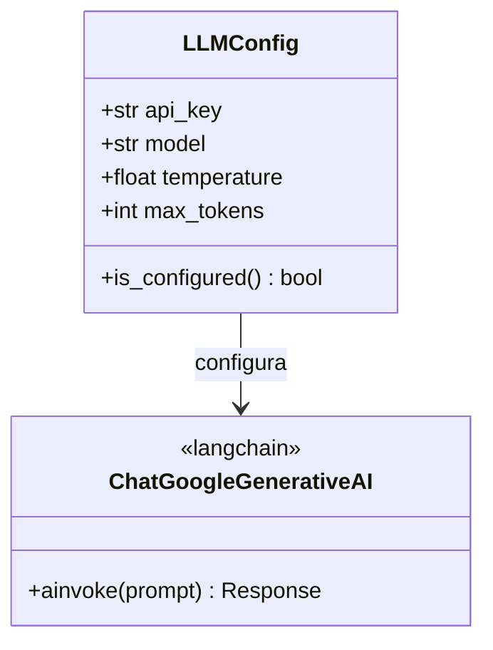
```mermaid
classDiagram
    class LLMConfig {
        +str api_key
        +str model
        +float temperature
        +int max_tokens
        +is_configured() bool
    }
    
    class ChatGoogleGenerativeAI {
        <<langchain>>
        +ainvoke(prompt) Response
    }
    
    LLMConfig --> ChatGoogleGenerativeAI : configura
```

#### Funções Principais

| Função | Descrição | Retorno |
|--------|-----------|---------|
| `detect_intent_with_llm(message)` | Detecta intenção usando LLM | str \| None |
| `generate_response_with_llm(context, data, fallback)` | Gera resposta natural | str |
| `is_llm_enabled()` | Verifica se LLM está configurado | bool |
| `get_llm_status()` | Retorna status completo | Dict |
| `get_llm()` | Obtém instância do LLM | ChatGoogleGenerativeAI \| None |

#### Prompts Utilizados

**Detecção de Intenção:**
```
Você é um assistente de uma livraria virtual.
Analise a mensagem do usuário e determine a intenção.

Intenções possíveis:
- buy: O usuário quer comprar um livro específico
- search: O usuário quer buscar/encontrar livros
- recommend: O usuário quer recomendações
- cart: O usuário quer manipular o carrinho
- checkout: O usuário quer finalizar compra/pagar
- discount: O usuário quer aplicar cupom/desconto
- help: O usuário precisa de ajuda ou está cumprimentando
```

**Geração de Respostas:**
```
Você é um assistente amigável de uma livraria virtual chamada "Livraria Virtual UCP".
Sua personalidade é: educado, prestativo, entusiasmado com livros.

Contexto atual: {context}
Dados disponíveis: {data}

Gere uma resposta natural e amigável para o usuário.
Mantenha a resposta concisa (máximo 3-4 frases por seção).
Use emojis com moderação.
```

#### Fluxo de Geração de Resposta

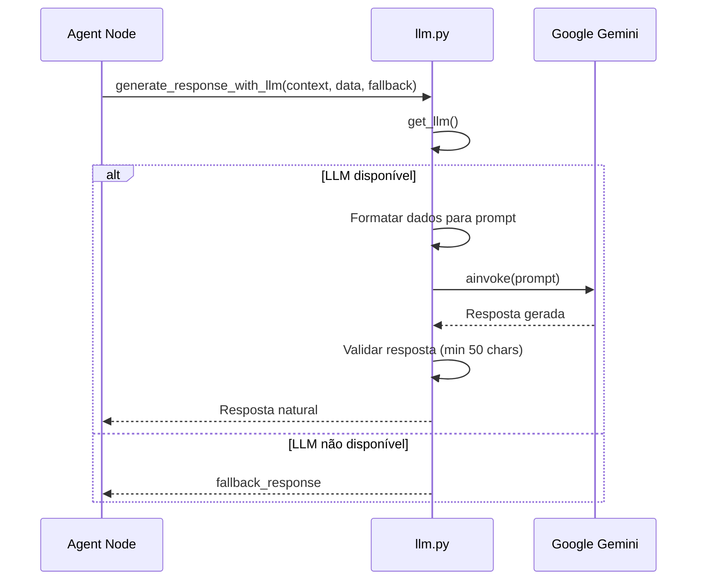
```mermaid
sequenceDiagram
    participant Node as Agent Node
    participant LLM as llm.py
    participant Gemini as Google Gemini

    Node->>LLM: generate_response_with_llm(context, data, fallback)
    LLM->>LLM: get_llm()
    
    alt LLM disponível
        LLM->>LLM: Formatar dados para prompt
        LLM->>Gemini: ainvoke(prompt)
        Gemini-->>LLM: Resposta gerada
        LLM->>LLM: Validar resposta (min 50 chars)
        LLM-->>Node: Resposta natural
    else LLM não disponível
        LLM-->>Node: fallback_response
    end
```

---

## Submódulos

### Nodes (Agentes Especializados)

O submódulo `nodes/` contém os agentes especializados do sistema.

📄 **Documentação completa:** [`nodes/nodes.md`](nodes/nodes.md)

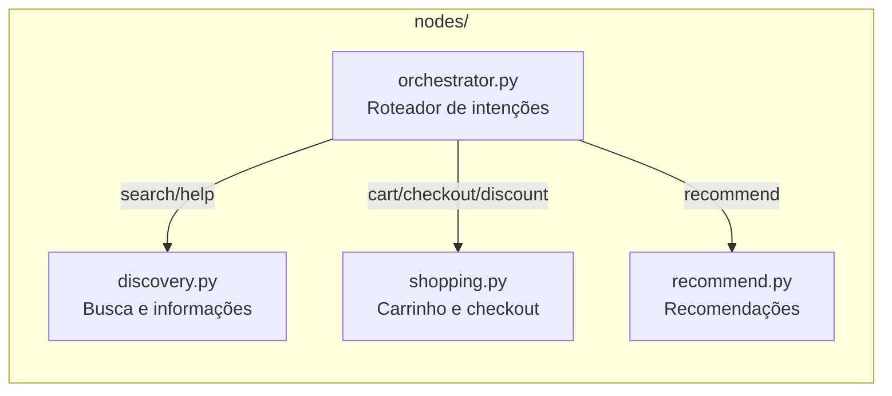
```mermaid
flowchart LR
    subgraph Nodes["nodes/"]
        Orch["orchestrator.py<br/>Roteador de intenções"]
        Disc["discovery.py<br/>Busca e informações"]
        Shop["shopping.py<br/>Carrinho e checkout"]
        Rec["recommend.py<br/>Recomendações"]
    end
    
    Orch -->|search/help| Disc
    Orch -->|cart/checkout/discount| Shop
    Orch -->|recommend| Rec
```

| Node | Responsabilidade | Intenções |
|------|------------------|-----------|
| **Orchestrator** | Detectar intenção (LLM/regras) e rotear | - |
| **Discovery** | Buscar livros, listar categorias | search, help |
| **Shopping** | Carrinho, cupons, checkout, compra direta | buy, cart, checkout, discount |
| **Recommend** | Recomendações personalizadas | recommend |

**Nota:** Todos os nodes agora usam LLM para gerar respostas mais naturais quando disponível, com fallback para respostas formatadas.

---

### A2A (Agent-to-Agent Protocol)

O submódulo `a2a/` implementa o protocolo de comunicação entre agentes.

📄 **Documentação completa:** [`a2a/a2a.md`](a2a/a2a.md)

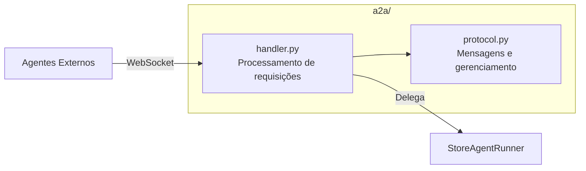
```mermaid
flowchart LR
    subgraph A2A["a2a/"]
        Protocol["protocol.py<br/>Mensagens e gerenciamento"]
        Handler["handler.py<br/>Processamento de requisições"]
    end
    
    External["Agentes Externos"] -->|WebSocket| Handler
    Handler --> Protocol
    Handler -->|Delega| Runner["StoreAgentRunner"]
```

| Componente | Responsabilidade |
|------------|------------------|
| **A2AProtocol** | Gerenciar conexões e criar mensagens |
| **A2AHandler** | Processar e rotear requisições A2A |

---

## Exports do Módulo

O `__init__.py` exporta os seguintes componentes:

```python
from backend.src.agents import (
    # Estado
    StoreAgentState,
    Message,
    CartItem,
    create_initial_state,
    
    # Grafo
    store_graph,
    store_agent_runner,
    StoreAgentRunner,
    
    # Nodes
    orchestrator_node,
    discovery_node,
    shopping_node,
    recommend_node,
)
```

### Diagrama de Exports

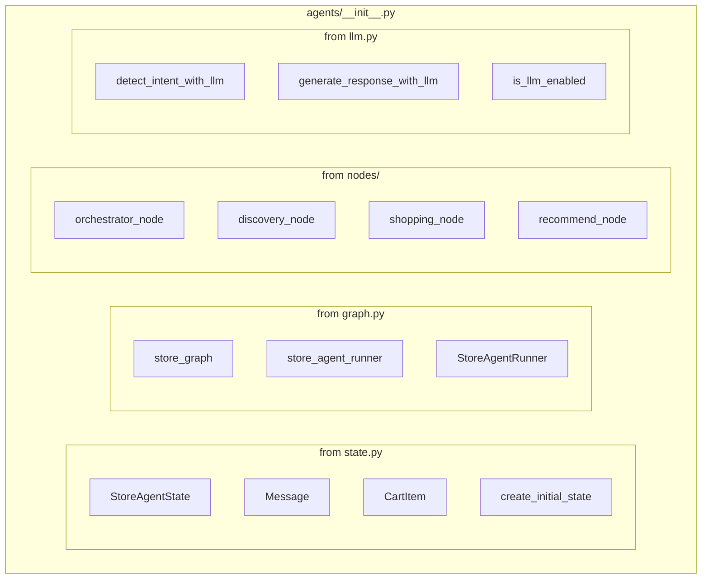
```mermaid
flowchart TB
    subgraph Module["agents/__init__.py"]
        subgraph FromState["from state.py"]
            StoreAgentState
            Message
            CartItem
            create_initial_state
        end
        
        subgraph FromGraph["from graph.py"]
            store_graph
            store_agent_runner
            StoreAgentRunner
        end
        
        subgraph FromNodes["from nodes/"]
            orchestrator_node
            discovery_node
            shopping_node
            recommend_node
        end
        
        subgraph FromLLM["from llm.py"]
            detect_intent_with_llm
            generate_response_with_llm
            is_llm_enabled
        end
    end
```

**Nota:** O módulo `llm.py` não é exportado diretamente pelo `__init__.py`, mas é usado internamente pelos nodes.

---

## Fluxos de Uso

### Fluxo de Chat (Humano)

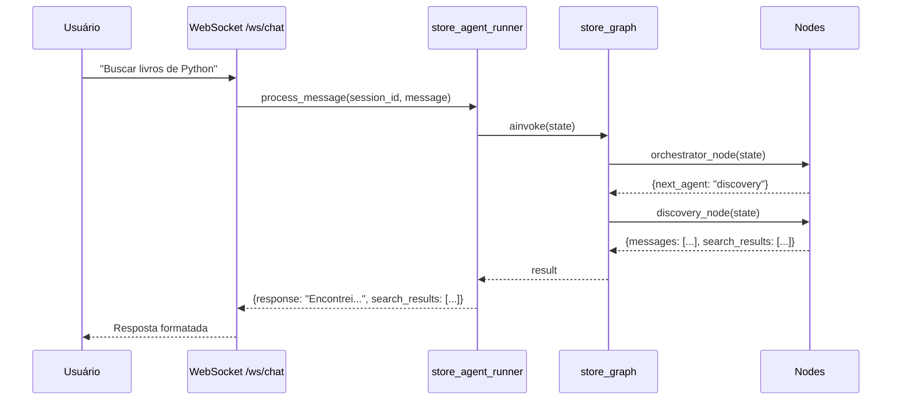
```mermaid
sequenceDiagram
    participant U as Usuário
    participant WS as WebSocket /ws/chat
    participant R as store_agent_runner
    participant G as store_graph
    participant N as Nodes

    U->>WS: "Buscar livros de Python"
    WS->>R: process_message(session_id, message)
    R->>G: ainvoke(state)
    G->>N: orchestrator_node(state)
    N-->>G: {next_agent: "discovery"}
    G->>N: discovery_node(state)
    N-->>G: {messages: [...], search_results: [...]}
    G-->>R: result
    R-->>WS: {response: "Encontrei...", search_results: [...]}
    WS-->>U: Resposta formatada
```

### Fluxo A2A (Agente Externo)

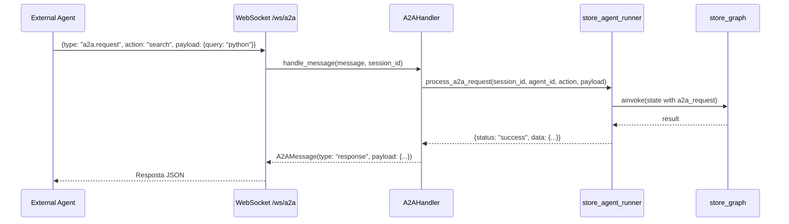
```mermaid
sequenceDiagram
    participant EA as External Agent
    participant WS as WebSocket /ws/a2a
    participant H as A2AHandler
    participant R as store_agent_runner
    participant G as store_graph

    EA->>WS: {type: "a2a.request", action: "search", payload: {query: "python"}}
    WS->>H: handle_message(message, session_id)
    H->>R: process_a2a_request(session_id, agent_id, action, payload)
    R->>G: ainvoke(state with a2a_request)
    G-->>R: result
    R-->>H: {status: "success", data: {...}}
    H-->>WS: A2AMessage(type: "response", payload: {...})
    WS-->>EA: Resposta JSON
```

### Fluxo Completo de Compra

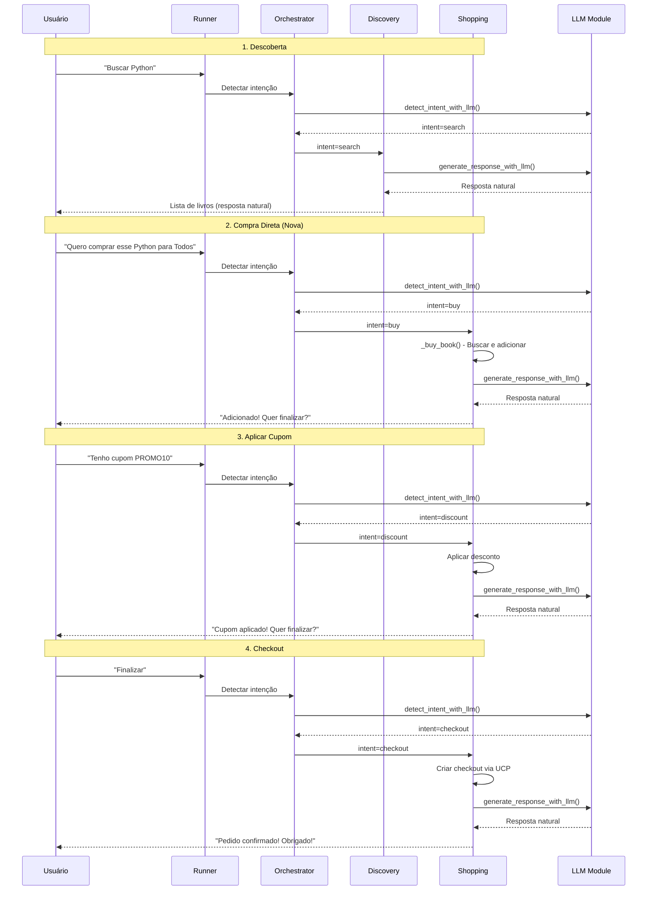
```mermaid
sequenceDiagram
    participant U as Usuário
    participant R as Runner
    participant O as Orchestrator
    participant D as Discovery
    participant S as Shopping
    participant LLM as LLM Module

    Note over U,S: 1. Descoberta
    U->>R: "Buscar Python"
    R->>O: Detectar intenção
    O->>LLM: detect_intent_with_llm()
    LLM-->>O: intent=search
    O->>D: intent=search
    D->>LLM: generate_response_with_llm()
    LLM-->>D: Resposta natural
    D-->>U: Lista de livros (resposta natural)

    Note over U,S: 2. Compra Direta (Nova)
    U->>R: "Quero comprar esse Python para Todos"
    R->>O: Detectar intenção
    O->>LLM: detect_intent_with_llm()
    LLM-->>O: intent=buy
    O->>S: intent=buy
    S->>S: _buy_book() - Buscar e adicionar
    S->>LLM: generate_response_with_llm()
    LLM-->>S: Resposta natural
    S-->>U: "Adicionado! Quer finalizar?"

    Note over U,S: 3. Aplicar Cupom
    U->>R: "Tenho cupom PROMO10"
    R->>O: Detectar intenção
    O->>LLM: detect_intent_with_llm()
    LLM-->>O: intent=discount
    O->>S: intent=discount
    S->>S: Aplicar desconto
    S->>LLM: generate_response_with_llm()
    LLM-->>S: Resposta natural
    S-->>U: "Cupom aplicado! Quer finalizar?"

    Note over U,S: 4. Checkout
    U->>R: "Finalizar"
    R->>O: Detectar intenção
    O->>LLM: detect_intent_with_llm()
    LLM-->>O: intent=checkout
    O->>S: intent=checkout
    S->>S: Criar checkout via UCP
    S->>LLM: generate_response_with_llm()
    LLM-->>S: Resposta natural
    S-->>U: "Pedido confirmado! Obrigado!"
```

---

## Gerenciamento de Sessões

```mermaid
flowchart TB
    subgraph Sessions["store_agent_runner.sessions"]
        S1["session_abc123<br/>StoreAgentState"]
        S2["session_def456<br/>StoreAgentState"]
        S3["session_ghi789<br/>StoreAgentState"]
    end
    
    subgraph Operations["Operações"]
        Get["get_or_create_session()"]
        Process["process_message()"]
        Clear["clear_session()"]
    end
    
    Get --> Sessions
    Process --> Sessions
    Clear --> Sessions
```

### Ciclo de Vida da Sessão

```mermaid
stateDiagram-v2
    [*] --> Created: get_or_create_session()
    Created --> Active: process_message()
    Active --> Active: process_message()
    Active --> Active: process_a2a_request()
    Active --> Cleared: clear_session()
    Cleared --> [*]
    
    note right of Active: Estado persiste entre mensagens<br/>LLM usado quando disponível
```

### Nova Intenção: "buy"

A intenção `buy` permite compra direta de livros mencionados pelo nome:

**Exemplos:**
- "Quero comprar esse Python para Todos"
- "Vou levar esse Clean Code"
- "Quero esse livro de Machine Learning"

**Fluxo:**
1. Usuário menciona livro pelo nome
2. Sistema busca o livro no catálogo
3. Adiciona automaticamente ao carrinho
4. Gera resposta natural perguntando se quer finalizar

---

## Integração com Outros Módulos

```mermaid
flowchart TB
    subgraph Agents["Módulo Agents"]
        Runner
        Graph
        State
    end
    
    subgraph Integrations["Integrações"]
        DB["db/<br/>Repositories"]
        UCP["ucp_server/<br/>Discovery, Checkout"]
        MCP["mcp/<br/>Tools"]
        Security["security/<br/>AP2"]
    end
    
    subgraph External["Externo"]
        Chat["Chat WebSocket"]
        A2AExt["A2A WebSocket"]
        REST["REST API"]
    end
    
    Chat --> Runner
    A2AExt --> Runner
    REST --> Runner
    
    Runner --> Graph
    Graph --> State
    
    Graph --> DB
    Graph --> UCP
    Graph --> MCP
    Graph --> Security
```

---

## Instâncias Globais

O módulo exporta duas instâncias globais:

```python
# Grafo compilado (imutável)
store_graph = create_store_agents_graph()

# Runner com gerenciamento de sessões
store_agent_runner = StoreAgentRunner()
```

### Status do LLM

Para verificar se o LLM está habilitado:

```python
from backend.src.agents.llm import is_llm_enabled, get_llm_status

# Verificar se está habilitado
if is_llm_enabled():
    print("LLM habilitado - respostas mais naturais!")
else:
    print("LLM desabilitado - usando regras")

# Obter status detalhado
status = get_llm_status()
print(f"Modelo: {status.get('model')}")
print(f"Configurado: {status.get('configured')}")
```

### Uso Recomendado

```python
from backend.src.agents import store_agent_runner

# Processar mensagem de chat
response = await store_agent_runner.process_message(
    session_id="sess_123",
    message="Buscar livros de Python",
    user_id="user_456"
)

# Processar requisição A2A
response = await store_agent_runner.process_a2a_request(
    session_id="a2a_789",
    agent_id="external-agent",
    action="search",
    payload={"query": "machine learning"}
)
```

---

## Dependências

```mermaid
flowchart TB
    subgraph External["Externas"]
        langgraph["langgraph<br/>StateGraph, END"]
        structlog["structlog<br/>Logging"]
        langchain["langchain-google-genai<br/>ChatGoogleGenerativeAI"]
    end
    
    subgraph Internal["Internas"]
        db["../db/<br/>Repositories"]
        ucp["../ucp_server/<br/>Models"]
        config["../config<br/>settings"]
    end
    
    subgraph Agents["Módulo Agents"]
        state["state.py"]
        graph["graph.py"]
        llm["llm.py"]
        nodes["nodes/"]
        a2a["a2a/"]
    end
    
    graph --> langgraph
    graph --> structlog
    graph --> state
    graph --> nodes
    
    nodes --> state
    nodes --> db
    nodes --> llm
    
    llm --> langchain
    llm --> config
    
    a2a --> graph
    a2a --> ucp
```

---

## Uso de LLM

### Habilitar LLM

Para habilitar o LLM, configure a chave da API do Google no arquivo `.env`:

```bash
GOOGLE_API_KEY=sua-chave-aqui
LLM_MODEL=gemini-2.0-flash-lite
LLM_TEMPERATURE=0.7
LLM_MAX_TOKENS=1024
```

### Comportamento com/sem LLM

| Funcionalidade | Com LLM | Sem LLM |
|----------------|---------|---------|
| **Detecção de Intenção** | Usa Gemini para análise semântica | Usa regras baseadas em keywords |
| **Geração de Respostas** | Respostas naturais e contextualizadas | Respostas formatadas pré-definidas |
| **Experiência** | Mais conversacional e natural | Funcional mas mais rígida |

### Exemplo de Resposta com LLM

**Sem LLM:**
```
Encontrei estes livros para você:

**1. Python para Todos**
   Autor: Maria Santos
   Preço: R$ 39,90
```

**Com LLM:**
```
Ótimo! Encontrei alguns livros interessantes sobre Python para você:

**1. Python para Todos** por Maria Santos - R$ 39,90
   Um guia completo perfeito para iniciantes!

Gostaria de adicionar algum ao carrinho? Basta dizer "quero comprar esse" ou o número do livro.
```

---

## Melhorias Recentes

### Integração com LLM (Google Gemini)

O módulo agora suporta integração com Google Gemini para:

- ✅ **Detecção de Intenção Inteligente** - Usa LLM para entender melhor a intenção do usuário
- ✅ **Respostas Naturais** - Gera respostas conversacionais em vez de templates fixos
- ✅ **Fallback Automático** - Usa regras quando LLM não disponível
- ✅ **Nova Intenção "buy"** - Permite compra direta mencionando o nome do livro

### Fluxo "buy" - Compra Direta

O shopping node agora suporta compra direta de livros:

```python
# Usuário: "Quero comprar esse Python para Todos"
# 1. Sistema detecta intent="buy"
# 2. Extrai nome do livro da mensagem
# 3. Busca no catálogo
# 4. Adiciona ao carrinho automaticamente
# 5. Gera resposta natural perguntando se quer finalizar
```

### Uso de LLM nos Nodes

Todos os nodes principais agora usam LLM quando disponível:

| Node | Uso de LLM |
|------|------------|
| **Orchestrator** | Detecção de intenção |
| **Discovery** | Geração de respostas de busca e ajuda |
| **Shopping** | Geração de respostas de carrinho, checkout e cupons |
| **Recommend** | Geração de respostas de recomendações |

---

## Referências

- **Nodes (Agentes Especializados):** [`nodes/nodes.md`](nodes/nodes.md)
- **A2A Protocol:** [`a2a/a2a.md`](a2a/a2a.md)
- **Database Layer:** [`../db/db.md`](../db/db.md)
- **LangGraph Docs:** https://langchain-ai.github.io/langgraph/
- **Google Gemini:** https://ai.google.dev/
- **LangChain Google GenAI:** https://python.langchain.com/docs/integrations/chat/google_generative_ai