# Módulo Nodes - LangGraph Agent Nodes

Este módulo implementa os **nodes** do grafo de agentes LangGraph para a Livraria Virtual UCP. Cada node representa um agente especializado que processa uma parte específica do fluxo de interação.

## Visão Geral

O módulo nodes contém:
- **Orchestrator** - Roteador principal que detecta intenções e direciona o fluxo
- **Discovery** - Busca de livros e informações sobre a loja
- **Shopping** - Gerenciamento de carrinho e checkout
- **Recommend** - Sistema de recomendações de livros

---

## Arquitetura do Módulo

```
backend/src/agents/nodes/
├── __init__.py      # Exports públicos dos nodes
├── orchestrator.py  # Node orquestrador/roteador
├── discovery.py     # Node de busca e descoberta
├── shopping.py      # Node de carrinho e checkout
├── recommend.py     # Node de recomendações
└── nodes.md         # Esta documentação
```

### Diagrama de Arquitetura

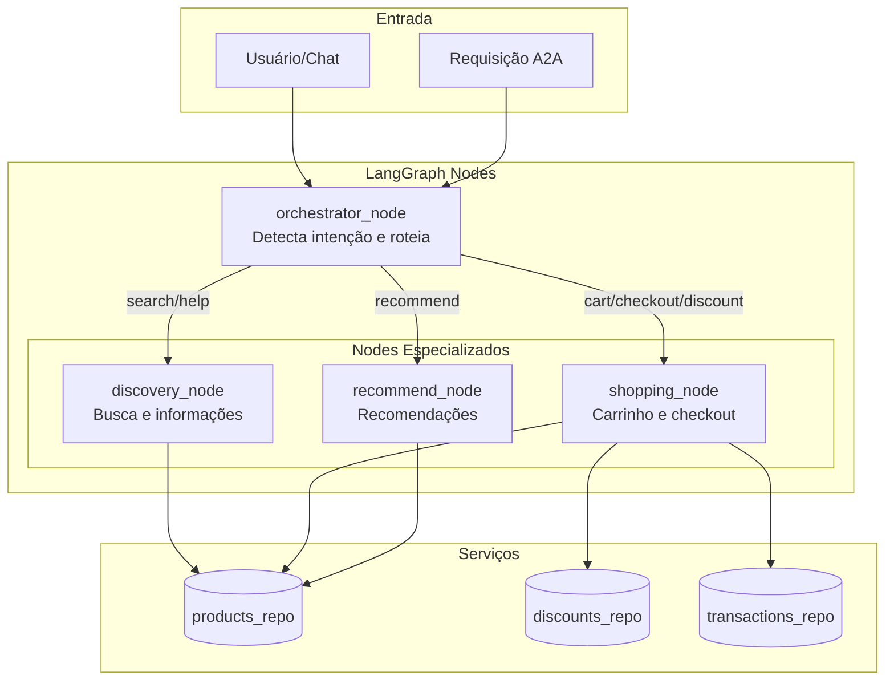

### Diagrama do Grafo LangGraph

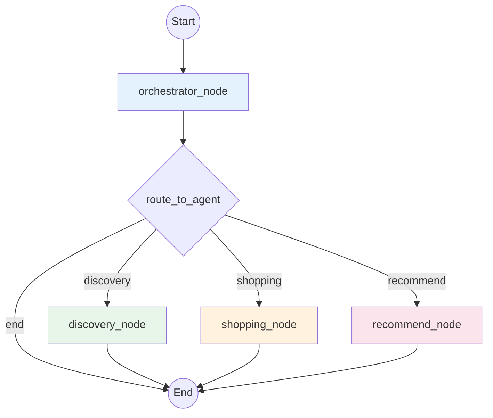

---

## Estado Compartilhado

Todos os nodes compartilham o estado `StoreAgentState` definido em `state.py`.

### Diagrama de Estado

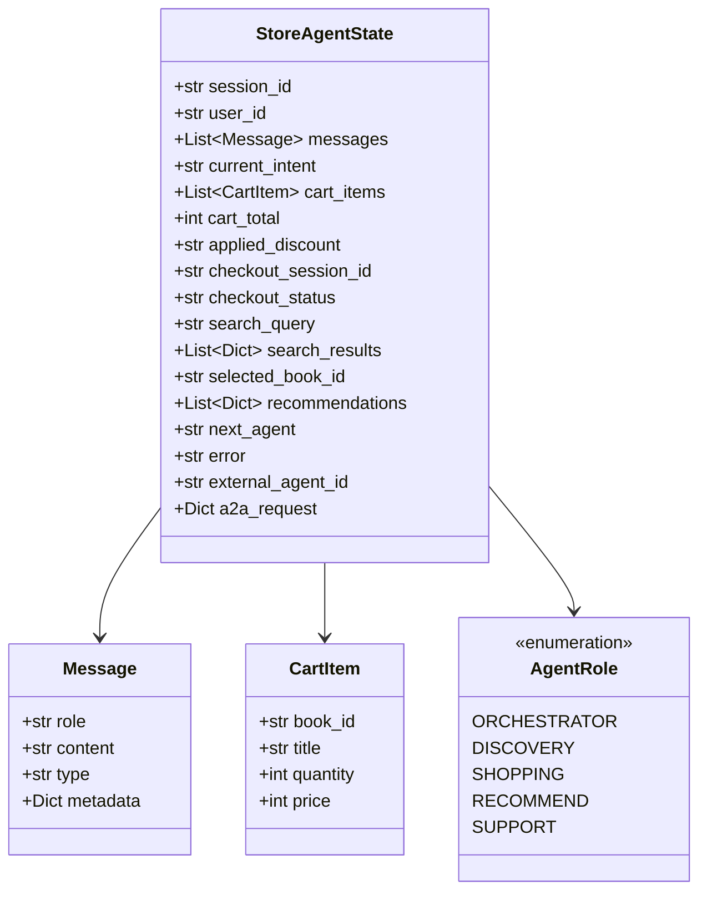

---

## Nodes Detalhados

### 1. Orchestrator Node (`orchestrator.py`)

O nó orquestrador é o ponto de entrada do grafo. Analisa a mensagem do usuário, detecta a intenção e roteia para o agente apropriado.

#### Funções Exportadas

| Função | Tipo | Descrição |
|--------|------|-----------|
| `orchestrator_node` | async node | Processa estado e define próximo agente |
| `route_to_agent` | routing func | Função de roteamento para o grafo |
| `detect_intent` | helper | Detecta intenção da mensagem |

#### Detecção de Intenção

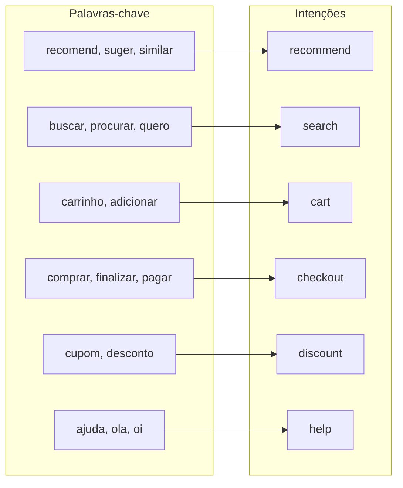

#### Mapeamento Intenção → Agente

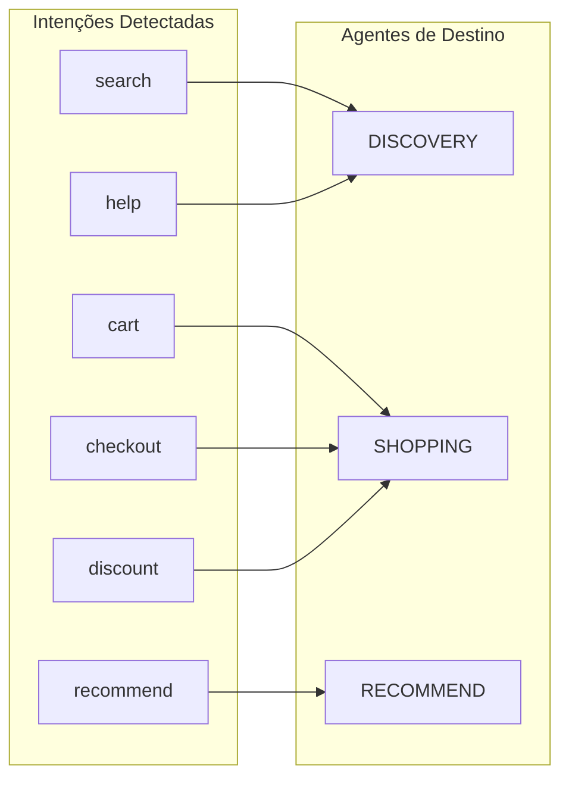

#### Código Principal

```python
async def orchestrator_node(state: StoreAgentState) -> Dict[str, Any]:
    """
    Decide para qual agente rotear baseado na mensagem.
    
    Returns:
        next_agent: Nome do próximo agente
        current_intent: Intenção detectada
    """
```

#### Tratamento A2A

Quando recebe uma requisição A2A, o orchestrator mapeia a ação diretamente:

| Ação A2A | Agente |
|----------|--------|
| `search`, `get_products` | DISCOVERY |
| `checkout`, `create_order` | SHOPPING |
| `recommend` | RECOMMEND |

---

### 2. Discovery Node (`discovery.py`)

Node responsável por busca de livros e informações sobre a loja.

#### Responsabilidades

- Buscar livros por termo
- Listar categorias disponíveis
- Fornecer detalhes de livros
- Responder perguntas sobre a loja (help)

#### Diagrama de Fluxo

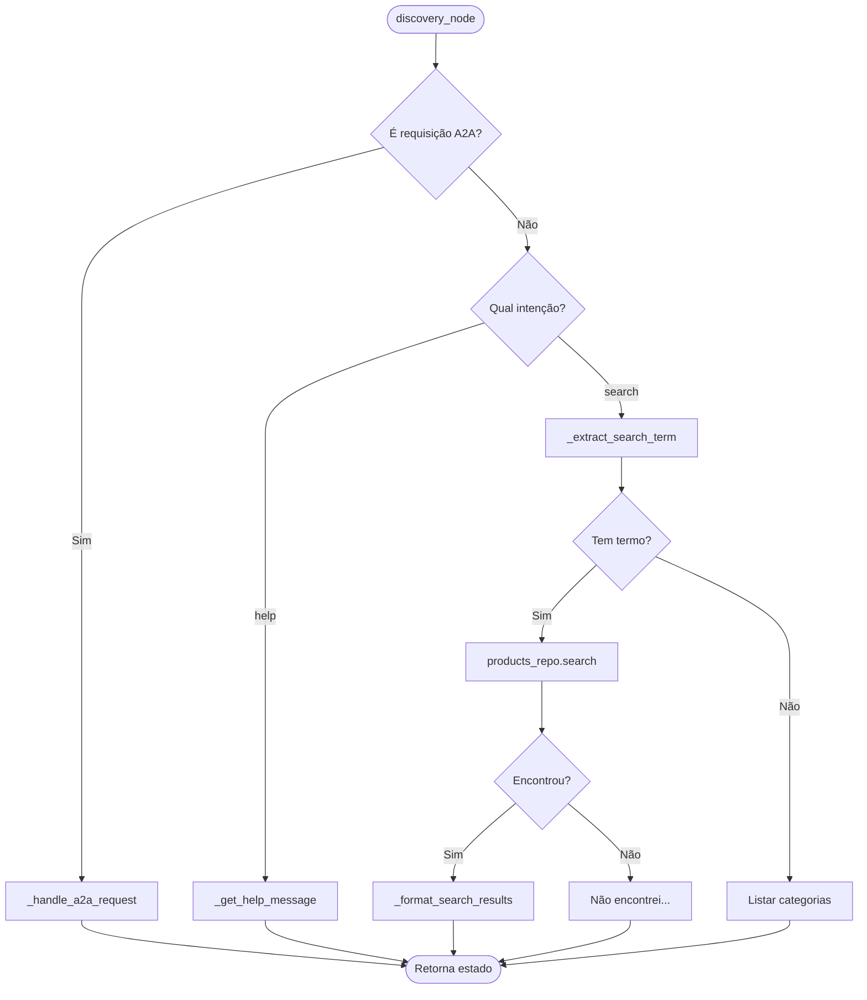

#### Funções Internas

| Função | Descrição |
|--------|-----------|
| `_handle_a2a_request` | Processa requisições A2A (search, get_products) |
| `_extract_search_term` | Remove stop words e extrai termo de busca |
| `_get_help_message` | Retorna mensagem de boas-vindas |
| `_format_search_results` | Formata resultados para exibição |
| `_format_categories` | Formata lista de categorias |

#### Exemplo de Saída

```python
{
    "messages": [Message(...)],
    "search_results": [
        {"id": "book_001", "title": "...", "price": 4990, ...}
    ],
    "search_query": "python",
    "next_agent": None  # Fim do fluxo
}
```

---

### 3. Shopping Node (`shopping.py`)

Node responsável pelo gerenciamento do carrinho e processo de checkout.

#### Responsabilidades

- Adicionar/remover itens do carrinho
- Aplicar cupons de desconto
- Criar sessões de checkout
- Processar pedidos A2A

#### Diagrama de Fluxo

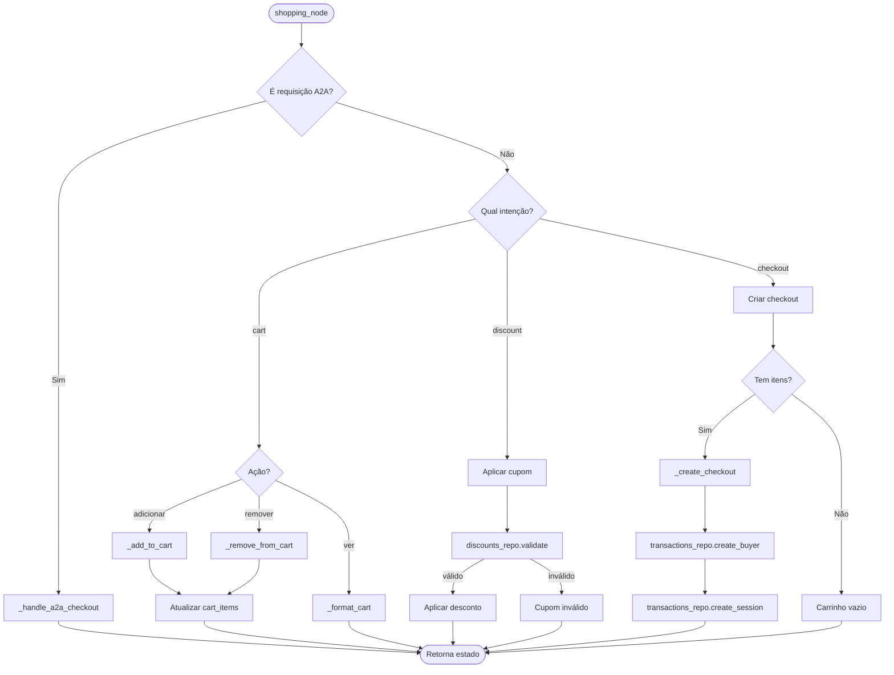

#### Funções Internas

| Função | Descrição |
|--------|-----------|
| `_add_to_cart` | Adiciona item ao carrinho (por índice ou busca) |
| `_remove_from_cart` | Remove item do carrinho por índice |
| `_create_checkout` | Cria sessão de checkout completa |
| `_handle_a2a_checkout` | Processa checkout via A2A |
| `_format_cart` | Formata carrinho para exibição |
| `_extract_discount_code` | Extrai código de cupom da mensagem |

#### Fluxo de Checkout

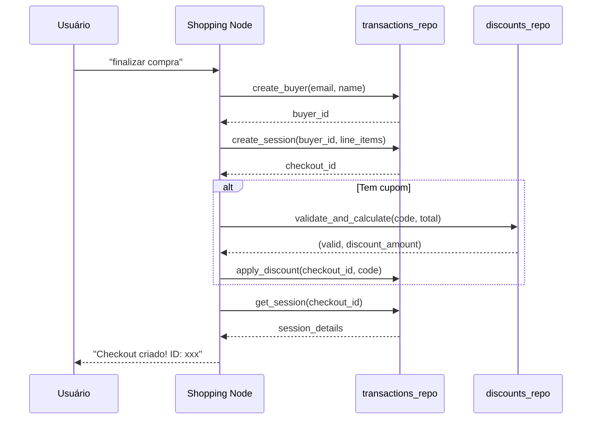

---

### 4. Recommend Node (`recommend.py`)

Node responsável pelo sistema de recomendações de livros.

#### Responsabilidades

- Recomendar por livro selecionado
- Recomendar por categorias do carrinho
- Recomendar por categoria mencionada
- Listar livros populares

#### Diagrama de Fluxo

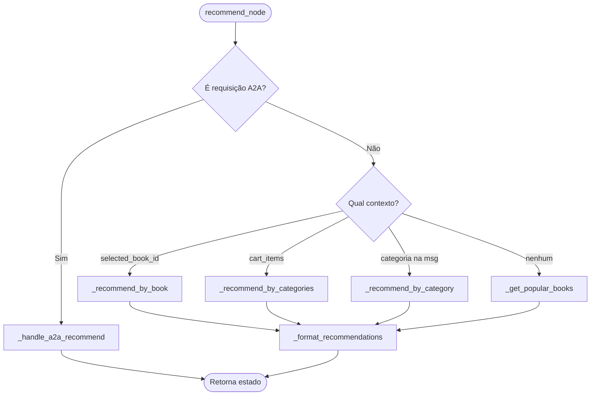

#### Estratégias de Recomendação

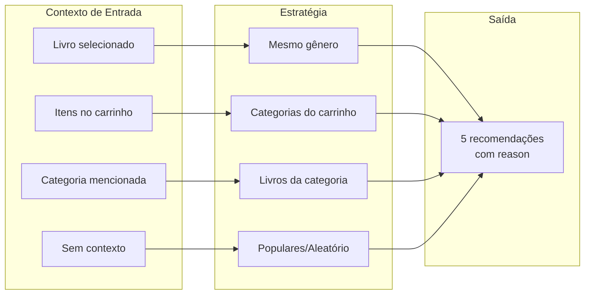

#### Funções Internas

| Função | Descrição |
|--------|-----------|
| `_recommend_by_book` | Recomenda livros da mesma categoria |
| `_recommend_by_category` | Recomenda livros de uma categoria |
| `_recommend_by_categories` | Recomenda de múltiplas categorias |
| `_get_popular_books` | Retorna livros "populares" (mock) |
| `_handle_a2a_recommend` | Processa recomendações A2A |
| `_extract_category` | Extrai categoria da mensagem |
| `_format_recommendations` | Formata recomendações para exibição |

#### Exemplo de Saída

```python
{
    "messages": [Message(...)],
    "recommendations": [
        {
            "id": "book_003",
            "title": "Python para Todos",
            "author": "Maria Santos",
            "price": 3990,
            "price_formatted": "R$ 39,90",
            "category": "Programacao",
            "reason": "Mesmo gênero: Programacao"
        }
    ],
    "search_results": [...],  # Permite adicionar ao carrinho
    "next_agent": None
}
```

---

## Fluxos de Interação

### Fluxo Completo de Compra (Chat)

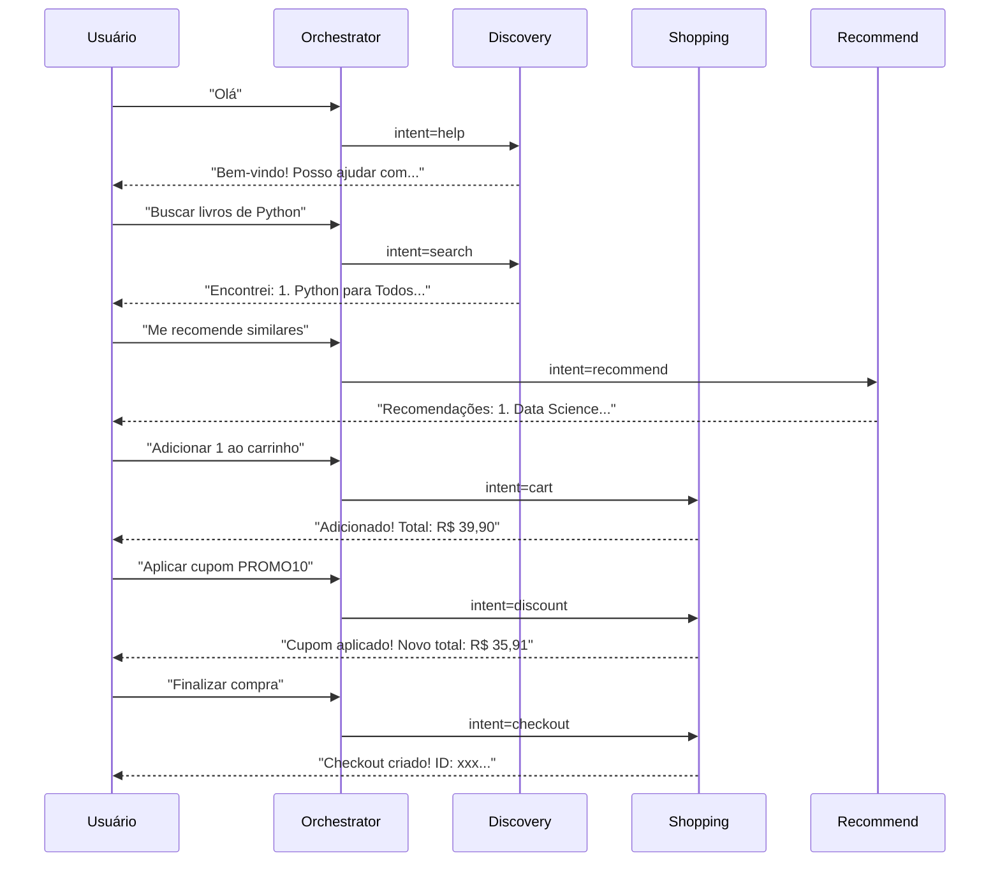

### Fluxo A2A

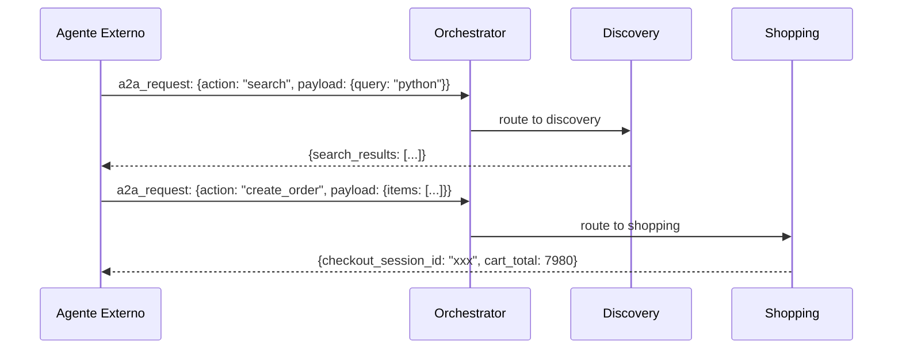

---

## Diagrama de Classes

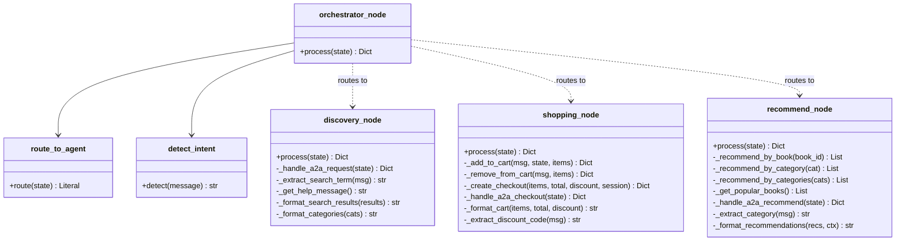

---

## Dependências

### Dependências por Node

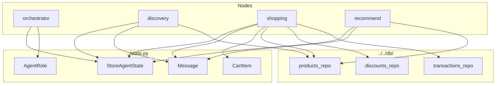

### Tabela de Dependências

| Node | state.py | products_repo | discounts_repo | transactions_repo |
|------|----------|---------------|----------------|-------------------|
| orchestrator | ✅ | - | - | - |
| discovery | ✅ | ✅ | - | - |
| shopping | ✅ | ✅ | ✅ | ✅ |
| recommend | ✅ | ✅ | - | - |

---

## Exports do Módulo

O `__init__.py` exporta as seguintes funções:

```python
from .orchestrator import orchestrator_node
from .discovery import discovery_node
from .shopping import shopping_node
from .recommend import recommend_node

__all__ = [
    "orchestrator_node",
    "discovery_node",
    "shopping_node",
    "recommend_node",
]
```

### Uso no Grafo

```python
from langgraph.graph import StateGraph
from backend.src.agents.nodes import (
    orchestrator_node,
    discovery_node,
    shopping_node,
    recommend_node
)
from backend.src.agents.nodes.orchestrator import route_to_agent

# Criar grafo
graph = StateGraph(StoreAgentState)

# Adicionar nodes
graph.add_node("orchestrator", orchestrator_node)
graph.add_node("discovery", discovery_node)
graph.add_node("shopping", shopping_node)
graph.add_node("recommend", recommend_node)

# Configurar roteamento
graph.add_conditional_edges(
    "orchestrator",
    route_to_agent,
    {
        "discovery": "discovery",
        "shopping": "shopping",
        "recommend": "recommend",
        "end": END
    }
)
```

---

## Tratamento de Erros

Todos os nodes seguem o padrão de tratamento de erros:

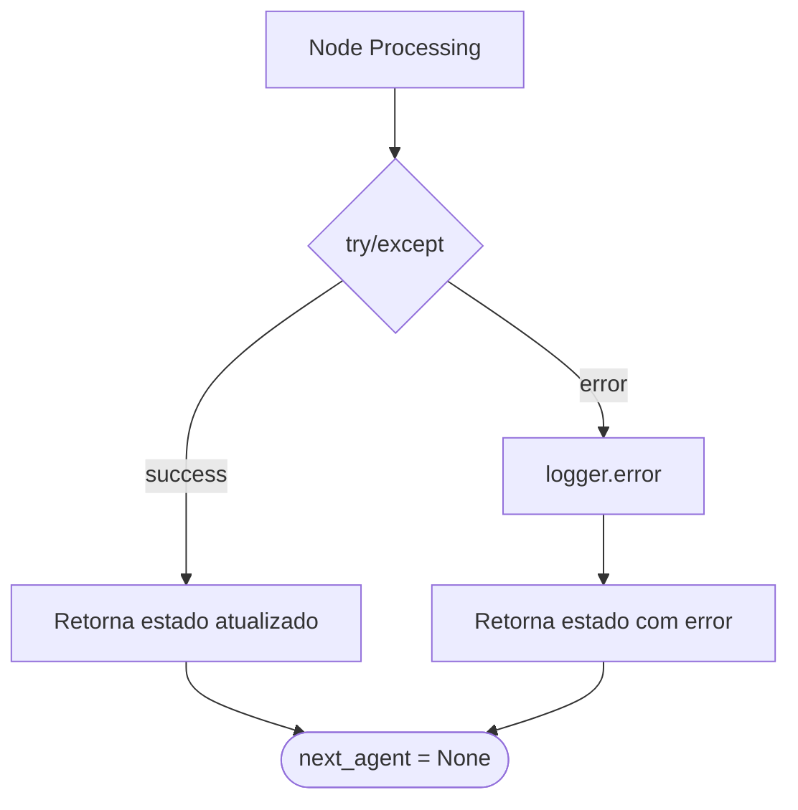

### Logs Estruturados

Todos os nodes usam `structlog` para logging estruturado:

```python
logger.info("Node processing", session=state["session_id"])
logger.info("Intent detected", intent=intent, message=message[:50])
logger.error("Processing error", error=str(e))
```
