# Módulo DB - Camada de Persistência

Este módulo implementa a camada de acesso a dados da Livraria Virtual UCP, utilizando **SQLite** com operações assíncronas via **aiosqlite**. Segue o padrão Repository para separação de responsabilidades.

## Visão Geral

O módulo db contém:
- **Database** - Gerenciador de conexões SQLite assíncronas
- **ProductsRepository** - Operações com livros (catálogo)
- **DiscountsRepository** - Operações com cupons de desconto
- **TransactionsRepository** - Operações com checkout e pagamentos
- **Import Scripts** - Importação de dados dos CSVs

---

## Arquitetura do Módulo

```
backend/src/db/
├── __init__.py       # Exports do módulo
├── database.py       # Gerenciador de conexões SQLite
├── products.py       # Repository de produtos (livros)
├── discounts.py      # Repository de cupons
├── transactions.py   # Repository de transações
├── import_books.py   # Script de importação de dados
└── db.md             # Esta documentação
```

### Diagrama de Arquitetura

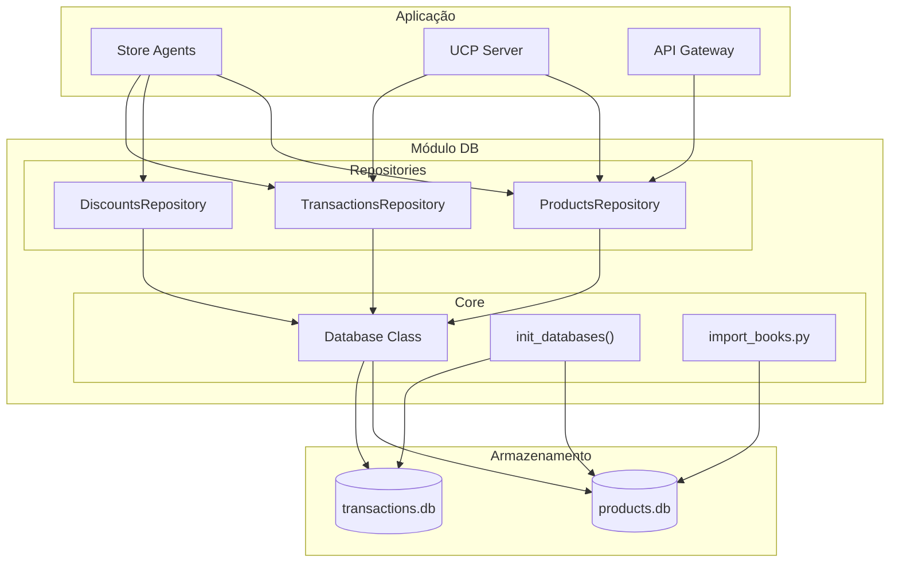
```mermaid
flowchart TB
    subgraph Application["Aplicação"]
        Agents["Store Agents"]
        UCP["UCP Server"]
        API["API Gateway"]
    end

    subgraph DB["Módulo DB"]
        subgraph Repositories["Repositories"]
            PR["ProductsRepository"]
            DR["DiscountsRepository"]
            TR["TransactionsRepository"]
        end
        
        subgraph Core["Core"]
            Database["Database Class"]
            Init["init_databases()"]
            Import["import_books.py"]
        end
    end

    subgraph Storage["Armazenamento"]
        ProductsDB[(products.db)]
        TransactionsDB[(transactions.db)]
    end

    Agents --> PR
    Agents --> DR
    Agents --> TR
    UCP --> PR
    UCP --> TR
    API --> PR
    
    PR --> Database
    DR --> Database
    TR --> Database
    
    Database --> ProductsDB
    Database --> TransactionsDB
    
    Init --> ProductsDB
    Init --> TransactionsDB
    Import --> ProductsDB
```

### Separação de Bancos de Dados

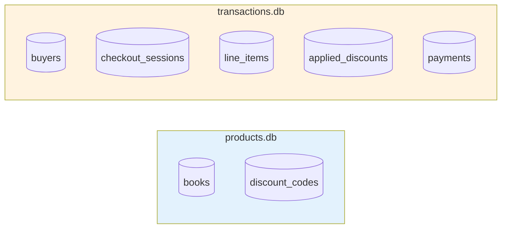
```mermaid
flowchart LR
    subgraph ProductsDB["products.db"]
        books[(books)]
        discount_codes[(discount_codes)]
    end
    
    subgraph TransactionsDB["transactions.db"]
        buyers[(buyers)]
        checkout_sessions[(checkout_sessions)]
        line_items[(line_items)]
        applied_discounts[(applied_discounts)]
        payments[(payments)]
    end
    
    style ProductsDB fill:#e3f2fd
    style TransactionsDB fill:#fff3e0
```

---

## Modelo de Dados

### Diagrama ER Completo

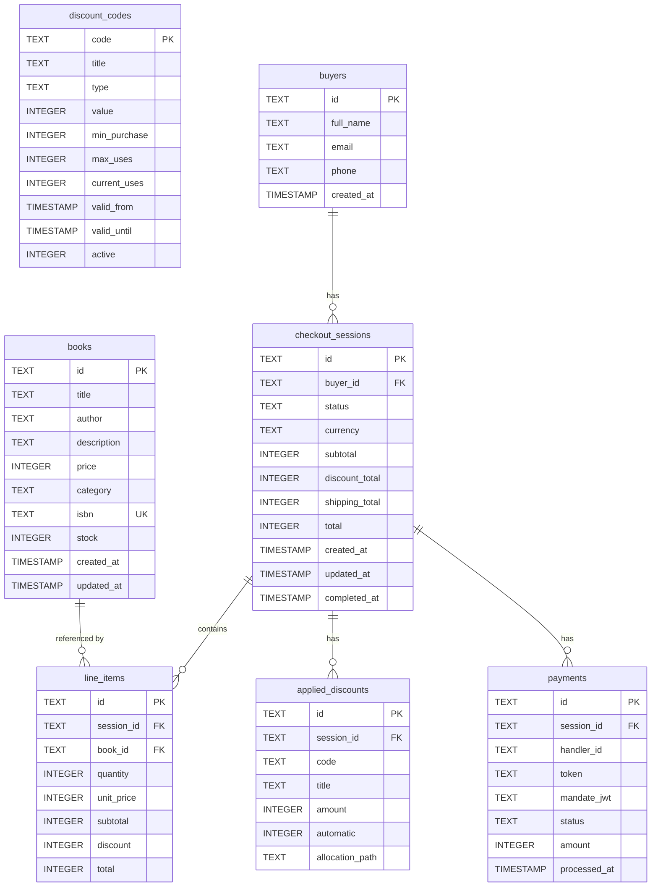
```mermaid
erDiagram
    books {
        TEXT id PK
        TEXT title
        TEXT author
        TEXT description
        INTEGER price
        TEXT category
        TEXT isbn UK
        INTEGER stock
        TIMESTAMP created_at
        TIMESTAMP updated_at
    }
    
    discount_codes {
        TEXT code PK
        TEXT title
        TEXT type
        INTEGER value
        INTEGER min_purchase
        INTEGER max_uses
        INTEGER current_uses
        TIMESTAMP valid_from
        TIMESTAMP valid_until
        INTEGER active
    }
    
    buyers {
        TEXT id PK
        TEXT full_name
        TEXT email
        TEXT phone
        TIMESTAMP created_at
    }
    
    checkout_sessions {
        TEXT id PK
        TEXT buyer_id FK
        TEXT status
        TEXT currency
        INTEGER subtotal
        INTEGER discount_total
        INTEGER shipping_total
        INTEGER total
        TIMESTAMP created_at
        TIMESTAMP updated_at
        TIMESTAMP completed_at
    }
    
    line_items {
        TEXT id PK
        TEXT session_id FK
        TEXT book_id FK
        INTEGER quantity
        INTEGER unit_price
        INTEGER subtotal
        INTEGER discount
        INTEGER total
    }
    
    applied_discounts {
        TEXT id PK
        TEXT session_id FK
        TEXT code
        TEXT title
        INTEGER amount
        INTEGER automatic
        TEXT allocation_path
    }
    
    payments {
        TEXT id PK
        TEXT session_id FK
        TEXT handler_id
        TEXT token
        TEXT mandate_jwt
        TEXT status
        INTEGER amount
        TIMESTAMP processed_at
    }
    
    buyers ||--o{ checkout_sessions : "has"
    checkout_sessions ||--o{ line_items : "contains"
    checkout_sessions ||--o{ applied_discounts : "has"
    checkout_sessions ||--o{ payments : "has"
    books ||--o{ line_items : "referenced by"
```

---

## Componentes Detalhados

### 1. Database (`database.py`)

Classe central para gerenciamento de conexões SQLite assíncronas.

#### Diagrama de Classes

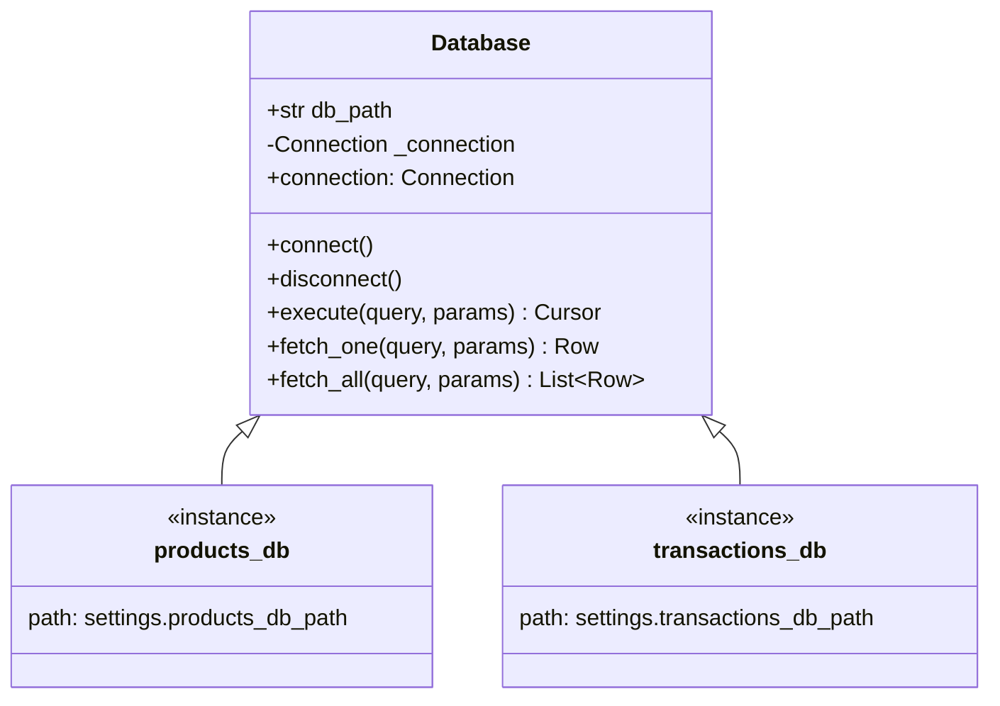
```mermaid
classDiagram
    class Database {
        +str db_path
        -Connection _connection
        +connect()
        +disconnect()
        +connection: Connection
        +execute(query, params) Cursor
        +fetch_one(query, params) Row
        +fetch_all(query, params) List~Row~
    }
    
    class products_db {
        <<instance>>
        path: settings.products_db_path
    }
    
    class transactions_db {
        <<instance>>
        path: settings.transactions_db_path
    }
    
    Database <|-- products_db
    Database <|-- transactions_db
```

#### Métodos da Classe Database

| Método | Tipo | Descrição |
|--------|------|-----------|
| `connect()` | async | Abre conexão com o banco |
| `disconnect()` | async | Fecha conexão |
| `connection` | property | Retorna conexão ativa |
| `execute(query, params)` | async | Executa query com commit |
| `fetch_one(query, params)` | async | Busca um registro |
| `fetch_all(query, params)` | async | Busca todos os registros |

#### Context Managers

```python
@asynccontextmanager
async def get_products_db():
    """Context manager para banco de produtos."""

@asynccontextmanager  
async def get_transactions_db():
    """Context manager para banco de transações."""
```

#### Função de Inicialização

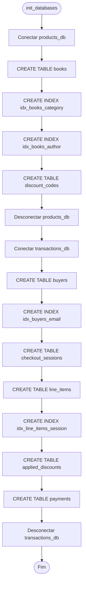
```mermaid
flowchart TD
    Start([init_databases]) --> ConnectProducts[Conectar products_db]
    
    ConnectProducts --> CreateBooks[CREATE TABLE books]
    CreateBooks --> CreateIdxCategory[CREATE INDEX idx_books_category]
    CreateIdxCategory --> CreateIdxAuthor[CREATE INDEX idx_books_author]
    CreateIdxAuthor --> CreateDiscounts[CREATE TABLE discount_codes]
    CreateDiscounts --> DisconnectProducts[Desconectar products_db]
    
    DisconnectProducts --> ConnectTransactions[Conectar transactions_db]
    
    ConnectTransactions --> CreateBuyers[CREATE TABLE buyers]
    CreateBuyers --> CreateIdxEmail[CREATE INDEX idx_buyers_email]
    CreateIdxEmail --> CreateSessions[CREATE TABLE checkout_sessions]
    CreateSessions --> CreateLineItems[CREATE TABLE line_items]
    CreateLineItems --> CreateIdxSession[CREATE INDEX idx_line_items_session]
    CreateIdxSession --> CreateApplied[CREATE TABLE applied_discounts]
    CreateApplied --> CreatePayments[CREATE TABLE payments]
    CreatePayments --> DisconnectTransactions[Desconectar transactions_db]
    
    DisconnectTransactions --> End([Fim])
```

---

### 2. ProductsRepository (`products.py`)

Repository para operações com livros do catálogo.

#### Diagrama de Classe

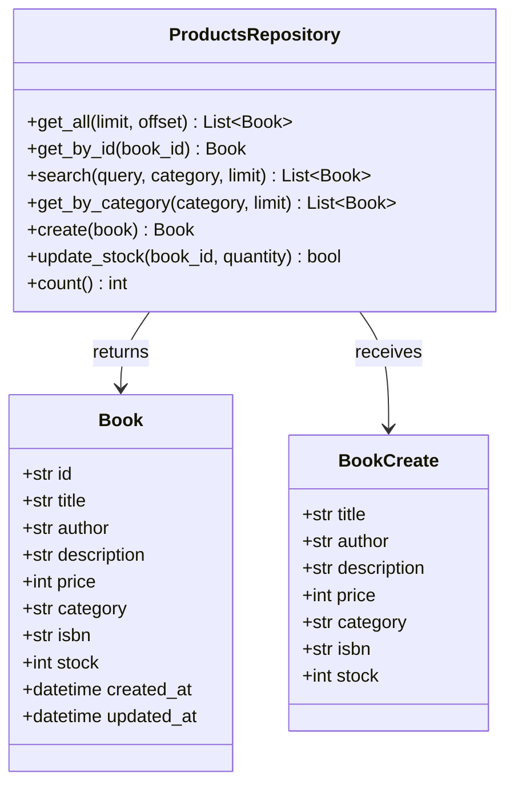
```mermaid
classDiagram
    class ProductsRepository {
        +get_all(limit, offset) List~Book~
        +get_by_id(book_id) Book
        +search(query, category, limit) List~Book~
        +get_by_category(category, limit) List~Book~
        +create(book) Book
        +update_stock(book_id, quantity) bool
        +count() int
    }
    
    class Book {
        +str id
        +str title
        +str author
        +str description
        +int price
        +str category
        +str isbn
        +int stock
        +datetime created_at
        +datetime updated_at
    }
    
    class BookCreate {
        +str title
        +str author
        +str description
        +int price
        +str category
        +str isbn
        +int stock
    }
    
    ProductsRepository --> Book : returns
    ProductsRepository --> BookCreate : receives
```

#### Métodos

| Método | Parâmetros | Retorno | Descrição |
|--------|------------|---------|-----------|
| `get_all` | limit, offset | List[Book] | Lista todos os livros |
| `get_by_id` | book_id | Book \| None | Busca por ID |
| `search` | query, category?, limit | List[Book] | Busca por termo |
| `get_by_category` | category, limit | List[Book] | Filtra por categoria |
| `create` | BookCreate | Book | Cria novo livro |
| `update_stock` | book_id, quantity | bool | Atualiza estoque (+/-) |
| `count` | - | int | Total de livros |

#### Fluxo de Busca

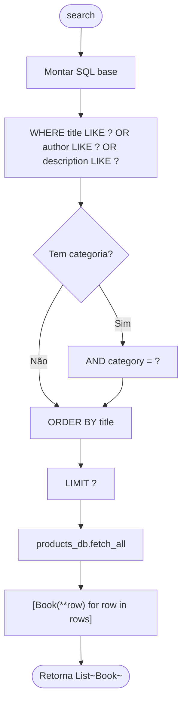
```mermaid
flowchart TD
    Search([search]) --> BuildSQL[Montar SQL base]
    BuildSQL --> AddLike["WHERE title LIKE ? OR author LIKE ? OR description LIKE ?"]
    AddLike --> HasCategory{Tem categoria?}
    
    HasCategory -->|Sim| AddCategory["AND category = ?"]
    HasCategory -->|Não| AddOrder["ORDER BY title"]
    AddCategory --> AddOrder
    
    AddOrder --> AddLimit["LIMIT ?"]
    AddLimit --> Execute[products_db.fetch_all]
    Execute --> Convert["[Book(**row) for row in rows]"]
    Convert --> Return([Retorna List~Book~])
```

---

### 3. DiscountsRepository (`discounts.py`)

Repository para gerenciamento de cupons de desconto.

#### Diagrama de Classes

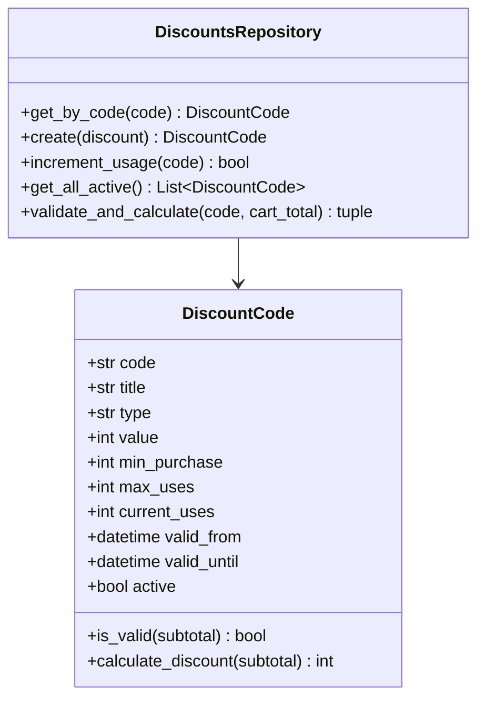
```mermaid
classDiagram
    class DiscountCode {
        +str code
        +str title
        +str type
        +int value
        +int min_purchase
        +int max_uses
        +int current_uses
        +datetime valid_from
        +datetime valid_until
        +bool active
        +is_valid(subtotal) bool
        +calculate_discount(subtotal) int
    }
    
    class DiscountsRepository {
        +get_by_code(code) DiscountCode
        +create(discount) DiscountCode
        +increment_usage(code) bool
        +get_all_active() List~DiscountCode~
        +validate_and_calculate(code, cart_total) tuple
    }
    
    DiscountsRepository --> DiscountCode
```

#### Tipos de Desconto

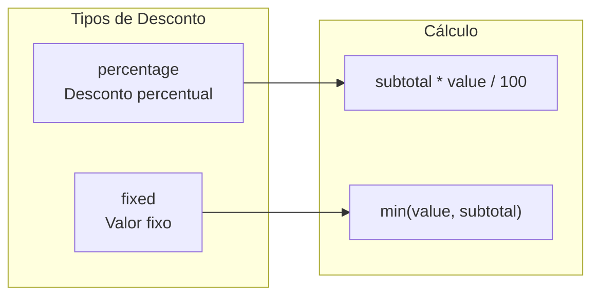
```mermaid
flowchart LR
    subgraph Types["Tipos de Desconto"]
        Percentage["percentage<br/>Desconto percentual"]
        Fixed["fixed<br/>Valor fixo"]
    end
    
    subgraph Calculation["Cálculo"]
        CalcPerc["subtotal * value / 100"]
        CalcFixed["min(value, subtotal)"]
    end
    
    Percentage --> CalcPerc
    Fixed --> CalcFixed
```

#### Fluxo de Validação

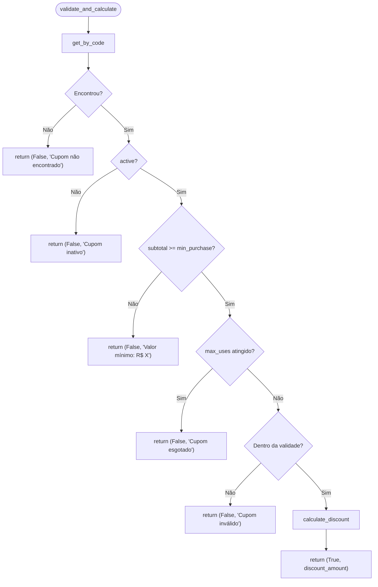
```mermaid
flowchart TD
    Start([validate_and_calculate]) --> GetCode[get_by_code]
    GetCode --> Found{Encontrou?}
    
    Found -->|Não| NotFound["return (False, 'Cupom não encontrado')"]
    Found -->|Sim| CheckActive{active?}
    
    CheckActive -->|Não| Inactive["return (False, 'Cupom inativo')"]
    CheckActive -->|Sim| CheckMin{subtotal >= min_purchase?}
    
    CheckMin -->|Não| MinError["return (False, 'Valor mínimo: R$ X')"]
    CheckMin -->|Sim| CheckMax{max_uses atingido?}
    
    CheckMax -->|Sim| Exhausted["return (False, 'Cupom esgotado')"]
    CheckMax -->|Não| CheckDates{Dentro da validade?}
    
    CheckDates -->|Não| Invalid["return (False, 'Cupom inválido')"]
    CheckDates -->|Sim| Calculate[calculate_discount]
    
    Calculate --> Success["return (True, discount_amount)"]
```

#### Métodos

| Método | Parâmetros | Retorno | Descrição |
|--------|------------|---------|-----------|
| `get_by_code` | code | DiscountCode \| None | Busca cupom |
| `create` | DiscountCode | DiscountCode | Cria cupom |
| `increment_usage` | code | bool | Incrementa contador de uso |
| `get_all_active` | - | List[DiscountCode] | Lista cupons ativos |
| `validate_and_calculate` | code, cart_total | (bool, int\|str) | Valida e calcula |

---

### 4. TransactionsRepository (`transactions.py`)

Repository para gerenciamento de checkout sessions e pagamentos.

#### Diagrama de Classes

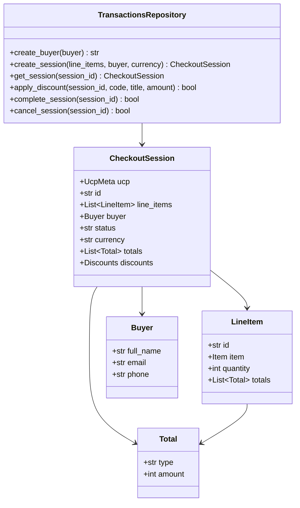
```mermaid
classDiagram
    class TransactionsRepository {
        +create_buyer(buyer) str
        +create_session(line_items, buyer, currency) CheckoutSession
        +get_session(session_id) CheckoutSession
        +apply_discount(session_id, code, title, amount) bool
        +complete_session(session_id) bool
        +cancel_session(session_id) bool
    }
    
    class CheckoutSession {
        +UcpMeta ucp
        +str id
        +List~LineItem~ line_items
        +Buyer buyer
        +str status
        +str currency
        +List~Total~ totals
        +Discounts discounts
    }
    
    class LineItem {
        +str id
        +Item item
        +int quantity
        +List~Total~ totals
    }
    
    class Buyer {
        +str full_name
        +str email
        +str phone
    }
    
    class Total {
        +str type
        +int amount
    }
    
    TransactionsRepository --> CheckoutSession
    CheckoutSession --> LineItem
    CheckoutSession --> Buyer
    CheckoutSession --> Total
    LineItem --> Total
```

#### Estados do Checkout

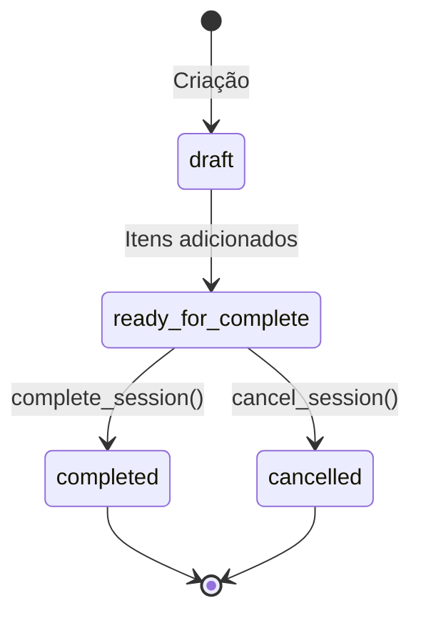
```mermaid
stateDiagram-v2
    [*] --> draft: Criação
    draft --> ready_for_complete: Itens adicionados
    ready_for_complete --> completed: complete_session()
    ready_for_complete --> cancelled: cancel_session()
    completed --> [*]
    cancelled --> [*]
```

#### Fluxo de Criação de Sessão

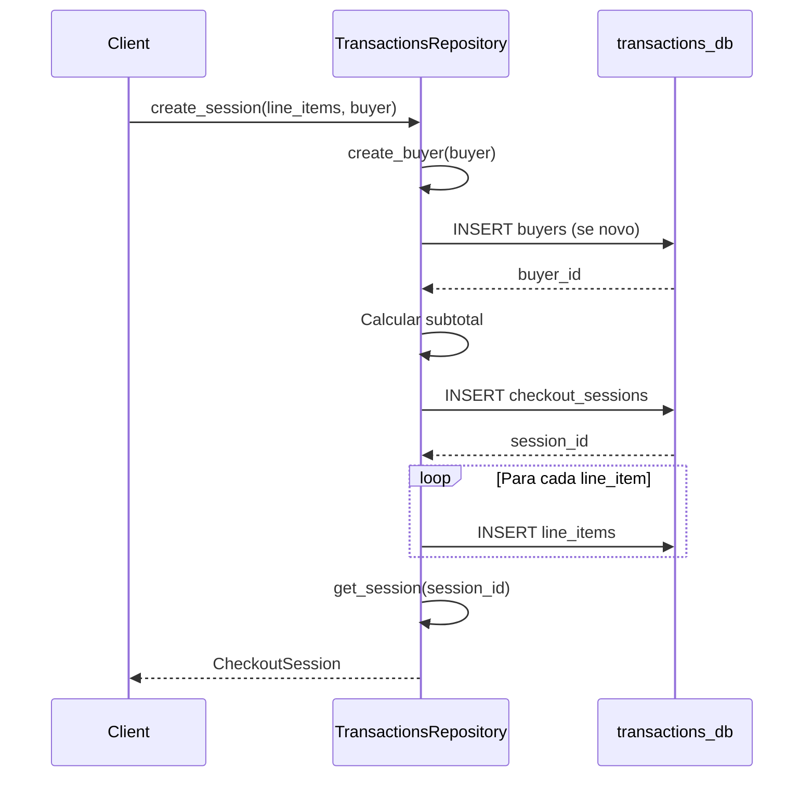
```mermaid
sequenceDiagram
    participant C as Client
    participant TR as TransactionsRepository
    participant DB as transactions_db

    C->>TR: create_session(line_items, buyer)
    TR->>TR: create_buyer(buyer)
    TR->>DB: INSERT buyers (se novo)
    DB-->>TR: buyer_id
    
    TR->>TR: Calcular subtotal
    TR->>DB: INSERT checkout_sessions
    DB-->>TR: session_id
    
    loop Para cada line_item
        TR->>DB: INSERT line_items
    end
    
    TR->>TR: get_session(session_id)
    TR-->>C: CheckoutSession
```

#### Fluxo de Aplicar Desconto

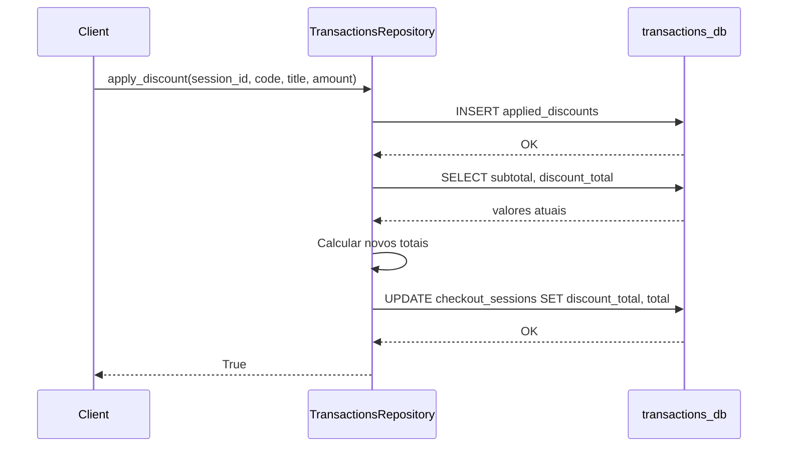
```mermaid
sequenceDiagram
    participant C as Client
    participant TR as TransactionsRepository
    participant DB as transactions_db

    C->>TR: apply_discount(session_id, code, title, amount)
    TR->>DB: INSERT applied_discounts
    DB-->>TR: OK
    
    TR->>DB: SELECT subtotal, discount_total
    DB-->>TR: valores atuais
    
    TR->>TR: Calcular novos totais
    TR->>DB: UPDATE checkout_sessions SET discount_total, total
    DB-->>TR: OK
    
    TR-->>C: True
```

#### Métodos

| Método | Parâmetros | Retorno | Descrição |
|--------|------------|---------|-----------|
| `create_buyer` | Buyer | str | Cria ou retorna buyer existente |
| `create_session` | line_items, buyer, currency | CheckoutSession | Cria sessão completa |
| `get_session` | session_id | CheckoutSession \| None | Busca sessão com todos os dados |
| `apply_discount` | session_id, code, title, amount | bool | Aplica desconto |
| `complete_session` | session_id | bool | Marca como completa |
| `cancel_session` | session_id | bool | Cancela sessão |

---

### 5. Import Scripts (`import_books.py`)

Script para importação de dados dos arquivos CSV.

#### Fluxo de Importação

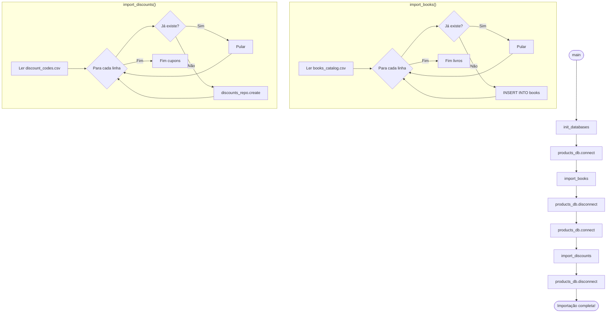
```mermaid
flowchart TD
    Start([main]) --> Init[init_databases]
    
    Init --> ConnectBooks[products_db.connect]
    ConnectBooks --> ImportBooks[import_books]
    
    subgraph ImportBooksFlow["import_books()"]
        ReadCSV[Ler books_catalog.csv]
        ReadCSV --> Loop1{Para cada linha}
        Loop1 --> Exists1{Já existe?}
        Exists1 -->|Sim| Skip1[Pular]
        Exists1 -->|Não| Insert1[INSERT INTO books]
        Skip1 --> Loop1
        Insert1 --> Loop1
        Loop1 -->|Fim| Done1[Fim livros]
    end
    
    ImportBooks --> DisconnectBooks[products_db.disconnect]
    DisconnectBooks --> ConnectDiscounts[products_db.connect]
    ConnectDiscounts --> ImportDiscounts[import_discounts]
    
    subgraph ImportDiscountsFlow["import_discounts()"]
        ReadCSV2[Ler discount_codes.csv]
        ReadCSV2 --> Loop2{Para cada linha}
        Loop2 --> Exists2{Já existe?}
        Exists2 -->|Sim| Skip2[Pular]
        Exists2 -->|Não| Insert2[discounts_repo.create]
        Skip2 --> Loop2
        Insert2 --> Loop2
        Loop2 -->|Fim| Done2[Fim cupons]
    end
    
    ImportDiscounts --> DisconnectDiscounts[products_db.disconnect]
    DisconnectDiscounts --> End([Importação completa!])
```

#### Execução

```bash
# Executar importação
python -m backend.src.db.import_books
```

---

## Instâncias Globais

O módulo exporta as seguintes instâncias globais:

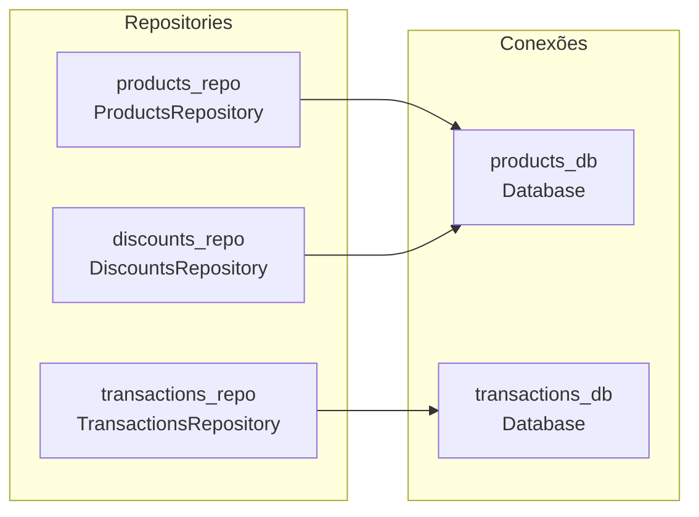
```mermaid
flowchart LR
    subgraph Databases["Conexões"]
        products_db["products_db<br/>Database"]
        transactions_db["transactions_db<br/>Database"]
    end
    
    subgraph Repositories["Repositories"]
        products_repo["products_repo<br/>ProductsRepository"]
        discounts_repo["discounts_repo<br/>DiscountsRepository"]
        transactions_repo["transactions_repo<br/>TransactionsRepository"]
    end
    
    products_repo --> products_db
    discounts_repo --> products_db
    transactions_repo --> transactions_db
```

### Uso nos Módulos

```python
from backend.src.db.products import products_repo
from backend.src.db.discounts import discounts_repo
from backend.src.db.transactions import transactions_repo

# Buscar livros
books = await products_repo.search("python")

# Validar cupom
is_valid, result = await discounts_repo.validate_and_calculate("PROMO10", 5000)

# Criar checkout
session = await transactions_repo.create_session(line_items, buyer)
```

---

## Formato de Valores Monetários

Todos os valores monetários são armazenados em **centavos** (inteiros):

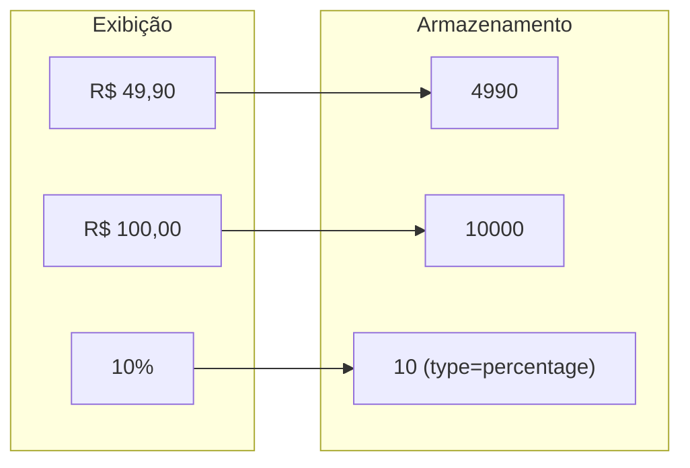
```mermaid
flowchart LR
    subgraph Display["Exibição"]
        D1["R$ 49,90"]
        D2["R$ 100,00"]
        D3["10%"]
    end
    
    subgraph Storage["Armazenamento"]
        S1["4990"]
        S2["10000"]
        S3["10 (type=percentage)"]
    end
    
    D1 --> S1
    D2 --> S2
    D3 --> S3
```

---

## Índices do Banco

### products.db

| Tabela | Índice | Coluna | Propósito |
|--------|--------|--------|-----------|
| books | idx_books_category | category | Filtro por categoria |
| books | idx_books_author | author | Busca por autor |

### transactions.db

| Tabela | Índice | Coluna | Propósito |
|--------|--------|--------|-----------|
| buyers | idx_buyers_email | email | Busca por email |
| line_items | idx_line_items_session | session_id | Itens por sessão |

---

## Dependências

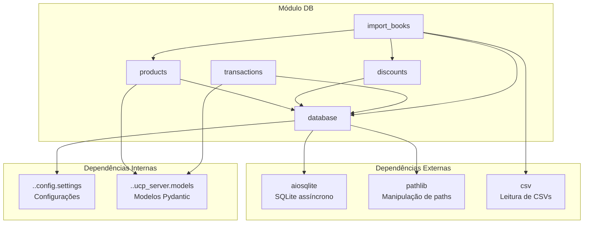
```mermaid
flowchart TB
    subgraph External["Dependências Externas"]
        aiosqlite["aiosqlite<br/>SQLite assíncrono"]
        pathlib["pathlib<br/>Manipulação de paths"]
        csv["csv<br/>Leitura de CSVs"]
    end
    
    subgraph Internal["Dependências Internas"]
        config["..config.settings<br/>Configurações"]
        models["..ucp_server.models<br/>Modelos Pydantic"]
    end
    
    subgraph DB["Módulo DB"]
        database
        products
        discounts
        transactions
        import_books
    end
    
    database --> aiosqlite
    database --> pathlib
    database --> config
    
    products --> database
    products --> models
    
    discounts --> database
    
    transactions --> database
    transactions --> models
    
    import_books --> database
    import_books --> products
    import_books --> discounts
    import_books --> csv
```

---

## Configurações

As paths dos bancos de dados são definidas em `config.py`:

```python
class Settings:
    products_db_path: str = "backend/data/products.db"
    transactions_db_path: str = "backend/data/transactions.db"
```

---

## Tratamento de Erros

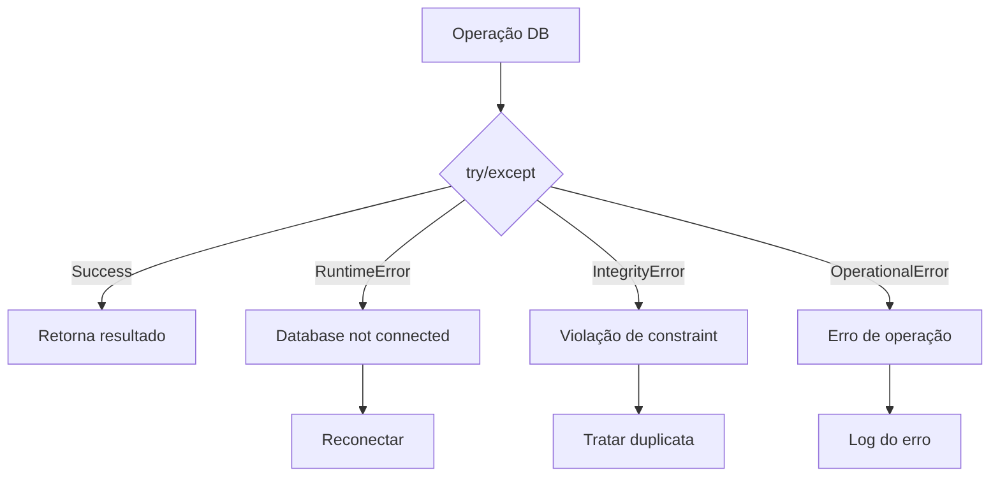
```mermaid
flowchart TD
    Operation[Operação DB] --> TryCatch{try/except}
    
    TryCatch -->|Success| Return[Retorna resultado]
    TryCatch -->|RuntimeError| NotConnected["Database not connected"]
    TryCatch -->|IntegrityError| Duplicate["Violação de constraint"]
    TryCatch -->|OperationalError| DBError["Erro de operação"]
    
    NotConnected --> Reconnect[Reconectar]
    Duplicate --> Handle[Tratar duplicata]
    DBError --> Log[Log do erro]
```

---

## Boas Práticas

1. **Sempre usar instâncias globais** - Não criar novas instâncias de repositories
2. **Valores em centavos** - Nunca usar float para valores monetários
3. **UUIDs para IDs** - Formato `prefix_hexstring` (ex: `book_a1b2c3d4`)
4. **Verificar conexão** - Usar context managers ou garantir connect/disconnect
5. **Transações** - O `execute()` já faz commit automático
