# Módulo MCP - Model Context Protocol

Este módulo implementa o servidor **MCP (Model Context Protocol)** da Livraria Virtual UCP. O MCP permite que agentes de IA interajam com o catálogo da livraria de forma estruturada, com suporte a **progressive disclosure** para revelar ferramentas gradualmente.

## Visão Geral

O módulo MCP fornece:
- **Servidor MCP** - Expõe ferramentas para agentes de IA
- **HTTP Server** - API REST alternativa ao SSE/stdio
- **Tool Registry** - Registro centralizado de ferramentas
- **Progressive Disclosure** - Revelação gradual de ferramentas
- **7 Ferramentas** - Busca, catálogo, carrinho e recomendações

---

## Arquitetura do Módulo

```
backend/src/mcp/
├── __init__.py              # Exports públicos
├── server.py                # Servidor MCP principal
├── http_server.py           # API HTTP para MCP
├── registry.py              # Registry de ferramentas
├── progressive_disclosure.py # Controle de disclosure
├── mcp.md                   # Esta documentação
└── tools/                   # Ferramentas MCP
    ├── search.py
    ├── catalog.py
    ├── cart.py
    ├── recommendations.py
    └── tools.md             # → Documentação detalhada
```

### Diagrama de Arquitetura

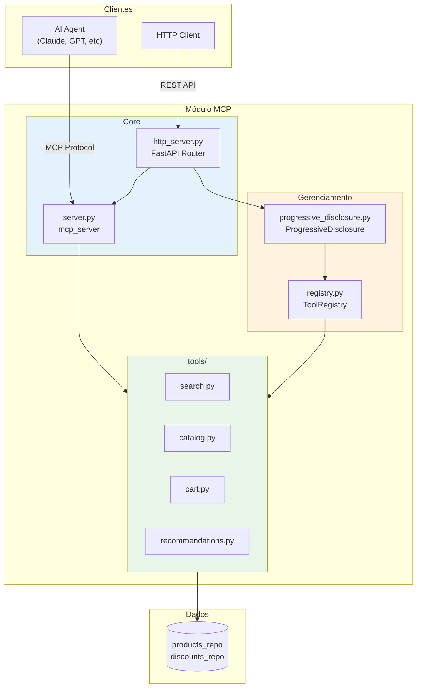

---

## Componentes Principais

### 1. MCP Server (`server.py`)

Servidor MCP principal usando a biblioteca `mcp`.

#### Diagrama do Server

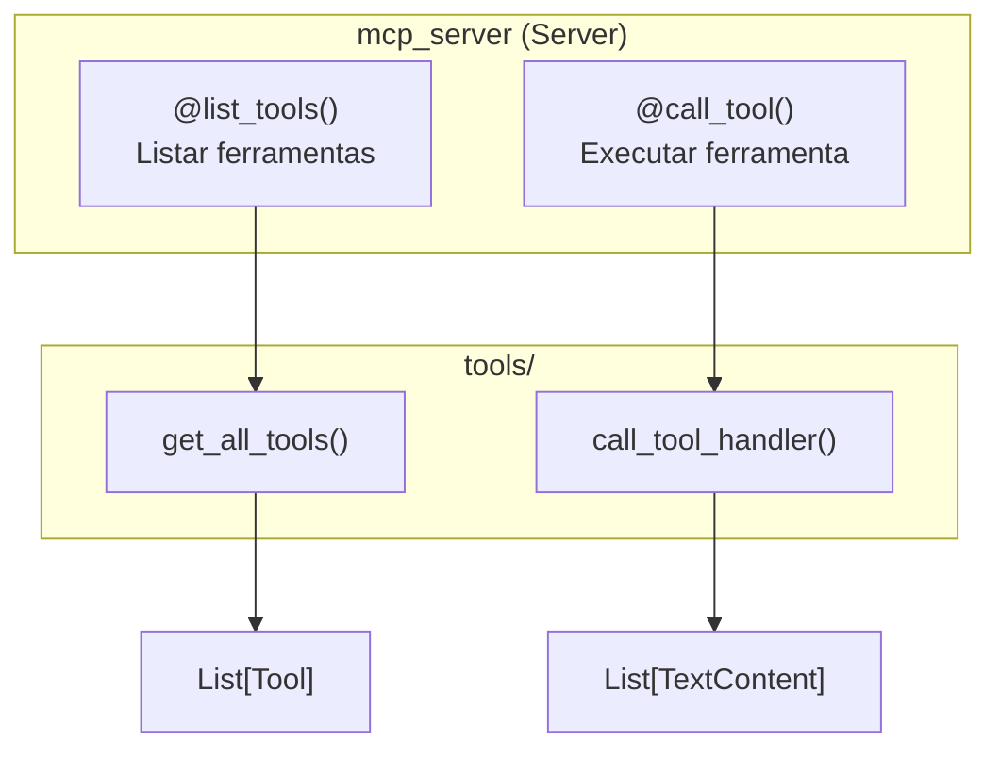

#### Handlers Registrados

| Handler | Decorator | Descrição |
|---------|-----------|-----------|
| `list_tools` | `@mcp_server.list_tools()` | Lista todas as ferramentas disponíveis |
| `call_tool` | `@mcp_server.call_tool()` | Executa uma ferramenta pelo nome |

#### Código Principal

```python
# Criar instância do servidor MCP
mcp_server = Server("livraria-mcp")

@mcp_server.list_tools()
async def list_tools() -> List[Tool]:
    """Retorna todas as ferramentas MCP."""
    return get_all_tools()

@mcp_server.call_tool()
async def call_tool(name: str, arguments: Dict[str, Any]) -> List[TextContent]:
    """Executa uma ferramenta e retorna resultado como JSON."""
    result = await call_tool_handler(name, arguments)
    return [TextContent(type="text", text=json.dumps(result))]
```

---

### 2. HTTP Server (`http_server.py`)

API REST que expõe as funcionalidades MCP via HTTP.

#### Diagrama de Rotas

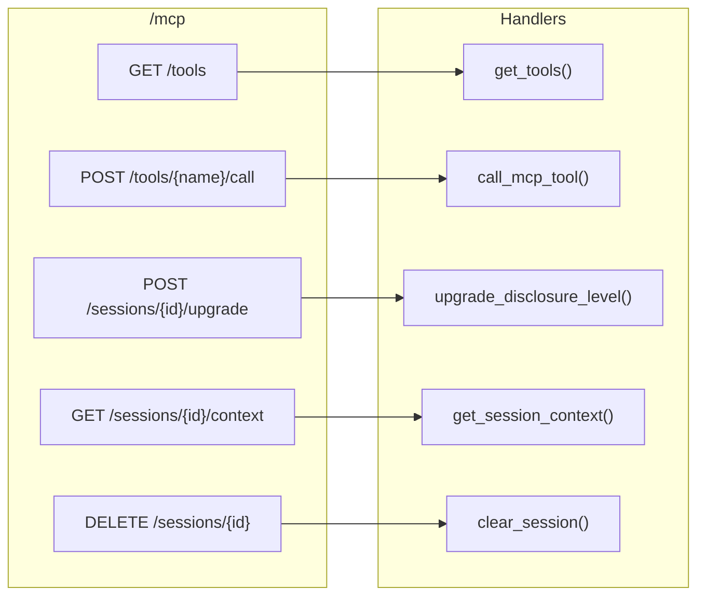

#### Endpoints

| Método | Endpoint | Descrição |
|--------|----------|-----------|
| GET | `/mcp/tools` | Lista ferramentas (com progressive disclosure opcional) |
| POST | `/mcp/tools/{tool_name}/call` | Executa uma ferramenta |
| POST | `/mcp/sessions/{session_id}/upgrade` | Faz upgrade do nível de disclosure |
| GET | `/mcp/sessions/{session_id}/context` | Obtém contexto de disclosure |
| DELETE | `/mcp/sessions/{session_id}` | Limpa sessão |

#### Fluxo com Progressive Disclosure

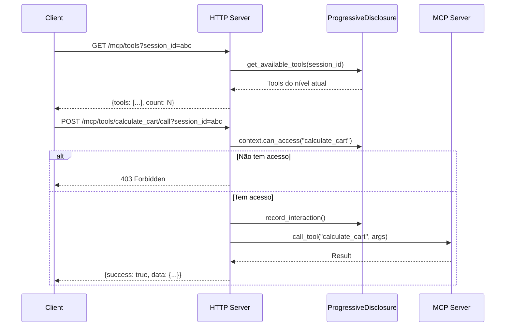

---

### 3. Tool Registry (`registry.py`)

Registro centralizado para gerenciamento de ferramentas.

#### Diagrama de Classes

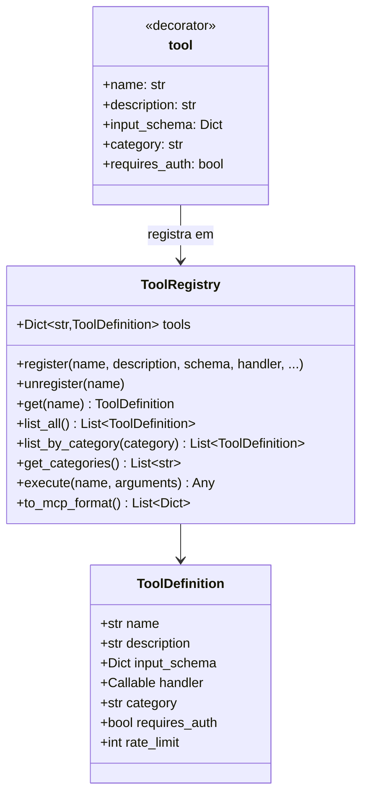

#### Uso do Decorator

```python
from backend.src.mcp import tool

@tool(
    name="my_tool",
    description="Descrição da ferramenta",
    input_schema={"type": "object", "properties": {...}},
    category="custom"
)
async def my_tool(args: Dict[str, Any]) -> Dict[str, Any]:
    return {"result": "..."}
```

#### Métodos do Registry

| Método | Descrição |
|--------|-----------|
| `register(...)` | Registra uma nova ferramenta |
| `unregister(name)` | Remove uma ferramenta |
| `get(name)` | Obtém definição de uma ferramenta |
| `list_all()` | Lista todas as ferramentas |
| `list_by_category(cat)` | Lista ferramentas de uma categoria |
| `get_categories()` | Lista categorias disponíveis |
| `execute(name, args)` | Executa uma ferramenta |
| `to_mcp_format()` | Converte para formato MCP |

---

### 4. Progressive Disclosure (`progressive_disclosure.py`)

Implementa a revelação gradual de ferramentas conforme o contexto do usuário.

#### Diagrama de Níveis

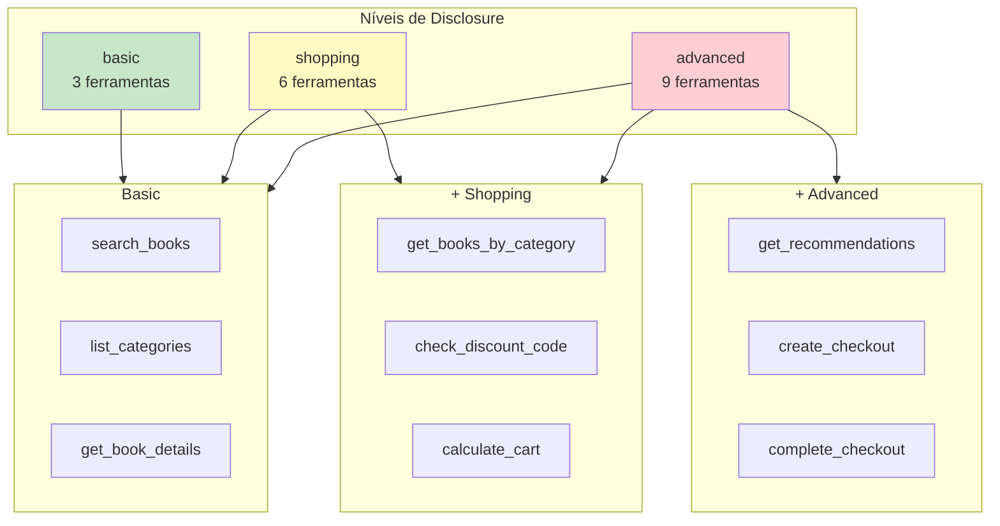

#### Diagrama de Classes

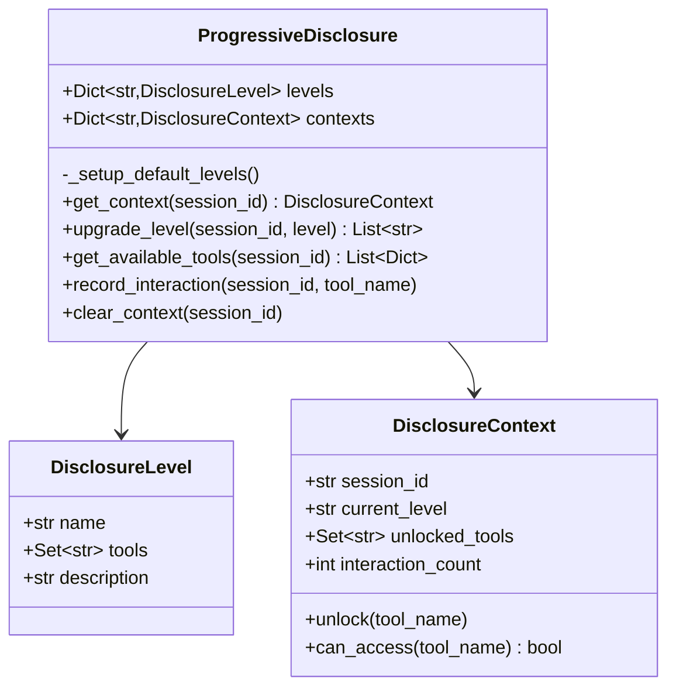

#### Fluxo de Auto-Upgrade

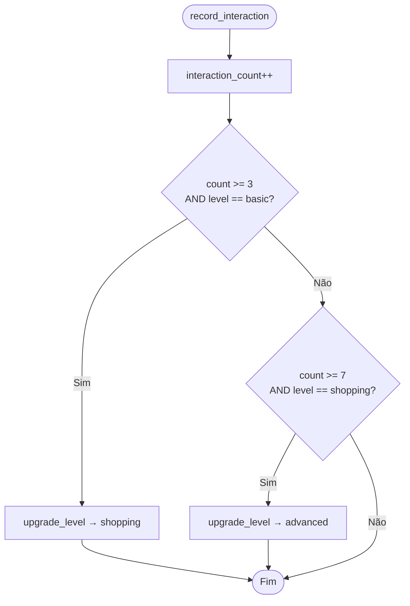

#### Níveis Configurados

| Nível | Ferramentas | Descrição |
|-------|-------------|-----------|
| `basic` | search_books, list_categories, get_book_details | Ferramentas básicas de navegação |
| `shopping` | + get_books_by_category, check_discount_code, calculate_cart | Ferramentas de compra |
| `advanced` | + get_recommendations, create_checkout, complete_checkout | Ferramentas completas |

---

## Submódulo Tools

O submódulo `tools/` contém as implementações das 7 ferramentas MCP.

📄 **Documentação completa:** [`tools/tools.md`](tools/tools.md)

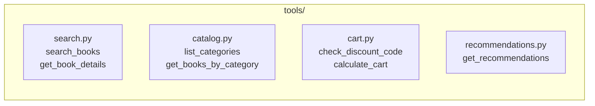

| Arquivo | Ferramentas |
|---------|-------------|
| `search.py` | `search_books`, `get_book_details` |
| `catalog.py` | `list_categories`, `get_books_by_category` |
| `cart.py` | `check_discount_code`, `calculate_cart` |
| `recommendations.py` | `get_recommendations` |

---

## Exports do Módulo

```python
from backend.src.mcp import (
    # Servidor MCP
    mcp_server,
    
    # Registry
    ToolRegistry,
    ToolDefinition,
    get_tool_registry,
    tool,  # decorator
    
    # Progressive Disclosure
    ProgressiveDisclosure,
    DisclosureContext,
    DisclosureLevel,
    get_progressive_disclosure,
)
```

---

## Fluxos de Uso

### Fluxo MCP Padrão (Stdio/SSE)

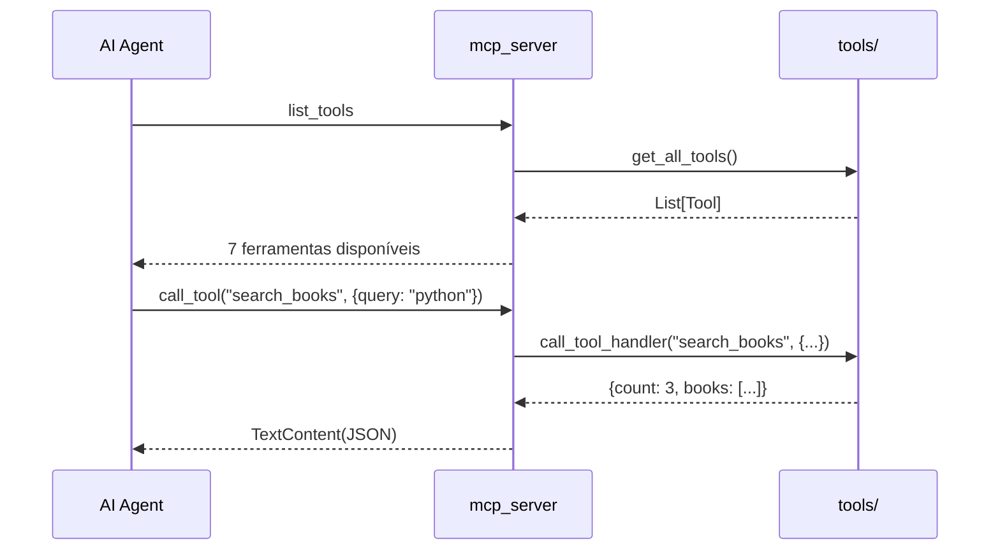

### Fluxo HTTP com Progressive Disclosure

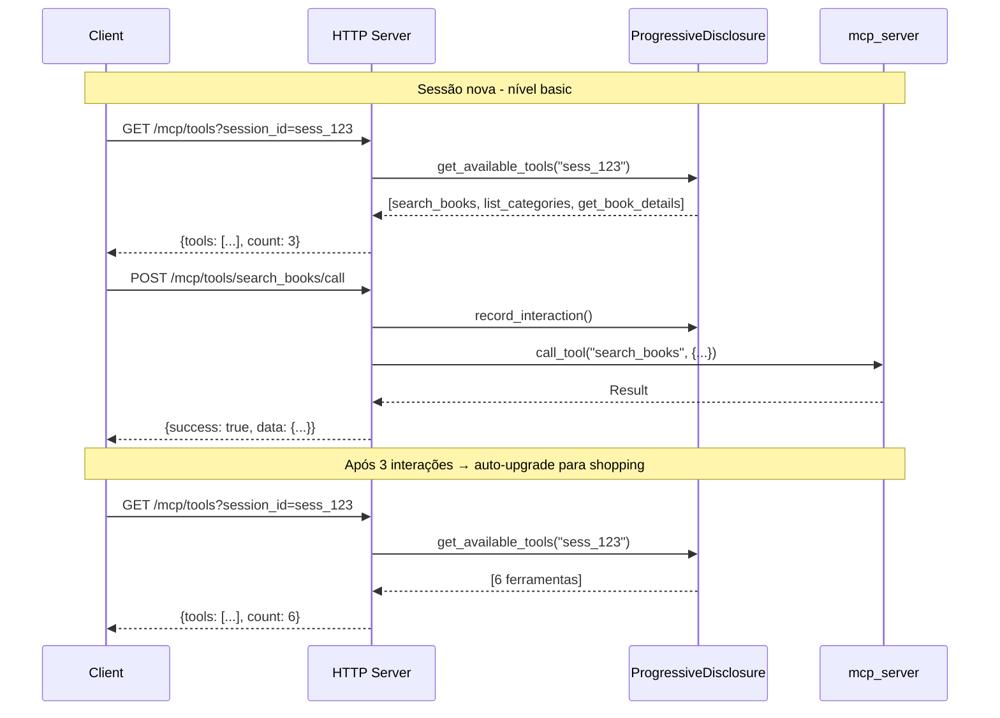

### Fluxo de Upgrade Manual

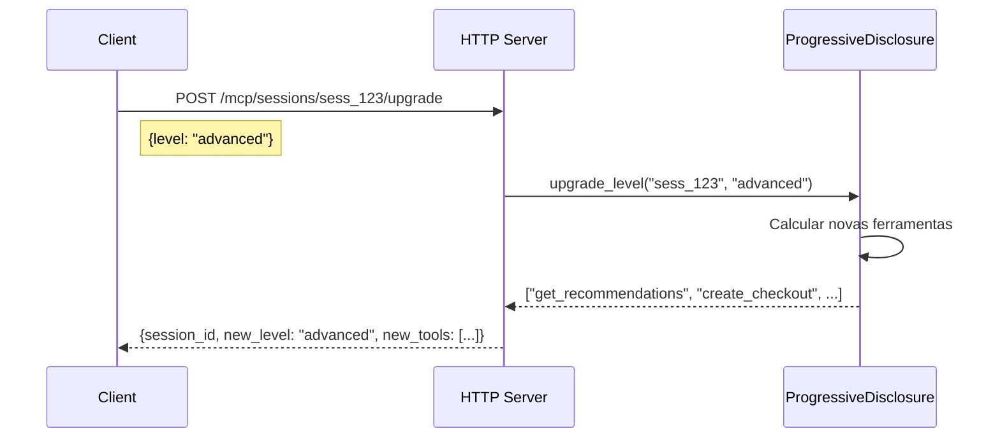

---

## Integração com UCP Server

O módulo MCP é integrado ao UCP Server via FastAPI router.

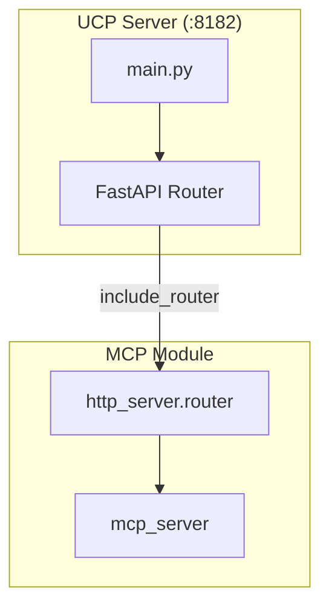

### Montagem no UCP Server

```python
from fastapi import FastAPI
from backend.src.mcp.http_server import router as mcp_router

app = FastAPI()
app.include_router(mcp_router)  # Monta em /mcp
```

---

## Instâncias Globais

O módulo exporta três instâncias globais:

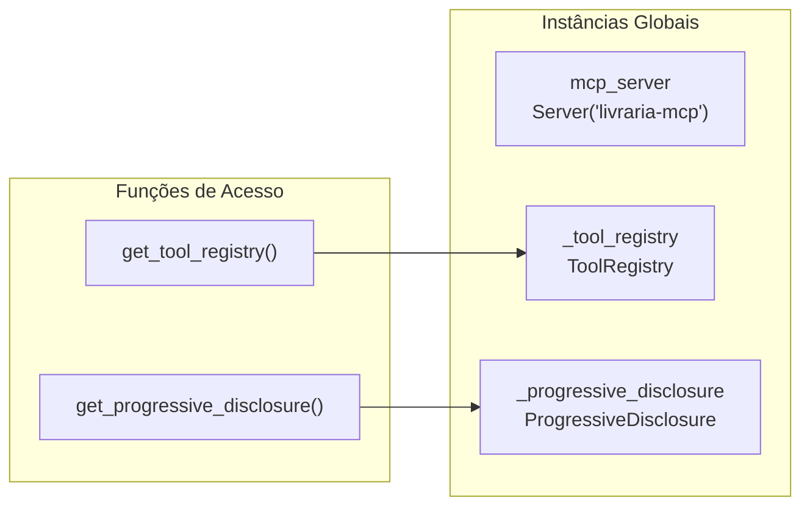

---

## Dependências

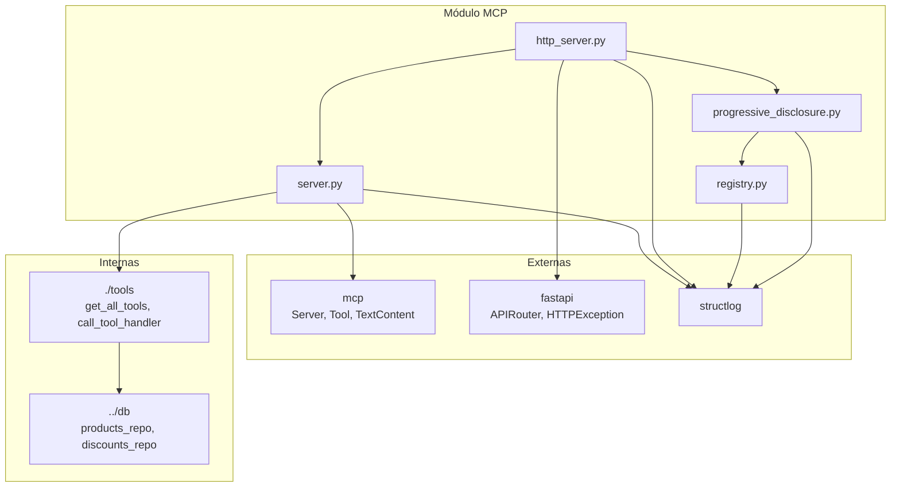

---

## Referências

- **Ferramentas MCP:** [`tools/tools.md`](tools/tools.md)
- **MCP Protocol Spec:** https://modelcontextprotocol.io/
- **Database Layer:** [`../db/db.md`](../db/db.md)
