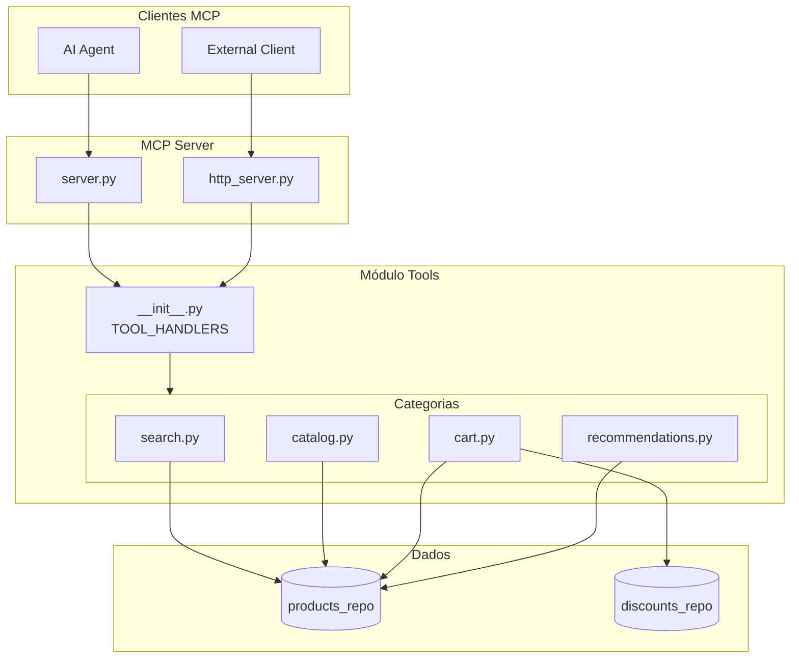
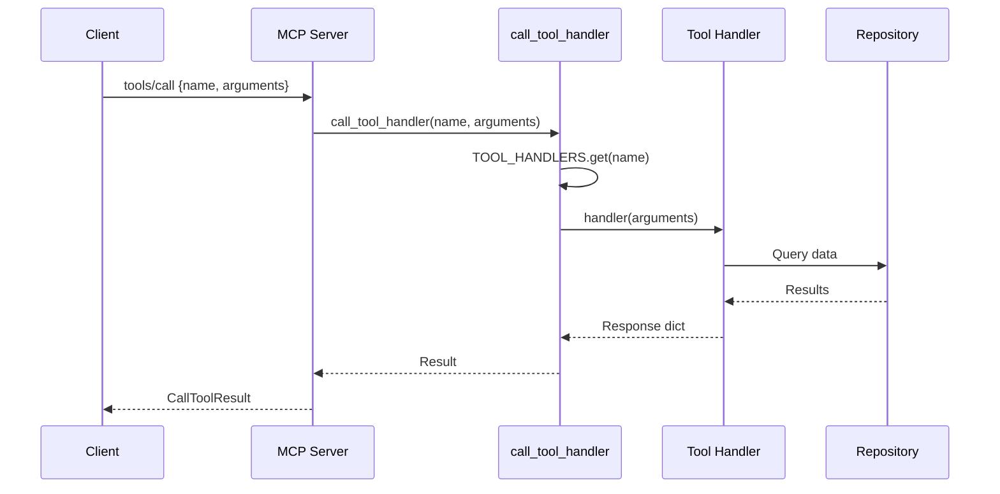
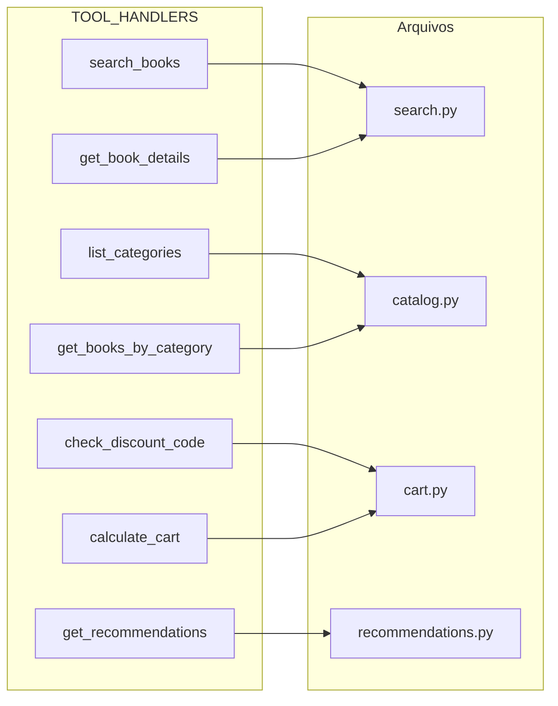
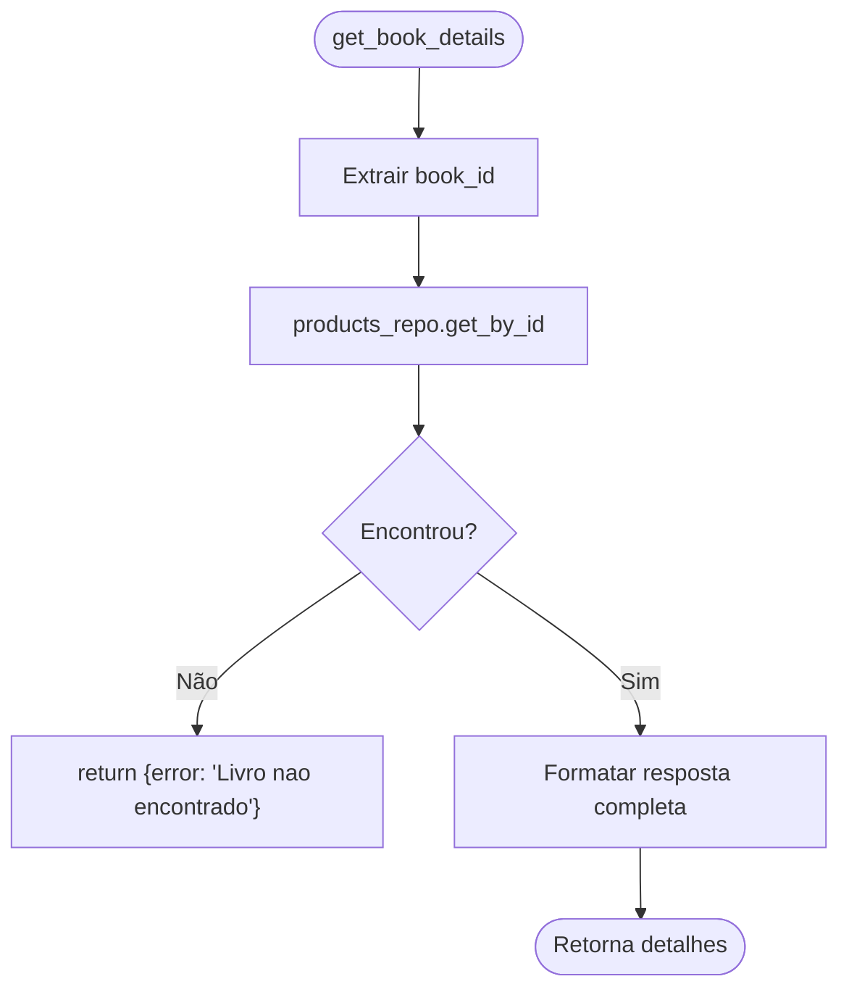
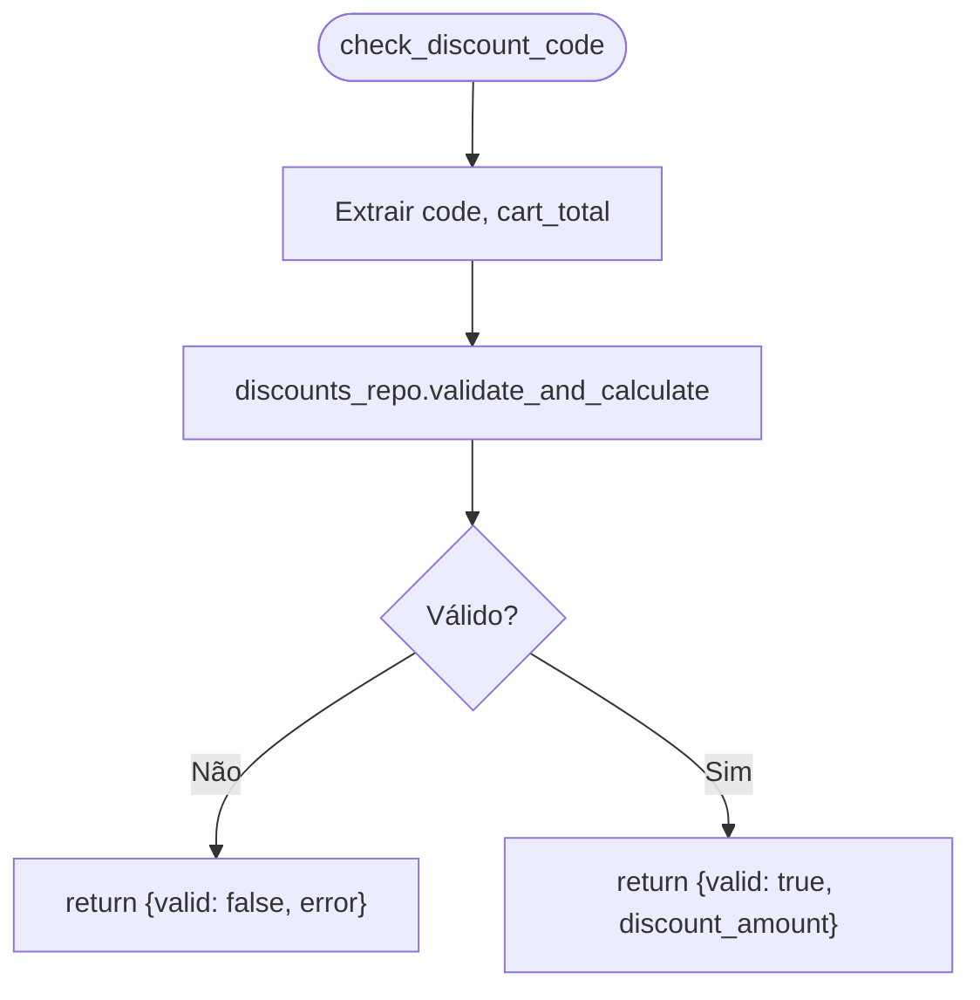
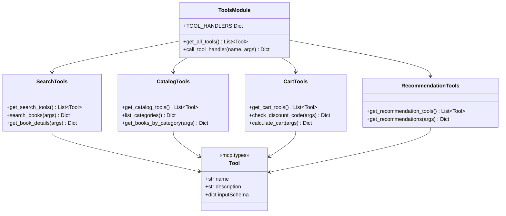
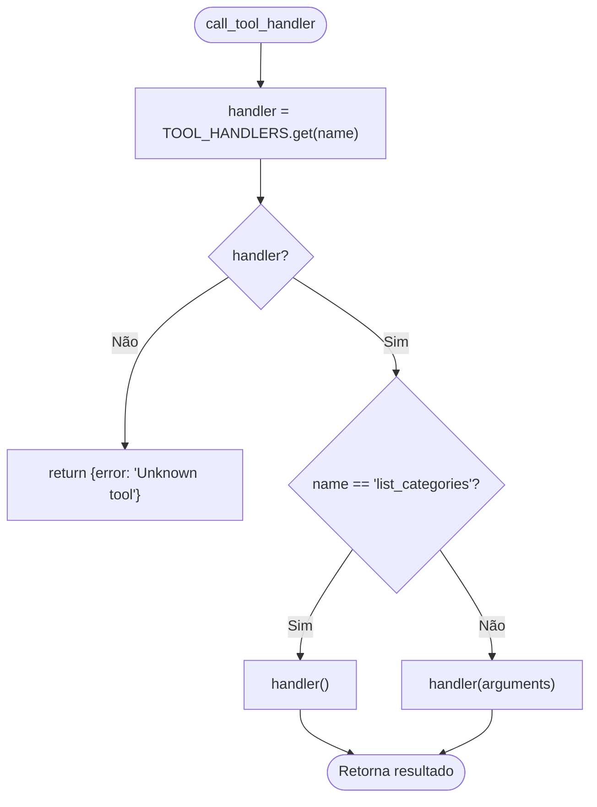
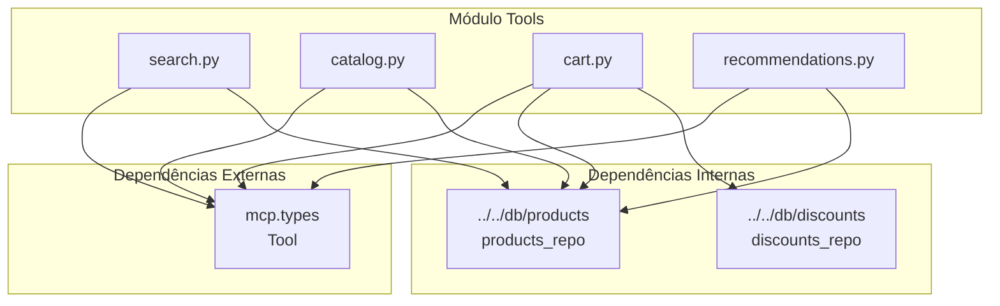
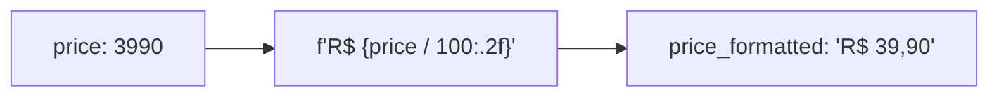

# Módulo MCP Tools - Ferramentas do Model Context Protocol

Este módulo implementa as **ferramentas MCP** (Model Context Protocol) da Livraria Virtual UCP. As ferramentas permitem que agentes de IA interajam com o catálogo, carrinho e sistema de recomendações de forma estruturada.

## Visão Geral

O módulo tools fornece **7 ferramentas** organizadas em 4 categorias:

| Categoria | Ferramentas | Descrição |
|-----------|-------------|-----------|
| **Search** | `search_books`, `get_book_details` | Busca de livros |
| **Catalog** | `list_categories`, `get_books_by_category` | Catálogo e categorias |
| **Cart** | `check_discount_code`, `calculate_cart` | Carrinho e descontos |
| **Recommendations** | `get_recommendations` | Recomendações personalizadas |

---

## Arquitetura do Módulo

```
backend/src/mcp/tools/
├── __init__.py          # Exports e TOOL_HANDLERS
├── search.py            # Ferramentas de busca
├── catalog.py           # Ferramentas de catálogo
├── cart.py              # Ferramentas de carrinho
├── recommendations.py   # Ferramentas de recomendação
└── tools.md             # Esta documentação
```

### Diagrama de Arquitetura



### Fluxo de Chamada



---

## Mapeamento de Ferramentas



---

## Ferramentas Detalhadas

### 1. Search Tools (`search.py`)

Ferramentas para busca e consulta de livros.

#### `search_books`

Busca livros no catálogo por termo.

```mermaid
flowchart TD
    Start([search_books]) --> GetArgs[Extrair query, category, max_results]
    GetArgs --> Search[products_repo.search]
    Search --> HasCategory{category?}
    HasCategory -->|Sim| Filter[Filtrar por categoria]
    HasCategory -->|Não| Limit[Limitar resultados]
    Filter --> Limit
    Limit --> Format[Formatar resposta]
    Format --> Return([Retorna {count, books}])
```

**Input Schema:**

```json
{
    "type": "object",
    "properties": {
        "query": {
            "type": "string",
            "description": "Termo de busca (titulo, autor ou descricao)"
        },
        "category": {
            "type": "string",
            "description": "Filtrar por categoria (opcional)"
        },
        "max_results": {
            "type": "integer",
            "description": "Numero maximo de resultados (default: 10)",
            "default": 10
        }
    },
    "required": ["query"]
}
```

**Output:**

```json
{
    "count": 3,
    "books": [
        {
            "id": "book_003",
            "title": "Python para Todos",
            "author": "Maria Santos",
            "price": 3990,
            "price_formatted": "R$ 39,90",
            "category": "Programacao",
            "in_stock": true
        }
    ]
}
```

---

#### `get_book_details`

Obtém detalhes completos de um livro.



**Input Schema:**

```json
{
    "type": "object",
    "properties": {
        "book_id": {
            "type": "string",
            "description": "ID do livro"
        }
    },
    "required": ["book_id"]
}
```

**Output:**

```json
{
    "id": "book_003",
    "title": "Python para Todos",
    "author": "Maria Santos",
    "description": "Guia completo de Python para iniciantes...",
    "price": 3990,
    "price_formatted": "R$ 39,90",
    "category": "Programacao",
    "isbn": "978-85-0001-003-4",
    "stock": 100,
    "in_stock": true
}
```

---

### 2. Catalog Tools (`catalog.py`)

Ferramentas para navegação no catálogo.

#### `list_categories`

Lista todas as categorias disponíveis.

```mermaid
flowchart TD
    Start([list_categories]) --> GetAll[products_repo.get_all]
    GetAll --> Extract["Extrair categorias únicas"]
    Extract --> Sort[Ordenar alfabeticamente]
    Sort --> Return([Retorna {count, categories}])
```

**Input Schema:**

```json
{
    "type": "object",
    "properties": {}
}
```

**Output:**

```json
{
    "count": 13,
    "categories": [
        "Arquitetura",
        "Data Science",
        "DevOps",
        "Frontend",
        "Inteligencia Artificial",
        "Programacao",
        "Tecnologia"
    ]
}
```

---

#### `get_books_by_category`

Lista livros de uma categoria específica.

```mermaid
flowchart TD
    Start([get_books_by_category]) --> GetCat[Extrair category]
    GetCat --> Fetch[products_repo.get_by_category]
    Fetch --> Format[Formatar lista de livros]
    Format --> Return([Retorna {category, count, books}])
```

**Input Schema:**

```json
{
    "type": "object",
    "properties": {
        "category": {
            "type": "string",
            "description": "Nome da categoria"
        }
    },
    "required": ["category"]
}
```

**Output:**

```json
{
    "category": "Programacao",
    "count": 4,
    "books": [
        {
            "id": "book_003",
            "title": "Python para Todos",
            "author": "Maria Santos",
            "price_formatted": "R$ 39,90"
        }
    ]
}
```

---

### 3. Cart Tools (`cart.py`)

Ferramentas para operações de carrinho e descontos.

#### `check_discount_code`

Verifica se um código de desconto é válido.



**Input Schema:**

```json
{
    "type": "object",
    "properties": {
        "code": {
            "type": "string",
            "description": "Codigo do cupom de desconto"
        },
        "cart_total": {
            "type": "integer",
            "description": "Valor total do carrinho em centavos"
        }
    },
    "required": ["code"]
}
```

**Output (válido):**

```json
{
    "valid": true,
    "discount_amount": 500,
    "discount_formatted": "R$ 5,00"
}
```

**Output (inválido):**

```json
{
    "valid": false,
    "error": "Cupom não encontrado"
}
```

---

#### `calculate_cart`

Calcula o total do carrinho com desconto.

```mermaid
flowchart TD
    Start([calculate_cart]) --> GetArgs[Extrair items, discount_code]
    GetArgs --> Loop{Para cada item}
    
    Loop --> GetBook[products_repo.get_by_id]
    GetBook --> Found{Encontrou?}
    Found -->|Sim| AddItem[Adicionar ao subtotal]
    Found -->|Não| Skip[Pular item]
    AddItem --> Loop
    Skip --> Loop
    
    Loop -->|Fim| HasDiscount{Tem cupom?}
    HasDiscount -->|Sim| ValidateDiscount[Validar e calcular desconto]
    HasDiscount -->|Não| CalcTotal[total = subtotal]
    ValidateDiscount --> CalcTotal
    
    CalcTotal --> Format[Formatar resposta]
    Format --> Return([Retorna {items, subtotal, discount, total}])
```

**Input Schema:**

```json
{
    "type": "object",
    "properties": {
        "items": {
            "type": "array",
            "items": {
                "type": "object",
                "properties": {
                    "book_id": {"type": "string"},
                    "quantity": {"type": "integer"}
                }
            },
            "description": "Lista de itens no carrinho"
        },
        "discount_code": {
            "type": "string",
            "description": "Codigo de desconto (opcional)"
        }
    },
    "required": ["items"]
}
```

**Output:**

```json
{
    "items": [
        {
            "book_id": "book_003",
            "title": "Python para Todos",
            "quantity": 2,
            "unit_price": 3990,
            "total": 7980
        }
    ],
    "subtotal": 7980,
    "subtotal_formatted": "R$ 79,80",
    "discount": 798,
    "discount_formatted": "R$ 7,98",
    "total": 7182,
    "total_formatted": "R$ 71,82"
}
```

---

### 4. Recommendation Tools (`recommendations.py`)

Ferramentas para recomendações personalizadas.

#### `get_recommendations`

Obtém recomendações baseadas em livro ou categoria.

```mermaid
flowchart TD
    Start([get_recommendations]) --> GetArgs[Extrair book_id, category, max_results]
    
    GetArgs --> HasBook{book_id?}
    HasBook -->|Sim| GetBook[products_repo.get_by_id]
    GetBook --> GetCategory[category = book.category]
    HasBook -->|Não| CheckCategory{category?}
    
    GetCategory --> FetchByCategory
    CheckCategory -->|Sim| FetchByCategory[products_repo.get_by_category]
    CheckCategory -->|Não| FetchAll[products_repo.get_all]
    
    FetchByCategory --> RemoveBase[Remover livro base]
    FetchAll --> Limit[Limitar resultados]
    RemoveBase --> Limit
    
    Limit --> Format[Formatar recomendações]
    Format --> Return([Retorna {based_on, recommendations}])
```

**Input Schema:**

```json
{
    "type": "object",
    "properties": {
        "based_on_book_id": {
            "type": "string",
            "description": "ID do livro base para recomendacoes"
        },
        "category": {
            "type": "string",
            "description": "Categoria para buscar recomendacoes"
        },
        "max_results": {
            "type": "integer",
            "description": "Numero maximo de recomendacoes",
            "default": 5
        }
    }
}
```

**Output:**

```json
{
    "based_on": "book_003",
    "recommendations": [
        {
            "id": "book_008",
            "title": "Clean Code em Python",
            "author": "Fernando Reis",
            "price_formatted": "R$ 42,90",
            "category": "Programacao"
        }
    ]
}
```

---

## Diagrama de Classes



---

## Tabela Resumo de Ferramentas

| Ferramenta | Arquivo | Parâmetros | Retorno |
|------------|---------|------------|---------|
| `search_books` | search.py | query*, category?, max_results? | {count, books[]} |
| `get_book_details` | search.py | book_id* | {id, title, author, ...} |
| `list_categories` | catalog.py | - | {count, categories[]} |
| `get_books_by_category` | catalog.py | category* | {category, count, books[]} |
| `check_discount_code` | cart.py | code*, cart_total? | {valid, discount_amount/error} |
| `calculate_cart` | cart.py | items*, discount_code? | {items, subtotal, discount, total} |
| `get_recommendations` | recommendations.py | book_id?, category?, max_results? | {based_on, recommendations[]} |

*\* = obrigatório*

---

## Exports do Módulo

```python
from backend.src.mcp.tools import (
    # Função principal
    get_all_tools,
    call_tool_handler,
    TOOL_HANDLERS,
    
    # Search
    get_search_tools,
    search_books,
    get_book_details,
    
    # Catalog
    get_catalog_tools,
    list_categories,
    get_books_by_category,
    
    # Cart
    get_cart_tools,
    check_discount_code,
    calculate_cart,
    
    # Recommendations
    get_recommendation_tools,
    get_recommendations,
)
```

---

## Função `call_tool_handler`

Dispatcher central para chamada de ferramentas.



---

## Dependências



---

## Exemplos de Uso

### Via MCP Server

```python
# Chamada via server MCP
result = await server.call_tool("search_books", {
    "query": "python",
    "max_results": 5
})
```

### Diretamente

```python
from backend.src.mcp.tools import call_tool_handler

# Buscar livros
result = await call_tool_handler("search_books", {
    "query": "machine learning"
})

# Listar categorias
categories = await call_tool_handler("list_categories", {})

# Calcular carrinho
cart = await call_tool_handler("calculate_cart", {
    "items": [
        {"book_id": "book_003", "quantity": 2}
    ],
    "discount_code": "PROMO10"
})
```

---

## Formato de Preços

Todas as ferramentas seguem o padrão:
- **Valores internos:** Centavos (integer)
- **Valores formatados:** String com "R$ X,XX"


