# Módulo Security - Segurança AP2 e Criptografia

Este módulo implementa a camada de segurança da Livraria Virtual UCP, fornecendo:
- **AP2 Security** - Mandatos JWT para pagamentos autônomos (SDK Oficial Google)
- **Key Manager** - Gerenciamento de chaves Ed25519
- **Request Signatures** - Assinaturas de requisições UCP

## Visão Geral

O módulo security fornece:
- **Mandatos AP2 Oficiais** - IntentMandate, CartMandate, PaymentMandate
- **Chaves Ed25519** - Par de chaves pública/privada para assinaturas
- **Assinaturas de Requisições** - Headers de conformidade UCP com assinaturas criptográficas

---

## Arquitetura do Módulo

```
backend/src/security/
├── __init__.py          # Exports públicos
├── key_manager.py       # Gerenciador de chaves Ed25519
├── ap2_security.py      # Mandatos JWT AP2 (orquestração)
├── ap2_types.py         # Tipos oficiais AP2 (re-exportados do SDK)
├── ap2_adapters.py      # Adaptadores e funções de conversão
├── signatures.py        # Assinaturas de requisições
└── security.md          # Esta documentação
```

### Diagrama de Arquitetura

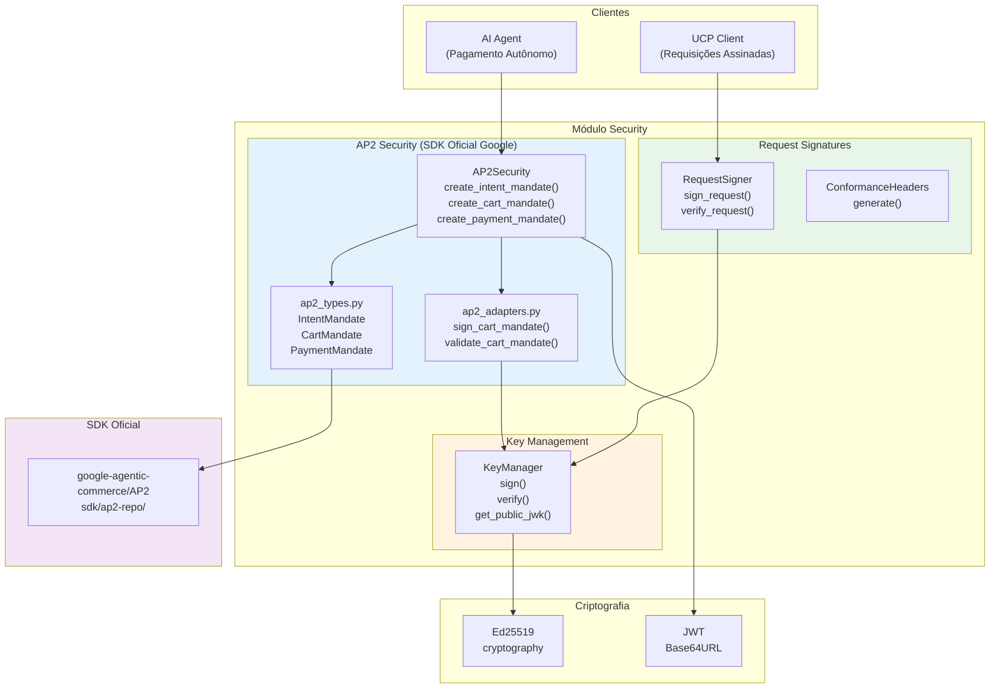

---

## Componentes Detalhados

### 1. Key Manager (`key_manager.py`)

Gerenciador de chaves Ed25519 para assinaturas criptográficas.

#### Diagrama de Classes

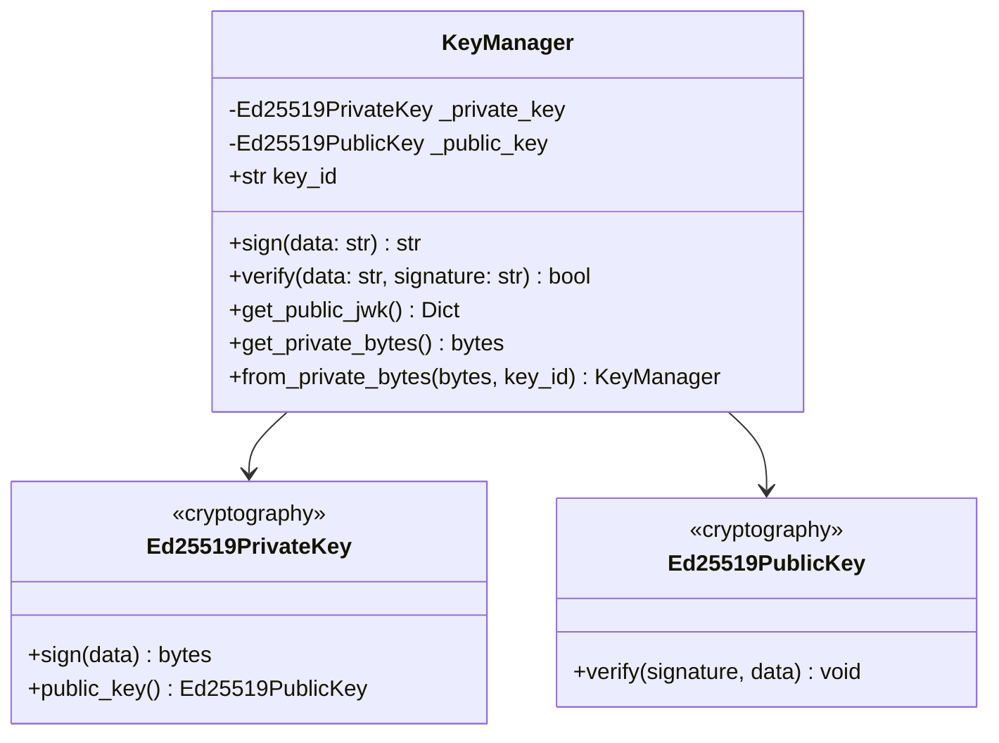

#### Fluxo de Geração de Chaves

```mermaid
flowchart TD
    Start([KeyManager.__init__]) --> Generate[Ed25519PrivateKey.generate]
    Generate --> GetPublic[private_key.public_key]
    GetPublic --> GetBytes[public_key.public_bytes]
    GetBytes --> Encode[base64url_encode(primeiros 8 bytes)]
    Encode --> CreateID["key_id = 'key-' + hash"]
    CreateID --> End([Chave pronta])
```

#### Métodos Principais

| Método | Descrição | Retorno |
|--------|-----------|---------|
| `sign(data)` | Assina dados com chave privada | Assinatura base64url |
| `verify(data, signature)` | Verifica assinatura | bool |
| `get_public_jwk()` | Exporta chave pública em formato JWK | Dict JWK |
| `get_private_bytes()` | Obtém bytes da chave privada (backup) | bytes |
| `from_private_bytes(bytes, key_id)` | Restaura KeyManager de backup | KeyManager |

#### Formato JWK

```json
{
    "kty": "OKP",
    "crv": "Ed25519",
    "x": "base64url_encoded_public_key",
    "kid": "key-abc123",
    "use": "sig",
    "alg": "EdDSA"
}
```

---

### 2. AP2 Types (`ap2_types.py`)

Re-exporta os tipos oficiais do SDK Google AP2.

#### Tipos Principais

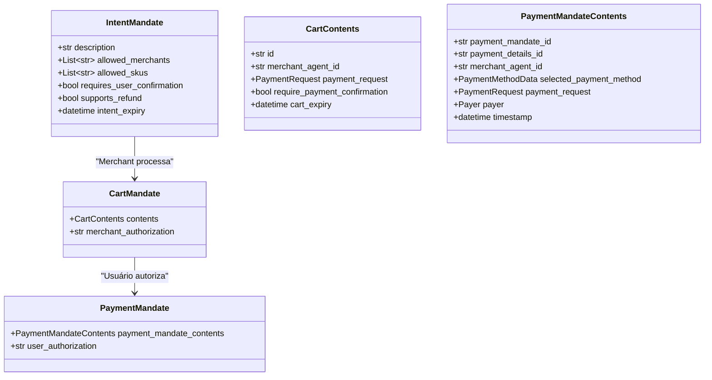

#### Tipos de Pagamento (W3C)

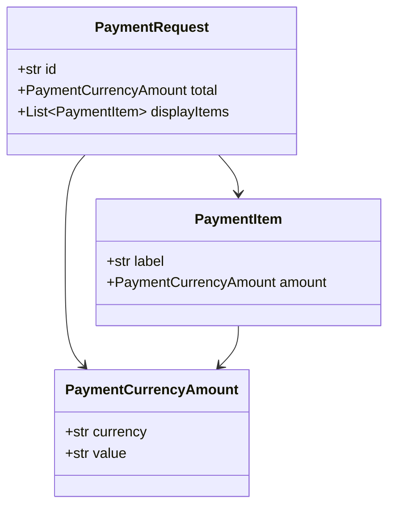

---

### 3. AP2 Adapters (`ap2_adapters.py`)

Funções de conversão e helpers para trabalhar com os tipos AP2.

#### Funções Principais

| Função | Descrição | Retorno |
|--------|-----------|---------|
| `create_intent_mandate(description, merchants, ...)` | Cria IntentMandate | IntentMandate |
| `create_cart_contents(cart_id, items, merchant, ...)` | Cria conteúdo do carrinho | CartContents |
| `sign_cart_mandate(cart_contents, key_manager)` | Assina carrinho com JWT | CartMandate |
| `create_payment_mandate(cart_mandate, payer, ...)` | Cria autorização de pagamento | PaymentMandate |
| `validate_cart_mandate(cart_mandate, public_key)` | Valida assinatura do carrinho | bool |
| `cart_items_to_cart_mandate(items, cart_id, ...)` | Converte itens para mandato | CartMandate |

#### Fluxo de Assinatura do Carrinho

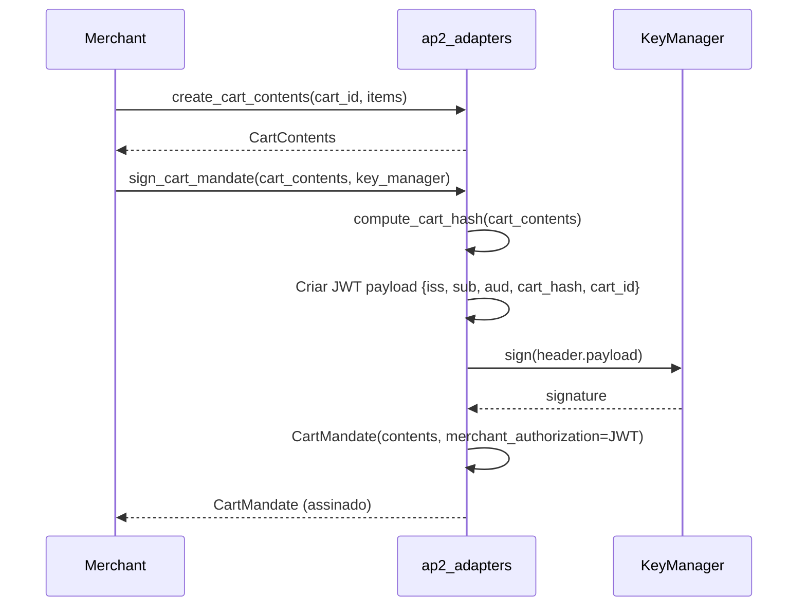

---

### 4. AP2 Security (`ap2_security.py`)

Orquestrador de mandatos AP2 - coordena a criação e validação dos 3 tipos de mandatos.

#### Diagrama de Classes

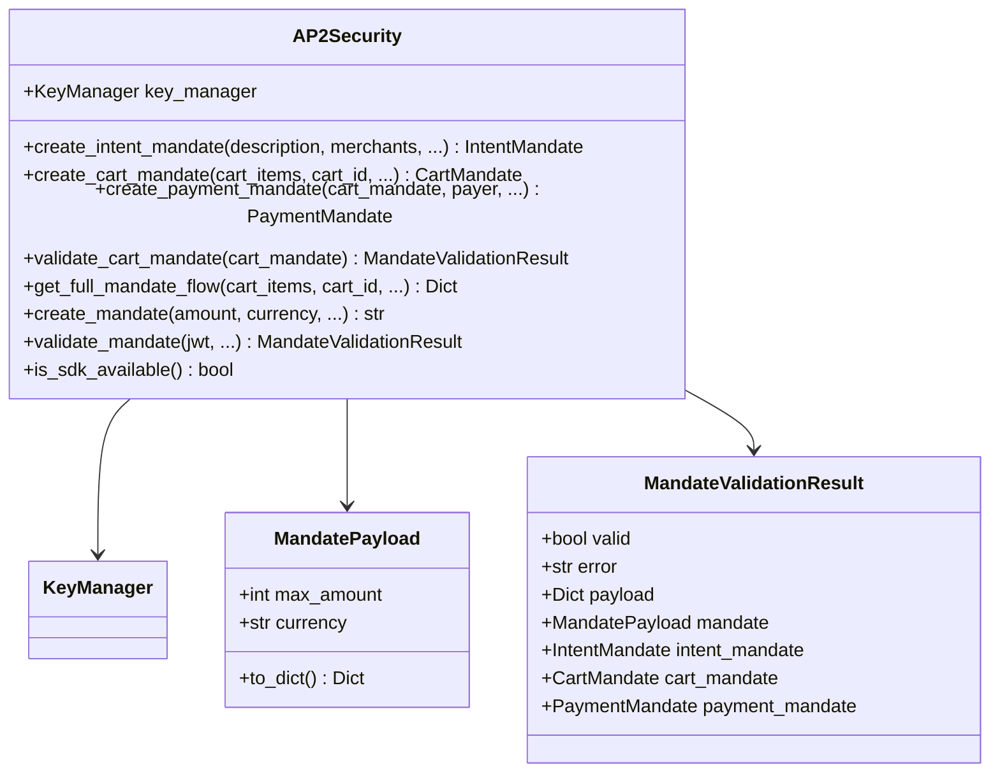

#### Fluxo Completo de Mandatos AP2

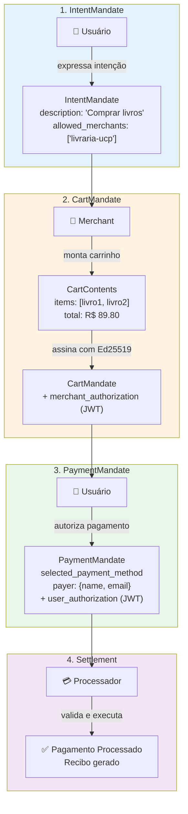

#### Método `get_full_mandate_flow()`

Este método gera os 3 mandatos em sequência:

```python
def get_full_mandate_flow(
    self,
    cart_items: List[Dict],
    cart_id: str,
    description: str = "",
    merchant_name: str = "Livraria Virtual UCP",
    payer_name: str = "Usuario",
    payer_email: str = "usuario@example.com",
    payment_method: str = "dev.ucp.mock_payment"
) -> Dict[str, Any]:
    """
    Retorna:
    {
        "intent_mandate": IntentMandate,
        "cart_mandate": CartMandate,
        "payment_mandate": PaymentMandate,
        "sdk_available": bool
    }
    """
```

---

### 5. Request Signatures (`signatures.py`)

Assinaturas de requisições UCP para conformidade e segurança.

#### Diagrama de Classes

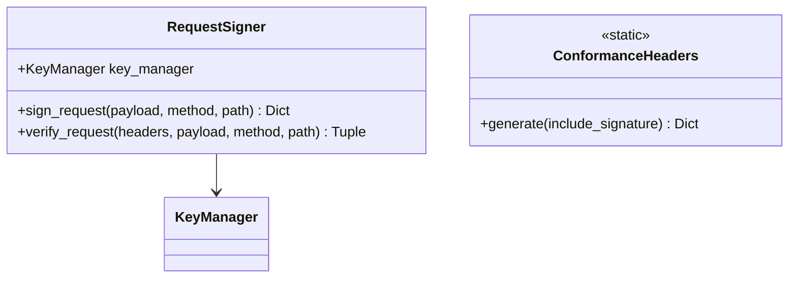

#### Headers Gerados

```json
{
    "request-id": "uuid",
    "idempotency-key": "uuid",
    "ucp-timestamp": "1704067200",
    "ucp-nonce": "hex16",
    "request-signature": "base64url_signature",
    "ucp-key-id": "key-abc123"
}
```

---

## Fluxos de Uso

### Fluxo de Pagamento com 3 Mandatos (AP2 Oficial)

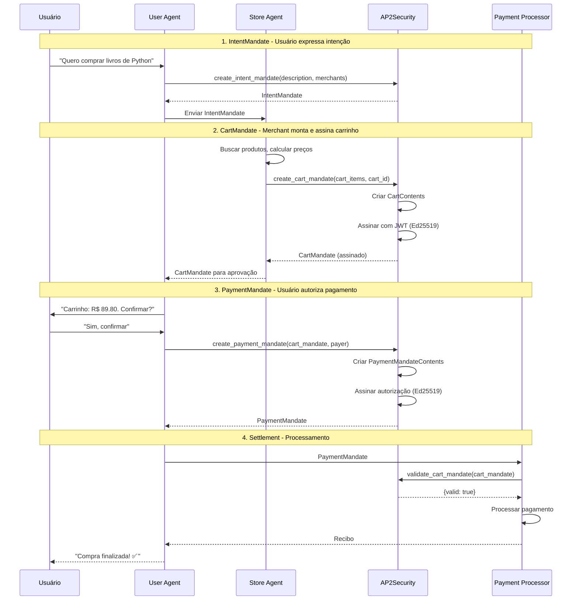

### Fluxo Simplificado (Mandato Legacy)

Para compatibilidade, o método `create_mandate()` ainda está disponível:

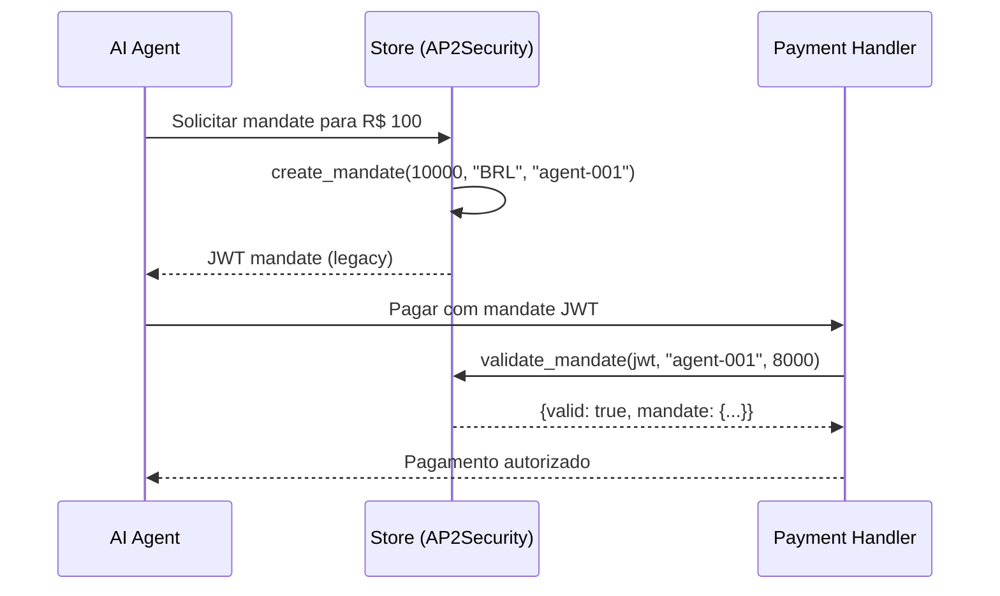

---

## Instâncias Globais

O módulo exporta três instâncias globais (singletons):

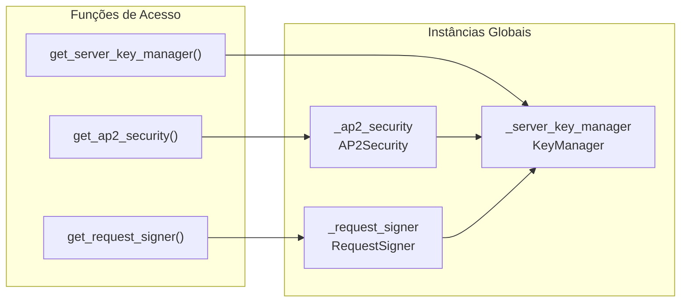

---

## Exports do Módulo

```python
from backend.src.security import (
    # Key Manager
    KeyManager,
    get_server_key_manager,
    
    # AP2 Security
    AP2Security,
    get_ap2_security,
    MandatePayload,
    MandateValidationResult,
    
    # Tipos AP2 Oficiais (SDK Google)
    IntentMandate,
    CartMandate,
    CartContents,
    PaymentMandate,
    PaymentMandateContents,
    PaymentRequest,
    PaymentItem,
    PaymentCurrencyAmount,
    PaymentResponse,
    is_ap2_sdk_available,
    AP2_SDK_AVAILABLE,
    
    # Adapters AP2
    create_intent_mandate,
    create_cart_contents,
    sign_cart_mandate,
    create_payment_mandate,
    validate_cart_mandate,
    cart_items_to_cart_mandate,
    
    # Request Signatures
    RequestSigner,
    ConformanceHeaders,
    get_request_signer,
)
```

---

## Exemplos de Uso

### Fluxo Completo com 3 Mandatos (Recomendado)

```python
from backend.src.security import get_ap2_security, is_ap2_sdk_available

# Verificar se SDK está disponível
print(f"SDK AP2 disponível: {is_ap2_sdk_available()}")

ap2 = get_ap2_security()

# Itens do carrinho
cart_items = [
    {"title": "Clean Code em Python", "price": 4990, "quantity": 1},
    {"title": "Python para Todos", "price": 3990, "quantity": 1}
]

# Gerar fluxo completo de mandatos
mandates = ap2.get_full_mandate_flow(
    cart_items=cart_items,
    cart_id="cart_123",
    description="Comprar livros de programação",
    payer_name="João Silva",
    payer_email="joao@example.com"
)

# Acessar mandatos individuais
intent = mandates["intent_mandate"]
cart = mandates["cart_mandate"]
payment = mandates["payment_mandate"]

print(f"IntentMandate: {intent.description}")
print(f"CartMandate ID: {cart.contents.id}")
print(f"CartMandate assinado: {cart.merchant_authorization is not None}")
print(f"PaymentMandate ID: {payment.payment_mandate_contents.payment_mandate_id}")
```

### Criar Mandatos Individualmente

```python
from backend.src.security import get_ap2_security

ap2 = get_ap2_security()

# 1. IntentMandate
intent = ap2.create_intent_mandate(
    description="Comprar livros de Python",
    merchants=["livraria-ucp"],
    skus=["book-001", "book-002"]
)

# 2. CartMandate (após merchant montar carrinho)
cart_items = [{"title": "Livro", "price": 4990, "quantity": 1}]
cart_mandate = ap2.create_cart_mandate(
    cart_items=cart_items,
    cart_id="cart_456"
)

# 3. PaymentMandate (após usuário confirmar)
payment_mandate = ap2.create_payment_mandate(
    cart_mandate=cart_mandate,
    payer_name="Maria",
    payer_email="maria@example.com"
)
```

### Validar CartMandate

```python
from backend.src.security import get_ap2_security

ap2 = get_ap2_security()

# Validar assinatura do carrinho
result = ap2.validate_cart_mandate(cart_mandate)

if result.valid:
    print("CartMandate válido!")
    print(f"  - Formato JWT: ✓")
    print(f"  - Assinatura Ed25519: ✓")
    print(f"  - Hash do carrinho: ✓")
else:
    print(f"Erro: {result.error}")
```

### Mandato Legacy (Compatibilidade)

```python
from backend.src.security import get_ap2_security

ap2 = get_ap2_security()

# Criar mandate (formato antigo)
mandate_jwt = ap2.create_mandate(
    amount=10000,  # R$ 100,00 em centavos
    currency="BRL",
    beneficiary="agent-001",
    expiry_seconds=3600
)

# Validar mandate
result = ap2.validate_mandate(
    jwt=mandate_jwt,
    expected_audience="agent-001",
    required_amount=8000
)

if result.valid:
    print(f"Mandate válido! Limite: R$ {result.mandate.max_amount / 100:.2f}")
```

### Executar Demo

```bash
# Executar demonstração completa do AP2
make demo-ap2
```

---

## Dependências

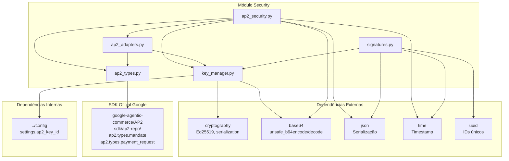

---

## Segurança

### Algoritmos Utilizados

| Componente | Algoritmo | Propósito |
|------------|-----------|-----------|
| Assinaturas | Ed25519 (EdDSA) | Assinatura digital |
| Codificação | Base64URL | Codificação de dados binários |
| Tokens | JWT | Estrutura de mandatos |
| Hash | SHA-256 | Integridade do carrinho |

### Validações de Segurança

#### IntentMandate
- ✅ Expiração configurável
- ✅ Lista de merchants permitidos
- ✅ Lista de SKUs permitidos (opcional)
- ✅ Flag de confirmação do usuário

#### CartMandate
- ✅ Assinatura JWT com Ed25519
- ✅ Hash SHA-256 do conteúdo do carrinho
- ✅ Validação de expiração
- ✅ Detecção de adulteração (preços, quantidades)

#### PaymentMandate
- ✅ Autorização JWT do usuário
- ✅ Referência ao CartMandate original
- ✅ Dados do pagador incluídos
- ✅ Timestamp de autorização

#### Request Signature
- ✅ Verificação de assinatura Ed25519
- ✅ Validação de timestamp (prevenção de replay)
- ✅ Verificação de nonce
- ✅ Validação de idade máxima

---

## Benefícios do SDK Oficial

| Benefício | Descrição |
|-----------|-----------|
| **Padronizado** | Segue especificação oficial do Google |
| **Interoperável** | Compatível com outros implementadores AP2 |
| **Seguro** | Criptografia Ed25519 em todos os mandatos |
| **Auditável** | Cadeia de mandatos cria trilha não-repudiável |
| **Extensível** | Suporta diferentes rails de pagamento |

---

## Referências

- **SDK Oficial AP2:** https://github.com/google-agentic-commerce/AP2
- **AP2 Protocol:** Agent Payments Protocol v2
- **Ed25519:** https://ed25519.cr.yp.to/
- **JWT:** https://jwt.io/
- **JWK:** https://datatracker.ietf.org/doc/html/rfc7517
- **W3C Payment Request:** https://www.w3.org/TR/payment-request/
