# Backend Source - Código Fonte do Backend

Este diretório contém todo o código fonte do backend da Livraria Virtual UCP. O backend implementa múltiplos protocolos (UCP, A2A, MCP, AP2) usando **SDKs oficiais** e fornece APIs REST, WebSocket e endpoints de discovery.

## Visão Geral

O backend é composto por **6 módulos principais**:

| Módulo | Descrição | Porta | SDK Oficial |
|--------|-----------|-------|-------------|
| **API Gateway** | Entry point principal (main.py) | 8000 | - |
| **UCP Server** | Servidor Universal Commerce Protocol | 8182 | ✅ `ucp-python` |
| **MCP Server** | Model Context Protocol (via HTTP) | Integrado | ✅ `mcp` (FastMCP) |
| **Agents** | Store Agents (LangGraph) + A2A | Via WebSocket | ✅ `a2a-sdk` |
| **Database** | Camada de persistência SQLite | - | - |
| **Security** | AP2 Security e assinaturas | - | ✅ `ap2` (Google) |

---

## SDKs Oficiais Integrados

| Protocolo | SDK | Repositório | Localização |
|-----------|-----|-------------|-------------|
| **UCP** | `ucp-python` | Universal-Commerce-Protocol/python-sdk | `sdk/ucp-python/` |
| **A2A** | `a2a-sdk` | a2aproject/a2a-python | PyPI |
| **AP2** | `ap2` | google-agentic-commerce/AP2 | `sdk/ap2-repo/` |
| **MCP** | `mcp` (FastMCP) | modelcontextprotocol/python-sdk | PyPI |

---

## Arquitetura do Backend

```
backend/src/
├── __init__.py          # Versão do backend
├── main.py              # API Gateway (porta 8000)
├── config.py            # Configurações
├── src.md               # Esta documentação
│
├── agents/              # Store Agents (LangGraph + A2A SDK)
│   ├── agents.md        # → Documentação completa
│   ├── a2a/
│   │   └── a2a.md      # → Protocolo A2A (SDK oficial)
│   └── nodes/
│       └── nodes.md     # → Agent Nodes
│
├── db/                  # Camada de Persistência
│   └── db.md            # → Documentação completa
│
├── mcp/                 # Model Context Protocol (SDK oficial)
│   ├── mcp.md           # → Documentação completa
│   └── tools/
│       └── tools.md      # → Ferramentas MCP
│
├── security/            # Segurança AP2 (SDK oficial Google)
│   ├── security.md      # → Documentação completa
│   ├── ap2_types.py     # → Tipos oficiais AP2
│   └── ap2_adapters.py  # → Adaptadores AP2
│
└── ucp_server/          # UCP Server (SDK oficial)
    ├── ucp.md            # → Documentação completa
    ├── capabilities/
    │   └── capabilities.md  # → Capabilities UCP
    ├── models/
    │   └── models.md        # → Modelos Pydantic
    ├── routes/
    │   └── routes.md         # → Rotas HTTP
    └── services/
        └── services.md       # → Serviços UCP
```

### Diagrama de Arquitetura Completo

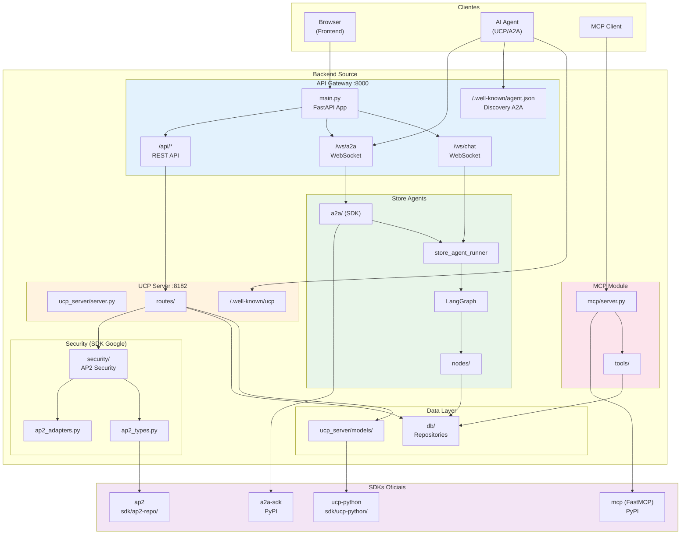

---

## Componentes Principais

### 1. API Gateway (`main.py`)

Entry point principal que orquestra todas as funcionalidades.

#### Estrutura do App

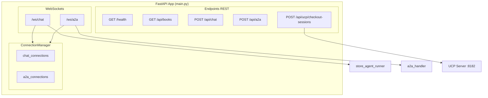

#### Endpoints Principais

| Endpoint | Método | Tipo | Descrição |
|----------|--------|------|-----------|
| `/health` | GET | REST | Health check |
| `/.well-known/agent.json` | GET | REST | Discovery endpoint A2A |
| `/api/books` | GET | REST | Listar livros |
| `/api/books/search` | GET | REST | Buscar livros |
| `/api/chat` | POST | REST | Chat com Store Agents |
| `/api/a2a` | POST | REST | Requisição A2A |
| `/api/a2a/agents` | GET | REST | Listar agentes conectados |
| `/api/ucp/checkout-sessions` | POST | REST | Proxy para UCP Server |
| `/ws/chat` | WebSocket | WS | Chat em tempo real |
| `/ws/a2a` | WebSocket | WS | Comunicação A2A |

#### Fluxo de Chat WebSocket

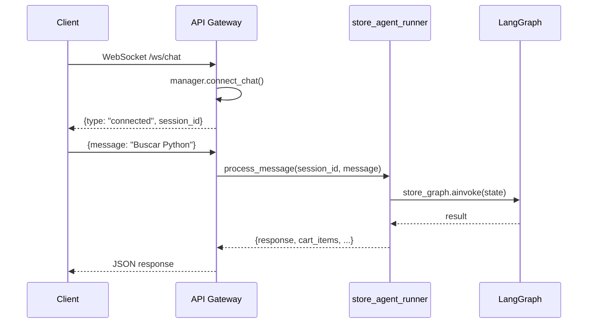

#### Fluxo de A2A WebSocket

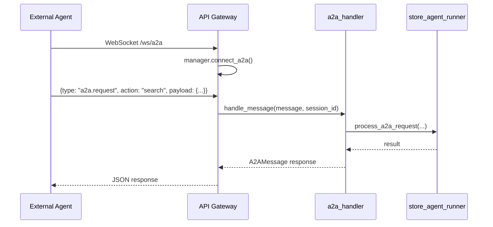

---

### 2. Configurações (`config.py`)

Configurações centralizadas usando Pydantic Settings.

#### Configurações Disponíveis

| Categoria | Configuração | Padrão | Descrição |
|-----------|--------------|--------|-----------|
| **Server** | `api_port` | 8000 | Porta do API Gateway |
| **Server** | `ucp_port` | 8182 | Porta do UCP Server |
| **Database** | `products_db_path` | `./data/products.db` | Path do banco de produtos |
| **Database** | `transactions_db_path` | `./data/transactions.db` | Path do banco de transações |
| **Security** | `ap2_key_id` | `livraria-key-001` | ID da chave AP2 |
| **Security** | `jwt_expiry_seconds` | 3600 | Expiração de JWT (1 hora) |
| **LLM** | `google_api_key` | - | Chave da API Gemini |
| **Debug** | `debug` | `True` | Modo debug |
| **Debug** | `log_level` | `INFO` | Nível de log |

#### Carregamento de Configurações

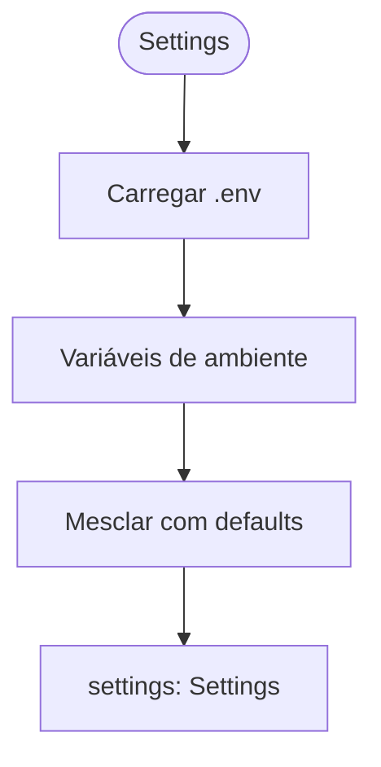

---

## Módulos Documentados

### Agents

📄 **Documentação:** [`agents/agents.md`](agents/agents.md)

Sistema de agentes inteligentes usando LangGraph e **A2A SDK oficial**:

- **State** - Estado compartilhado entre agentes
- **Graph** - Grafo LangGraph orquestrador
- **Nodes** - Agentes especializados (Discovery, Shopping, Recommend)
- **A2A** - Comunicação Agent-to-Agent (SDK oficial)

📄 **Submódulos:**
- [`agents/a2a/a2a.md`](agents/a2a/a2a.md) - Protocolo Agent-to-Agent (SDK oficial)
- [`agents/nodes/nodes.md`](agents/nodes/nodes.md) - Agent Nodes detalhados

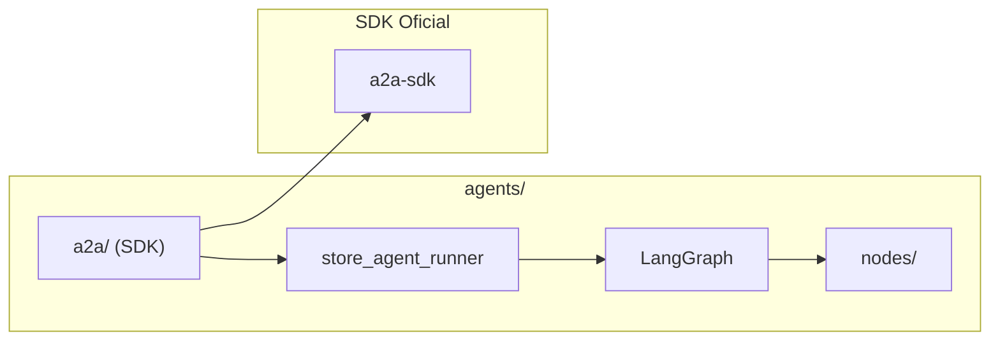

---

### Database

📄 **Documentação:** [`db/db.md`](db/db.md)

Camada de persistência SQLite:

- **Database** - Gerenciador de conexões
- **ProductsRepository** - Operações com livros (inclui controle de estoque)
- **DiscountsRepository** - Operações com cupons
- **TransactionsRepository** - Operações com checkout

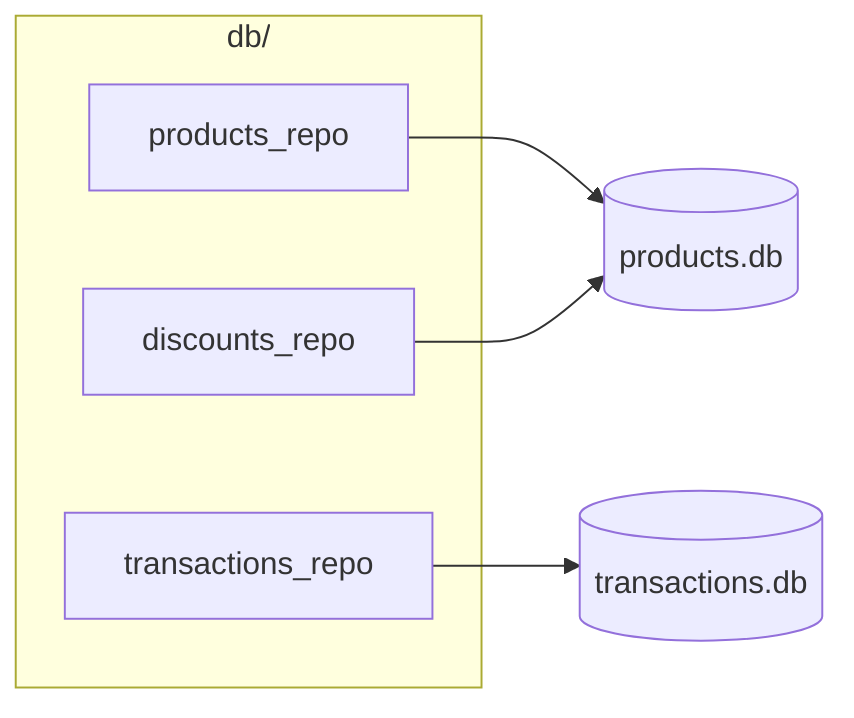

---

### MCP

📄 **Documentação:** [`mcp/mcp.md`](mcp/mcp.md)

Model Context Protocol usando **SDK oficial** (FastMCP):

- **MCP Server** - Servidor MCP principal (FastMCP)
- **HTTP Server** - API REST para MCP
- **Tool Registry** - Registro de ferramentas
- **Progressive Disclosure** - Revelação gradual

📄 **Submódulo:**
- [`mcp/tools/tools.md`](mcp/tools/tools.md) - 7 ferramentas MCP

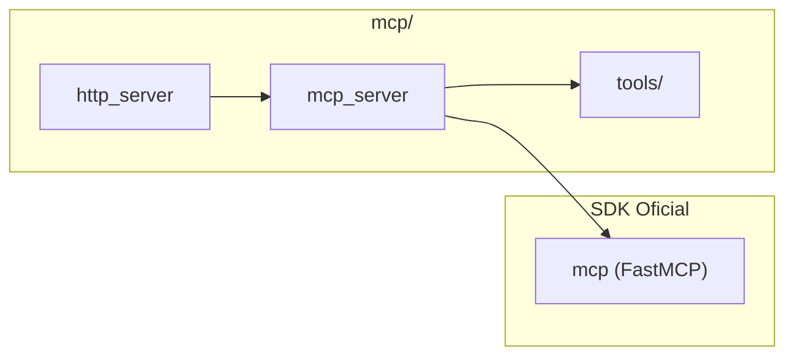

---

### Security

📄 **Documentação:** [`security/security.md`](security/security.md)

Segurança AP2 usando **SDK oficial do Google**:

- **AP2Security** - Orquestrador de mandatos (IntentMandate, CartMandate, PaymentMandate)
- **ap2_types** - Tipos oficiais re-exportados do SDK
- **ap2_adapters** - Funções de conversão e assinatura
- **KeyManager** - Gerenciamento de chaves Ed25519
- **RequestSigner** - Assinaturas de requisições UCP

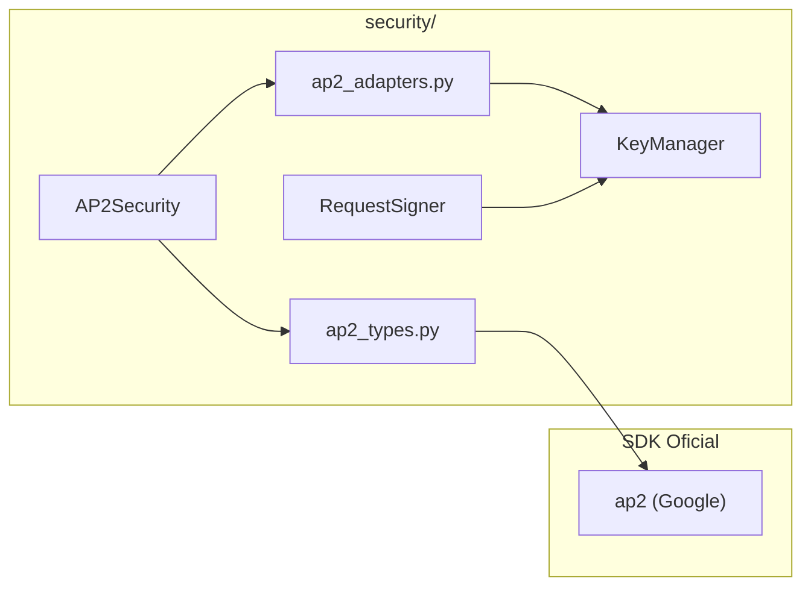

#### Fluxo de Mandatos AP2

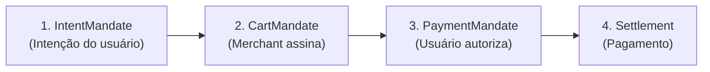

---

### UCP Server

📄 **Documentação:** [`ucp_server/ucp.md`](ucp_server/ucp.md)

Servidor Universal Commerce Protocol usando **SDK oficial**:

- **Server** - FastAPI app do UCP Server
- **Discovery** - Endpoint `/.well-known/ucp`
- **Routes** - Endpoints HTTP REST
- **Models** - Modelos Pydantic (SDK oficial)
- **Capabilities** - Capabilities UCP
- **Services** - Serviços UCP

📄 **Submódulos:**
- [`ucp_server/capabilities/capabilities.md`](ucp_server/capabilities/capabilities.md) - Capabilities (checkout, discount, fulfillment)
- [`ucp_server/models/models.md`](ucp_server/models/models.md) - Modelos Pydantic
- [`ucp_server/routes/routes.md`](ucp_server/routes/routes.md) - Rotas HTTP
- [`ucp_server/services/services.md`](ucp_server/services/services.md) - Serviços e payment handlers

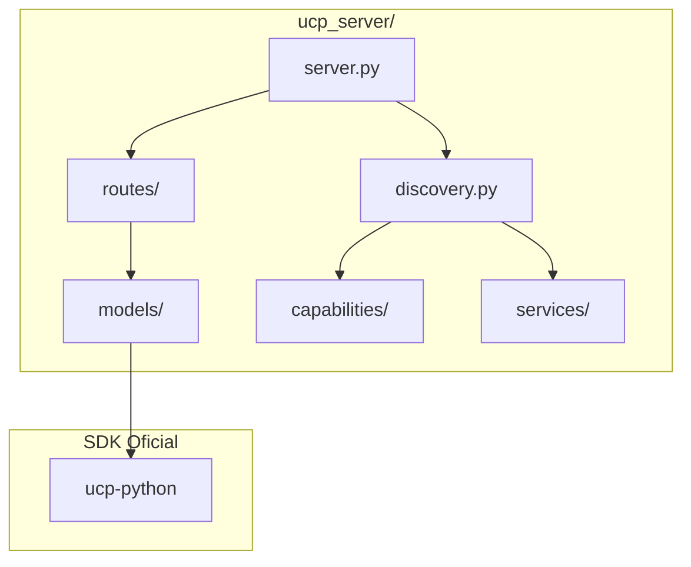

---

## Fluxo de Requisição Completo

### Fluxo de Discovery A2A

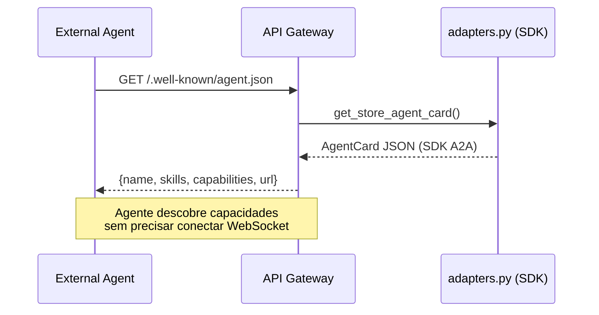

### Fluxo de Compra via UCP com AP2

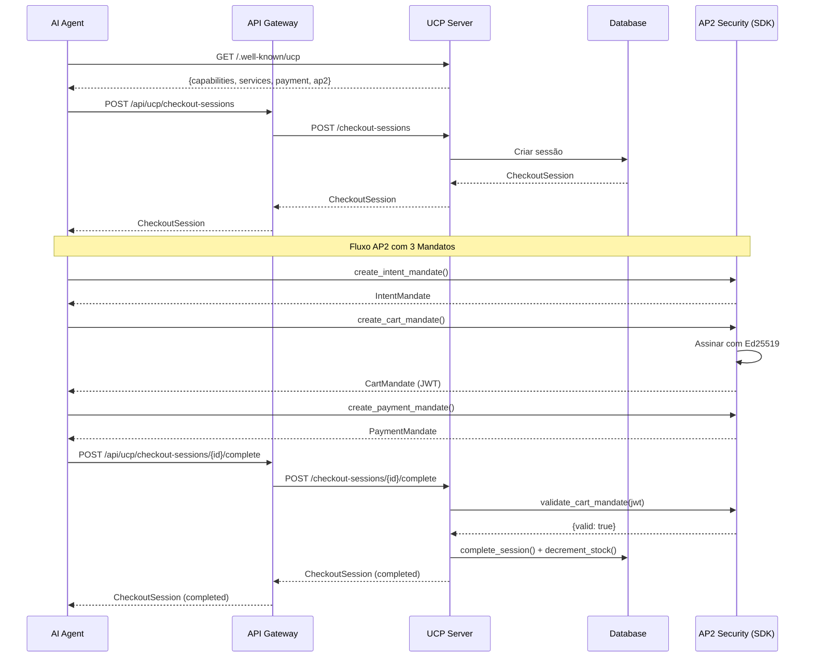

### Fluxo de Chat com Store Agents

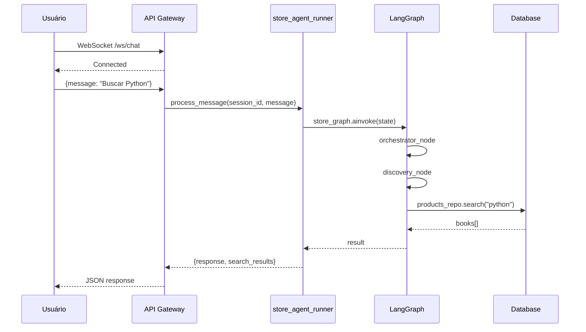

---

## Integração entre Módulos

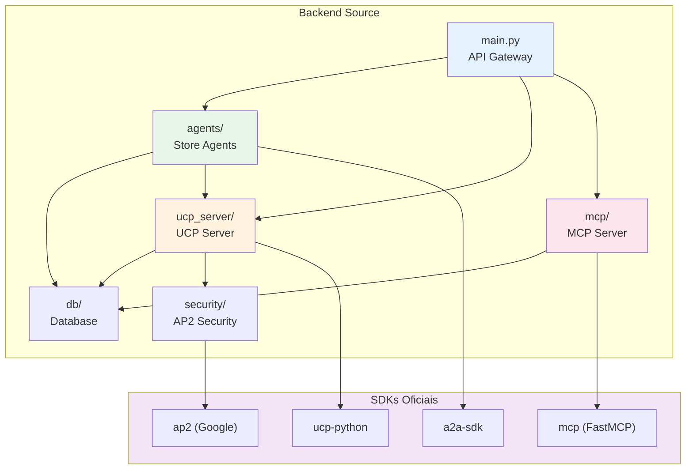

### Tabela de Dependências

| Módulo | Usa | Via | SDK |
|--------|-----|-----|-----|
| **main.py** | agents | `store_agent_runner`, `a2a_handler` | a2a-sdk |
| **main.py** | ucp_server | HTTP proxy (`httpx`) | - |
| **ucp_server** | db | `products_repo`, `transactions_repo`, `discounts_repo` | - |
| **ucp_server** | security | `get_ap2_security()` | ap2 |
| **ucp_server** | models | Modelos Pydantic | ucp-python |
| **agents** | db | `products_repo`, `transactions_repo`, `discounts_repo` | - |
| **agents** | a2a | `adapters.py` | a2a-sdk |
| **mcp** | db | `products_repo`, `discounts_repo` | - |
| **mcp** | server | FastMCP | mcp |

---

## Inicialização do Backend

### Startup Sequence

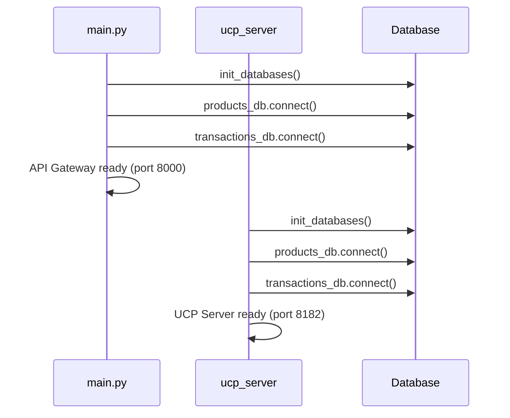

### Shutdown Sequence

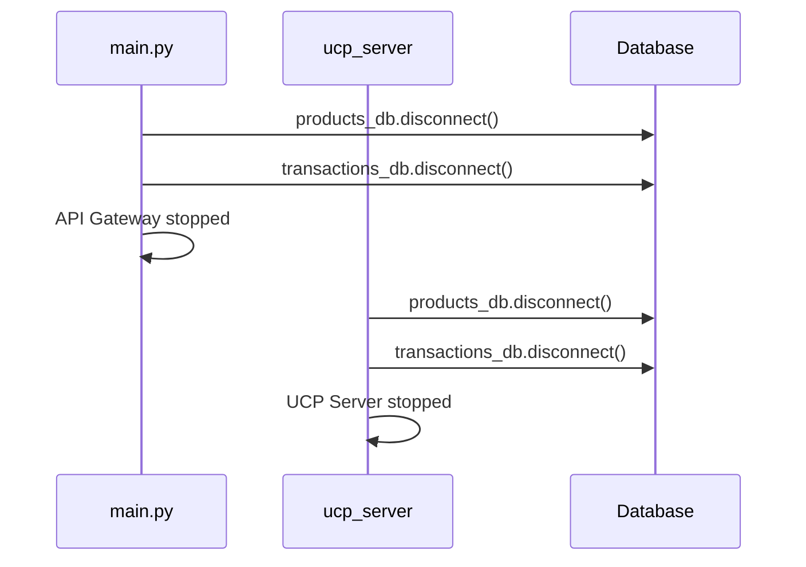

---

## Endpoints Principais

### API Gateway (porta 8000)

| Endpoint | Método | Descrição |
|----------|--------|-----------|
| `/health` | GET | Health check |
| `/.well-known/agent.json` | GET | Discovery endpoint A2A (AgentCard) |
| `/api/books` | GET | Listar livros |
| `/api/books/search` | GET | Buscar livros |
| `/api/books/{book_id}` | GET | Obter livro |
| `/api/chat` | POST | Chat REST |
| `/api/a2a` | POST | A2A REST |
| `/api/a2a/agents` | GET | Listar agentes |
| `/api/ucp/checkout-sessions` | POST | Proxy UCP |
| `/ws/chat` | WebSocket | Chat em tempo real |
| `/ws/a2a` | WebSocket | A2A em tempo real |

### UCP Server (porta 8182)

| Endpoint | Método | Descrição |
|----------|--------|-----------|
| `/.well-known/ucp` | GET | Discovery endpoint (inclui AP2 info) |
| `/health` | GET | Health check |
| `/books/*` | GET | Rotas de catálogo |
| `/checkout-sessions/*` | POST, GET, PUT, DELETE | Rotas de checkout |
| `/mcp/*` | GET, POST | Rotas MCP |

---

## Configuração e Variáveis de Ambiente

### Arquivo `.env`

```bash
# Servers
API_PORT=8000
UCP_PORT=8182

# Database
PRODUCTS_DB_PATH=./data/products.db
TRANSACTIONS_DB_PATH=./data/transactions.db

# Security
AP2_KEY_ID=livraria-key-001
JWT_EXPIRY_SECONDS=3600

# LLM (Gemini)
GOOGLE_API_KEY=AIza...

# Debug
DEBUG=True
LOG_LEVEL=INFO
```

---

## Logging

O backend usa `structlog` para logging estruturado em todos os módulos:

```python
logger.info("Event", field1=value1, field2=value2)
logger.warning("Warning", error=error_message)
logger.error("Error", error=str(e))
```

### Eventos Logados

| Módulo | Eventos |
|--------|---------|
| **main.py** | Chat messages, A2A messages, UCP proxy requests |
| **ucp_server** | Discovery requests, checkout operations, AP2 validation |
| **agents** | Intent detection (LLM), node processing, A2A requests |
| **mcp** | Tool calls, progressive disclosure upgrades |
| **security** | Mandate creation, JWT signing, validation |

---

## Referências para Documentação Detalhada

### Módulos Principais

- **Agents:** [`agents/agents.md`](agents/agents.md)
  - Sistema de agentes LangGraph
  - Submódulos: [`a2a/a2a.md`](agents/a2a/a2a.md), [`nodes/nodes.md`](agents/nodes/nodes.md)

- **Database:** [`db/db.md`](db/db.md)
  - Camada de persistência SQLite
  - Repositories e gerenciamento de conexões

- **MCP:** [`mcp/mcp.md`](mcp/mcp.md)
  - Model Context Protocol (SDK oficial)
  - Submódulo: [`tools/tools.md`](mcp/tools/tools.md)

- **Security:** [`security/security.md`](security/security.md)
  - AP2 Security (SDK oficial Google)
  - Fluxo de 3 mandatos: Intent → Cart → Payment

- **UCP Server:** [`ucp_server/ucp.md`](ucp_server/ucp.md)
  - Servidor Universal Commerce Protocol (SDK oficial)
  - Submódulos:
    - [`capabilities/capabilities.md`](ucp_server/capabilities/capabilities.md)
    - [`models/models.md`](ucp_server/models/models.md)
    - [`routes/routes.md`](ucp_server/routes/routes.md)
    - [`services/services.md`](ucp_server/services/services.md)

---

## Execução

### Iniciar Backend Completo

```bash
# Terminal 1: API Gateway
uvicorn backend.src.main:app --host 0.0.0.0 --port 8000

# Terminal 2: UCP Server
uvicorn backend.src.ucp_server.server:app --host 0.0.0.0 --port 8182
```

### Usando Scripts

```bash
# Executar tudo
./scripts/start_backend.sh

# Ou via Makefile
make run-backend

# Demo AP2 (fluxo de 3 mandatos)
make demo-ap2
```

---

## Estrutura de Dados

### Bancos de Dados

| Banco | Path | Tabelas |
|-------|------|---------|
| **products.db** | `./data/products.db` | books (com stock), discount_codes |
| **transactions.db** | `./data/transactions.db` | buyers, checkout_sessions, line_items, applied_discounts, payments |

📄 **Documentação:** [`../data/data.md`](../data/data.md)

---

## Protocolos Implementados

| Protocolo | Endpoint | SDK Oficial | Descrição |
|-----------|----------|-------------|-----------|
| **UCP** | `/.well-known/ucp` | ✅ ucp-python | Universal Commerce Protocol |
| **A2A** | `/.well-known/agent.json` | ✅ a2a-sdk | Discovery endpoint A2A (AgentCard) |
| **A2A** | `/ws/a2a` | ✅ a2a-sdk | Agent-to-Agent Communication (WebSocket) |
| **MCP** | `/mcp/*` | ✅ mcp (FastMCP) | Model Context Protocol |
| **AP2** | Via checkout | ✅ ap2 (Google) | Agent Payments Protocol v2 |
| **REST** | `/api/*` | - | API REST padrão |
| **WebSocket** | `/ws/*` | - | Comunicação em tempo real |

---

## Arquitetura de Camadas

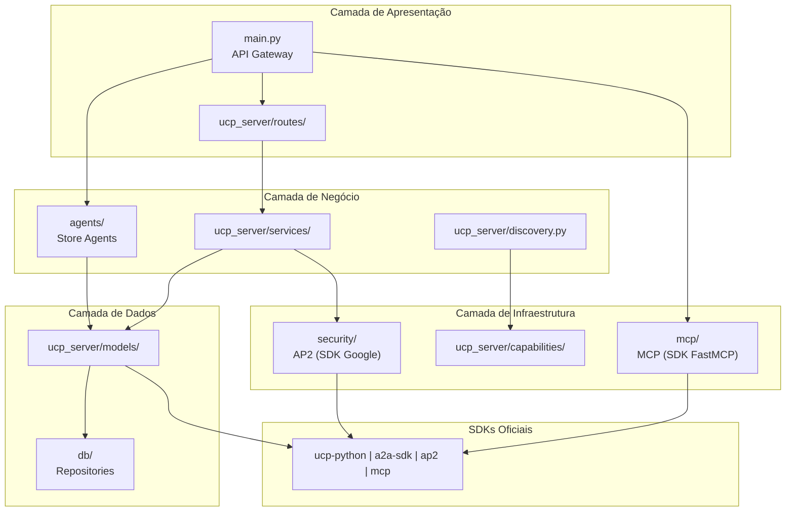

---

## Referências

- **Documentação dos Módulos:**
  - [`agents/agents.md`](agents/agents.md)
  - [`agents/a2a/a2a.md`](agents/a2a/a2a.md)
  - [`agents/nodes/nodes.md`](agents/nodes/nodes.md)
  - [`db/db.md`](db/db.md)
  - [`mcp/mcp.md`](mcp/mcp.md)
  - [`mcp/tools/tools.md`](mcp/tools/tools.md)
  - [`security/security.md`](security/security.md)
  - [`ucp_server/ucp.md`](ucp_server/ucp.md)
  - [`ucp_server/capabilities/capabilities.md`](ucp_server/capabilities/capabilities.md)
  - [`ucp_server/models/models.md`](ucp_server/models/models.md)
  - [`ucp_server/routes/routes.md`](ucp_server/routes/routes.md)
  - [`ucp_server/services/services.md`](ucp_server/services/services.md)

- **Documentação Externa:**
  - [`../data/data.md`](../data/data.md) - Dados e bancos de dados
  - [`../docs/techSpec.md`](../docs/techSpec.md) - Especificação técnica completa

- **SDKs Oficiais:**
  - UCP: https://github.com/Universal-Commerce-Protocol/python-sdk
  - A2A: https://github.com/a2aproject/a2a-python
  - AP2: https://github.com/google-agentic-commerce/AP2
  - MCP: https://github.com/modelcontextprotocol/python-sdk
