# Módulo Capabilities - UCP Capabilities

Este módulo implementa as **capabilities** (capacidades) do Universal Commerce Protocol (UCP) da Livraria Virtual UCP. As capabilities definem o que a loja pode fazer e são descobertas por agentes via endpoint `/.well-known/ucp`.

## Visão Geral

O módulo capabilities fornece **3 capabilities** principais:

| Capability | Nome | Versão | Estende |
|------------|------|--------|---------|
| **Checkout** | `dev.ucp.shopping.checkout` | 2026-01-11 | - |
| **Discount** | `dev.ucp.shopping.discount` | 2026-01-11 | checkout |
| **Fulfillment** | `dev.ucp.shopping.fulfillment` | 2026-01-11 | checkout |

---

## Arquitetura do Módulo

```
backend/src/ucp_server/capabilities/
├── __init__.py          # Exports e funções principais
├── checkout.py          # Capability de checkout
├── discount.py          # Capability de desconto
├── fulfillment.py       # Capability de fulfillment
└── capabilities.md      # Esta documentação
```

### Diagrama de Arquitetura

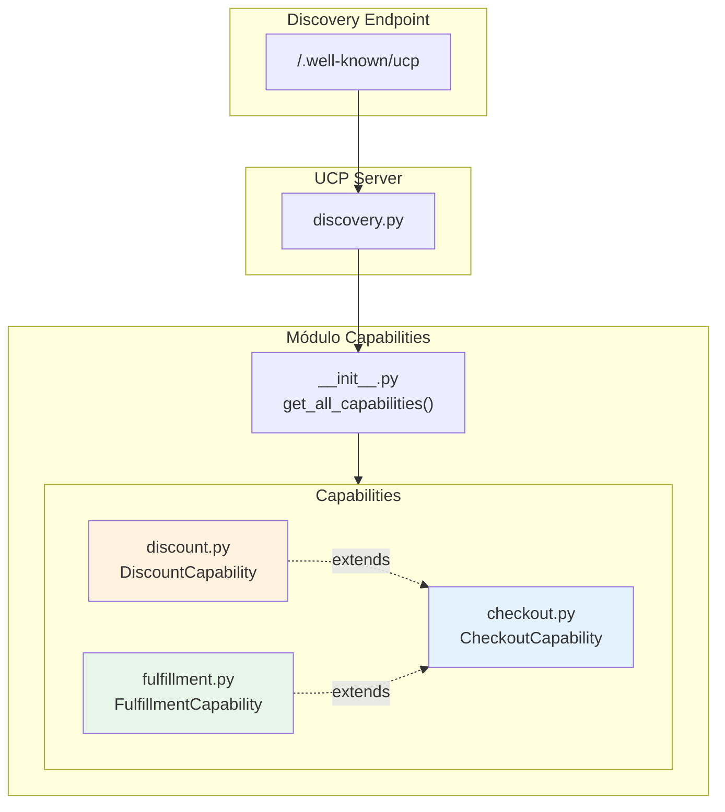

### Hierarquia de Capabilities

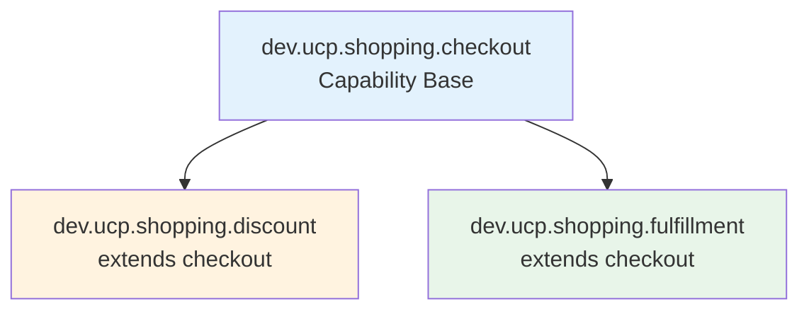

---

## Componentes Detalhados

### 1. Checkout Capability (`checkout.py`)

Capability principal de checkout - base para todas as outras.

#### Especificação

```python
class CheckoutCapability(BaseModel):
    name: str = "dev.ucp.shopping.checkout"
    version: str = "2026-01-11"
    spec: str = "https://ucp.dev/specs/shopping/checkout"
    schema_url: str = "https://ucp.dev/schemas/shopping/checkout.json"
    extends: Optional[str] = None
```

#### Operações Suportadas

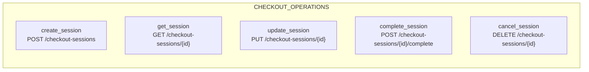

| Operação | Método | Endpoint | Descrição |
|----------|--------|----------|-----------|
| `create_session` | POST | `/checkout-sessions` | Criar nova sessão |
| `get_session` | GET | `/checkout-sessions/{session_id}` | Obter detalhes |
| `update_session` | PUT | `/checkout-sessions/{session_id}` | Atualizar sessão |
| `complete_session` | POST | `/checkout-sessions/{session_id}/complete` | Completar checkout |
| `cancel_session` | DELETE | `/checkout-sessions/{session_id}` | Cancelar sessão |

#### Fluxo de Checkout

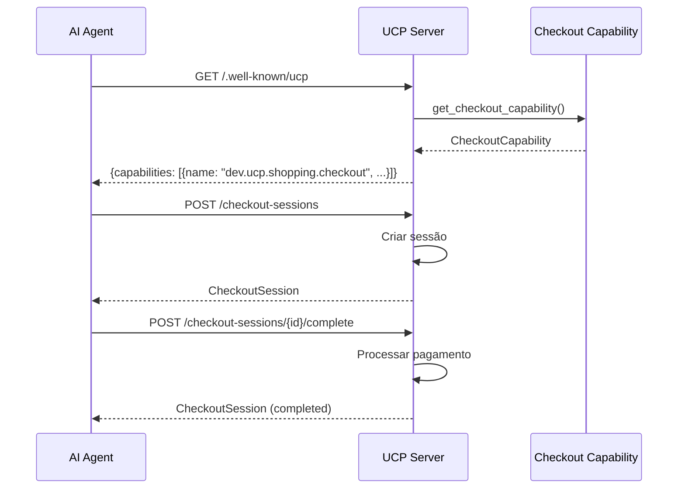

---

### 2. Discount Capability (`discount.py`)

Capability de desconto que estende checkout para suportar cupons e códigos promocionais.

#### Especificação

```python
class DiscountCapability(BaseModel):
    name: str = "dev.ucp.shopping.discount"
    version: str = "2026-01-11"
    spec: str = "https://ucp.dev/specs/shopping/discount"
    schema_url: str = "https://ucp.dev/schemas/shopping/discount.json"
    extends: str = "dev.ucp.shopping.checkout"  # ← Estende checkout
```

#### Tipos de Desconto

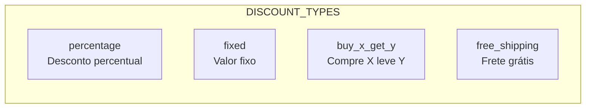

| Tipo | Descrição | Exemplo |
|------|-----------|---------|
| `percentage` | Desconto percentual | 10% off |
| `fixed` | Valor fixo em centavos | R$ 10,00 off |
| `buy_x_get_y` | Compre X leve Y | Compre 2 leve 1 |
| `free_shipping` | Frete grátis | Frete grátis |

#### Operações Suportadas

| Operação | Método | Endpoint | Descrição |
|----------|--------|----------|-----------|
| `apply_discount` | POST | `/checkout-sessions/{session_id}/discounts` | Aplicar cupom |
| `remove_discount` | DELETE | `/checkout-sessions/{session_id}/discounts/{code}` | Remover cupom |
| `validate_discount` | POST | `/discounts/validate` | Validar código |

#### Fluxo de Aplicação de Desconto

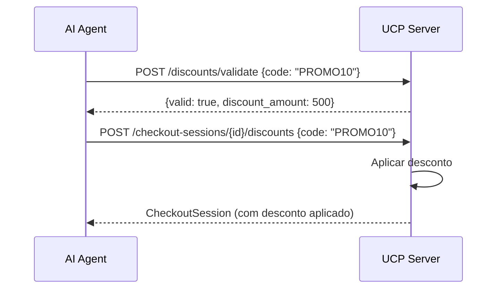

---

### 3. Fulfillment Capability (`fulfillment.py`)

Capability de fulfillment que estende checkout para suportar entrega, rastreamento e atualizações de status.

#### Especificação

```python
class FulfillmentCapability(BaseModel):
    name: str = "dev.ucp.shopping.fulfillment"
    version: str = "2026-01-11"
    spec: str = "https://ucp.dev/specs/shopping/fulfillment"
    schema_url: str = "https://ucp.dev/schemas/shopping/fulfillment.json"
    extends: str = "dev.ucp.shopping.checkout"  # ← Estende checkout
```

#### Status de Fulfillment

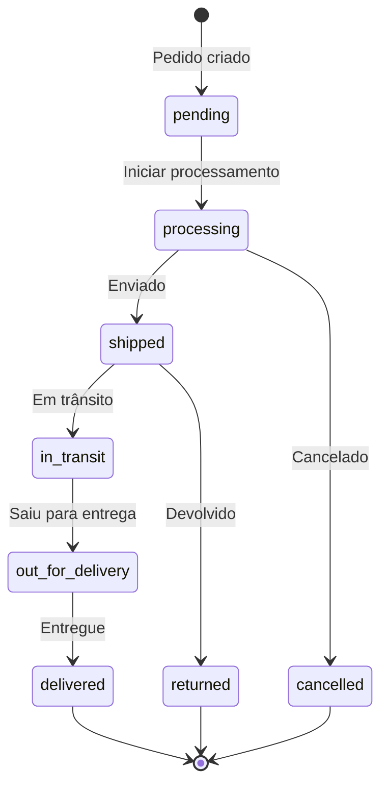

| Status | Descrição |
|--------|-----------|
| `pending` | Aguardando processamento |
| `processing` | Em processamento |
| `shipped` | Enviado |
| `in_transit` | Em trânsito |
| `out_for_delivery` | Saiu para entrega |
| `delivered` | Entregue |
| `cancelled` | Cancelado |
| `returned` | Devolvido |

#### Operações Suportadas

| Operação | Método | Endpoint | Descrição |
|----------|--------|----------|-----------|
| `get_fulfillment_status` | GET | `/orders/{order_id}/fulfillment` | Obter status |
| `update_shipping_address` | PUT | `/orders/{order_id}/shipping` | Atualizar endereço |
| `track_shipment` | GET | `/orders/{order_id}/tracking` | Rastrear envio |

#### Fluxo de Fulfillment

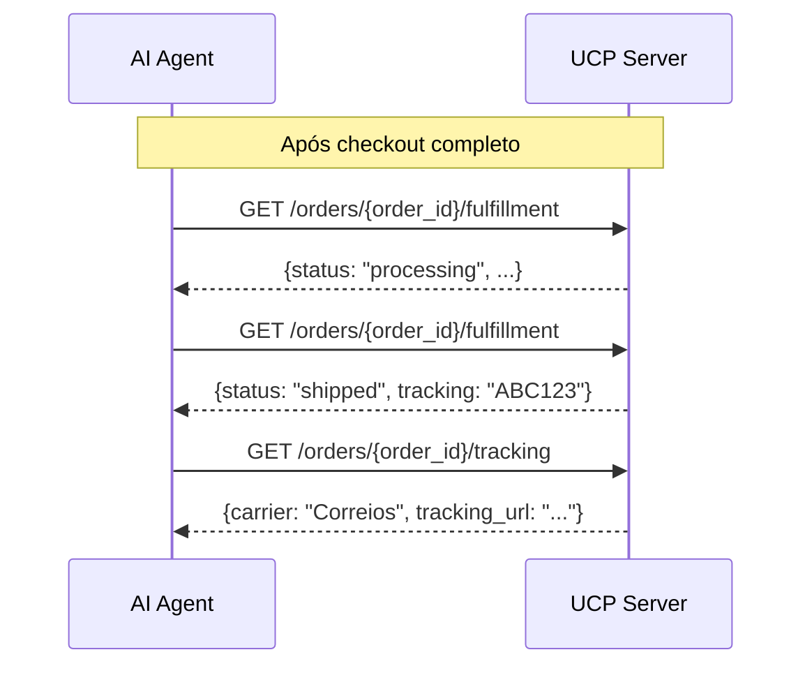

---

## Módulo Principal (`__init__.py`)

O arquivo `__init__.py` fornece funções para descobrir e acessar capabilities.

### Diagrama de Classes

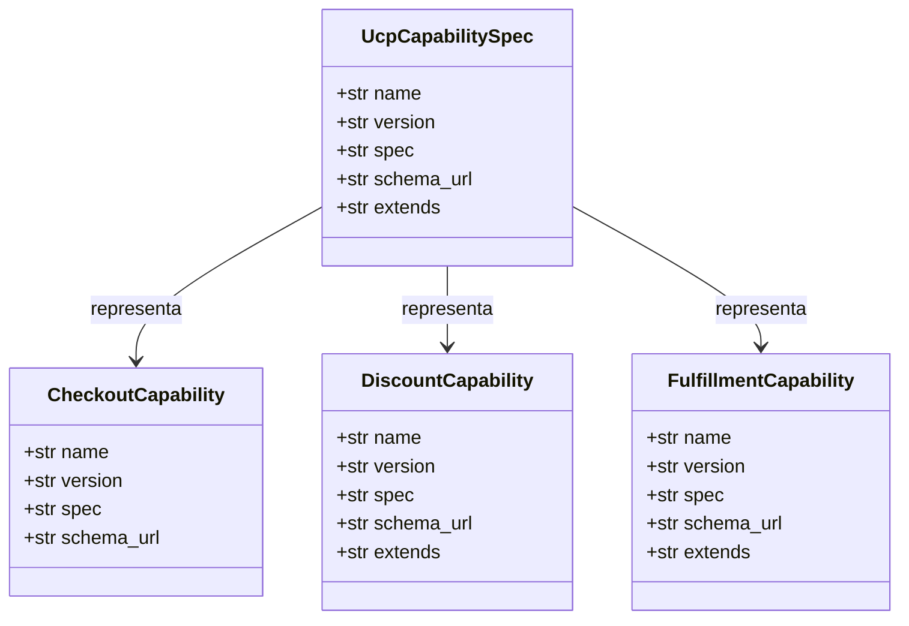

### Funções Principais

| Função | Retorno | Descrição |
|--------|---------|-----------|
| `get_all_capabilities()` | `List[UcpCapabilitySpec]` | Retorna todas as capabilities |
| `get_capability_by_name(name)` | Capability ou None | Busca capability por nome |

### Fluxo de Discovery

```mermaid
flowchart TD
    Start([GET /.well-known/ucp]) --> GetAll[get_all_capabilities]
    
    GetAll --> GetCheckout[get_checkout_capability]
    GetAll --> GetDiscount[get_discount_capability]
    GetAll --> GetFulfillment[get_fulfillment_capability]
    
    GetCheckout --> CreateSpec1[UcpCapabilitySpec(checkout)]
    GetDiscount --> CreateSpec2[UcpCapabilitySpec(discount)]
    GetFulfillment --> CreateSpec3[UcpCapabilitySpec(fulfillment)]
    
    CreateSpec1 --> Combine[List de specs]
    CreateSpec2 --> Combine
    CreateSpec3 --> Combine
    
    Combine --> Return([Retorna capabilities])
```

---

## Exports do Módulo

```python
from backend.src.ucp_server.capabilities import (
    # Funções principais
    get_all_capabilities,
    get_capability_by_name,
    UcpCapabilitySpec,
    
    # Checkout
    CheckoutCapability,
    get_checkout_capability,
    CHECKOUT_OPERATIONS,
    
    # Discount
    DiscountCapability,
    get_discount_capability,
    DISCOUNT_TYPES,
    DISCOUNT_OPERATIONS,
    
    # Fulfillment
    FulfillmentCapability,
    get_fulfillment_capability,
    FULFILLMENT_STATUS,
    FULFILLMENT_OPERATIONS,
)
```

---

## Integração com Discovery

As capabilities são expostas via endpoint de discovery UCP.

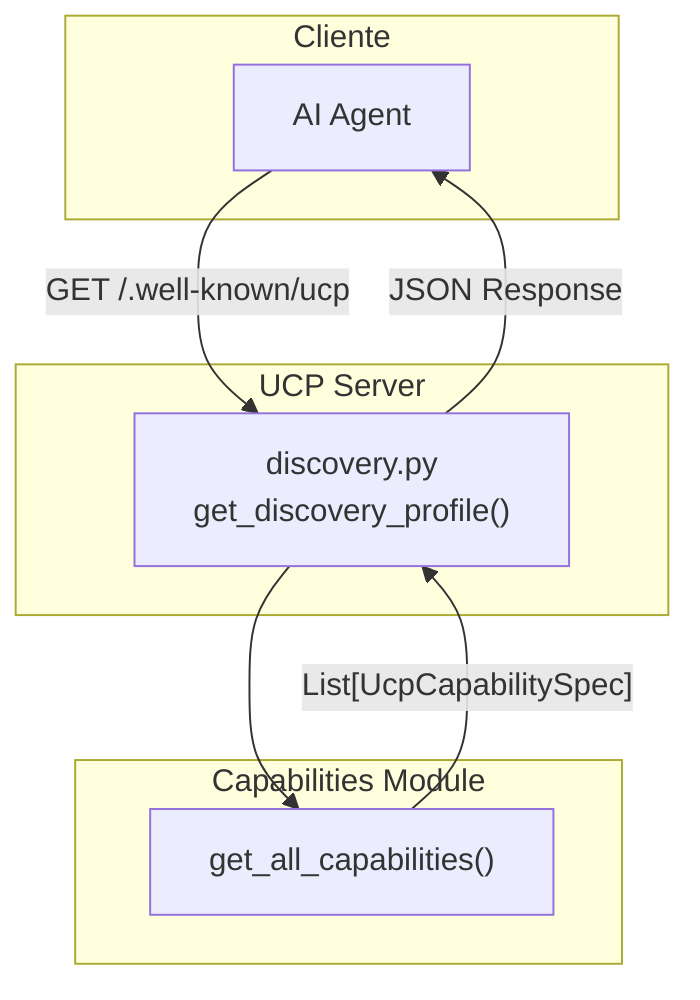

### Exemplo de Resposta Discovery

```json
{
    "ucp": {
        "version": "2026-01-11",
        "capabilities": [
            {
                "name": "dev.ucp.shopping.checkout",
                "version": "2026-01-11",
                "spec": "https://ucp.dev/specs/shopping/checkout",
                "schema_url": "https://ucp.dev/schemas/shopping/checkout.json"
            },
            {
                "name": "dev.ucp.shopping.discount",
                "version": "2026-01-11",
                "spec": "https://ucp.dev/specs/shopping/discount",
                "schema_url": "https://ucp.dev/schemas/shopping/discount.json",
                "extends": "dev.ucp.shopping.checkout"
            },
            {
                "name": "dev.ucp.shopping.fulfillment",
                "version": "2026-01-11",
                "spec": "https://ucp.dev/specs/shopping/fulfillment",
                "schema_url": "https://ucp.dev/schemas/shopping/fulfillment.json",
                "extends": "dev.ucp.shopping.checkout"
            }
        ]
    }
}
```

---

## Dependências

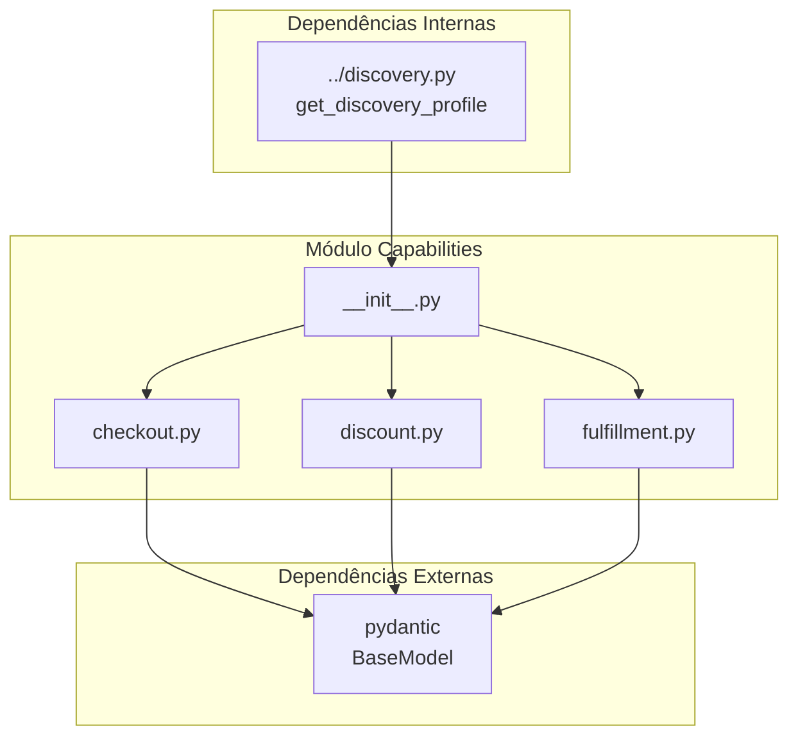

---

## Uso das Capabilities

### Descobrir Capabilities

```python
from backend.src.ucp_server.capabilities import get_all_capabilities

capabilities = get_all_capabilities()
for cap in capabilities:
    print(f"{cap.name} v{cap.version}")
    if cap.extends:
        print(f"  Extends: {cap.extends}")
```

### Buscar Capability Específica

```python
from backend.src.ucp_server.capabilities import get_capability_by_name

discount_cap = get_capability_by_name("dev.ucp.shopping.discount")
if discount_cap:
    print(f"Found: {discount_cap.name}")
    print(f"Extends: {discount_cap.extends}")
```

### Obter Operações de uma Capability

```python
from backend.src.ucp_server.capabilities import (
    get_checkout_operations,
    get_discount_operations,
    get_fulfillment_operations
)

# Operações de checkout
checkout_ops = get_checkout_operations()
for op in checkout_ops:
    print(f"{op['name']}: {op['endpoint']}")

# Operações de desconto
discount_ops = get_discount_operations()
for op in discount_ops:
    print(f"{op['name']}: {op['endpoint']}")
```

---

## Referências

- **UCP Protocol:** Universal Commerce Protocol
- **Discovery Endpoint:** `/.well-known/ucp`
- **Checkout Spec:** https://ucp.dev/specs/shopping/checkout
- **Discount Spec:** https://ucp.dev/specs/shopping/discount
- **Fulfillment Spec:** https://ucp.dev/specs/shopping/fulfillment
