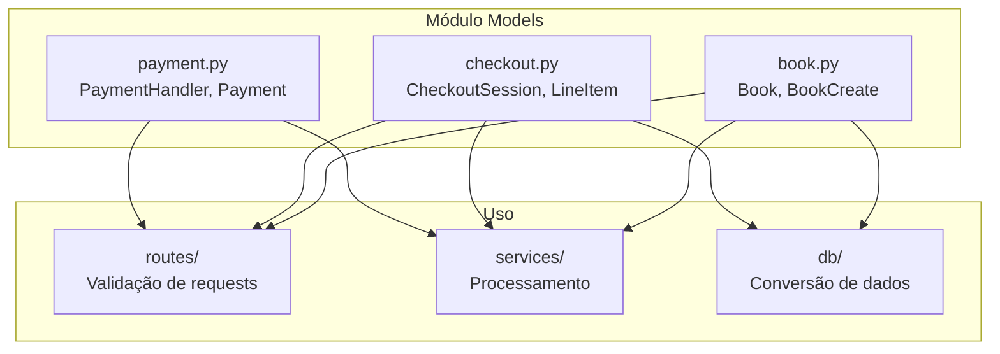
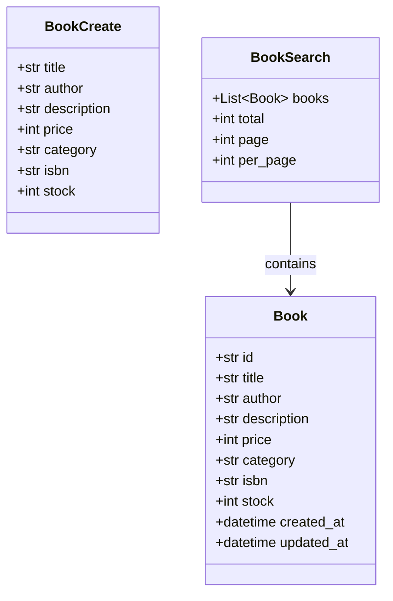
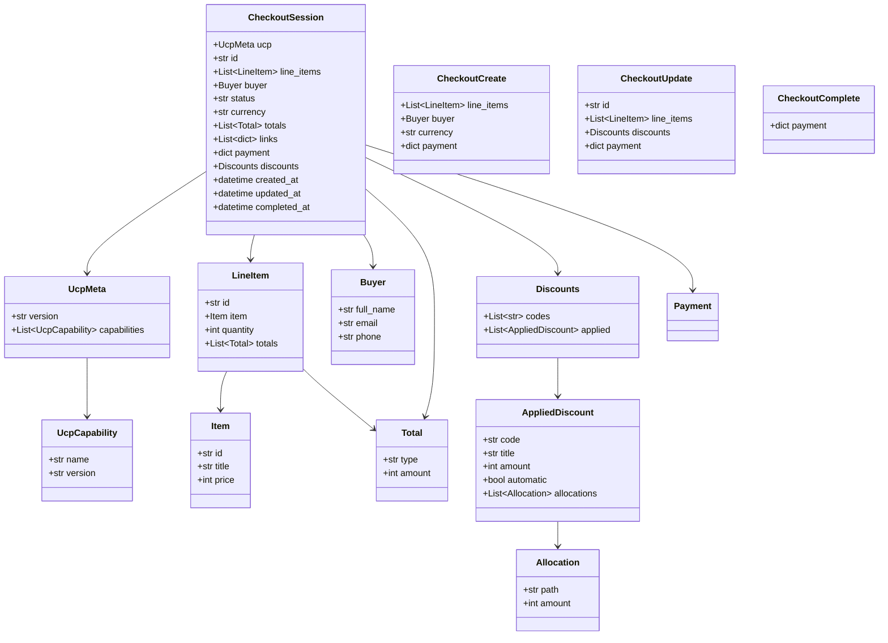
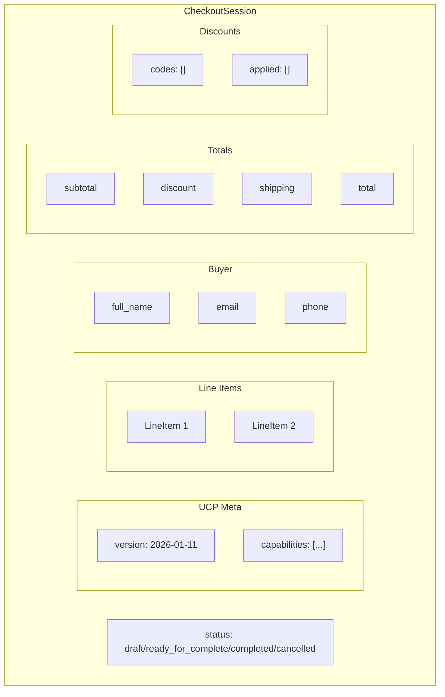
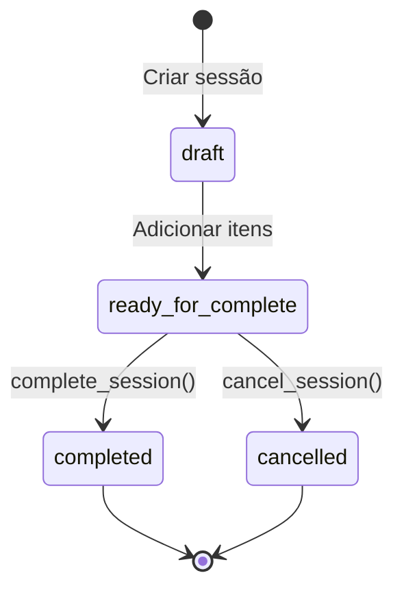
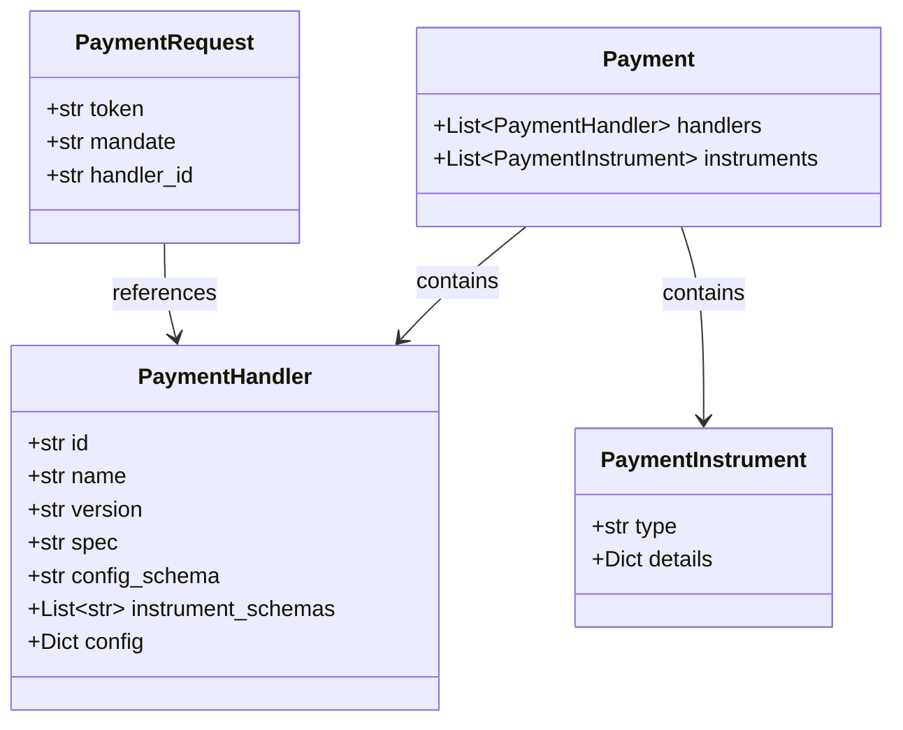
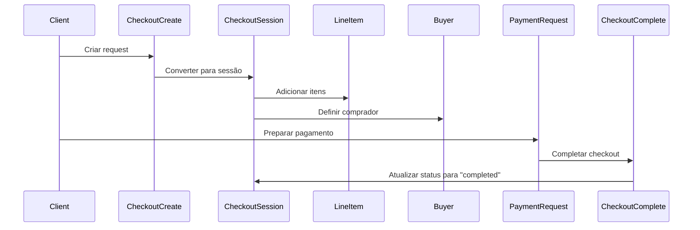
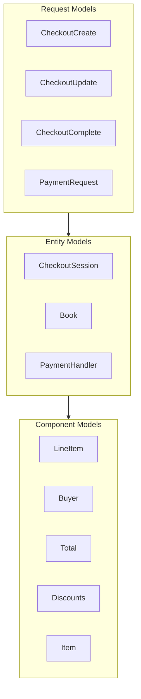
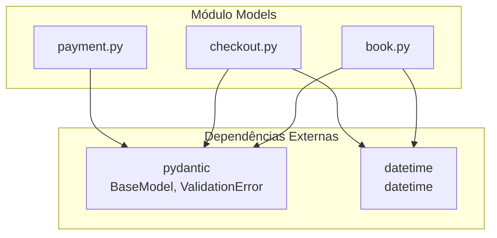

# Módulo Models - Modelos Pydantic do UCP Server

Este módulo define todos os **modelos Pydantic** usados pelo UCP Server da Livraria Virtual UCP. Os modelos seguem a especificação UCP e são usados para validação, serialização e documentação de API.

## Visão Geral

O módulo models contém **3 categorias** de modelos:

| Categoria | Arquivo | Modelos Principais |
|-----------|---------|-------------------|
| **Book** | `book.py` | Book, BookCreate, BookSearch |
| **Checkout** | `checkout.py` | CheckoutSession, LineItem, Buyer, Total, Discounts |
| **Payment** | `payment.py` | PaymentHandler, Payment, PaymentInstrument, PaymentRequest |

---

## Arquitetura do Módulo

```
backend/src/ucp_server/models/
├── __init__.py      # Exports públicos
├── book.py          # Modelos de livros
├── checkout.py      # Modelos de checkout
├── payment.py       # Modelos de pagamento
└── models.md        # Esta documentação
```

### Diagrama de Arquitetura



---

## Modelos Detalhados

### 1. Book Models (`book.py`)

Modelos relacionados a livros do catálogo.

#### Diagrama de Classes



#### Modelos

| Modelo | Propósito | Campos Principais |
|--------|-----------|-------------------|
| `Book` | Representa um livro completo | id, title, author, price, stock |
| `BookCreate` | Dados para criar livro | title, author, price (sem id) |
| `BookSearch` | Resultado de busca paginado | books[], total, page, per_page |

#### Exemplo de Uso

```python
from backend.src.ucp_server.models import Book, BookCreate

# Criar livro
book_data = BookCreate(
    title="Python para Todos",
    author="Maria Santos",
    price=3990,  # R$ 39,90 em centavos
    category="Programacao",
    stock=100
)

# Converter para Book (após salvar no DB)
book = Book(
    id="book_003",
    **book_data.model_dump(),
    created_at=datetime.now()
)
```

---

### 2. Checkout Models (`checkout.py`)

Modelos relacionados a checkout sessions e transações.

#### Diagrama de Classes - Hierarquia Completa



#### Estrutura de CheckoutSession



#### Status do Checkout



| Status | Descrição |
|--------|-----------|
| `draft` | Sessão em construção |
| `ready_for_complete` | Pronta para pagamento |
| `completed` | Checkout finalizado |
| `cancelled` | Checkout cancelado |

#### Tipos de Total

| Tipo | Descrição |
|------|-----------|
| `subtotal` | Soma dos itens |
| `discount` | Valor do desconto |
| `shipping` | Valor do frete |
| `total` | Total final |

#### Modelos de Request

| Modelo | Propósito | Uso |
|--------|-----------|-----|
| `CheckoutCreate` | Criar sessão | POST /checkout-sessions |
| `CheckoutUpdate` | Atualizar sessão | PUT /checkout-sessions/{id} |
| `CheckoutComplete` | Completar checkout | POST /checkout-sessions/{id}/complete |

#### Exemplo de CheckoutSession

```json
{
    "ucp": {
        "version": "2026-01-11",
        "capabilities": [
            {"name": "dev.ucp.shopping.checkout", "version": "2026-01-11"}
        ]
    },
    "id": "sess_abc123",
    "line_items": [
        {
            "id": "li_001",
            "item": {
                "id": "book_003",
                "title": "Python para Todos",
                "price": 3990
            },
            "quantity": 2,
            "totals": [
                {"type": "subtotal", "amount": 7980},
                {"type": "total", "amount": 7980}
            ]
        }
    ],
    "buyer": {
        "full_name": "João Silva",
        "email": "joao@example.com",
        "phone": "+5511999999999"
    },
    "status": "ready_for_complete",
    "currency": "BRL",
    "totals": [
        {"type": "subtotal", "amount": 7980},
        {"type": "discount", "amount": 798},
        {"type": "total", "amount": 7182}
    ],
    "discounts": {
        "codes": ["PROMO10"],
        "applied": [
            {
                "code": "PROMO10",
                "title": "10% de desconto",
                "amount": 798,
                "automatic": false,
                "allocations": [
                    {"path": "subtotal", "amount": 798}
                ]
            }
        ]
    }
}
```

---

### 3. Payment Models (`payment.py`)

Modelos relacionados a pagamentos e handlers.

#### Diagrama de Classes



#### Modelos

| Modelo | Propósito | Campos Principais |
|--------|-----------|-------------------|
| `PaymentHandler` | Handler de pagamento disponível | id, name, version, spec |
| `PaymentInstrument` | Instrumento de pagamento | type, details |
| `Payment` | Configuração de pagamento | handlers[], instruments[] |
| `PaymentRequest` | Request para completar pagamento | token, mandate (JWT), handler_id |

#### Exemplo de PaymentHandler

```json
{
    "id": "ap2",
    "name": "Agent Payments Protocol v2",
    "version": "2.0",
    "spec": "https://ap2.dev/spec",
    "config_schema": "https://ap2.dev/schemas/config.json",
    "instrument_schemas": [
        "https://ap2.dev/schemas/mandate.json"
    ],
    "config": {
        "public_key": "key-abc123",
        "supported_currencies": ["BRL", "USD"]
    }
}
```

#### Exemplo de PaymentRequest

```json
{
    "token": "payment_token_xyz",
    "mandate": "eyJhbGciOiJFZERTQSIsInR5cCI6IkpXVCJ9...",
    "handler_id": "ap2"
}
```

---

## Relacionamentos entre Modelos

### Fluxo de Checkout Completo



### Hierarquia de Modelos



---

## Exports do Módulo

```python
from backend.src.ucp_server.models import (
    # Book
    Book,
    BookCreate,
    
    # Checkout
    CheckoutSession,
    LineItem,
    Buyer,
    Total,
    
    # Payment
    PaymentHandler,
    Payment,
)
```

---

## Validação Pydantic

Todos os modelos usam **Pydantic BaseModel** para validação automática.

### Validações Automáticas

| Tipo | Validação |
|------|-----------|
| `str` | Não vazio (se required) |
| `int` | Tipo numérico |
| `Optional[T]` | Pode ser None |
| `List[T]` | Lista de tipo T |
| `datetime` | Formato de data válido |

### Exemplo de Validação

```python
from backend.src.ucp_server.models import CheckoutCreate, LineItem, Buyer, Item

# Validação automática
try:
    checkout = CheckoutCreate(
        line_items=[
            LineItem(
                item=Item(id="book_001", title="Livro", price=5000),
                quantity=2
            )
        ],
        buyer=Buyer(
            full_name="João Silva",
            email="joao@example.com"
        )
    )
except ValidationError as e:
    print(f"Erro de validação: {e}")
```

---

## Serialização

### Para JSON

```python
# Serializar para JSON
checkout_dict = checkout_session.model_dump()
json_str = checkout_session.model_dump_json()

# Com alias (para API)
checkout_dict = checkout_session.model_dump(by_alias=True)

# Excluir campos None
checkout_dict = checkout_session.model_dump(exclude_none=True)
```

### De JSON

```python
# Deserializar de JSON
checkout_session = CheckoutSession.model_validate(json_dict)

# Com validação estrita
checkout_session = CheckoutSession.model_validate(
    json_dict,
    strict=True
)
```

---

## Dependências



---

## Uso nos Módulos

### Routes

```python
from backend.src.ucp_server.models import CheckoutCreate, CheckoutSession

@router.post("/checkout-sessions")
async def create_checkout(request: CheckoutCreate) -> CheckoutSession:
    # request já está validado pelo Pydantic
    session = await create_checkout_session(request)
    return session
```

### Services

```python
from backend.src.ucp_server.models import CheckoutSession, LineItem

async def calculate_totals(session: CheckoutSession) -> CheckoutSession:
    subtotal = sum(
        item.item.price * item.quantity 
        for item in session.line_items
    )
    # Atualizar totals
    session.totals = [
        Total(type="subtotal", amount=subtotal),
        Total(type="total", amount=subtotal)
    ]
    return session
```

### Database

```python
from backend.src.ucp_server.models import Book, BookCreate

# Converter BookCreate para dict para inserir no DB
book_dict = book_create.model_dump()

# Converter row do DB para Book
book = Book(**dict(row))
```

---

## Referências

- **Pydantic:** https://docs.pydantic.dev/
- **UCP Spec:** Universal Commerce Protocol
- **FastAPI Models:** https://fastapi.tiangolo.com/tutorial/body/
