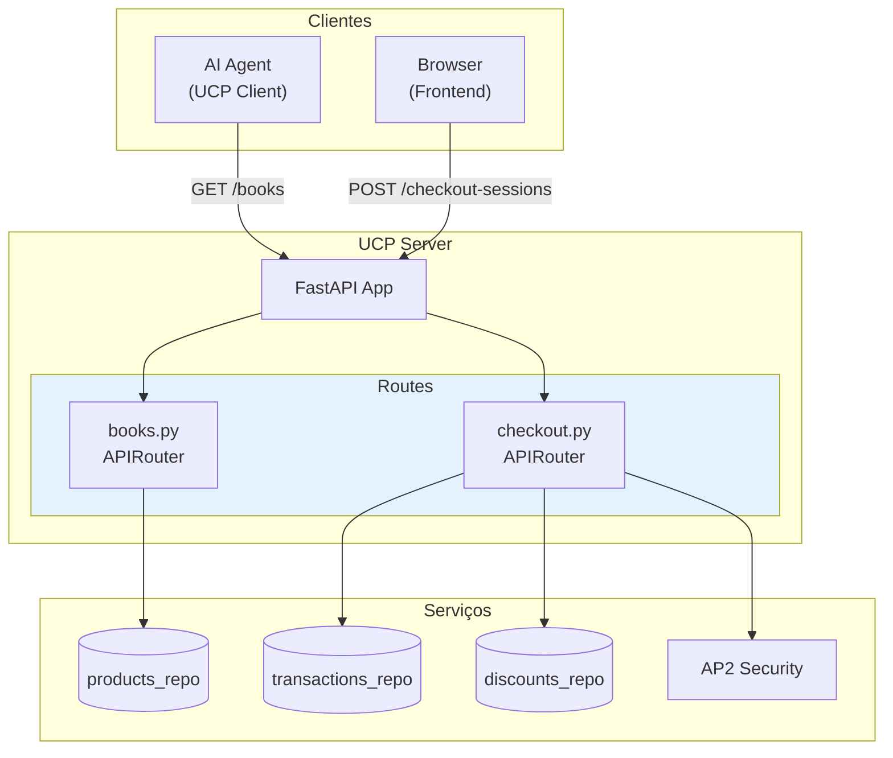
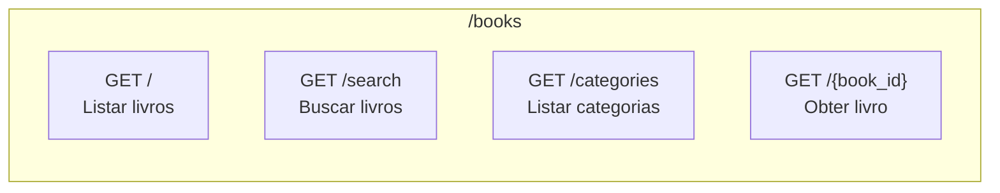
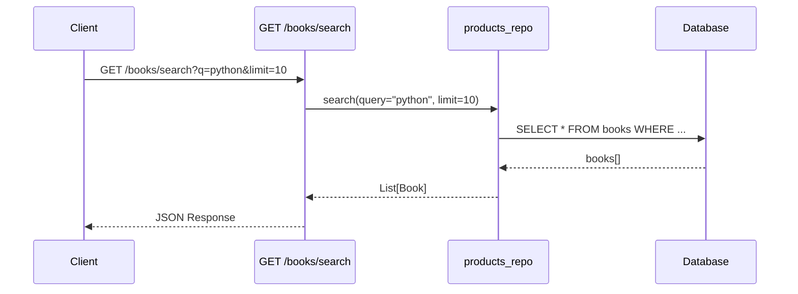
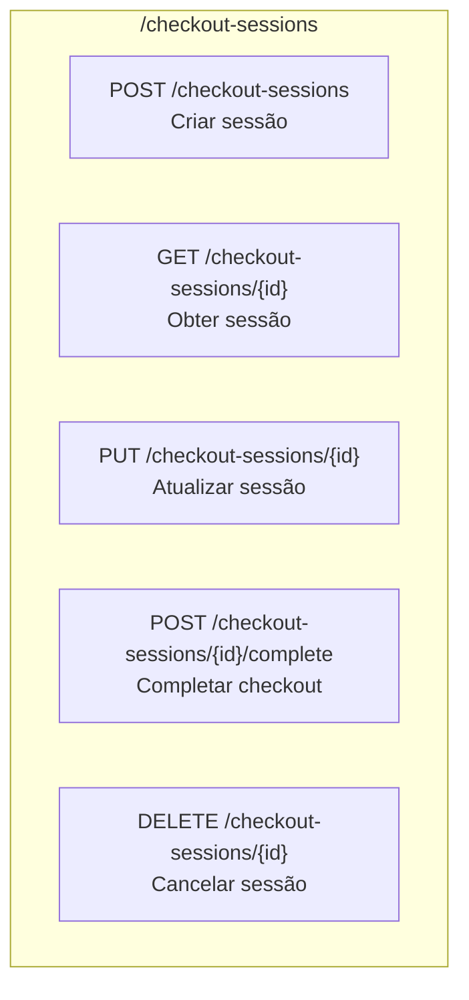
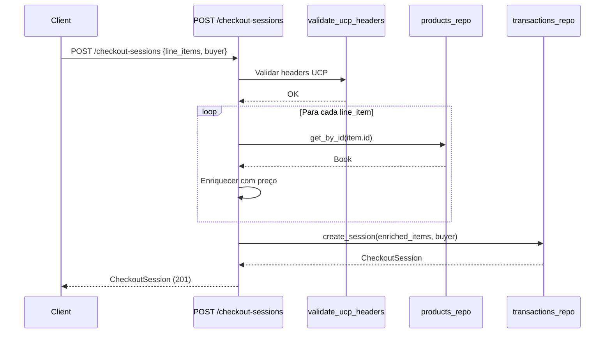
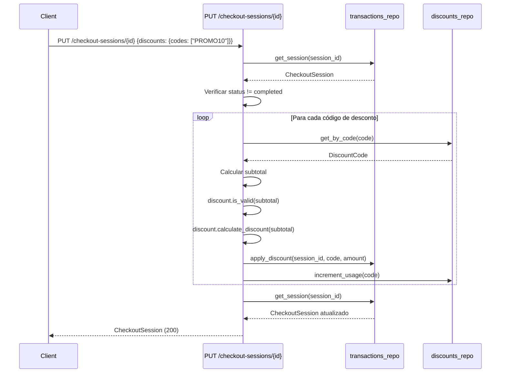
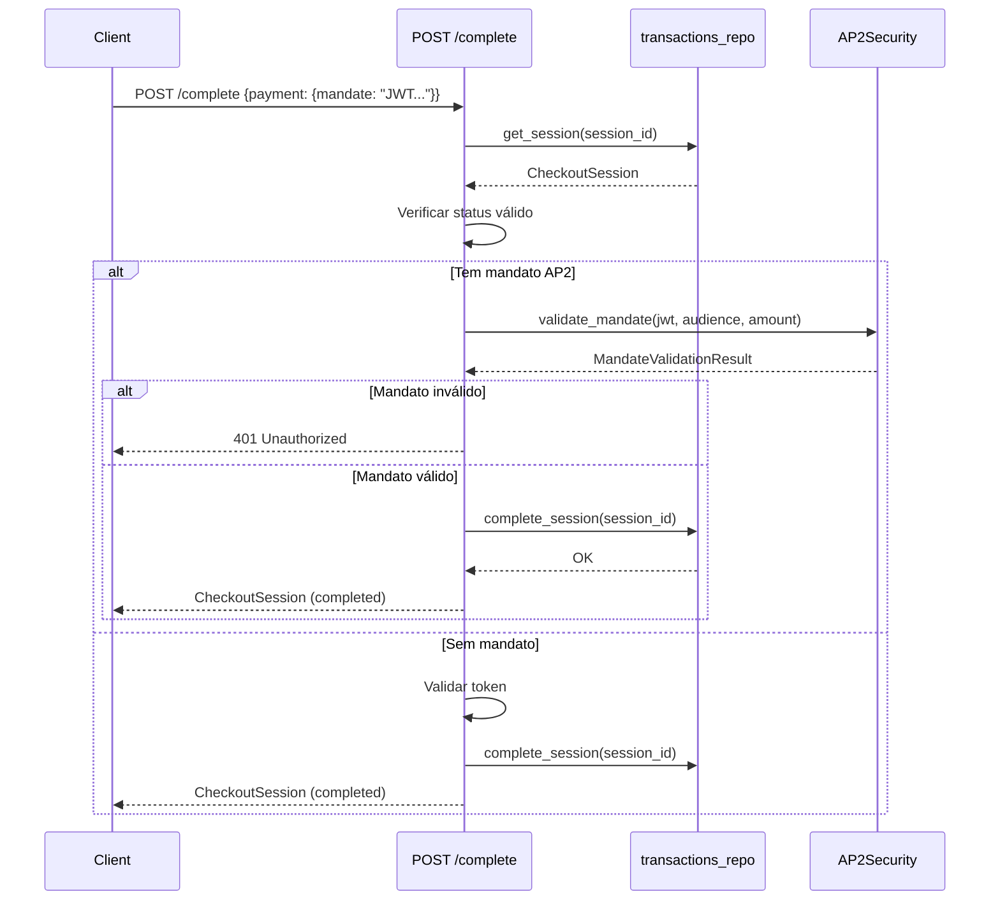
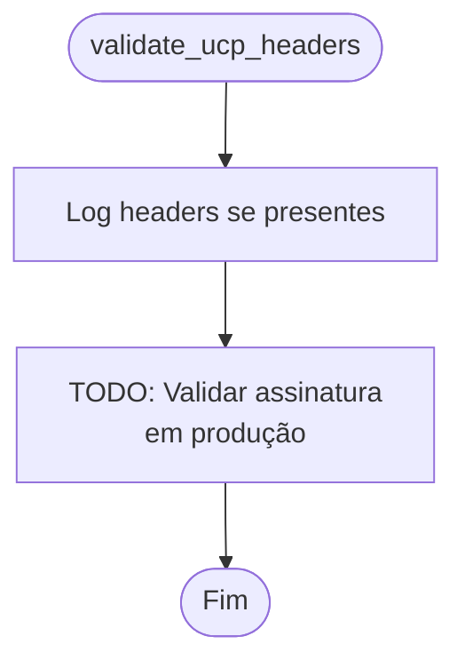
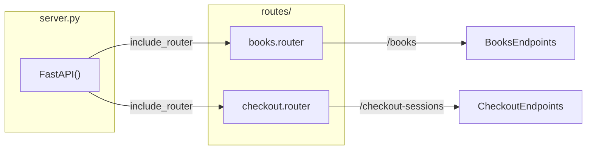
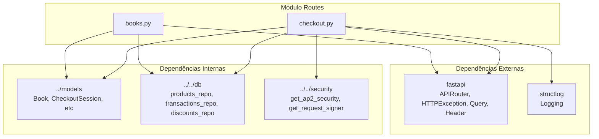

# Módulo Routes - Rotas FastAPI do UCP Server

Este módulo implementa as **rotas HTTP** do UCP Server da Livraria Virtual UCP usando FastAPI. As rotas expõem as capabilities UCP (checkout, discount) e operações de catálogo.

## Visão Geral

O módulo routes fornece **2 routers** principais:

| Router | Arquivo | Endpoints | Capability |
|--------|---------|-----------|------------|
| **Books** | `books.py` | 4 endpoints | Catálogo |
| **Checkout** | `checkout.py` | 5 endpoints | dev.ucp.shopping.checkout |

---

## Arquitetura do Módulo

```
backend/src/ucp_server/routes/
├── __init__.py      # Exports (vazio)
├── books.py         # Rotas de livros
├── checkout.py      # Rotas de checkout
└── routes.md        # Esta documentação
```

### Diagrama de Arquitetura



---

## Books Routes (`books.py`)

Rotas para operações de catálogo de livros.

### Endpoints



| Método | Endpoint | Query Params | Response | Descrição |
|--------|----------|--------------|----------|-----------|
| GET | `/books` | `limit?`, `offset?` | `List[Book]` | Listar todos os livros |
| GET | `/books/search` | `q*`, `category?`, `limit?` | `List[Book]` | Buscar por termo |
| GET | `/books/categories` | - | `{categories: []}` | Listar categorias |
| GET | `/books/{book_id}` | - | `Book` | Obter livro por ID |

### Fluxo de Busca



### Validações

| Parâmetro | Validação |
|-----------|-----------|
| `limit` | `le=100` (máximo 100) |
| `offset` | `ge=0` (mínimo 0) |
| `q` | `min_length=1` (obrigatório, mínimo 1 caractere) |
| `book_id` | Verificação de existência (404 se não encontrado) |

---

## Checkout Routes (`checkout.py`)

Rotas para operações de checkout seguindo a especificação UCP.

### Endpoints



| Método | Endpoint | Request Body | Response | Capability |
|--------|----------|--------------|----------|------------|
| POST | `/checkout-sessions` | `CheckoutCreate` | `CheckoutSession` | checkout |
| GET | `/checkout-sessions/{session_id}` | - | `CheckoutSession` | checkout |
| PUT | `/checkout-sessions/{session_id}` | `CheckoutUpdate` | `CheckoutSession` | discount |
| POST | `/checkout-sessions/{session_id}/complete` | `CheckoutComplete` | `CheckoutSession` | checkout |
| DELETE | `/checkout-sessions/{session_id}` | - | `{status, session_id}` | checkout |

### Headers UCP

Todos os endpoints de checkout aceitam headers UCP opcionais:

| Header | Alias | Descrição |
|--------|-------|-----------|
| `UCP-Agent` | `ucp_agent` | Identificador do agente |
| `request-signature` | `request_signature` | Assinatura da requisição |
| `idempotency-key` | `idempotency_key` | Chave de idempotência |
| `request-id` | `request_id` | ID único da requisição |

### Fluxo de Criação de Sessão



### Fluxo de Atualização com Desconto



### Fluxo de Completar Checkout (AP2)



### Validações de Checkout

| Validação | Endpoint | Código HTTP | Mensagem |
|-----------|----------|-------------|----------|
| Livro não encontrado | POST create | 400 | "Book not found: {id}" |
| Sessão não encontrada | GET, PUT, POST, DELETE | 404 | "Session not found" |
| Sessão já completada | PUT, POST complete | 400 | "Session already completed" |
| Sessão cancelada | POST complete | 400 | "Session was cancelled" |
| Pagamento inválido | POST complete | 400 | "Payment token or mandate required" |
| Mandato AP2 inválido | POST complete | 401 | "Invalid AP2 mandate: {error}" |
| Pagamento falhou | POST complete | 402 | "Payment failed" |
| Não pode cancelar completado | DELETE | 400 | "Cannot cancel completed session" |

---

## Função `validate_ucp_headers`

Valida headers UCP obrigatórios (atualmente apenas log, validação de assinatura em TODO).



**Implementação Futura:**

```python
def validate_ucp_headers(...):
    if ucp_agent:
        signer = get_request_signer()
        valid, error = signer.verify_request(
            headers=headers,
            payload=payload,
            method=request.method,
            path=request.url.path
        )
        if not valid:
            raise HTTPException(401, detail=f"Invalid signature: {error}")
```

---

## Integração com UCP Server

### Montagem dos Routers



### Código de Montagem

```python
from fastapi import FastAPI
from backend.src.ucp_server.routes import books, checkout

app = FastAPI()

app.include_router(books.router, prefix="/books", tags=["Books"])
app.include_router(
    checkout.router, 
    prefix="/checkout-sessions", 
    tags=["Checkout"]
)
```

---

## Dependências



---

## Exemplos de Uso

### Listar Livros

```bash
curl http://localhost:8182/books?limit=10&offset=0
```

**Response:**

```json
[
    {
        "id": "book_001",
        "title": "O Codigo do Futuro",
        "author": "Ana Silva",
        "price": 4990,
        "category": "Tecnologia",
        "stock": 50
    }
]
```

### Buscar Livros

```bash
curl "http://localhost:8182/books/search?q=python&limit=5"
```

### Criar Sessão de Checkout

```bash
curl -X POST http://localhost:8182/checkout-sessions \
  -H "Content-Type: application/json" \
  -H "UCP-Agent: my-agent/1.0" \
  -d '{
    "line_items": [
      {
        "item": {"id": "book_003", "title": "Python", "price": 3990},
        "quantity": 2
      }
    ],
    "buyer": {
      "full_name": "João Silva",
      "email": "joao@example.com"
    },
    "currency": "BRL"
  }'
```

### Aplicar Desconto

```bash
curl -X PUT http://localhost:8182/checkout-sessions/sess_123 \
  -H "Content-Type: application/json" \
  -d '{
    "discounts": {
      "codes": ["PROMO10"]
    }
  }'
```

### Completar Checkout com AP2

```bash
curl -X POST http://localhost:8182/checkout-sessions/sess_123/complete \
  -H "Content-Type: application/json" \
  -d '{
    "payment": {
      "mandate": "eyJhbGciOiJFZERTQSIsInR5cCI6IkpXVCJ9...",
      "handler_id": "ap2"
    }
  }'
```

---

## Tratamento de Erros

### Códigos HTTP Utilizados

| Código | Significado | Uso |
|--------|-------------|-----|
| 200 | OK | GET, PUT bem-sucedidos |
| 201 | Created | POST create bem-sucedido |
| 400 | Bad Request | Validação falhou, estado inválido |
| 401 | Unauthorized | Mandato AP2 inválido |
| 402 | Payment Required | Pagamento falhou |
| 404 | Not Found | Recurso não encontrado |

### Estrutura de Erro

```json
{
    "detail": "Mensagem de erro descritiva"
}
```

---

## Logging

Todas as rotas de checkout usam `structlog` para logging estruturado:

```python
logger.info("Checkout session created", session_id=session.id)
logger.warning("Invalid discount code", code=code)
logger.info("AP2 mandate validated", max_amount=result.mandate.max_amount)
```

### Eventos Logados

| Evento | Nível | Campos |
|--------|-------|--------|
| Criação de sessão | INFO | session_id |
| Código de desconto inválido | WARNING | code |
| Desconto aplicado | INFO | code, amount |
| Mandato AP2 validado | INFO | max_amount, currency, session_total |
| Checkout completado | INFO | session_id |
| Checkout cancelado | INFO | session_id |

---

## Referências

- **FastAPI:** https://fastapi.tiangolo.com/
- **UCP Spec:** Universal Commerce Protocol
- **AP2 Security:** [`../../security/security.md`](../../security/security.md)
- **Models:** [`../models/models.md`](../models/models.md)
