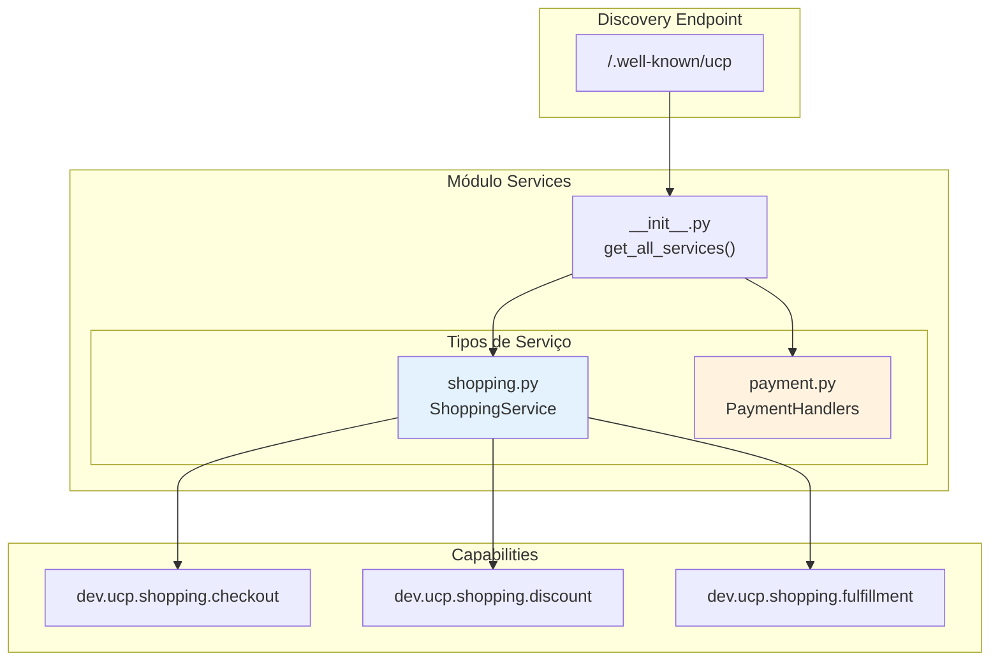
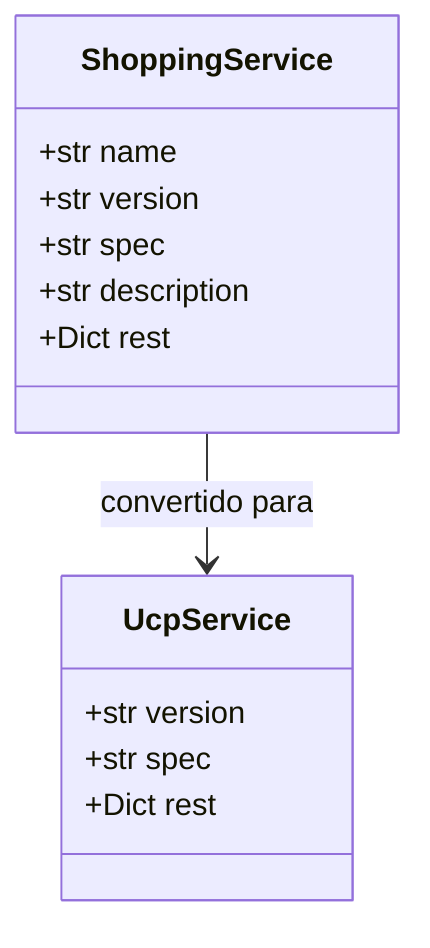
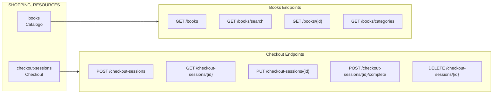
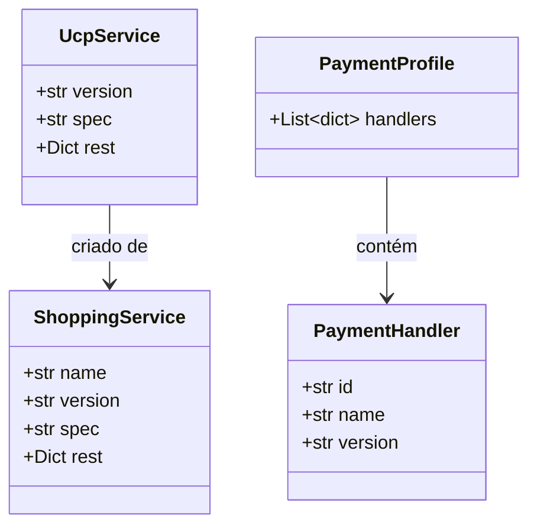
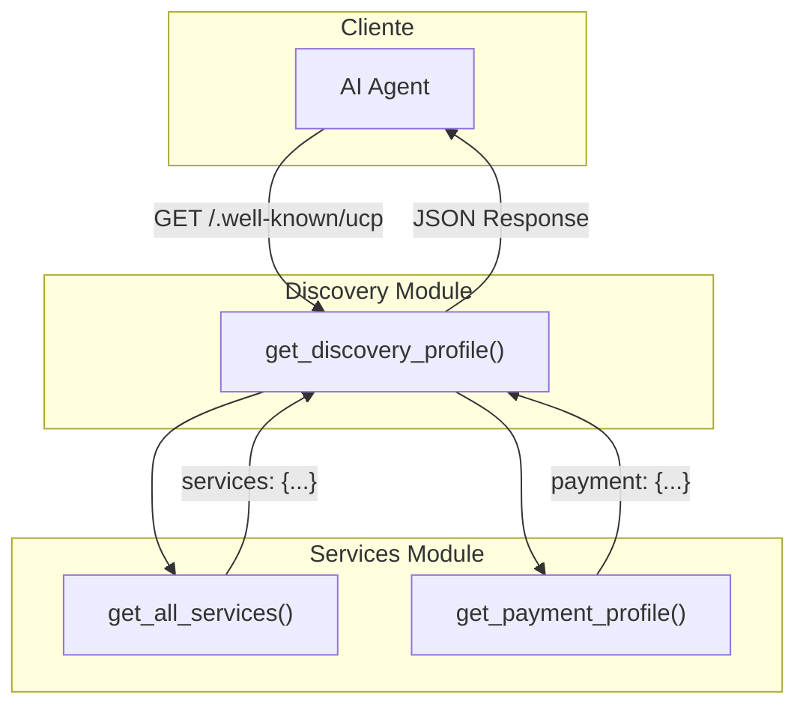
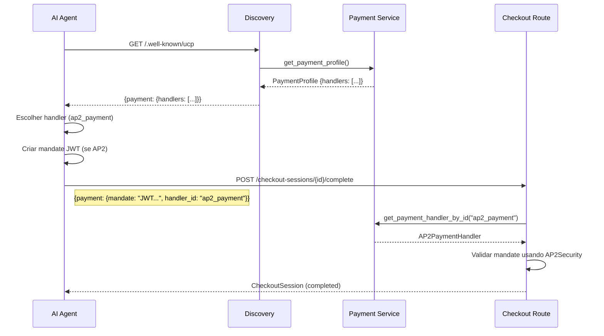
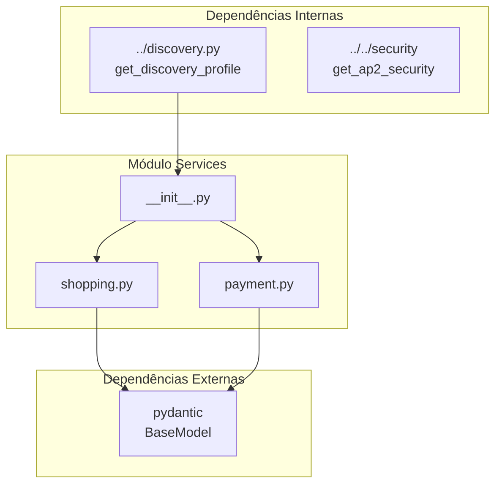

# Módulo Services - Serviços UCP

Este módulo implementa os **serviços** do Universal Commerce Protocol (UCP) da Livraria Virtual UCP. Os serviços agrupam capabilities relacionadas e definem a interface REST da loja.

## Visão Geral

O módulo services fornece **2 serviços principais**:

| Serviço | Arquivo | Descrição |
|---------|---------|-----------|
| **Shopping** | `shopping.py` | Serviço principal de compras (checkout, descontos, fulfillment) |
| **Payment** | `payment.py` | Handlers de pagamento (Mock, AP2) |

---

## Arquitetura do Módulo

```
backend/src/ucp_server/services/
├── __init__.py      # Exports e funções principais
├── shopping.py      # Serviço de shopping
├── payment.py       # Handlers de pagamento
└── services.md      # Esta documentação
```

### Diagrama de Arquitetura



---

## Componentes Detalhados

### 1. Shopping Service (`shopping.py`)

Serviço principal que agrupa as capabilities de checkout, desconto e fulfillment.

#### Diagrama de Classes



#### Especificação do Serviço

```python
class ShoppingService(BaseModel):
    name: str = "dev.ucp.shopping"
    version: str = "2026-01-11"
    spec: str = "https://ucp.dev/specs/shopping"
    description: str = "Servico de compras com checkout, descontos e fulfillment"
    rest: Dict[str, str] = {
        "schema": "https://ucp.dev/services/shopping/openapi.json",
        "endpoint": "http://localhost:8182/"
    }
```

#### Recursos do Serviço



#### Recursos Disponíveis

| Recurso | Descrição | Endpoints |
|---------|-----------|-----------|
| `books` | Catálogo de livros | list, search, get, categories |
| `checkout-sessions` | Sessões de checkout | create, get, update, complete, cancel |

#### Exemplo de Uso

```python
from backend.src.ucp_server.services import get_shopping_service

service = get_shopping_service(base_url="http://localhost:8182")
print(f"Service: {service.name} v{service.version}")
print(f"REST Endpoint: {service.rest['endpoint']}")
```

---

### 2. Payment Service (`payment.py`)

Handlers de pagamento suportados pela loja.

#### Diagrama de Classes

```mermaid
classDiagram
    class PaymentHandler {
        <<abstract>>
        +str id
        +str name
        +str version
        +str spec
        +str config_schema
        +List~str~ instrument_schemas
        +Dict config
    }
    
    class MockPaymentHandler {
        +str id = "mock_payment"
        +str name = "dev.ucp.mock_payment"
        +Dict config = {test_mode: true}
    }
    
    class AP2PaymentHandler {
        +str id = "ap2_payment"
        +str name = "dev.ucp.ap2_payment"
        +Dict config = {algorithm: Ed25519}
    }
    
    PaymentHandler <|-- MockPaymentHandler
    PaymentHandler <|-- AP2PaymentHandler
```

#### Mock Payment Handler

Handler de pagamento mock para desenvolvimento e testes.

**Configuração:**

```json
{
    "id": "mock_payment",
    "name": "dev.ucp.mock_payment",
    "version": "2026-01-11",
    "spec": "https://ucp.dev/specs/mock",
    "config_schema": "https://ucp.dev/schemas/mock.json",
    "instrument_schemas": [
        "https://ucp.dev/schemas/shopping/types/card_payment_instrument.json"
    ],
    "config": {
        "supported_tokens": ["success_token", "fail_token"],
        "test_mode": true
    }
}
```

**Uso:**

```python
# Token "success_token" → pagamento bem-sucedido
# Token "fail_token" → pagamento falha (402)
# Qualquer outro → pagamento bem-sucedido
```

#### AP2 Payment Handler

Handler de pagamento usando Agent Payments Protocol v2.

**Configuração:**

```json
{
    "id": "ap2_payment",
    "name": "dev.ucp.ap2_payment",
    "version": "2026-01-11",
    "spec": "https://ucp.dev/specs/ap2",
    "config_schema": "https://ucp.dev/schemas/ap2.json",
    "instrument_schemas": [
        "https://ucp.dev/schemas/ap2/mandate.json"
    ],
    "config": {
        "algorithm": "Ed25519",
        "audience": "livraria-ucp",
        "max_amount": 100000
    }
}
```

**Características:**

- ✅ Validação de mandatos JWT Ed25519
- ✅ Verificação de limite de valor (max_amount)
- ✅ Validação de audience
- ✅ Suporte a pagamentos autônomos de agentes

#### Comparação de Handlers

| Handler | ID | Uso | Validação |
|---------|----|-----|-----------|
| **Mock** | `mock_payment` | Desenvolvimento/Testes | Tokens simples |
| **AP2** | `ap2_payment` | Produção (Agentes) | Mandatos JWT Ed25519 |

---

## Módulo Principal (`__init__.py`)

O arquivo `__init__.py` fornece funções para descobrir serviços e handlers.

### Diagrama de Classes



### Funções Principais

| Função | Retorno | Descrição |
|--------|---------|-----------|
| `get_all_services(base_url)` | `Dict[str, UcpService]` | Retorna todos os serviços |
| `get_payment_profile()` | `PaymentProfile` | Retorna perfil de pagamentos |

### Fluxo de Discovery

```mermaid
flowchart TD
    Start([GET /.well-known/ucp]) --> GetAllServices[get_all_services]
    
    GetAllServices --> GetShopping[get_shopping_service]
    GetShopping --> CreateService[UcpService(shopping)]
    
    GetAllServices --> GetPayment[get_payment_profile]
    GetPayment --> GetAllHandlers[get_all_payment_handlers]
    GetAllHandlers --> CreateProfile[PaymentProfile(handlers)]
    
    CreateService --> Combine[Combinar em resposta]
    CreateProfile --> Combine
    
    Combine --> Return([Retorna discovery profile])
```

---

## Integração com Discovery

Os serviços são expostos via endpoint de discovery UCP.



### Exemplo de Resposta Discovery

```json
{
    "ucp": {
        "version": "2026-01-11",
        "capabilities": [...],
        "services": {
            "dev.ucp.shopping": {
                "version": "2026-01-11",
                "spec": "https://ucp.dev/specs/shopping",
                "rest": {
                    "schema": "https://ucp.dev/services/shopping/openapi.json",
                    "endpoint": "http://localhost:8182/"
                }
            }
        },
        "payment": {
            "handlers": [
                {
                    "id": "mock_payment",
                    "name": "dev.ucp.mock_payment",
                    "version": "2026-01-11",
                    "spec": "https://ucp.dev/specs/mock",
                    "config": {
                        "test_mode": true
                    }
                },
                {
                    "id": "ap2_payment",
                    "name": "dev.ucp.ap2_payment",
                    "version": "2026-01-11",
                    "spec": "https://ucp.dev/specs/ap2",
                    "config": {
                        "algorithm": "Ed25519",
                        "max_amount": 100000
                    }
                }
            ]
        }
    }
}
```

---

## Exports do Módulo

```python
from backend.src.ucp_server.services import (
    # Funções principais
    get_all_services,
    get_payment_profile,
    UcpService,
    PaymentProfile,
    
    # Shopping
    ShoppingService,
    get_shopping_service,
    SHOPPING_RESOURCES,
    
    # Payment
    PaymentHandler,
    MockPaymentHandler,
    AP2PaymentHandler,
    get_mock_payment_handler,
    get_ap2_payment_handler,
    get_all_payment_handlers,
    get_payment_handler_by_id,
    PAYMENT_HANDLERS,
)
```

---

## Uso dos Serviços

### Obter Serviço de Shopping

```python
from backend.src.ucp_server.services import get_shopping_service

service = get_shopping_service(base_url="https://loja.example.com")
print(f"Service: {service.name}")
print(f"Version: {service.version}")
print(f"REST Endpoint: {service.rest['endpoint']}")
```

### Listar Recursos do Shopping

```python
from backend.src.ucp_server.services import get_resources

resources = get_resources()
for resource in resources:
    print(f"{resource['name']}: {resource['description']}")
    for action, endpoint in resource['endpoints'].items():
        print(f"  {action}: {endpoint}")
```

### Obter Handlers de Pagamento

```python
from backend.src.ucp_server.services import (
    get_all_payment_handlers,
    get_payment_handler_by_id
)

# Listar todos
handlers = get_all_payment_handlers()
for handler in handlers:
    print(f"{handler.id}: {handler.name}")

# Buscar específico
ap2_handler = get_payment_handler_by_id("ap2_payment")
if ap2_handler:
    print(f"AP2 Max Amount: R$ {ap2_handler.config['max_amount'] / 100:.2f}")
```

### Obter Perfil de Pagamentos

```python
from backend.src.ucp_server.services import get_payment_profile

profile = get_payment_profile()
print(f"Handlers disponíveis: {len(profile.handlers)}")
for handler in profile.handlers:
    print(f"  - {handler['name']} ({handler['id']})")
```

---

## Fluxo de Uso de Payment Handler



---

## Dependências



---

## Recursos do Shopping Service

### Books Resource

| Ação | Método | Endpoint | Descrição |
|------|--------|----------|-----------|
| `list` | GET | `/books` | Listar todos os livros |
| `search` | GET | `/books/search?q={query}` | Buscar por termo |
| `get` | GET | `/books/{book_id}` | Obter livro por ID |
| `categories` | GET | `/books/categories` | Listar categorias |

### Checkout Sessions Resource

| Ação | Método | Endpoint | Descrição |
|------|--------|----------|-----------|
| `create` | POST | `/checkout-sessions` | Criar nova sessão |
| `get` | GET | `/checkout-sessions/{session_id}` | Obter sessão |
| `update` | PUT | `/checkout-sessions/{session_id}` | Atualizar sessão |
| `complete` | POST | `/checkout-sessions/{session_id}/complete` | Completar checkout |
| `cancel` | DELETE | `/checkout-sessions/{session_id}` | Cancelar sessão |

---

## Referências

- **UCP Protocol:** Universal Commerce Protocol
- **Discovery Endpoint:** `/.well-known/ucp`
- **Shopping Spec:** https://ucp.dev/specs/shopping
- **AP2 Spec:** https://ap2.dev/specs
- **Payment Handlers:** [`../routes/routes.md`](../routes/routes.md)
