# Módulo UCP Server - Universal Commerce Protocol Server

Este módulo implementa o **servidor UCP (Universal Commerce Protocol)** da Livraria Virtual UCP. O servidor expõe capabilities, serviços e endpoints REST que permitem que agentes de IA descubram e interajam com a loja de forma autônoma.

## Visão Geral

O UCP Server é o componente central que:
- **Expõe capabilities** via discovery endpoint `/.well-known/ucp`
- **Fornece endpoints REST** para checkout, catálogo e pagamentos
- **Valida pagamentos AP2** para transações autônomas
- **Integra com MCP** para ferramentas de agentes

---

## Arquitetura do Módulo

```
backend/src/ucp_server/
├── __init__.py          # Exports do módulo
├── server.py            # FastAPI app principal
├── discovery.py         # Discovery endpoint /.well-known/ucp
├── ucp.md               # Esta documentação
├── capabilities/        # Capabilities UCP
│   ├── checkout.py
│   ├── discount.py
│   ├── fulfillment.py
│   └── capabilities.md # → Documentação detalhada
├── models/              # Modelos Pydantic
│   ├── book.py
│   ├── checkout.py
│   ├── payment.py
│   └── models.md        # → Documentação detalhada
├── routes/              # Rotas FastAPI
│   ├── books.py
│   ├── checkout.py
│   └── routes.md        # → Documentação detalhada
└── services/            # Serviços UCP
    ├── shopping.py
    ├── payment.py
    └── services.md      # → Documentação detalhada
```

### Diagrama de Arquitetura Completo

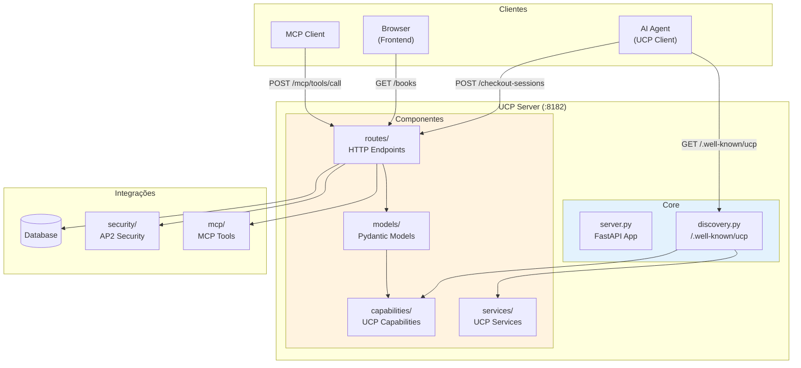

---

## Componentes Principais

### 1. Server (`server.py`)

Aplicação FastAPI principal que orquestra todos os componentes.

#### Estrutura do App

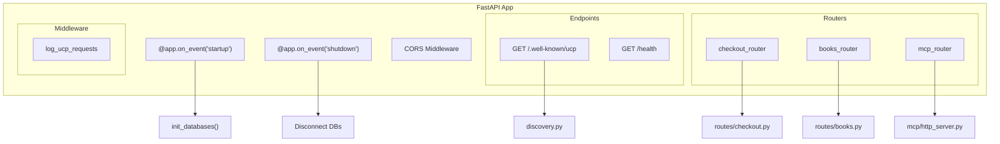

#### Endpoints Principais

| Endpoint | Método | Descrição |
|----------|--------|-----------|
| `/.well-known/ucp` | GET | Discovery endpoint UCP |
| `/health` | GET | Health check |
| `/books/*` | GET | Rotas de catálogo |
| `/checkout-sessions/*` | POST, GET, PUT, DELETE | Rotas de checkout |
| `/mcp/*` | GET, POST | Rotas MCP |

#### Eventos de Ciclo de Vida

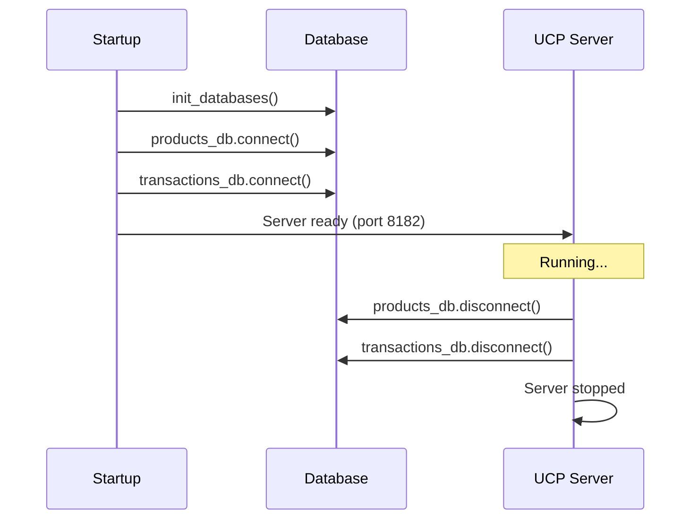

---

### 2. Discovery (`discovery.py`)

Endpoint de discovery que permite agentes descobrirem capabilities e serviços.

#### Diagrama de Classes

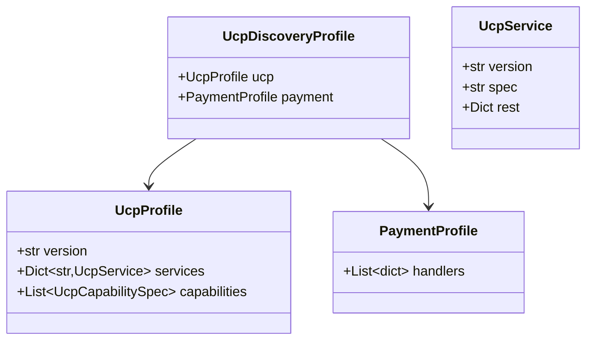

#### Fluxo de Discovery

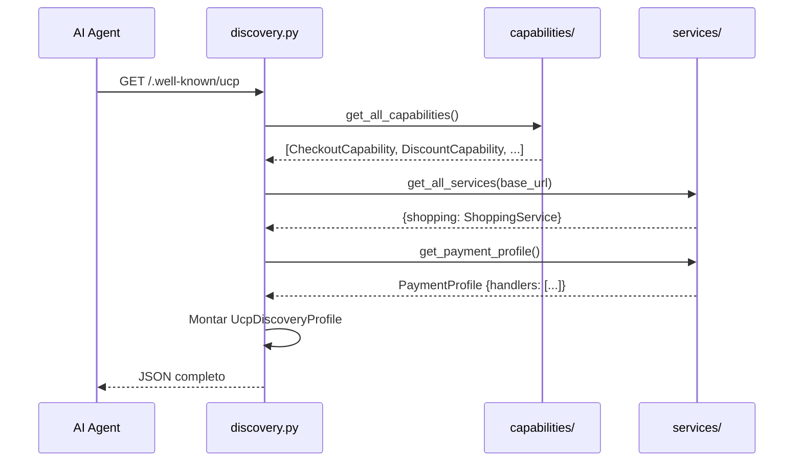

#### Exemplo de Resposta

```json
{
    "ucp": {
        "version": "2026-01-11",
        "services": {
            "dev.ucp.shopping": {
                "version": "2026-01-11",
                "spec": "https://ucp.dev/specs/shopping",
                "rest": {
                    "schema": "https://ucp.dev/services/shopping/openapi.json",
                    "endpoint": "http://localhost:8182/"
                }
            }
        },
        "capabilities": [
            {
                "name": "dev.ucp.shopping.checkout",
                "version": "2026-01-11",
                "spec": "https://ucp.dev/specs/shopping/checkout"
            },
            {
                "name": "dev.ucp.shopping.discount",
                "version": "2026-01-11",
                "extends": "dev.ucp.shopping.checkout"
            },
            {
                "name": "dev.ucp.shopping.fulfillment",
                "version": "2026-01-11",
                "extends": "dev.ucp.shopping.checkout"
            }
        ]
    },
    "payment": {
        "handlers": [
            {
                "id": "mock_payment",
                "name": "dev.ucp.mock_payment",
                "version": "2026-01-11"
            },
            {
                "id": "ap2_payment",
                "name": "dev.ucp.ap2_payment",
                "version": "2026-01-11"
            }
        ]
    }
}
```

---

## Submódulos Documentados

### Capabilities

📄 **Documentação completa:** [`capabilities/capabilities.md`](capabilities/capabilities.md)

Define as capabilities UCP suportadas pela loja:

- **Checkout** (`dev.ucp.shopping.checkout`) - Capability base
- **Discount** (`dev.ucp.shopping.discount`) - Estende checkout
- **Fulfillment** (`dev.ucp.shopping.fulfillment`) - Estende checkout

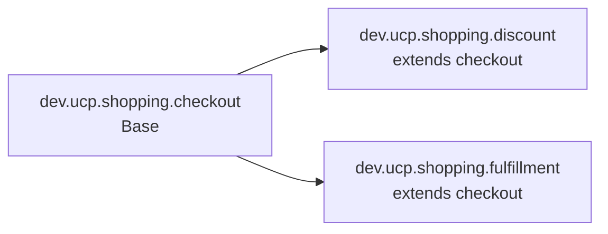

---

### Models

📄 **Documentação completa:** [`models/models.md`](models/models.md)

Modelos Pydantic para validação e serialização:

- **Book** - Modelos de livros (Book, BookCreate, BookSearch)
- **Checkout** - Modelos de checkout (CheckoutSession, LineItem, Buyer, Total, Discounts)
- **Payment** - Modelos de pagamento (PaymentHandler, Payment, PaymentRequest)

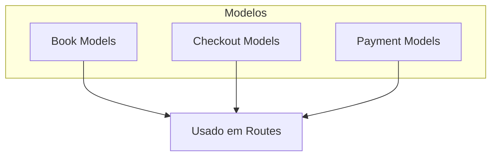

---

### Routes

📄 **Documentação completa:** [`routes/routes.md`](routes/routes.md)

Rotas HTTP FastAPI:

- **Books Router** - 4 endpoints (list, search, categories, get)
- **Checkout Router** - 5 endpoints (create, get, update, complete, cancel)

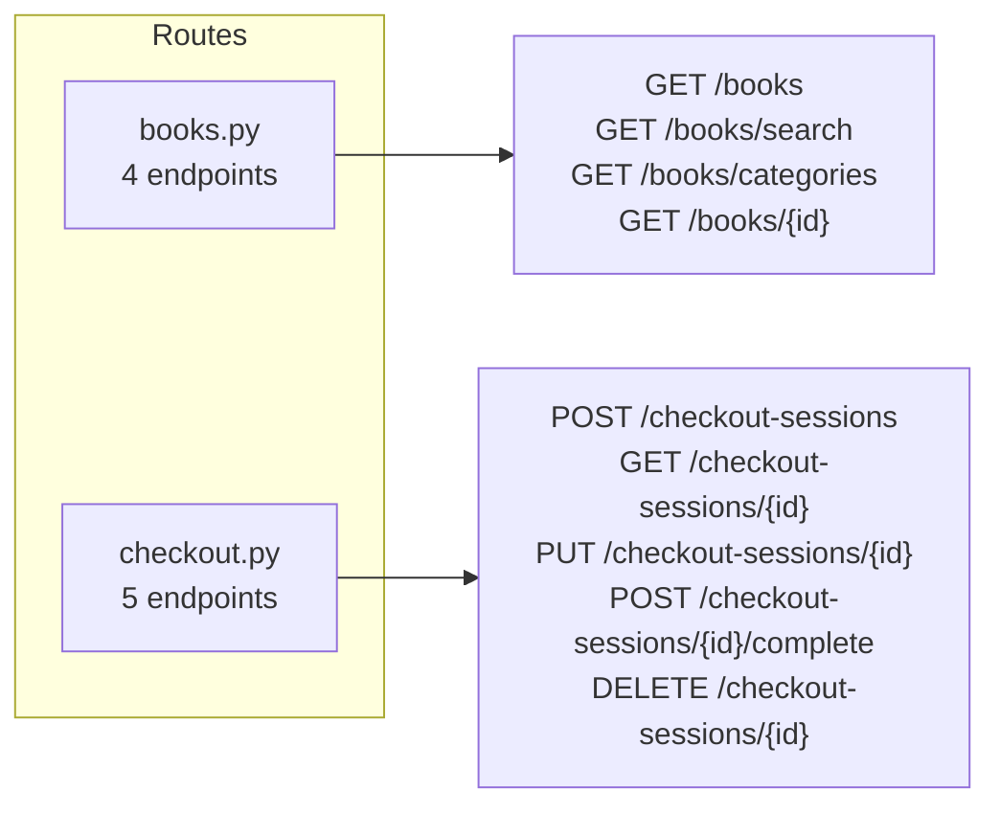

---

### Services

📄 **Documentação completa:** [`services/services.md`](services/services.md)

Serviços UCP e payment handlers:

- **Shopping Service** - Serviço principal (`dev.ucp.shopping`)
- **Payment Handlers** - Mock e AP2 handlers

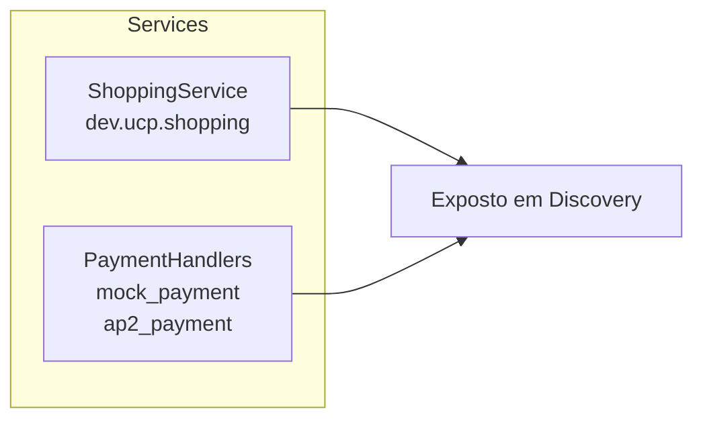

---

## Fluxo Completo de Compra

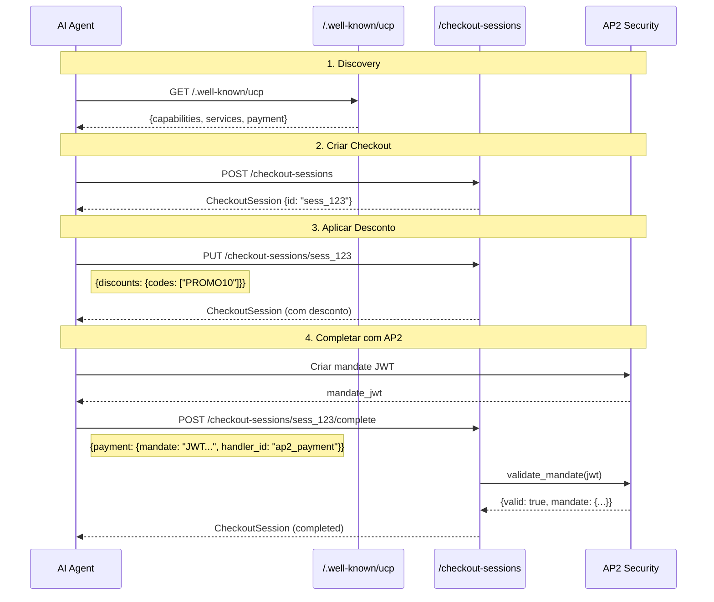

---

## Integração com Outros Módulos

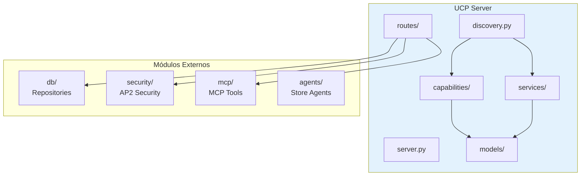

### Dependências

| Módulo | Uso no UCP Server |
|--------|-------------------|
| `db/` | Repositories para produtos, transações e descontos |
| `security/` | Validação de mandatos AP2 em checkout |
| `mcp/` | Ferramentas MCP expostas via HTTP |
| `agents/` | Store Agents (indireto via A2A) |

---

## Endpoints Principais

### Discovery

| Endpoint | Método | Descrição |
|----------|--------|-----------|
| `/.well-known/ucp` | GET | Perfil completo de discovery |

### Books

| Endpoint | Método | Descrição |
|----------|--------|-----------|
| `/books` | GET | Listar livros |
| `/books/search` | GET | Buscar livros |
| `/books/categories` | GET | Listar categorias |
| `/books/{book_id}` | GET | Obter livro |

### Checkout

| Endpoint | Método | Descrição |
|----------|--------|-----------|
| `/checkout-sessions` | POST | Criar sessão |
| `/checkout-sessions/{id}` | GET | Obter sessão |
| `/checkout-sessions/{id}` | PUT | Atualizar sessão |
| `/checkout-sessions/{id}/complete` | POST | Completar checkout |
| `/checkout-sessions/{id}` | DELETE | Cancelar sessão |

### MCP

| Endpoint | Método | Descrição |
|----------|--------|-----------|
| `/mcp/tools` | GET | Listar ferramentas MCP |
| `/mcp/tools/{name}/call` | POST | Chamar ferramenta |

---

## Configuração

### Variáveis de Ambiente

O servidor usa configurações de `config.py`:

| Configuração | Descrição | Padrão |
|--------------|-----------|--------|
| `ucp_port` | Porta do servidor UCP | 8182 |
| `products_db_path` | Path do banco de produtos | `backend/data/products.db` |
| `transactions_db_path` | Path do banco de transações | `backend/data/transactions.db` |
| `ap2_key_id` | ID da chave AP2 | `livraria-key` |

### CORS

O servidor permite CORS de todas as origens (`allow_origins=["*"]`) para desenvolvimento. Em produção, configurar origens específicas.

---

## Logging

O servidor usa `structlog` para logging estruturado:

```python
logger.info("UCP Request", method="POST", path="/checkout-sessions", agent="my-agent/1.0")
logger.info("Checkout session created", session_id="sess_123")
logger.warning("Invalid discount code", code="INVALID")
```

### Eventos Logados

| Evento | Nível | Campos |
|--------|-------|--------|
| Discovery request | INFO | base_url |
| UCP Request | INFO | method, path, agent |
| Checkout criado | INFO | session_id |
| Desconto aplicado | INFO | code, amount |
| Mandato AP2 validado | INFO | max_amount, currency, session_total |
| Checkout completado | INFO | session_id |

---

## Inicialização

### Startup

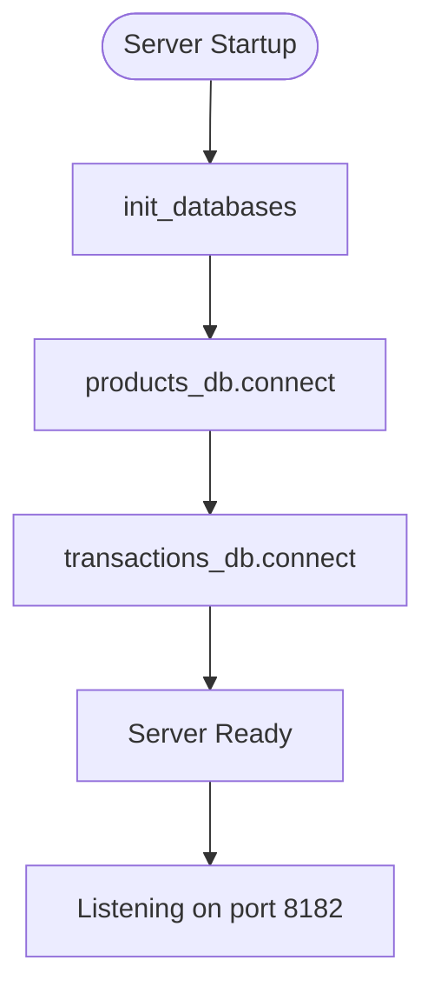

### Shutdown

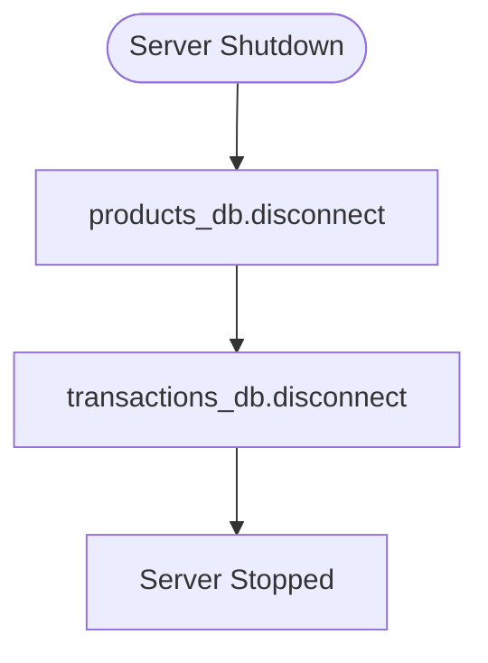

---

## Exports do Módulo

```python
from backend.src.ucp_server import (
    # App principal
    app,  # FastAPI app
    
    # Discovery
    get_discovery_profile,
    UcpProfile,
    UcpDiscoveryProfile,
    
    # Routers (se necessário)
    # checkout_router, books_router (via server.py)
)
```

---

## Referências para Documentação Detalhada

### Submódulos

- **Capabilities:** [`capabilities/capabilities.md`](capabilities/capabilities.md)
  - Checkout, Discount e Fulfillment capabilities
  - Operações suportadas por cada capability

- **Models:** [`models/models.md`](models/models.md)
  - Modelos Pydantic (Book, CheckoutSession, Payment)
  - Validação e serialização

- **Routes:** [`routes/routes.md`](routes/routes.md)
  - Endpoints HTTP detalhados
  - Fluxos de checkout e validações

- **Services:** [`services/services.md`](services/services.md)
  - Shopping Service e Payment Handlers
  - Configuração de handlers

### Módulos Relacionados

- **Database:** [`../db/db.md`](../db/db.md)
- **Security:** [`../security/security.md`](../security/security.md)
- **MCP:** [`../mcp/mcp.md`](../mcp/mcp.md)
- **Agents:** [`../agents/agents.md`](../agents/agents.md)

---

## Exemplo de Uso Completo

### 1. Descobrir Loja

```bash
curl http://localhost:8182/.well-known/ucp
```

### 2. Buscar Livros

```bash
curl "http://localhost:8182/books/search?q=python&limit=5"
```

### 3. Criar Checkout

```bash
curl -X POST http://localhost:8182/checkout-sessions \
  -H "Content-Type: application/json" \
  -H "UCP-Agent: my-agent/1.0" \
  -d '{
    "line_items": [
      {"item": {"id": "book_003", "title": "Python", "price": 3990}, "quantity": 2}
    ],
    "buyer": {"full_name": "João", "email": "joao@example.com"},
    "currency": "BRL"
  }'
```

### 4. Aplicar Desconto

```bash
curl -X PUT http://localhost:8182/checkout-sessions/sess_123 \
  -H "Content-Type: application/json" \
  -d '{"discounts": {"codes": ["PROMO10"]}}'
```

### 5. Completar com AP2

```bash
curl -X POST http://localhost:8182/checkout-sessions/sess_123/complete \
  -H "Content-Type: application/json" \
  -d '{
    "payment": {
      "mandate": "eyJhbGciOiJFZERTQSIsInR5cCI6IkpXVCJ9...",
      "handler_id": "ap2_payment"
    }
  }'
```

---

## Arquitetura de Camadas

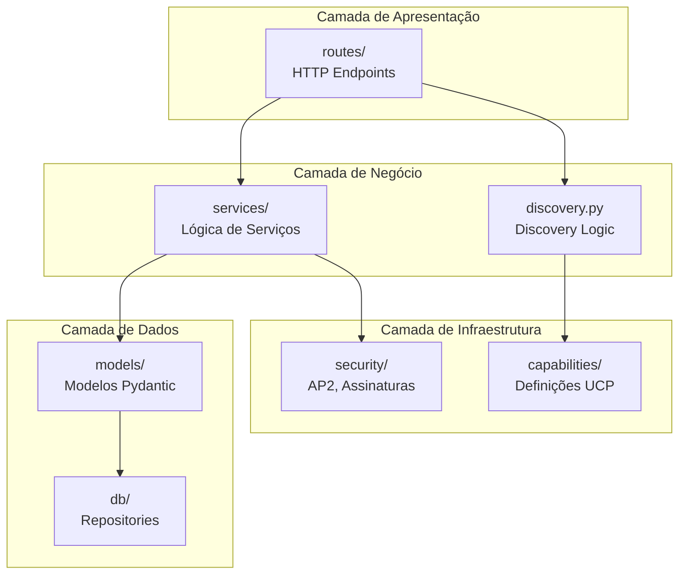

---

## Protocolos Suportados

| Protocolo | Endpoint | Descrição |
|-----------|----------|-----------|
| **UCP** | `/.well-known/ucp` | Discovery e capabilities |
| **REST** | `/books/*`, `/checkout-sessions/*` | API REST padrão |
| **MCP** | `/mcp/*` | Model Context Protocol |
| **AP2** | Via checkout complete | Agent Payments Protocol |

---

## Referências

- **UCP Protocol:** Universal Commerce Protocol
- **FastAPI:** https://fastapi.tiangolo.com/
- **Pydantic:** https://docs.pydantic.dev/
- **Documentação dos Submódulos:**
  - [`capabilities/capabilities.md`](capabilities/capabilities.md)
  - [`models/models.md`](models/models.md)
  - [`routes/routes.md`](routes/routes.md)
  - [`services/services.md`](services/services.md)
