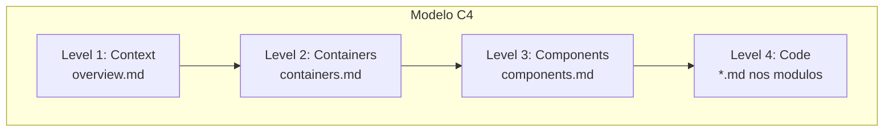
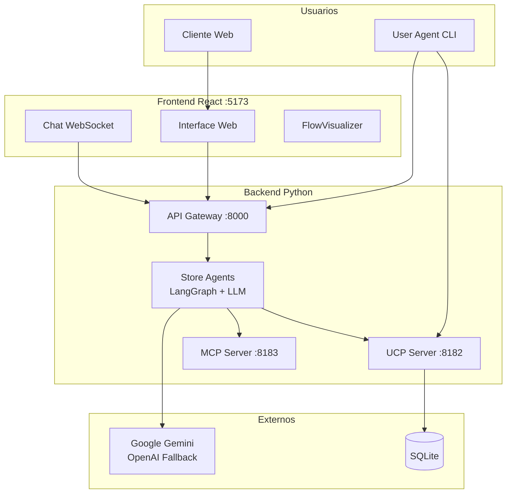

# Arquitetura - Livraria Virtual UCP

Este diretorio contem a documentacao de arquitetura do projeto, organizada seguindo o modelo C4 e complementada com diagramas de fluxo e modelo de dados.

---

## Indice de Documentos

| Documento | Descricao | Nivel C4 |
|-----------|-----------|----------|
| [overview.md](./overview.md) | Diagrama de Contexto - Visao geral do sistema e atores externos | Level 1 |
| [containers.md](./containers.md) | Diagrama de Containers - Aplicacoes e servicos que compoem o sistema | Level 2 |
| [components.md](./components.md) | Diagrama de Componentes - Estrutura interna de cada container | Level 3 |
| [flows.md](./flows.md) | Diagramas de Sequencia - Fluxos principais do sistema | - |
| [data-model.md](./data-model.md) | Modelo de Dados - Estrutura do banco de dados | - |

---

## Modelo C4

O modelo C4 organiza a arquitetura em 4 niveis de abstracao:

```
Level 1: Context   -> Quem usa o sistema? Com quais sistemas externos se comunica?
Level 2: Container -> Quais aplicacoes/servicos compoem o sistema?
Level 3: Component -> Como cada container e estruturado internamente?
Level 4: Code      -> Detalhes de implementacao (ver documentacoes especificas)
```

### Diagrama de Niveis



---

## Visao Geral da Arquitetura



---

## Protocolos Implementados

### UCP (Universal Commerce Protocol)
Protocolo aberto do Google para comercio agentivo. Define como agentes descobrem e interagem com backends de comercio.

- **Discovery**: `GET /.well-known/ucp`
- **Checkout**: Sessions, pagamentos, descontos
- **SDK**: `ucp-python` (oficial)

### A2A (Agent-to-Agent)
Protocolo de comunicacao entre agentes autonomos via WebSocket, permitindo orquestracao de tarefas complexas.

- **Discovery**: `GET /.well-known/agent.json`
- **WebSocket**: `/ws/a2a`
- **SDK**: `a2a-sdk` (oficial)

### AP2 (Agent Payments Protocol v2)
Extensao para pagamentos seguros, usando mandatos criptograficos (Ed25519 + JWT).

- **3-Mandate Flow**: Intent → Cart → Payment
- **Criptografia**: Ed25519 (EdDSA)
- **SDK**: `ap2-repo` (Google)

### MCP (Model Context Protocol)
Protocolo da Anthropic que permite LLMs acessarem ferramentas externas de forma padronizada.

- **7 Tools**: search, cart, checkout, discount, etc.
- **Progressive Disclosure**: Ferramentas sob demanda
- **SDK**: `mcp` + `fastmcp`

### Diagrama de Protocolos

```mermaid
flowchart LR
    subgraph Protocols [Protocolos]
        UCP[UCP<br/>Comercio]
        A2A[A2A<br/>Agentes]
        AP2[AP2<br/>Pagamentos]
        MCP[MCP<br/>Ferramentas]
    end
    
    subgraph Endpoints [Endpoints]
        E1[/.well-known/ucp]
        E2[/.well-known/agent.json]
        E3[/ws/a2a]
        E4[/checkout-sessions]
    end
    
    UCP --> E1
    UCP --> E4
    A2A --> E2
    A2A --> E3
    AP2 --> E4
    MCP --> E1
```

---

## Tecnologias Principais

| Camada | Tecnologia | Versao |
|--------|------------|--------|
| **Frontend** | React + TypeScript + Vite | 18.2 / 5.3 / 5.0 |
| **Estilizacao** | Tailwind CSS | 3.4 |
| **Estado** | Zustand | 4.5 |
| **Backend** | FastAPI + Uvicorn | 0.109 / 0.27 |
| **Agentes** | LangGraph + LangChain | 0.2 / 0.3 |
| **LLM** | Google Gemini (principal) | 2.0 flash |
| **LLM Fallback** | OpenAI / Anthropic | GPT-4 / Claude |
| **Database** | SQLite + aiosqlite | 3.x / 0.20 |
| **Seguranca** | cryptography + PyJWT | 42.0 / 2.8 |

---

## Documentacoes Detalhadas

Para detalhes de implementacao (Level 4), consulte as documentacoes especificas:

### Backend
- [`backend/src/src.md`](../../backend/src/src.md) - Visao geral do backend
- [`backend/src/agents/agents.md`](../../backend/src/agents/agents.md) - Sistema de agentes LangGraph
- [`backend/src/ucp_server/ucp.md`](../../backend/src/ucp_server/ucp.md) - Servidor UCP
- [`backend/src/mcp/mcp.md`](../../backend/src/mcp/mcp.md) - Servidor MCP
- [`backend/src/security/security.md`](../../backend/src/security/security.md) - Seguranca AP2

### User Agent
- [`user_agent/userAgent.md`](../../user_agent/userAgent.md) - Agente autonomo do usuario
- [`user_agent/src/agent/agent.md`](../../user_agent/src/agent/agent.md) - Core do agente
- [`user_agent/src/clients/client.md`](../../user_agent/src/clients/client.md) - Clientes de protocolo

### Frontend
- [`frontend/front.md`](../../frontend/front.md) - Interface React completa

---

## Como Navegar

1. **Contexto**: Comece pelo [overview.md](./overview.md) para entender o contexto geral
2. **Containers**: Aprofunde em [containers.md](./containers.md) para ver os servicos
3. **Componentes**: Explore [components.md](./components.md) para detalhes internos
4. **Fluxos**: Consulte [flows.md](./flows.md) para entender os fluxos de uso
5. **Dados**: Veja [data-model.md](./data-model.md) para a estrutura de dados
6. **Implementacao**: Para detalhes de codigo, consulte as documentacoes de modulos acima

---

*Ultima atualizacao: 2026-02-04*
