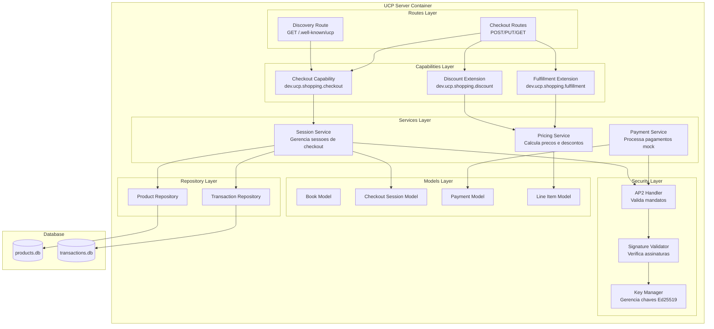
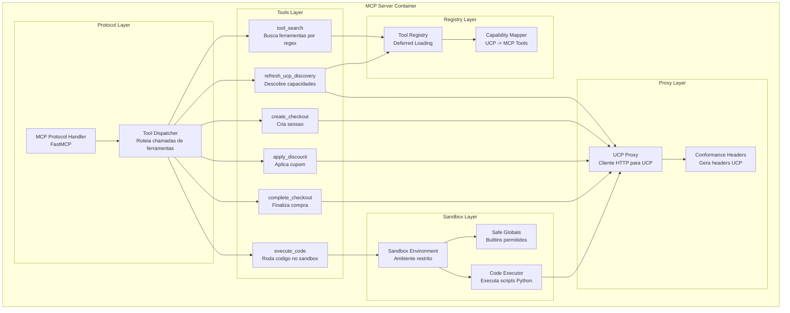
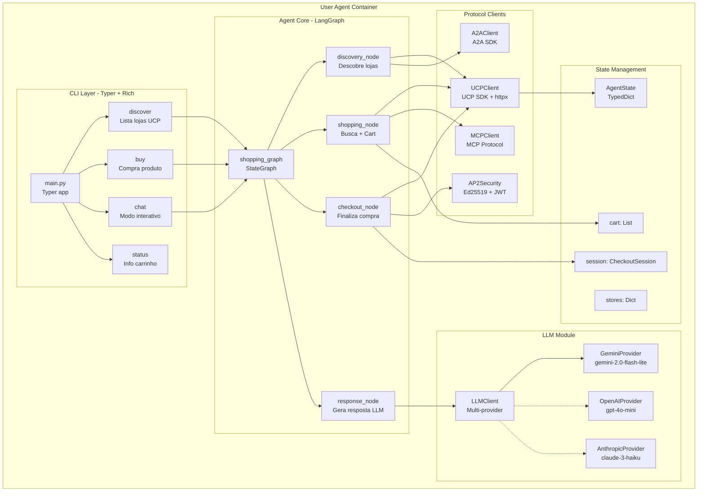
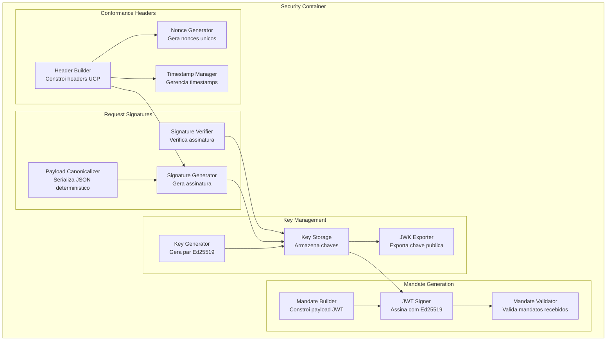
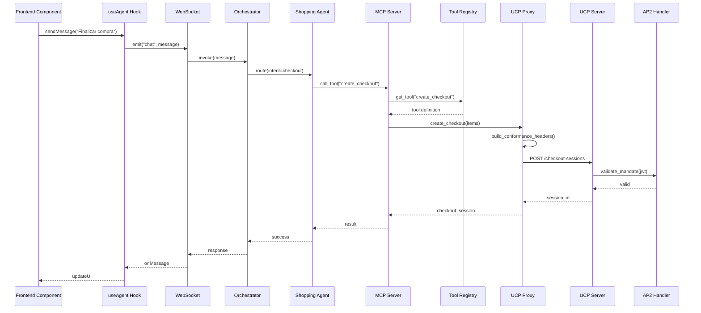

# C4 Level 3: Diagrama de Componentes

## Visao Geral

O diagrama de componentes detalha a estrutura interna de cada container do sistema.

---

## 1. Componentes do UCP Server



### Detalhamento dos Componentes UCP

| Componente | Arquivo | Responsabilidade |
|------------|---------|------------------|
| Discovery Route | `discovery.py` | Retorna perfil UCP da livraria |
| Checkout Routes | `routes/checkout.py` | CRUD de sessoes de checkout |
| Checkout Capability | `capabilities/checkout.py` | Logica core de checkout |
| Discount Extension | `capabilities/discount.py` | Aplicacao de cupons |
| Fulfillment Extension | `capabilities/fulfillment.py` | Opcoes de entrega |
| Session Service | `services/session.py` | Gerencia ciclo de vida da sessao |
| Pricing Service | `services/pricing.py` | Calculos de preco e desconto |
| Payment Service | `services/payment.py` | Mock de pagamentos |
| AP2 Handler | `security/ap2_handler.py` | Validacao de mandatos JWT |
| Signature Validator | `security/signatures.py` | Verificacao de assinaturas |
| Key Manager | `security/key_manager.py` | Geracao e armazenamento de chaves |

---

## 2. Componentes do MCP Server



### Detalhamento dos Componentes MCP

| Componente | Arquivo | Responsabilidade |
|------------|---------|------------------|
| MCP Protocol Handler | `mcp/server.py` | Implementa protocolo MCP |
| Tool Dispatcher | `mcp/dispatcher.py` | Roteia chamadas para ferramentas |
| Tool Registry | `mcp/tool_registry.py` | Registry com deferred loading |
| Capability Mapper | `mcp/capability_mapper.py` | Mapeia UCP caps para MCP tools |
| UCP Proxy | `mcp/ucp_proxy.py` | Cliente HTTP para servidor UCP |
| Conformance Headers | `mcp/conformance.py` | Gera headers de conformidade |
| Sandbox Environment | `mcp/sandbox.py` | Ambiente seguro de execucao |
| Safe Globals | `mcp/safe_globals.py` | Define builtins permitidos |
| Code Executor | `mcp/executor.py` | Executa codigo Python |

---

## 3. Componentes dos Store Agents (Backend)

```mermaid
flowchart TB
    subgraph agents [Store Agents Container]
        subgraph orchestration [Orchestration Layer - LangGraph]
            Orchestrator[shopping_graph<br/>StateGraph principal]
            StateManager[State Manager<br/>Gerencia AgentState]
            Router[Intent Router<br/>Classifica intencao]
        end

        subgraph agent_nodes [Agent Nodes]
            DiscoveryAgent[discovery_agent<br/>Lista produtos UCP]
            ShoppingAgent[shopping_agent<br/>Busca + Carrinho]
            CheckoutAgent[checkout_agent<br/>Finaliza compra]
            RecommendAgent[recommend_agent<br/>Sugestoes LLM]
        end

        subgraph state [State Layer]
            AgentState[AgentState<br/>TypedDict]
            MessageHistory[messages: List[Message]]
            CartState[cart: List[CartItem]]
            StoresState[stores: Dict[str, StoreInfo]]
        end

        subgraph llm [LLM Integration - Google Gemini]
            LLMClient[LLMClient<br/>google.genai]
            GeminiModel[gemini-2.0-flash-lite<br/>Modelo principal]
            OpenAIFallback[gpt-4o-mini<br/>Fallback]
            IntentDetector[Intent Detector<br/>Classifica input]
            ResponseGen[Response Generator<br/>Gera respostas]
        end

        subgraph a2a [A2A Protocol - Google ADK]
            A2AAdapter[A2AAdapter<br/>google.adk]
            AgentCard[AgentCard<br/>agent.json]
            TaskHandler[TaskHandler<br/>Processa tasks A2A]
        end
    end

    Orchestrator --> StateManager
    Orchestrator --> Router
    Router --> LLMClient
    LLMClient --> IntentDetector
    Router --> DiscoveryAgent
    Router --> ShoppingAgent
    Router --> CheckoutAgent
    Router --> RecommendAgent

    DiscoveryAgent --> AgentState
    ShoppingAgent --> AgentState
    CheckoutAgent --> AgentState
    RecommendAgent --> AgentState

    AgentState --> MessageHistory
    AgentState --> CartState
    AgentState --> StoresState

    RecommendAgent --> LLMClient
    LLMClient --> GeminiModel
    LLMClient -.-> OpenAIFallback
    LLMClient --> ResponseGen

    A2AAdapter --> AgentCard
    A2AAdapter --> TaskHandler
    TaskHandler --> Orchestrator
```

### Detalhamento dos Componentes de Store Agents

| Componente | Arquivo | Responsabilidade |
|------------|---------|------------------|
| shopping_graph | `agents/orchestrator.py` | StateGraph principal LangGraph |
| State Manager | `agents/state_manager.py` | CRUD de AgentState |
| Intent Router | `agents/router.py` | Classifica intencao com LLM |
| discovery_agent | `agents/discovery_agent.py` | Node que lista produtos |
| shopping_agent | `agents/shopping_agent.py` | Node que gerencia carrinho |
| checkout_agent | `agents/checkout_agent.py` | Node que finaliza compra |
| recommend_agent | `agents/recommend_agent.py` | Node que recomenda livros via LLM |
| AgentState | `agents/state.py` | TypedDict do estado compartilhado |
| LLMClient | `agents/llm_client.py` | Cliente multi-provider (Gemini primary) |
| A2AAdapter | `agents/a2a/adapter.py` | Adaptador Google ADK |
| AgentCard | `agent.json` | Metadados do agente A2A |

---

## 4. Componentes do Frontend React

O Frontend e uma SPA moderna com React, TypeScript, Vite e Tailwind CSS.

```mermaid
flowchart TB
    subgraph frontend [Frontend Container - Vite + React]
        subgraph pages [Pages]
            HomePage[HomePage.tsx<br/>Catalogo + Hero]
            ChatPage[ChatPage.tsx<br/>Agente Interativo]
            CartPage[CartPage.tsx<br/>Visualizacao]
            CheckoutPage[CheckoutPage.tsx<br/>Finalizacao]
        end

        subgraph components [UI Components]
            Header[Header.tsx<br/>Navegacao]
            BookCard[BookCard.tsx<br/>Card produto]
            ChatBox[ChatBox.tsx<br/>Mensagens]
            FlowVisualizer[FlowVisualizer.tsx<br/>Grafo LangGraph]
            CartItem[CartItem.tsx<br/>Item carrinho]
        end

        subgraph stores [State Management - Zustand]
            useStore[useStore.ts<br/>Store principal]
            CartSlice[cart: CartItem[]]
            ChatSlice[messages: Message[]]
            AgentSlice[agentState: AgentNode]
        end

        subgraph services [Services Layer]
            APIService[api.ts<br/>fetch wrapper]
            WSService[websocket.ts<br/>WebSocket native]
        end

        subgraph types [TypeScript Types]
            BookType[Book interface]
            MessageType[Message interface]
            AgentStateType[AgentState interface]
        end
    end

    HomePage --> Header
    HomePage --> BookCard
    ChatPage --> Header
    ChatPage --> ChatBox
    ChatPage --> FlowVisualizer
    CartPage --> Header
    CartPage --> CartItem

    BookCard --> useStore
    ChatBox --> useStore
    FlowVisualizer --> useStore
    CartItem --> useStore

    useStore --> CartSlice
    useStore --> ChatSlice
    useStore --> AgentSlice

    ChatBox --> WSService
    BookCard --> APIService
    FlowVisualizer --> AgentSlice
```

### Detalhamento dos Componentes Frontend

| Componente | Arquivo | Responsabilidade |
|------------|---------|------------------|
| HomePage | `pages/HomePage.tsx` | Hero section + catalogo de livros |
| ChatPage | `pages/ChatPage.tsx` | Interface do agente com chat e visualizador |
| CartPage | `pages/CartPage.tsx` | Visualizacao do carrinho |
| CheckoutPage | `pages/CheckoutPage.tsx` | Formulario de finalizacao |
| Header | `components/Header.tsx` | Navegacao e carrinho badge |
| BookCard | `components/BookCard.tsx` | Card de produto com adicionar ao carrinho |
| ChatBox | `components/ChatBox.tsx` | Interface de mensagens com agente |
| FlowVisualizer | `components/FlowVisualizer.tsx` | Grafo interativo do estado LangGraph |
| CartItem | `components/CartItem.tsx` | Item individual no carrinho |
| useStore | `stores/useStore.ts` | Zustand store com slices |
| api.ts | `services/api.ts` | Cliente REST com fetch |
| websocket.ts | `services/websocket.ts` | Cliente WebSocket nativo |

### Tecnologias do Frontend

| Tecnologia | Versao | Funcao |
|------------|--------|--------|
| React | 18.x | Framework UI |
| TypeScript | 5.6 | Type safety |
| Vite | 5.4 | Build tool + dev server |
| Tailwind CSS | 3.4 | Styling utilitario |
| Zustand | 5.0 | State management |
| React Router | 6.x | SPA routing |

---

## 5. Componentes do User Agent (Cliente)

O User Agent e um agente autonomo que roda no ambiente do usuario.



### Detalhamento dos Componentes User Agent

| Componente | Arquivo | Responsabilidade |
|------------|---------|------------------|
| main.py | `user_agent/main.py` | CLI Typer principal |
| discover | `user_agent/commands/discover.py` | Comando que lista lojas UCP |
| buy | `user_agent/commands/buy.py` | Comando que executa compra |
| chat | `user_agent/commands/chat.py` | Modo chat interativo |
| shopping_graph | `user_agent/agent/graph.py` | StateGraph LangGraph |
| discovery_node | `user_agent/agent/nodes/discovery.py` | Node de discovery |
| shopping_node | `user_agent/agent/nodes/shopping.py` | Node de busca/carrinho |
| checkout_node | `user_agent/agent/nodes/checkout.py` | Node de checkout |
| response_node | `user_agent/agent/nodes/response.py` | Node de resposta LLM |
| LLMClient | `user_agent/llm/client.py` | Cliente multi-provider |
| UCPClient | `user_agent/clients/ucp.py` | Cliente UCP |
| A2AClient | `user_agent/clients/a2a.py` | Cliente A2A |
| MCPClient | `user_agent/clients/mcp.py` | Cliente MCP |
| AP2Security | `user_agent/security/ap2.py` | Seguranca AP2 |

---

## 6. Componentes de Seguranca AP2



### Detalhamento dos Componentes de Seguranca

| Componente | Arquivo | Responsabilidade |
|------------|---------|------------------|
| Key Generator | `security/key_manager.py` | Gera chaves Ed25519 |
| Key Storage | `security/key_manager.py` | Armazena chaves em memoria |
| JWK Exporter | `security/key_manager.py` | Exporta JWK publico |
| Mandate Builder | `security/ap2_security.py` | Constroi payload do mandato |
| JWT Signer | `security/ap2_security.py` | Assina JWT com EdDSA |
| Mandate Validator | `security/ap2_security.py` | Valida mandatos |
| Payload Canonicalizer | `security/signatures.py` | JSON canonico |
| Signature Generator | `security/signatures.py` | Gera assinaturas |
| Header Builder | `security/conformance.py` | Headers de conformidade |

---

## Interacao entre Componentes


