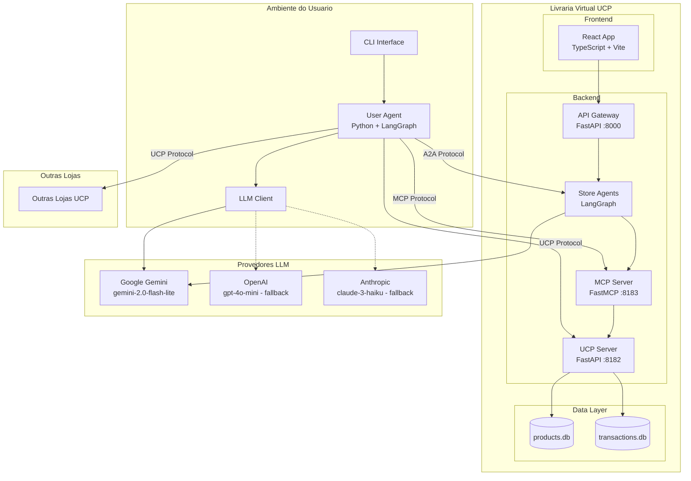
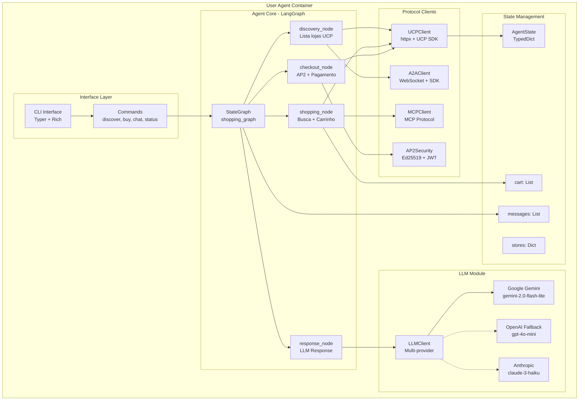
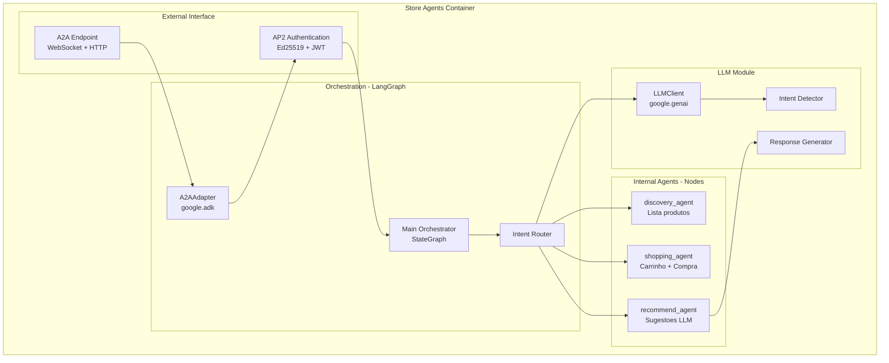
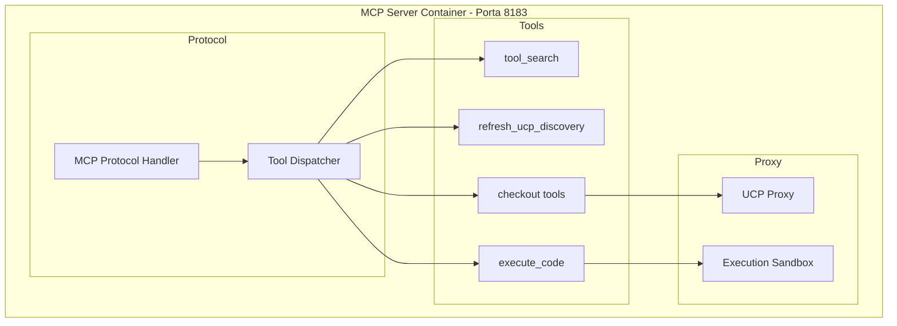
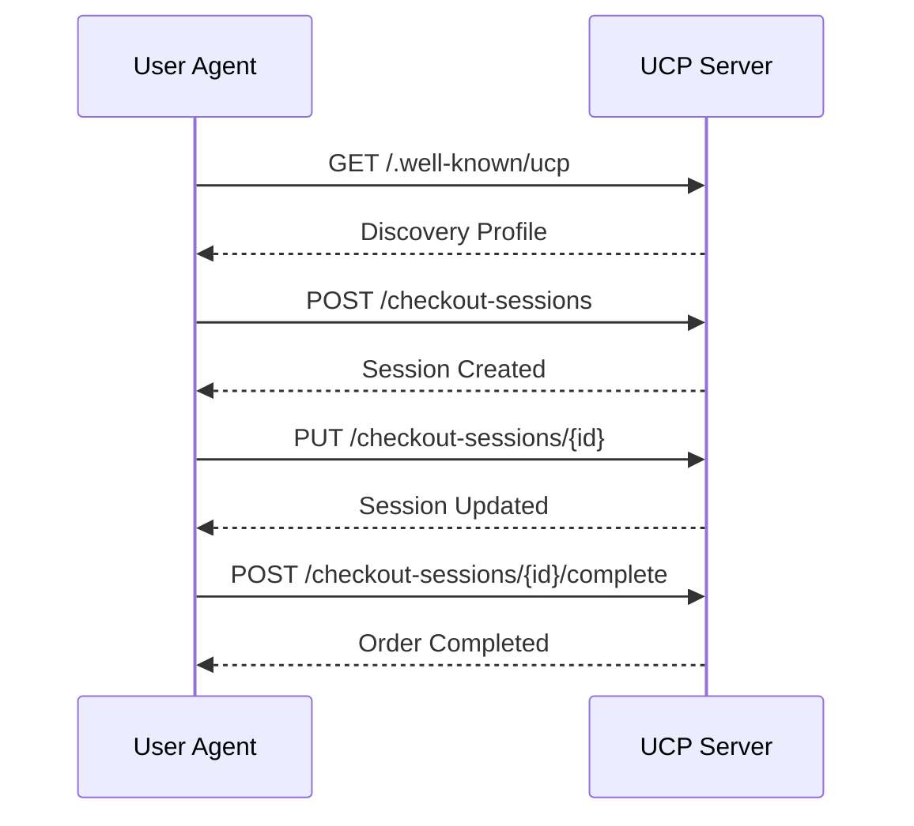
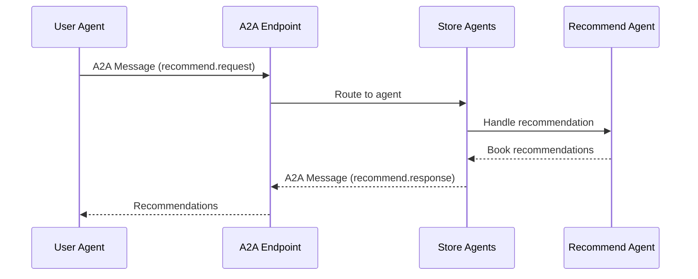
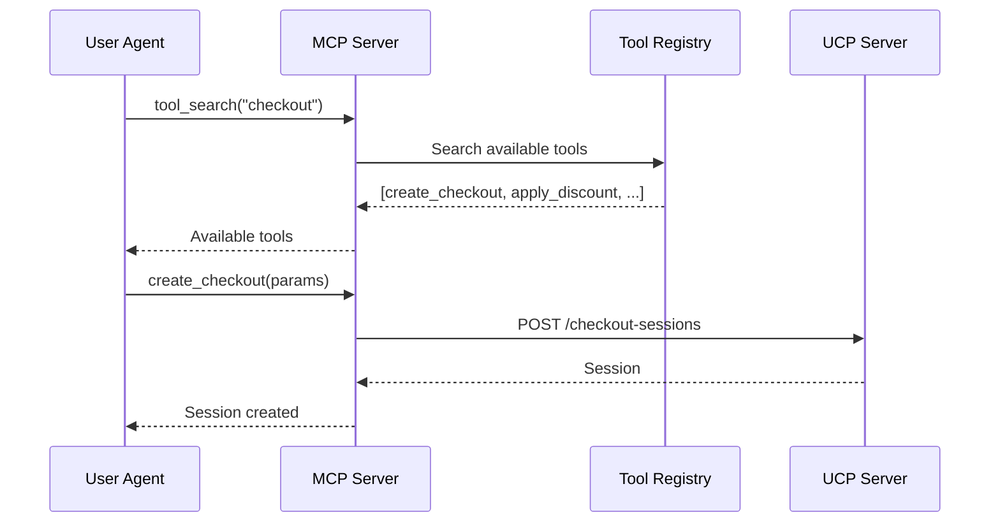
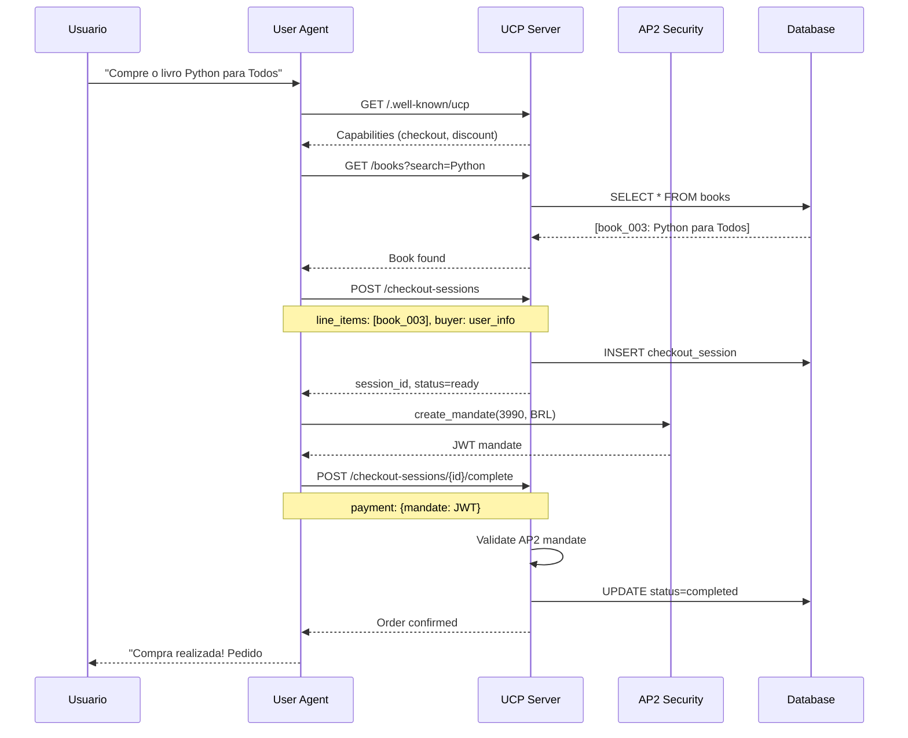
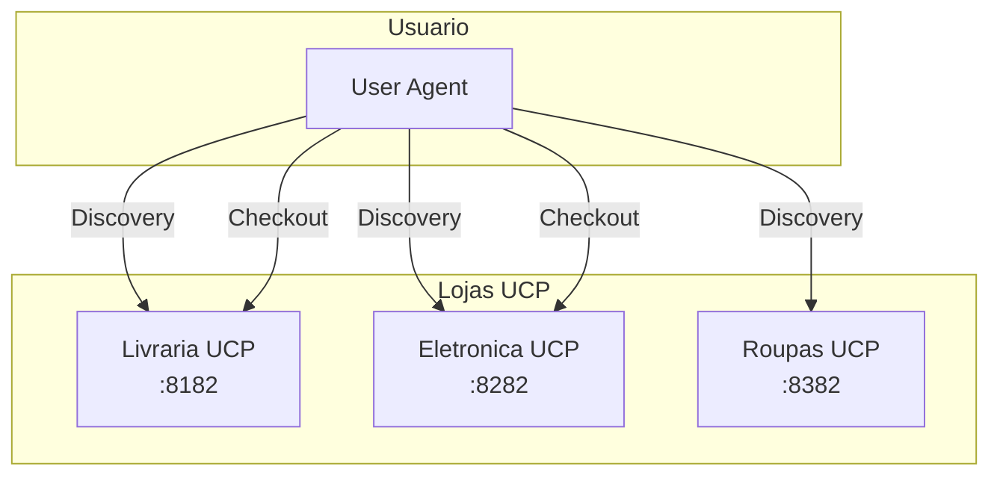

# C4 Level 2: Diagrama de Containers

## Visao Geral

O diagrama de containers mostra as aplicacoes e servicos que compoem o sistema, incluindo o **User Agent** como um container externo que interage com a loja.

## Diagrama de Containers Completo



## Containers Detalhados

### User Agent Container (Agente Autonomo)

O **User Agent** e um agente autonomo que o usuario executa em seu ambiente para interagir com lojas UCP. Possui CLI interativa com Typer/Rich e suporte a multiplos provedores LLM.



| Aspecto | Descricao |
|---------|-----------|
| **Tecnologia** | Python 3.11 + LangGraph 0.2 |
| **Interface** | CLI Typer + Rich (console formatado) |
| **LLM Principal** | Google Gemini (gemini-2.0-flash-lite) |
| **LLM Fallback** | OpenAI (gpt-4o-mini) ou Anthropic (claude-3-haiku) |
| **Responsabilidades** | Descobrir lojas, comparar precos, executar compras autonomas |
| **Comunicacao** | UCP, A2A, MCP, AP2 |
| **Documentacao** | [user_agent/userAgent.md](../../user_agent/userAgent.md) |

### Store Agents Container (Backend Agentico)

Os Store Agents sao agentes da loja que processam requisicoes de usuarios e de outros agentes (A2A). Incluem integracao com LLM para processamento de linguagem natural.



| Aspecto | Descricao |
|---------|-----------|
| **Tecnologia** | Python 3.11 + LangGraph 0.2 |
| **LLM** | Google Gemini (via google-genai) |
| **A2A** | Google ADK (google-adk) |
| **Responsabilidades** | Processar requests humanos e A2A, gerar recomendacoes |
| **Documentacao** | [backend/agents.md](../../docs/backend/agents.md) |

### Frontend Container (SPA React)

O Frontend e uma Single Page Application moderna construida com React, TypeScript e Vite.

```mermaid
flowchart TB
    subgraph frontend [Frontend Container - Porta 5173]
        subgraph build [Build Tools]
            Vite[Vite 5.4<br/>Dev Server + Build]
            TypeScript[TypeScript 5.6<br/>Type Checking]
            Tailwind[Tailwind CSS 3.4<br/>Styling]
        end

        subgraph app [React Application]
            App[App.tsx<br/>Root Component]
            Router[React Router<br/>SPA Navigation]
        end

        subgraph pages [Pages]
            Home[HomePage<br/>Catalogo]
            Chat[ChatPage<br/>Agente Interativo]
            Cart[CartPage<br/>Carrinho]
            Checkout[CheckoutPage<br/>Finalizar]
        end

        subgraph components [UI Components]
            BookCard[BookCard<br/>Exibicao produto]
            ChatBox[ChatBox<br/>Mensagens]
            FlowVis[FlowVisualizer<br/>Grafo interativo]
        end

        subgraph state [State Management]
            Zustand[Zustand Store]
            CartState[cart: CartItem[]]
            ChatState[messages: Message[]]
            AgentState[agentState: AgentNode]
        end

        subgraph services [Services]
            APIService[api.ts<br/>REST Client]
            WSService[websocket.ts<br/>Real-time]
        end
    end

    Vite --> App
    App --> Router
    Router --> Home
    Router --> Chat
    Router --> Cart
    Router --> Checkout

    Home --> BookCard
    Chat --> ChatBox
    Chat --> FlowVis

    BookCard --> Zustand
    ChatBox --> Zustand
    FlowVis --> Zustand

    Zustand --> CartState
    Zustand --> ChatState
    Zustand --> AgentState

    APIService --> Zustand
    WSService --> ChatState
```

| Aspecto | Descricao |
|---------|-----------|
| **Framework** | React 18 + TypeScript 5.6 |
| **Build Tool** | Vite 5.4 |
| **Styling** | Tailwind CSS 3.4 |
| **State** | Zustand 5.0 |
| **Real-time** | WebSocket (native) |
| **Porta** | 5173 (desenvolvimento) |
| **Documentacao** | [frontend/front.md](../../docs/frontend/front.md) |

### UCP Server Container

```mermaid
flowchart TB
    subgraph ucp_server [UCP Server Container - Porta 8182]
        subgraph routes [Routes Layer]
            DiscoveryRoute[GET /.well-known/ucp]
            CheckoutRoutes[/checkout-sessions/*]
            BooksRoutes[/books/*]
        end

        subgraph capabilities [Capabilities]
            CheckoutCap[Checkout Capability]
            DiscountExt[Discount Extension]
            FulfillmentExt[Fulfillment Extension]
        end

        subgraph services [Services]
            SessionService[Session Service]
            PricingService[Pricing Service]
            PaymentService[Payment Service]
        end

        subgraph security [Security]
            AP2Handler[AP2 Handler]
            SignatureValidator[Signature Validator]
        end
    end

    DiscoveryRoute --> CheckoutCap
    CheckoutRoutes --> CheckoutCap
    CheckoutRoutes --> DiscountExt
    CheckoutCap --> SessionService
    SessionService --> AP2Handler
```

### MCP Server Container



## Comunicacao entre User Agent e Loja

### Via UCP (Direto)



### Via A2A (Atraves dos Agentes)



### Via MCP (Ferramentas)



## Portas e Endpoints

| Container | Porta | Endpoints Principais |
|-----------|-------|---------------------|
| Frontend | 5173 | `/` (SPA) |
| API Gateway | 8000 | `/api/*`, `/ws/*` |
| UCP Server | 8182 | `/.well-known/ucp`, `/checkout-sessions/*` |
| MCP Server | 8183 | MCP Protocol (stdio/HTTP) |
| User Agent | - | Local execution |

## Fluxo de Compra com User Agent



## Arquitetura Multi-Loja

O User Agent pode interagir com multiplas lojas simultaneamente:



## Decisoes de Design

1. **User Agent Independente**: Executa no ambiente do usuario, nao na loja
2. **Multiplos Protocolos**: User Agent suporta UCP, A2A, MCP e AP2
3. **A2A Bidirecional**: Store Agents podem receber requests de User Agents
4. **Stateless UCP**: Cada request UCP e independente (idempotency keys)
5. **AP2 para Autonomia**: User Agent gera mandatos sem intervencao do usuario
