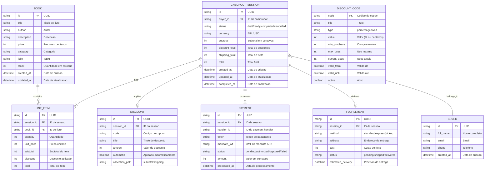

# Modelo de Dados

Este documento descreve a estrutura do banco de dados e os modelos de dados utilizados no sistema.

---

## Diagrama ER (Entity-Relationship)



---

## Schemas Detalhados

### Book (Livro)


**SQL Schema:**

```sql
CREATE TABLE books (
    id TEXT PRIMARY KEY,
    title TEXT NOT NULL,
    author TEXT NOT NULL,
    description TEXT,
    price INTEGER NOT NULL,  -- em centavos
    category TEXT,
    isbn TEXT UNIQUE,
    stock INTEGER DEFAULT 0,
    created_at TIMESTAMP DEFAULT CURRENT_TIMESTAMP,
    updated_at TIMESTAMP DEFAULT CURRENT_TIMESTAMP
);

CREATE INDEX idx_books_category ON books(category);
CREATE INDEX idx_books_author ON books(author);
```

### CheckoutSession (Sessao de Checkout)


**SQL Schema:**

```sql
CREATE TABLE checkout_sessions (
    id TEXT PRIMARY KEY,
    buyer_id TEXT,
    status TEXT DEFAULT 'draft',
    currency TEXT DEFAULT 'BRL',
    subtotal INTEGER DEFAULT 0,
    discount_total INTEGER DEFAULT 0,
    shipping_total INTEGER DEFAULT 0,
    total INTEGER DEFAULT 0,
    created_at TIMESTAMP DEFAULT CURRENT_TIMESTAMP,
    updated_at TIMESTAMP DEFAULT CURRENT_TIMESTAMP,
    completed_at TIMESTAMP,
    FOREIGN KEY (buyer_id) REFERENCES buyers(id)
);

CREATE TABLE line_items (
    id TEXT PRIMARY KEY,
    session_id TEXT NOT NULL,
    book_id TEXT NOT NULL,
    quantity INTEGER NOT NULL,
    unit_price INTEGER NOT NULL,
    subtotal INTEGER NOT NULL,
    discount INTEGER DEFAULT 0,
    total INTEGER NOT NULL,
    FOREIGN KEY (session_id) REFERENCES checkout_sessions(id),
    FOREIGN KEY (book_id) REFERENCES books(id)
);

CREATE INDEX idx_line_items_session ON line_items(session_id);
```

### Buyer (Comprador)


**SQL Schema:**

```sql
CREATE TABLE buyers (
    id TEXT PRIMARY KEY,
    full_name TEXT NOT NULL,
    email TEXT NOT NULL,
    phone TEXT,
    created_at TIMESTAMP DEFAULT CURRENT_TIMESTAMP
);

CREATE INDEX idx_buyers_email ON buyers(email);
```

### Payment (Pagamento)


**SQL Schema:**

```sql
CREATE TABLE payments (
    id TEXT PRIMARY KEY,
    session_id TEXT NOT NULL,
    handler_id TEXT NOT NULL,
    token TEXT,
    mandate_jwt TEXT,
    status TEXT DEFAULT 'pending',
    amount INTEGER NOT NULL,
    processed_at TIMESTAMP,
    FOREIGN KEY (session_id) REFERENCES checkout_sessions(id)
);
```

### Discount (Desconto)


**SQL Schema:**

```sql
CREATE TABLE discount_codes (
    code TEXT PRIMARY KEY,
    title TEXT NOT NULL,
    type TEXT NOT NULL,  -- 'percentage' ou 'fixed'
    value INTEGER NOT NULL,
    min_purchase INTEGER DEFAULT 0,
    max_uses INTEGER,
    current_uses INTEGER DEFAULT 0,
    valid_from TIMESTAMP,
    valid_until TIMESTAMP,
    active BOOLEAN DEFAULT 1
);

CREATE TABLE applied_discounts (
    id TEXT PRIMARY KEY,
    session_id TEXT NOT NULL,
    code TEXT NOT NULL,
    title TEXT NOT NULL,
    amount INTEGER NOT NULL,
    automatic BOOLEAN DEFAULT 0,
    allocation_path TEXT,
    FOREIGN KEY (session_id) REFERENCES checkout_sessions(id)
);
```

---

## Modelo UCP (Pydantic)

### CheckoutSession UCP Schema

```python
from pydantic import BaseModel
from typing import List, Optional
from datetime import datetime

class Item(BaseModel):
    id: str
    title: str
    price: Optional[int] = None

class Total(BaseModel):
    type: str  # 'subtotal', 'discount', 'shipping', 'total'
    amount: int

class LineItem(BaseModel):
    id: str
    item: Item
    quantity: int
    totals: List[Total] = []

class Buyer(BaseModel):
    full_name: str
    email: str
    phone: Optional[str] = None

class Allocation(BaseModel):
    path: str
    amount: int

class AppliedDiscount(BaseModel):
    code: str
    title: str
    amount: int
    automatic: bool = False
    allocations: List[Allocation] = []

class Discounts(BaseModel):
    codes: List[str] = []
    applied: List[AppliedDiscount] = []

class PaymentHandler(BaseModel):
    id: str
    name: str
    version: str
    spec: Optional[str] = None
    config_schema: Optional[str] = None
    instrument_schemas: List[str] = []
    config: dict = {}

class Payment(BaseModel):
    handlers: List[PaymentHandler] = []
    instruments: List[dict] = []

class UcpCapability(BaseModel):
    name: str
    version: str

class UcpMeta(BaseModel):
    version: str
    capabilities: List[UcpCapability] = []

class CheckoutSession(BaseModel):
    ucp: UcpMeta
    id: str
    line_items: List[LineItem]
    buyer: Buyer
    status: str  # 'draft', 'ready_for_complete', 'completed', 'cancelled'
    currency: str
    totals: List[Total]
    links: List[dict] = []
    payment: Payment
    discounts: Discounts = Discounts()
```

---

## Dados de Exemplo

### Catalogo de Livros (books_catalog.csv)

| id | title | author | price | category | isbn | stock |
|----|-------|--------|-------|----------|------|-------|
| book_001 | O Codigo do Futuro | Ana Silva | 4990 | Tecnologia | 978-85-0001-001-0 | 50 |
| book_002 | Algoritmos da Mente | Carlos Lima | 5990 | Ciencia | 978-85-0001-002-7 | 30 |
| book_003 | Python para Todos | Maria Santos | 3990 | Programacao | 978-85-0001-003-4 | 100 |
| book_004 | Machine Learning Pratico | Pedro Costa | 7990 | IA | 978-85-0001-004-1 | 25 |
| book_005 | Design de APIs | Julia Ferreira | 4490 | Tecnologia | 978-85-0001-005-8 | 40 |
| book_006 | Banco de Dados Moderno | Roberto Alves | 5490 | Tecnologia | 978-85-0001-006-5 | 35 |
| book_007 | Arquitetura de Software | Lucia Mendes | 6990 | Tecnologia | 978-85-0001-007-2 | 20 |
| book_008 | Clean Code em Python | Fernando Reis | 4290 | Programacao | 978-85-0001-008-9 | 60 |
| book_009 | DevOps na Pratica | Camila Souza | 5290 | DevOps | 978-85-0001-009-6 | 45 |
| book_010 | Seguranca Digital | Andre Martins | 4790 | Seguranca | 978-85-0001-010-2 | 55 |

### Cupons de Desconto (discount_codes)

| code | title | type | value | min_purchase | max_uses |
|------|-------|------|-------|--------------|----------|
| PRIMEIRA10 | 10% na primeira compra | percentage | 10 | 0 | 1 |
| LIVROS20 | 20% em compras acima de R$100 | percentage | 20 | 10000 | null |
| FRETE0 | Frete Gratis | fixed | 0 | 5000 | 100 |
| TECH15 | 15% em livros de Tecnologia | percentage | 15 | 0 | null |

---

## Indices e Performance

### Indices Criados

```sql
-- Busca por categoria
CREATE INDEX idx_books_category ON books(category);

-- Busca por autor
CREATE INDEX idx_books_author ON books(author);

-- Busca full-text no titulo
CREATE VIRTUAL TABLE books_fts USING fts5(title, author, description, content=books);

-- Line items por sessao
CREATE INDEX idx_line_items_session ON line_items(session_id);

-- Buyers por email
CREATE INDEX idx_buyers_email ON buyers(email);

-- Sessoes por status
CREATE INDEX idx_sessions_status ON checkout_sessions(status);
```

### Queries Comuns

```sql
-- Buscar livros por categoria
SELECT * FROM books WHERE category = ? ORDER BY created_at DESC;

-- Buscar livros por termo
SELECT * FROM books_fts WHERE books_fts MATCH ?;

-- Obter sessao com itens
SELECT cs.*, li.* 
FROM checkout_sessions cs
LEFT JOIN line_items li ON cs.id = li.session_id
WHERE cs.id = ?;

-- Calcular totais da sessao
SELECT 
    SUM(li.subtotal) as subtotal,
    SUM(li.discount) as discount,
    SUM(li.total) as total
FROM line_items li
WHERE li.session_id = ?;
```

---

## Modelo de Dados do User Agent

O User Agent mantem seu proprio estado local durante a execucao.

### AgentState (TypedDict)


### TypeScript (Python TypedDict)

```python
from typing import TypedDict, List, Dict, Optional

class Message(TypedDict):
    role: str  # 'user' | 'assistant' | 'system'
    content: str
    timestamp: str

class CartItem(TypedDict):
    store_id: str
    book_id: str
    title: str
    price: int
    quantity: int

class StoreInfo(TypedDict):
    url: str
    name: str
    capabilities: List[str]
    supports_a2a: bool
    discovered_at: str

class AgentState(TypedDict, total=False):
    messages: List[Message]
    cart: List[CartItem]
    stores: Dict[str, StoreInfo]
    session: Optional[dict]
    current_node: str
    intent: str
```

---

## Modelo de Dados do Frontend (Zustand)

O Frontend usa Zustand para gerenciamento de estado.

### Store Types (TypeScript)


### TypeScript Interfaces

```typescript
// types/index.ts

interface Book {
  id: string;
  title: string;
  author: string;
  price: number;
  description: string;
  category: string;
  isbn: string;
  stock: number;
}

interface CartItem {
  book: Book;
  quantity: number;
}

interface Message {
  id: string;
  role: 'user' | 'assistant' | 'system';
  content: string;
  timestamp: Date;
}

interface AgentNode {
  id: string;
  name: string;
  status: 'idle' | 'active' | 'done' | 'error';
}

interface AgentState {
  currentNode: string;
  nodes: AgentNode[];
  edges: { from: string; to: string }[];
}

interface StoreState {
  // Cart
  cart: CartItem[];
  addToCart: (book: Book) => void;
  removeFromCart: (bookId: string) => void;
  updateQuantity: (bookId: string, quantity: number) => void;
  clearCart: () => void;
  
  // Chat
  messages: Message[];
  addMessage: (message: Omit<Message, 'id' | 'timestamp'>) => void;
  clearMessages: () => void;
  
  // Agent
  agentState: AgentState;
  setAgentState: (state: AgentState) => void;
  
  // Books
  books: Book[];
  setBooks: (books: Book[]) => void;
}
```

### Zustand Store Implementation

```typescript
// stores/useStore.ts
import { create } from 'zustand';

export const useStore = create<StoreState>((set) => ({
  // Initial state
  cart: [],
  messages: [],
  agentState: { currentNode: 'idle', nodes: [], edges: [] },
  books: [],
  
  // Cart actions
  addToCart: (book) => set((state) => {
    const existing = state.cart.find(item => item.book.id === book.id);
    if (existing) {
      return {
        cart: state.cart.map(item =>
          item.book.id === book.id
            ? { ...item, quantity: item.quantity + 1 }
            : item
        )
      };
    }
    return { cart: [...state.cart, { book, quantity: 1 }] };
  }),
  
  removeFromCart: (bookId) => set((state) => ({
    cart: state.cart.filter(item => item.book.id !== bookId)
  })),
  
  // Chat actions
  addMessage: (msg) => set((state) => ({
    messages: [...state.messages, {
      ...msg,
      id: crypto.randomUUID(),
      timestamp: new Date()
    }]
  })),
  
  // Agent actions
  setAgentState: (agentState) => set({ agentState }),
}));
```

---

## Migracoes

### V1: Schema Inicial

```sql
-- migration_001_initial.sql
BEGIN TRANSACTION;

CREATE TABLE books (...);
CREATE TABLE buyers (...);
CREATE TABLE checkout_sessions (...);
CREATE TABLE line_items (...);
CREATE TABLE payments (...);
CREATE TABLE discount_codes (...);
CREATE TABLE applied_discounts (...);

COMMIT;
```

### V2: Adicionar Fulfillment

```sql
-- migration_002_fulfillment.sql
BEGIN TRANSACTION;

CREATE TABLE fulfillments (
    id TEXT PRIMARY KEY,
    session_id TEXT NOT NULL,
    method TEXT NOT NULL,
    address TEXT,
    cost INTEGER DEFAULT 0,
    status TEXT DEFAULT 'pending',
    estimated_delivery TIMESTAMP,
    FOREIGN KEY (session_id) REFERENCES checkout_sessions(id)
);

ALTER TABLE checkout_sessions ADD COLUMN shipping_total INTEGER DEFAULT 0;

COMMIT;
```
