# Diagramas de Fluxo

Este documento apresenta os principais fluxos do sistema usando diagramas de sequencia e atividade.

**Nota**: O sistema suporta dois modos de interacao:
1. **Via Frontend** - Usuario interage pela interface web
2. **Via User Agent** - Usuario usa seu proprio agente para acessar lojas UCP

---

## 0. Fluxos do User Agent (Agente do Usuario)

### 0.1 User Agent Descobrindo Multiplas Lojas

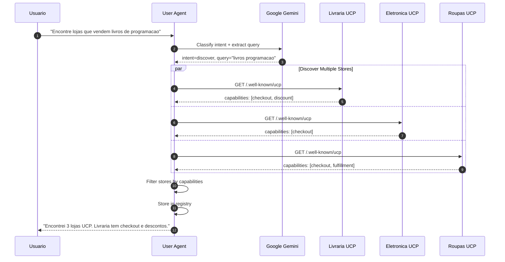
```mermaid
sequenceDiagram
    autonumber
    participant User as Usuario
    participant UA as User Agent
    participant Gemini as Google Gemini
    participant Store1 as Livraria UCP
    participant Store2 as Eletronica UCP
    participant Store3 as Roupas UCP

    User->>UA: "Encontre lojas que vendem livros de programacao"
    UA->>Gemini: Classify intent + extract query
    Gemini-->>UA: intent=discover, query="livros programacao"
    
    par Discover Multiple Stores
        UA->>Store1: GET /.well-known/ucp
        Store1-->>UA: capabilities: [checkout, discount]
    and
        UA->>Store2: GET /.well-known/ucp
        Store2-->>UA: capabilities: [checkout]
    and
        UA->>Store3: GET /.well-known/ucp
        Store3-->>UA: capabilities: [checkout, fulfillment]
    end
    
    UA->>UA: Filter stores by capabilities
    UA->>UA: Store in registry
    UA-->>User: "Encontrei 3 lojas UCP. Livraria tem checkout e descontos."
```

### 0.2 User Agent Comprando Diretamente (Sem Frontend)

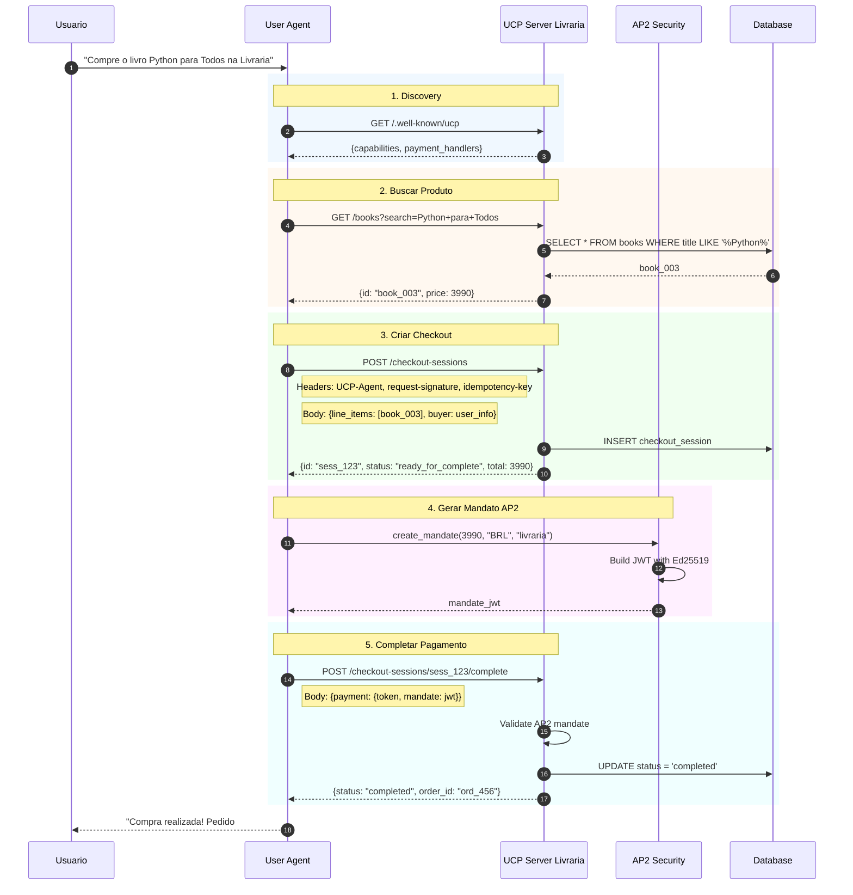
```mermaid
sequenceDiagram
    autonumber
    participant User as Usuario
    participant UA as User Agent
    participant UCP as UCP Server Livraria
    participant AP2 as AP2 Security
    participant DB as Database

    User->>UA: "Compre o livro Python para Todos na Livraria"
    
    rect rgb(240, 248, 255)
        Note over UA,UCP: 1. Discovery
        UA->>UCP: GET /.well-known/ucp
        UCP-->>UA: {capabilities, payment_handlers}
    end
    
    rect rgb(255, 248, 240)
        Note over UA,UCP: 2. Buscar Produto
        UA->>UCP: GET /books?search=Python+para+Todos
        UCP->>DB: SELECT * FROM books WHERE title LIKE '%Python%'
        DB-->>UCP: book_003
        UCP-->>UA: {id: "book_003", price: 3990}
    end
    
    rect rgb(240, 255, 240)
        Note over UA,UCP: 3. Criar Checkout
        UA->>UCP: POST /checkout-sessions
        Note right of UA: Headers: UCP-Agent, request-signature, idempotency-key
        Note right of UA: Body: {line_items: [book_003], buyer: user_info}
        UCP->>DB: INSERT checkout_session
        UCP-->>UA: {id: "sess_123", status: "ready_for_complete", total: 3990}
    end
    
    rect rgb(255, 240, 255)
        Note over UA,AP2: 4. Gerar Mandato AP2
        UA->>AP2: create_mandate(3990, "BRL", "livraria")
        AP2->>AP2: Build JWT with Ed25519
        AP2-->>UA: mandate_jwt
    end
    
    rect rgb(240, 255, 255)
        Note over UA,UCP: 5. Completar Pagamento
        UA->>UCP: POST /checkout-sessions/sess_123/complete
        Note right of UA: Body: {payment: {token, mandate: jwt}}
        UCP->>UCP: Validate AP2 mandate
        UCP->>DB: UPDATE status = 'completed'
        UCP-->>UA: {status: "completed", order_id: "ord_456"}
    end
    
    UA-->>User: "Compra realizada! Pedido #ord_456, total R$39,90"
```

### 0.3 User Agent Comunicando via A2A com Store Agents

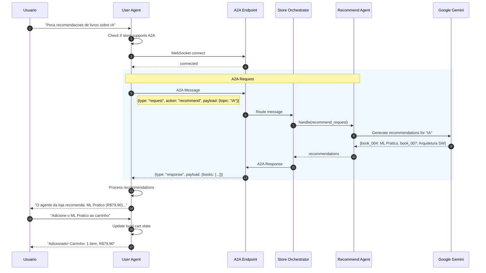
```mermaid
sequenceDiagram
    autonumber
    participant User as Usuario
    participant UA as User Agent
    participant A2A as A2A Endpoint
    participant SA as Store Orchestrator
    participant RA as Recommend Agent
    participant Gemini as Google Gemini

    User->>UA: "Peca recomendacoes de livros sobre IA"
    
    UA->>UA: Check if store supports A2A
    UA->>A2A: WebSocket connect
    A2A-->>UA: connected
    
    rect rgb(240, 248, 255)
        Note over UA,RA: A2A Request
        UA->>A2A: A2A Message
        Note right of UA: {type: "request", action: "recommend", payload: {topic: "IA"}}
        A2A->>SA: Route message
        SA->>RA: handle(recommend_request)
        RA->>Gemini: Generate recommendations for "IA"
        Gemini-->>RA: [book_004: ML Pratico, book_007: Arquitetura SW]
        RA-->>SA: recommendations
        SA->>A2A: A2A Response
        A2A-->>UA: {type: "response", payload: {books: [...]}}
    end
    
    UA->>UA: Process recommendations
    UA-->>User: "O agente da loja recomenda: ML Pratico (R$79,90)..."
    
    User->>UA: "Adicione o ML Pratico ao carrinho"
    UA->>UA: Update local cart state
    UA-->>User: "Adicionado! Carrinho: 1 item, R$79,90"
```

### 0.4 User Agent Comparando Precos entre Lojas

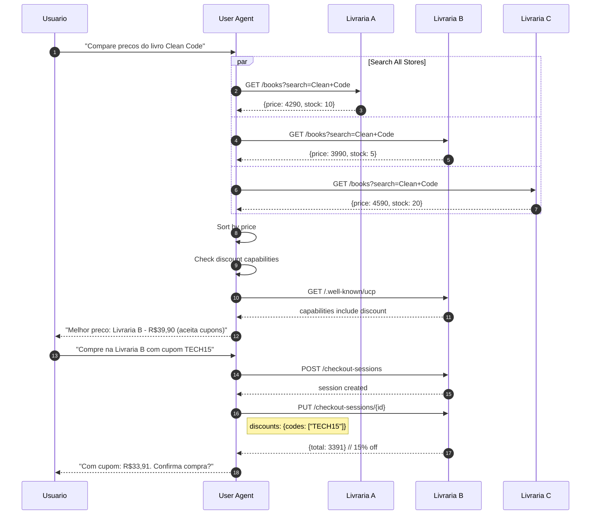
```mermaid
sequenceDiagram
    autonumber
    participant User as Usuario
    participant UA as User Agent
    participant Store1 as Livraria A
    participant Store2 as Livraria B
    participant Store3 as Livraria C

    User->>UA: "Compare precos do livro Clean Code"
    
    par Search All Stores
        UA->>Store1: GET /books?search=Clean+Code
        Store1-->>UA: {price: 4290, stock: 10}
    and
        UA->>Store2: GET /books?search=Clean+Code
        Store2-->>UA: {price: 3990, stock: 5}
    and
        UA->>Store3: GET /books?search=Clean+Code
        Store3-->>UA: {price: 4590, stock: 20}
    end
    
    UA->>UA: Sort by price
    UA->>UA: Check discount capabilities
    
    UA->>Store2: GET /.well-known/ucp
    Store2-->>UA: capabilities include discount
    
    UA-->>User: "Melhor preco: Livraria B - R$39,90 (aceita cupons)"
    
    User->>UA: "Compre na Livraria B com cupom TECH15"
    
    UA->>Store2: POST /checkout-sessions
    Store2-->>UA: session created
    
    UA->>Store2: PUT /checkout-sessions/{id}
    Note right of UA: discounts: {codes: ["TECH15"]}
    Store2-->>UA: {total: 3391} // 15% off
    
    UA-->>User: "Com cupom: R$33,91. Confirma compra?"
```

### 0.5 Diagrama de Estado do User Agent

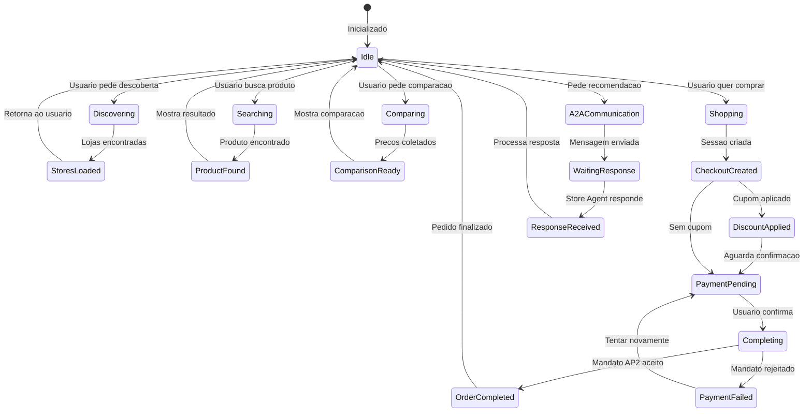
```mermaid
stateDiagram-v2
    [*] --> Idle: Inicializado
    
    Idle --> Discovering: Usuario pede descoberta
    Discovering --> StoresLoaded: Lojas encontradas
    StoresLoaded --> Idle: Retorna ao usuario
    
    Idle --> Searching: Usuario busca produto
    Searching --> ProductFound: Produto encontrado
    ProductFound --> Idle: Mostra resultado
    
    Idle --> Comparing: Usuario pede comparacao
    Comparing --> ComparisonReady: Precos coletados
    ComparisonReady --> Idle: Mostra comparacao
    
    Idle --> Shopping: Usuario quer comprar
    Shopping --> CheckoutCreated: Sessao criada
    CheckoutCreated --> DiscountApplied: Cupom aplicado
    DiscountApplied --> PaymentPending: Aguarda confirmacao
    CheckoutCreated --> PaymentPending: Sem cupom
    PaymentPending --> Completing: Usuario confirma
    Completing --> OrderCompleted: Mandato AP2 aceito
    OrderCompleted --> Idle: Pedido finalizado
    
    Completing --> PaymentFailed: Mandato rejeitado
    PaymentFailed --> PaymentPending: Tentar novamente
    
    Idle --> A2ACommunication: Pede recomendacao
    A2ACommunication --> WaitingResponse: Mensagem enviada
    WaitingResponse --> ResponseReceived: Store Agent responde
    ResponseReceived --> Idle: Processa resposta
```

---

## 1. Fluxo de Discovery UCP

### Diagrama de Sequencia

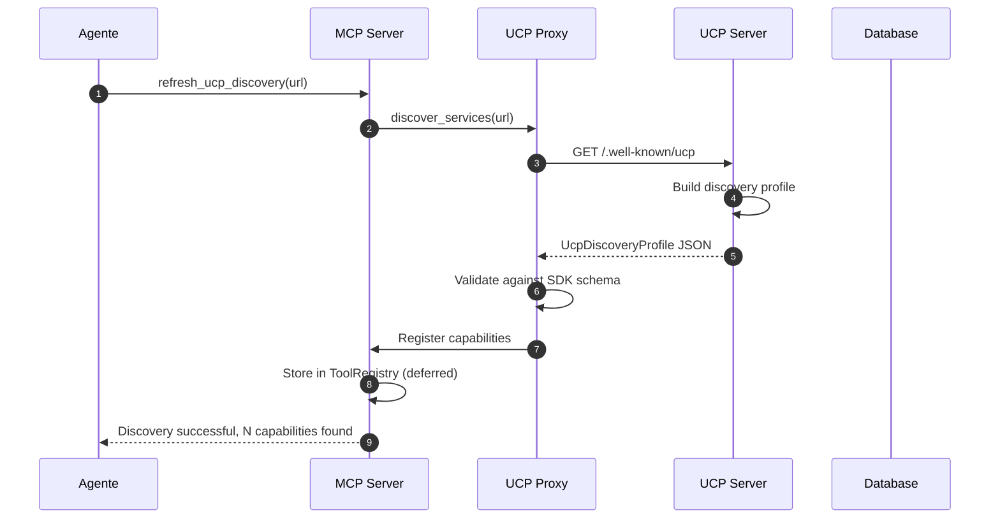
```mermaid
sequenceDiagram
    autonumber
    participant Agent as Agente
    participant MCP as MCP Server
    participant Proxy as UCP Proxy
    participant UCP as UCP Server
    participant DB as Database

    Agent->>MCP: refresh_ucp_discovery(url)
    MCP->>Proxy: discover_services(url)
    Proxy->>UCP: GET /.well-known/ucp
    UCP->>UCP: Build discovery profile
    UCP-->>Proxy: UcpDiscoveryProfile JSON
    Proxy->>Proxy: Validate against SDK schema
    Proxy->>MCP: Register capabilities
    MCP->>MCP: Store in ToolRegistry (deferred)
    MCP-->>Agent: Discovery successful, N capabilities found
```

### Resposta de Discovery

```json
{
  "ucp": {
    "version": "2026-01-11",
    "services": {
      "dev.ucp.shopping": {
        "version": "2026-01-11",
        "rest": { "endpoint": "http://localhost:8182/" }
      }
    },
    "capabilities": [
      { "name": "dev.ucp.shopping.checkout", "version": "2026-01-11" },
      { "name": "dev.ucp.shopping.discount", "extends": "dev.ucp.shopping.checkout" },
      { "name": "dev.ucp.shopping.fulfillment", "extends": "dev.ucp.shopping.checkout" }
    ]
  },
  "payment": {
    "handlers": [
      { "id": "mock_payment", "name": "dev.ucp.mock_payment", "version": "2026-01-11" }
    ]
  }
}
```

---

## 2. Fluxo de Checkout Completo

### Diagrama de Sequencia

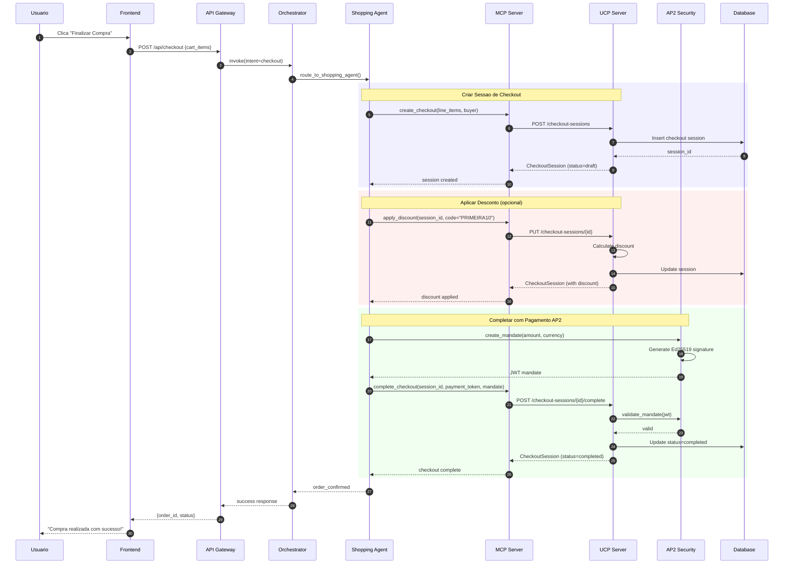
```mermaid
sequenceDiagram
    autonumber
    participant User as Usuario
    participant FE as Frontend
    participant API as API Gateway
    participant Orch as Orchestrator
    participant Shop as Shopping Agent
    participant MCP as MCP Server
    participant UCP as UCP Server
    participant AP2 as AP2 Security
    participant DB as Database

    User->>FE: Clica "Finalizar Compra"
    FE->>API: POST /api/checkout {cart_items}
    API->>Orch: invoke(intent=checkout)
    Orch->>Shop: route_to_shopping_agent()
    
    rect rgb(240, 240, 255)
        Note over Shop,UCP: Criar Sessao de Checkout
        Shop->>MCP: create_checkout(line_items, buyer)
        MCP->>UCP: POST /checkout-sessions
        UCP->>DB: Insert checkout session
        DB-->>UCP: session_id
        UCP-->>MCP: CheckoutSession (status=draft)
        MCP-->>Shop: session created
    end

    rect rgb(255, 240, 240)
        Note over Shop,UCP: Aplicar Desconto (opcional)
        Shop->>MCP: apply_discount(session_id, code="PRIMEIRA10")
        MCP->>UCP: PUT /checkout-sessions/{id}
        UCP->>UCP: Calculate discount
        UCP->>DB: Update session
        UCP-->>MCP: CheckoutSession (with discount)
        MCP-->>Shop: discount applied
    end

    rect rgb(240, 255, 240)
        Note over Shop,AP2: Completar com Pagamento AP2
        Shop->>AP2: create_mandate(amount, currency)
        AP2->>AP2: Generate Ed25519 signature
        AP2-->>Shop: JWT mandate
        Shop->>MCP: complete_checkout(session_id, payment_token, mandate)
        MCP->>UCP: POST /checkout-sessions/{id}/complete
        UCP->>AP2: validate_mandate(jwt)
        AP2-->>UCP: valid
        UCP->>DB: Update status=completed
        UCP-->>MCP: CheckoutSession (status=completed)
        MCP-->>Shop: checkout complete
    end

    Shop-->>Orch: order_confirmed
    Orch-->>API: success response
    API-->>FE: {order_id, status}
    FE-->>User: "Compra realizada com sucesso!"
```

### Diagrama de Atividade

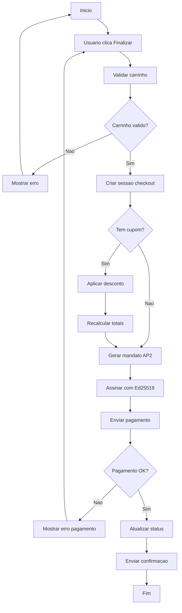
```mermaid
flowchart TD
    A[Inicio] --> B[Usuario clica Finalizar]
    B --> C[Validar carrinho]
    C --> D{Carrinho valido?}
    D -->|Nao| E[Mostrar erro]
    E --> A
    D -->|Sim| F[Criar sessao checkout]
    F --> G{Tem cupom?}
    G -->|Sim| H[Aplicar desconto]
    H --> I[Recalcular totais]
    G -->|Nao| J[Gerar mandato AP2]
    I --> J
    J --> K[Assinar com Ed25519]
    K --> L[Enviar pagamento]
    L --> M{Pagamento OK?}
    M -->|Nao| N[Mostrar erro pagamento]
    N --> B
    M -->|Sim| O[Atualizar status]
    O --> P[Enviar confirmacao]
    P --> Q[Fim]
```

---

## 3. Fluxo de Chat com Agente

### Diagrama de Sequencia

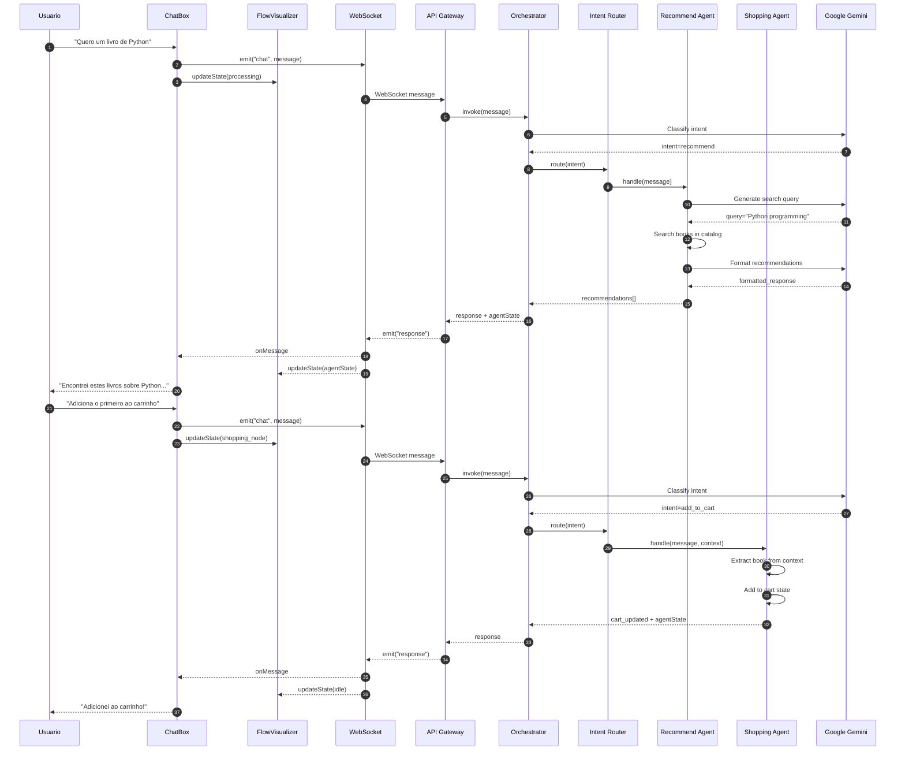
```mermaid
sequenceDiagram
    autonumber
    participant User as Usuario
    participant Chat as ChatBox
    participant FV as FlowVisualizer
    participant WS as WebSocket
    participant API as API Gateway
    participant Orch as Orchestrator
    participant Router as Intent Router
    participant Rec as Recommend Agent
    participant Shop as Shopping Agent
    participant Gemini as Google Gemini

    User->>Chat: "Quero um livro de Python"
    Chat->>WS: emit("chat", message)
    Chat->>FV: updateState(processing)
    WS->>API: WebSocket message
    API->>Orch: invoke(message)
    
    Orch->>Gemini: Classify intent
    Gemini-->>Orch: intent=recommend
    Orch->>Router: route(intent)
    Router->>Rec: handle(message)
    
    Rec->>Gemini: Generate search query
    Gemini-->>Rec: query="Python programming"
    Rec->>Rec: Search books in catalog
    Rec->>Gemini: Format recommendations
    Gemini-->>Rec: formatted_response
    
    Rec-->>Orch: recommendations[]
    Orch-->>API: response + agentState
    API-->>WS: emit("response")
    WS-->>Chat: onMessage
    WS-->>FV: updateState(agentState)
    Chat-->>User: "Encontrei estes livros sobre Python..."

    User->>Chat: "Adiciona o primeiro ao carrinho"
    Chat->>WS: emit("chat", message)
    Chat->>FV: updateState(shopping_node)
    WS->>API: WebSocket message
    API->>Orch: invoke(message)
    
    Orch->>Gemini: Classify intent
    Gemini-->>Orch: intent=add_to_cart
    Orch->>Router: route(intent)
    Router->>Shop: handle(message, context)
    
    Shop->>Shop: Extract book from context
    Shop->>Shop: Add to cart state
    Shop-->>Orch: cart_updated + agentState
    Orch-->>API: response
    API-->>WS: emit("response")
    WS-->>Chat: onMessage
    WS-->>FV: updateState(idle)
    Chat-->>User: "Adicionei ao carrinho!"
```

### Estados do Chat

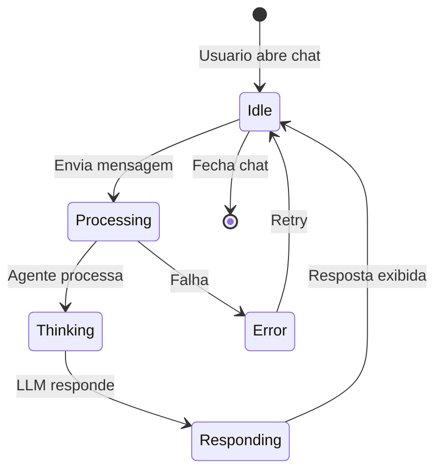
```mermaid
stateDiagram-v2
    [*] --> Idle: Usuario abre chat
    Idle --> Processing: Envia mensagem
    Processing --> Thinking: Agente processa
    Thinking --> Responding: LLM responde
    Responding --> Idle: Resposta exibida
    
    Processing --> Error: Falha
    Error --> Idle: Retry
    
    Idle --> [*]: Fecha chat
```

### FlowVisualizer - Visualizacao do Grafo LangGraph

O FlowVisualizer e um componente React que mostra o estado atual do grafo LangGraph em tempo real.

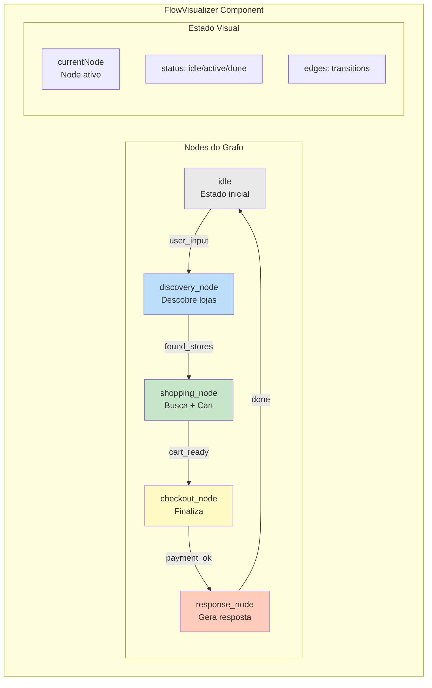
```mermaid
flowchart TB
    subgraph flowvis [FlowVisualizer Component]
        subgraph nodes [Nodes do Grafo]
            Idle[idle<br/>Estado inicial]
            Discovery[discovery_node<br/>Descobre lojas]
            Shopping[shopping_node<br/>Busca + Cart]
            Checkout[checkout_node<br/>Finaliza]
            Response[response_node<br/>Gera resposta]
        end

        subgraph state [Estado Visual]
            CurrentNode[currentNode<br/>Node ativo]
            NodeStatus[status: idle/active/done]
            Edges[edges: transitions]
        end
    end

    Idle -->|user_input| Discovery
    Discovery -->|found_stores| Shopping
    Shopping -->|cart_ready| Checkout
    Checkout -->|payment_ok| Response
    Response -->|done| Idle

    style Idle fill:#e8e8e8
    style Discovery fill:#bbdefb
    style Shopping fill:#c8e6c9
    style Checkout fill:#fff9c4
    style Response fill:#ffccbc
```

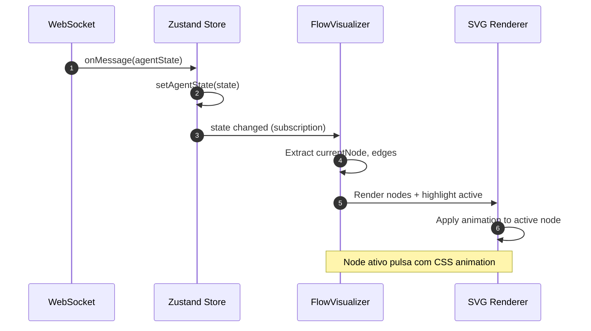
```mermaid
sequenceDiagram
    autonumber
    participant WS as WebSocket
    participant Store as Zustand Store
    participant FV as FlowVisualizer
    participant SVG as SVG Renderer

    WS->>Store: onMessage(agentState)
    Store->>Store: setAgentState(state)
    Store->>FV: state changed (subscription)
    FV->>FV: Extract currentNode, edges
    FV->>SVG: Render nodes + highlight active
    SVG->>SVG: Apply animation to active node
    Note over FV,SVG: Node ativo pulsa com CSS animation
```

| Propriedade | Tipo | Descricao |
|-------------|------|-----------|
| `currentNode` | `string` | Nome do node ativo no grafo |
| `nodes` | `AgentNode[]` | Lista de todos os nodes |
| `edges` | `Edge[]` | Transicoes entre nodes |
| `status` | `'idle' \| 'active' \| 'done' \| 'error'` | Status do node |

---

## 4. Fluxo de Comunicacao A2A

### Diagrama de Sequencia

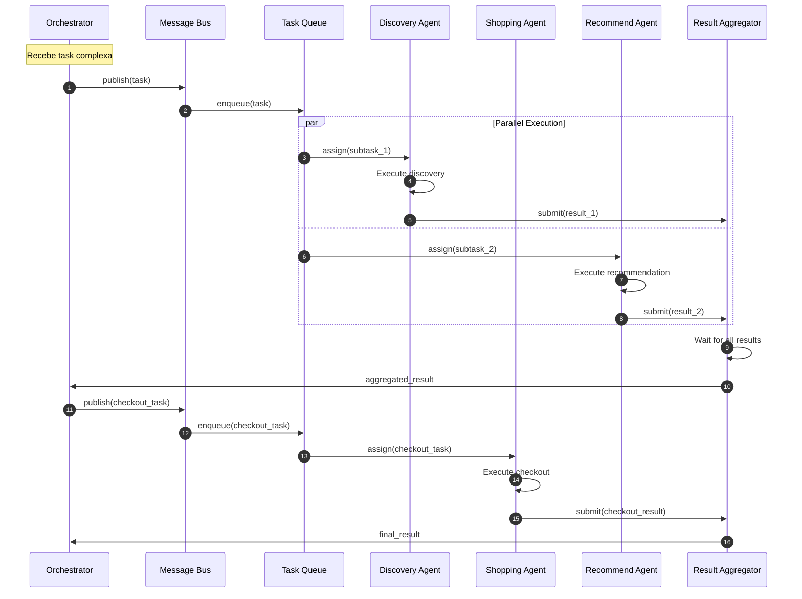
```mermaid
sequenceDiagram
    autonumber
    participant Orch as Orchestrator
    participant Bus as Message Bus
    participant Queue as Task Queue
    participant Disc as Discovery Agent
    participant Shop as Shopping Agent
    participant Rec as Recommend Agent
    participant Agg as Result Aggregator

    Note over Orch: Recebe task complexa
    Orch->>Bus: publish(task)
    Bus->>Queue: enqueue(task)
    
    par Parallel Execution
        Queue->>Disc: assign(subtask_1)
        Disc->>Disc: Execute discovery
        Disc->>Agg: submit(result_1)
    and
        Queue->>Rec: assign(subtask_2)
        Rec->>Rec: Execute recommendation
        Rec->>Agg: submit(result_2)
    end
    
    Agg->>Agg: Wait for all results
    Agg->>Orch: aggregated_result
    
    Orch->>Bus: publish(checkout_task)
    Bus->>Queue: enqueue(checkout_task)
    Queue->>Shop: assign(checkout_task)
    Shop->>Shop: Execute checkout
    Shop->>Agg: submit(checkout_result)
    Agg->>Orch: final_result
```

### Protocolo de Mensagens A2A

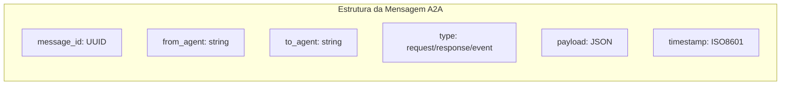
```mermaid
flowchart LR
    subgraph message [Estrutura da Mensagem A2A]
        ID[message_id: UUID]
        From[from_agent: string]
        To[to_agent: string]
        Type[type: request/response/event]
        Payload[payload: JSON]
        Timestamp[timestamp: ISO8601]
    end
```

---

## 5. Fluxo de Seguranca AP2

### Geracao de Mandato

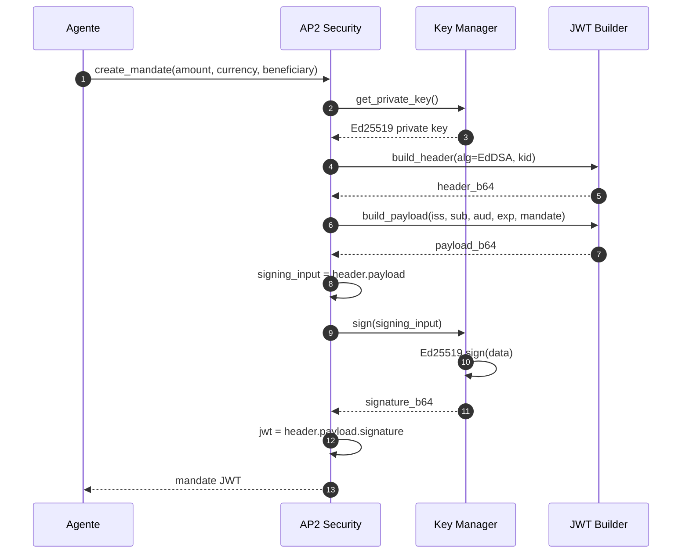
```mermaid
sequenceDiagram
    autonumber
    participant Agent as Agente
    participant AP2 as AP2 Security
    participant KM as Key Manager
    participant JWT as JWT Builder

    Agent->>AP2: create_mandate(amount, currency, beneficiary)
    AP2->>KM: get_private_key()
    KM-->>AP2: Ed25519 private key
    
    AP2->>JWT: build_header(alg=EdDSA, kid)
    JWT-->>AP2: header_b64
    
    AP2->>JWT: build_payload(iss, sub, aud, exp, mandate)
    JWT-->>AP2: payload_b64
    
    AP2->>AP2: signing_input = header.payload
    AP2->>KM: sign(signing_input)
    KM->>KM: Ed25519.sign(data)
    KM-->>AP2: signature_b64
    
    AP2->>AP2: jwt = header.payload.signature
    AP2-->>Agent: mandate JWT
```

### Validacao de Mandato

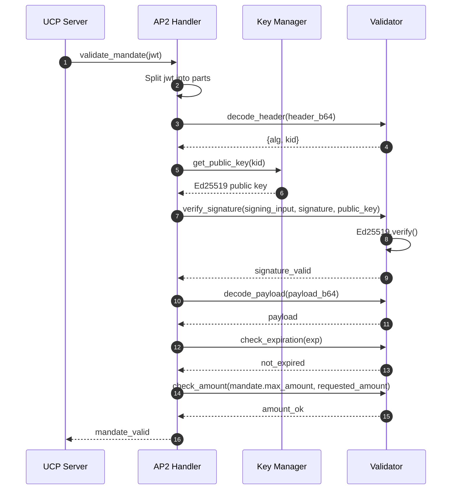
```mermaid
sequenceDiagram
    autonumber
    participant UCP as UCP Server
    participant AP2 as AP2 Handler
    participant KM as Key Manager
    participant Val as Validator

    UCP->>AP2: validate_mandate(jwt)
    AP2->>AP2: Split jwt into parts
    AP2->>Val: decode_header(header_b64)
    Val-->>AP2: {alg, kid}
    
    AP2->>KM: get_public_key(kid)
    KM-->>AP2: Ed25519 public key
    
    AP2->>Val: verify_signature(signing_input, signature, public_key)
    Val->>Val: Ed25519.verify()
    Val-->>AP2: signature_valid
    
    AP2->>Val: decode_payload(payload_b64)
    Val-->>AP2: payload
    
    AP2->>Val: check_expiration(exp)
    Val-->>AP2: not_expired
    
    AP2->>Val: check_amount(mandate.max_amount, requested_amount)
    Val-->>AP2: amount_ok
    
    AP2-->>UCP: mandate_valid
```

---

## 6. Fluxo de Progressive Disclosure (MCP)

### Diagrama de Sequencia

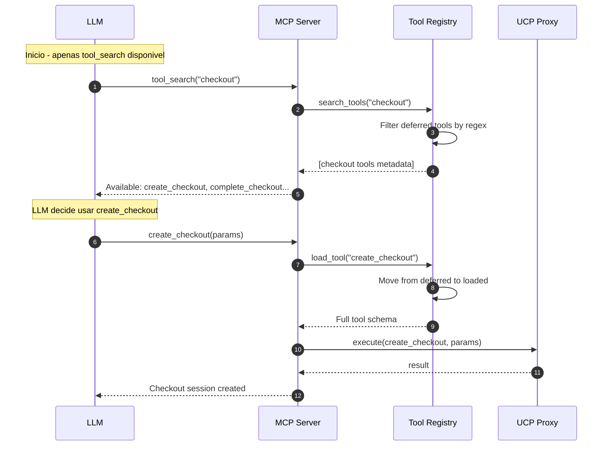
```mermaid
sequenceDiagram
    autonumber
    participant LLM as LLM
    participant MCP as MCP Server
    participant Reg as Tool Registry
    participant Proxy as UCP Proxy

    Note over LLM: Inicio - apenas tool_search disponivel

    LLM->>MCP: tool_search("checkout")
    MCP->>Reg: search_tools("checkout")
    Reg->>Reg: Filter deferred tools by regex
    Reg-->>MCP: [checkout tools metadata]
    MCP-->>LLM: Available: create_checkout, complete_checkout...

    Note over LLM: LLM decide usar create_checkout

    LLM->>MCP: create_checkout(params)
    MCP->>Reg: load_tool("create_checkout")
    Reg->>Reg: Move from deferred to loaded
    Reg-->>MCP: Full tool schema
    MCP->>Proxy: execute(create_checkout, params)
    Proxy-->>MCP: result
    MCP-->>LLM: Checkout session created
```

### Beneficio de Tokens

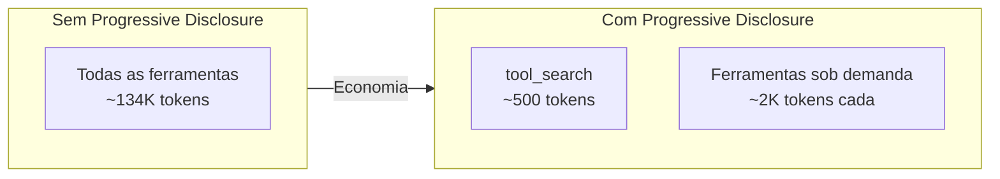
```mermaid
flowchart LR
    subgraph before [Sem Progressive Disclosure]
        All[Todas as ferramentas<br/>~134K tokens]
    end

    subgraph after [Com Progressive Disclosure]
        Search[tool_search<br/>~500 tokens]
        OnDemand[Ferramentas sob demanda<br/>~2K tokens cada]
    end

    before -->|Economia| after
```

---

## 7. Fluxo de Execucao no Sandbox

### Diagrama de Sequencia

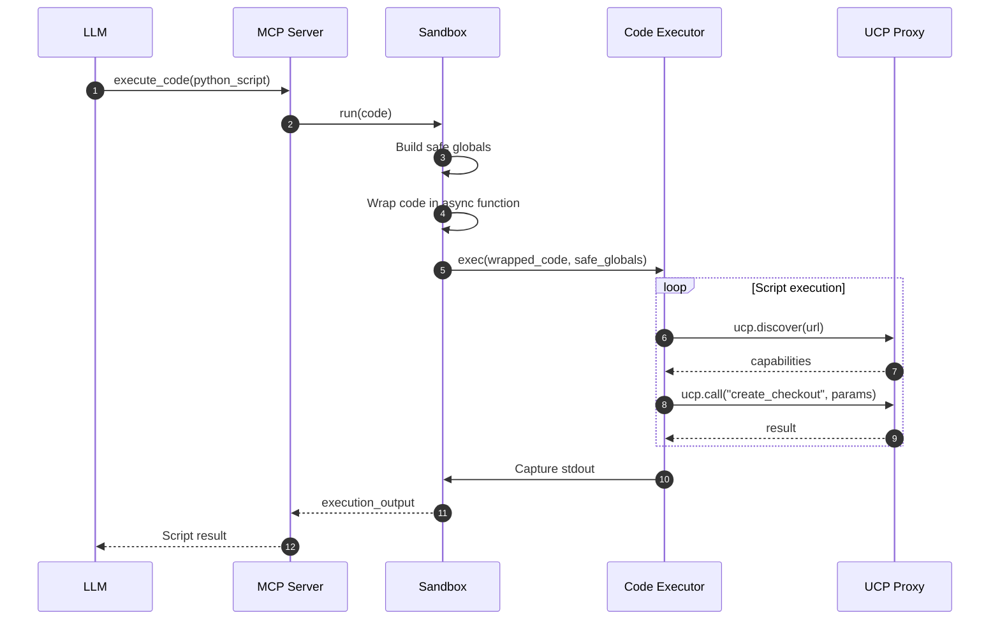
```mermaid
sequenceDiagram
    autonumber
    participant LLM as LLM
    participant MCP as MCP Server
    participant Sand as Sandbox
    participant Exec as Code Executor
    participant Proxy as UCP Proxy

    LLM->>MCP: execute_code(python_script)
    MCP->>Sand: run(code)
    Sand->>Sand: Build safe globals
    Sand->>Sand: Wrap code in async function
    Sand->>Exec: exec(wrapped_code, safe_globals)
    
    loop Script execution
        Exec->>Proxy: ucp.discover(url)
        Proxy-->>Exec: capabilities
        Exec->>Proxy: ucp.call("create_checkout", params)
        Proxy-->>Exec: result
    end
    
    Exec->>Sand: Capture stdout
    Sand-->>MCP: execution_output
    MCP-->>LLM: Script result
```

### Globals Permitidos no Sandbox

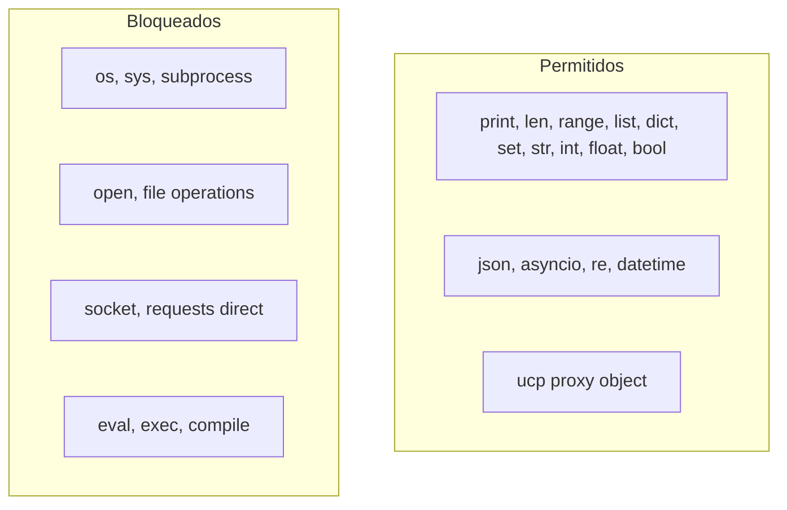
```mermaid
flowchart TB
    subgraph allowed [Permitidos]
        Builtins[print, len, range, list, dict, set, str, int, float, bool]
        Modules[json, asyncio, re, datetime]
        UCP[ucp proxy object]
    end

    subgraph blocked [Bloqueados]
        OS[os, sys, subprocess]
        IO[open, file operations]
        Network[socket, requests direct]
        Eval[eval, exec, compile]
    end
```
