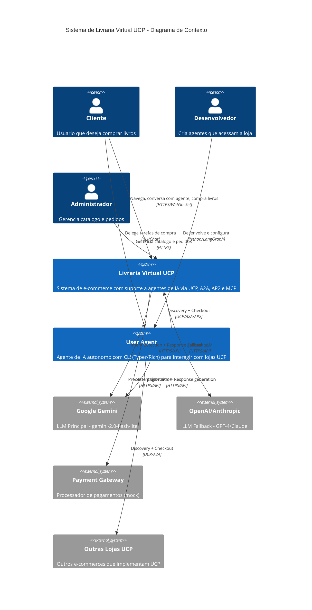
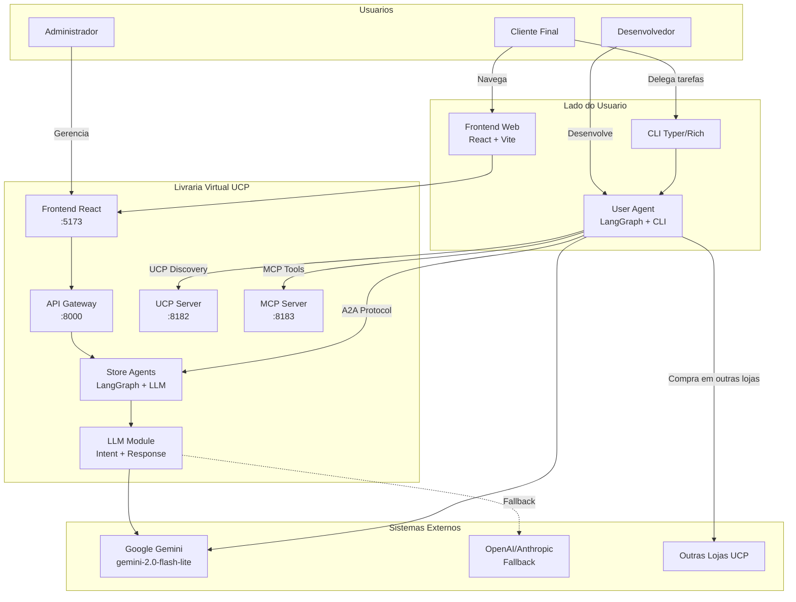
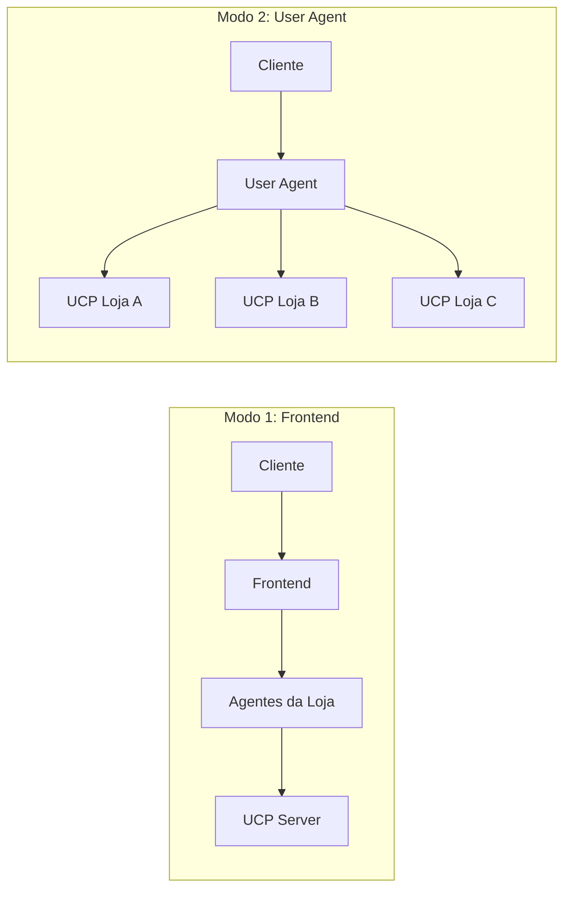
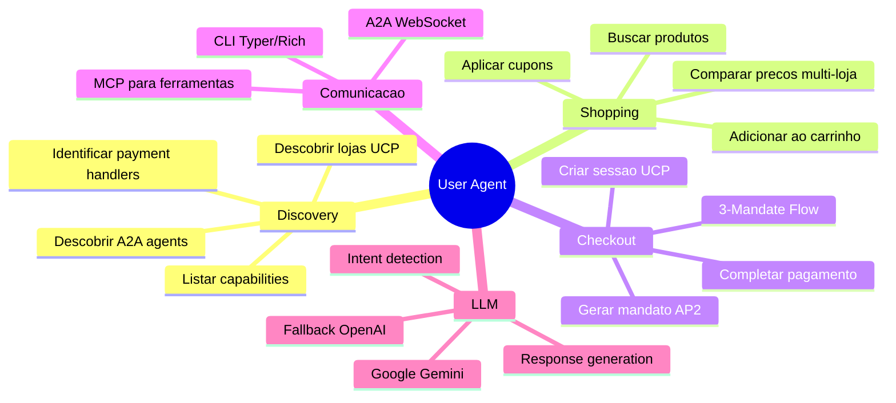
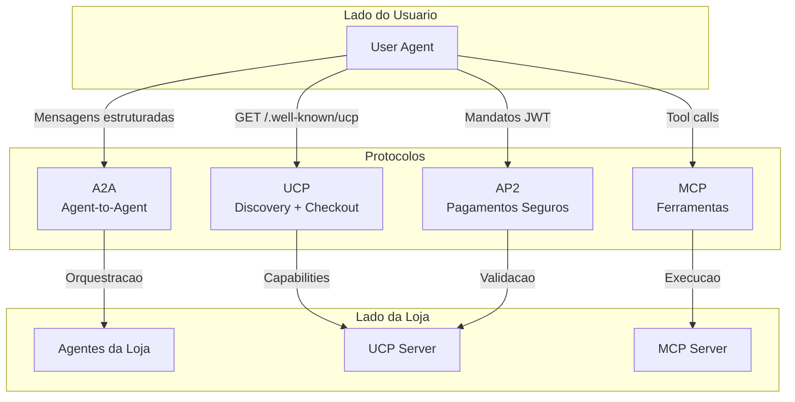
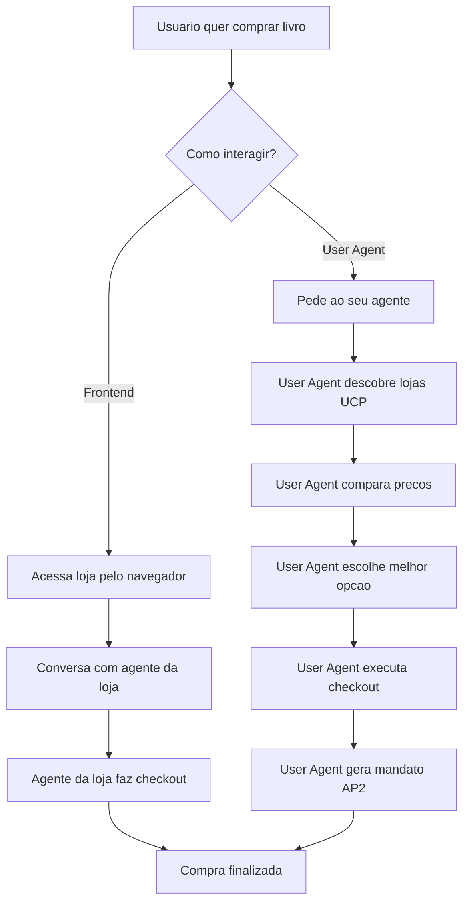

# C4 Level 1: Diagrama de Contexto

## Visao Geral

O diagrama de contexto mostra a Livraria Virtual UCP e suas interacoes com usuarios, agentes externos e sistemas.

**Importante**: O UCP permite que **agentes externos** (criados por usuarios ou terceiros) acessem a loja diretamente, sem precisar passar pelo frontend. Isso e o diferencial do comercio agentivo.

## Diagrama de Contexto

## Diagrama Detalhado (Flowchart)

## Dois Modos de Interacao

### Modo 1: Via Frontend (Tradicional)
O cliente acessa a loja pelo navegador e interage com os agentes da loja.

### Modo 2: Via User Agent (Agentivo)
O cliente usa seu proprio agente que descobre e interage com multiplas lojas UCP.

## Descricao dos Elementos

### Pessoas/Atores

| Ator | Descricao | Interacoes |
|------|-----------|------------|
| **Cliente** | Usuario final que busca e compra livros | Usa frontend OU delega para seu User Agent |
| **Desenvolvedor** | Cria e configura agentes personalizados | Desenvolve User Agents com LangGraph |
| **Administrador** | Responsavel pela gestao da loja | Gerencia catalogo, pedidos, descontos |

### Sistemas

| Sistema | Tipo | Responsabilidade |
|---------|------|------------------|
| **Livraria Virtual UCP** | Principal | E-commerce com endpoints UCP, A2A, MCP |
| **User Agent** | Externo | Agente autonomo do usuario com CLI Typer/Rich |
| **Google Gemini** | Externo | LLM Principal - Intent detection e response generation |
| **OpenAI/Anthropic** | Externo | LLM Fallback - GPT-4/Claude como alternativa |
| **Outras Lojas UCP** | Externo | Demonstra interoperabilidade multi-loja |

## User Agent - O Agente do Usuario

O **User Agent** e um agente de IA que o usuario/desenvolvedor pode criar para:

1. **Descobrir lojas**: Acessa `/.well-known/ucp` de qualquer loja
2. **Comparar precos**: Consulta multiplas lojas simultaneamente
3. **Executar compras**: Realiza checkout autonomamente com AP2
4. **Receber recomendacoes**: Usa agentes da loja via A2A

### Capacidades do User Agent

## Protocolos no Contexto

## Fluxo de Alto Nivel com User Agent

## Vantagens do Modelo com User Agent

| Aspecto | Sem User Agent | Com User Agent |
|---------|----------------|----------------|
| **Descoberta** | Manual, loja por loja | Automatica via UCP |
| **Comparacao** | Usuario compara manualmente | Agente compara automaticamente |
| **Checkout** | Preenche formularios | Autonomo com AP2 |
| **Personalizacao** | Limitada ao frontend | Totalmente customizavel |
| **Multi-loja** | Processos separados | Unificado pelo agente |

## Decisoes de Arquitetura

1. **Dual Mode**: Sistema suporta tanto frontend tradicional quanto acesso via User Agent
2. **UCP First**: Todas as operacoes de comercio passam pelo UCP Server
3. **A2A Aberto**: Agentes externos podem se comunicar com agentes da loja
4. **AP2 para Autonomia**: User Agent pode completar compras sem intervencao humana
5. **MCP para Extensibilidade**: Ferramentas expostas via MCP para qualquer agente
