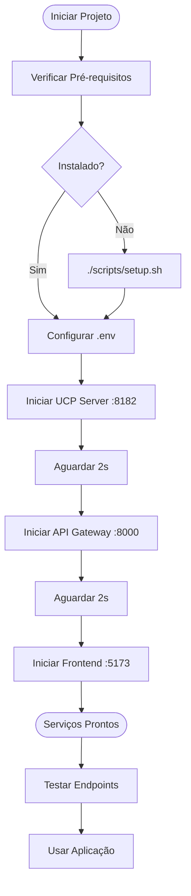

# Guia de Instalação e Execução

Este guia explica como instalar, configurar e executar todos os serviços do projeto Livraria Virtual UCP.

---

## 📋 Índice

- [Pré-requisitos](#pré-requisitos)
- [Instalação Completa](#instalação-completa)
- [Configuração](#configuração)
- [Execução dos Serviços](#execução-dos-serviços)
- [Verificação](#verificação)
- [Troubleshooting](#troubleshooting)

---

## Pré-requisitos

### Software Necessário

| Software | Versão Mínima | Como Instalar |
|----------|---------------|---------------|
| **Python** | 3.11+ | [python.org](https://www.python.org/downloads/) |
| **Node.js** | 18+ | [nodejs.org](https://nodejs.org/) |
| **npm** | 9+ | Vem com Node.js |
| **Git** | 2.30+ | [git-scm.com](https://git-scm.com/) |

### Verificar Instalações

```bash
# Verificar Python
python3 --version  # Deve ser 3.11 ou superior

# Verificar Node.js
node --version     # Deve ser 18 ou superior

# Verificar npm
npm --version      # Deve ser 9 ou superior

# Verificar Git
git --version
```

### Chaves de API (Opcional mas Recomendado)

Para funcionalidades completas, você precisará de:

- **Google API Key** (Gemini) - Para LLM nos agentes
  - Obter em: https://ai.google.dev/
  - Gratuito com limites generosos

- **OpenAI API Key** (Opcional) - Fallback para LLM
  - Obter em: https://platform.openai.com/
  - Requer créditos

- **Anthropic API Key** (Opcional) - Fallback alternativo
  - Obter em: https://console.anthropic.com/
  - Requer créditos

> **Nota:** O projeto funciona sem LLM usando detecção de intenção baseada em keywords, mas a experiência será melhor com LLM habilitado.

---

## Instalação Completa

### Opção 1: Script Automatizado (Recomendado)

O projeto inclui um script de setup que configura tudo automaticamente:

```bash
# Tornar scripts executáveis
chmod +x scripts/*.sh

# Executar setup completo
./scripts/setup.sh
```

Este script:
- ✅ Cria ambientes virtuais Python
- ✅ Instala todas as dependências
- ✅ Copia arquivos `.env.example` para `.env`
- ✅ Importa catálogo de livros inicial

### Opção 2: Instalação Manual

#### 1. Clonar o Repositório

```bash
git clone <repo-url>
cd FuturesUCP
```

#### 2. Backend

```bash
cd backend

# Criar ambiente virtual
python3 -m venv venv

# Ativar ambiente virtual
source venv/bin/activate  # Linux/Mac
# ou
venv\Scripts\activate     # Windows

# Instalar dependências
pip install -r requirements.txt

# Copiar arquivo de configuração
cp .env.example .env

# Editar .env com suas chaves de API
nano .env  # ou use seu editor preferido
```

#### 3. User Agent

```bash
cd ../user_agent

# Criar ambiente virtual
python3 -m venv venv

# Ativar ambiente virtual
source venv/bin/activate  # Linux/Mac
# ou
venv\Scripts\activate     # Windows

# Instalar dependências
pip install -r requirements.txt

# Copiar arquivo de configuração
cp .env.example .env

# Editar .env com suas chaves de API
nano .env
```

#### 4. Frontend

```bash
cd ../frontend

# Instalar dependências
npm install
```

#### 5. Importar Dados Iniciais

```bash
cd ../backend
source venv/bin/activate

# Importar catálogo de livros
python -m src.db.import_books
```

---

## Configuração

### Arquivos `.env`

Cada componente tem seu próprio arquivo `.env`:

#### Backend (`backend/.env`)

```bash
# Servidor
API_HOST=0.0.0.0
API_PORT=8000
UCP_HOST=0.0.0.0
UCP_PORT=8182
MCP_PORT=8183

# Banco de dados
PRODUCTS_DB_PATH=./data/products.db
TRANSACTIONS_DB_PATH=./data/transactions.db

# LLM - Gemini (Principal)
GOOGLE_API_KEY=sua-chave-aqui
LLM_MODEL=gemini-2.0-flash-lite
LLM_TEMPERATURE=0.7
LLM_MAX_TOKENS=1024

# LLM - Alternativos (opcional)
OPENAI_API_KEY=sk-...
ANTHROPIC_API_KEY=sk-ant-...

# Segurança
JWT_EXPIRY_SECONDS=3600
AP2_KEY_ID=livraria-key-001

# Debug
DEBUG=true
LOG_LEVEL=INFO
```

#### User Agent (`user_agent/.env`)

```bash
# LLM - Gemini (Recomendado)
GOOGLE_API_KEY=sua-chave-aqui
GEMINI_MODEL=gemini-2.0-flash-lite

# LLM - Fallback (opcional)
OPENAI_API_KEY=sk-...
ANTHROPIC_API_KEY=sk-ant-...
LLM_MODEL=gpt-4-turbo-preview

# Servidores
API_GATEWAY_URL=http://localhost:8000
UCP_SERVER_URL=http://localhost:8182
DEFAULT_STORES=["http://localhost:8182"]

# A2A
A2A_RECONNECT_INTERVAL=5.0
A2A_PING_INTERVAL=30.0

# Segurança
USER_KEY_ID=user-agent-key-001
JWT_EXPIRY_SECONDS=3600

# Debug
DEBUG=True
LOG_LEVEL=INFO
```

### Configuração Mínima

Se você não tiver chaves de API, o projeto ainda funciona:

```bash
# Backend - Deixe GOOGLE_API_KEY vazio
GOOGLE_API_KEY=

# User Agent - Deixe GOOGLE_API_KEY vazio
GOOGLE_API_KEY=
```

Os agentes usarão detecção de intenção baseada em keywords em vez de LLM.

---

## Execução dos Serviços

### Opção 1: Demo Completa (Tudo de Uma Vez)

O script `demo.sh` inicia todos os serviços automaticamente:

```bash
./scripts/demo.sh
```

Este script:
- ✅ Inicia UCP Server (porta 8182)
- ✅ Inicia API Gateway (porta 8000)
- ✅ Inicia Frontend (porta 5173)
- ✅ Mostra URLs e status

**Pressione `Ctrl+C` para parar todos os serviços.**

### Opção 2: Serviços Individuais

#### Terminal 1: Backend (UCP Server + API Gateway)

```bash
cd backend
source venv/bin/activate  # Linux/Mac
# ou
venv\Scripts\activate     # Windows

# Usar script
./scripts/start_backend.sh

# Ou manualmente:
# UCP Server
uvicorn src.ucp_server.server:app --host 0.0.0.0 --port 8182 &

# API Gateway (aguardar 2 segundos após UCP Server)
uvicorn src.main:app --host 0.0.0.0 --port 8000 &
```

#### Terminal 2: Frontend

```bash
cd frontend

# Usar script
./scripts/start_frontend.sh

# Ou manualmente:
npm run dev
```

#### Terminal 3: User Agent CLI (Opcional)

```bash
cd user_agent
source venv/bin/activate  # Linux/Mac
# ou
venv\Scripts\activate     # Windows

# Usar script
./scripts/start_user_agent.sh

# Ou manualmente:
python -m src.cli chat --store http://localhost:8182
```

### Opção 3: Usando Makefile

```bash
# Instalar tudo
make install

# Iniciar todos os serviços
make up

# Ver status
make status

# Parar todos os serviços
make down

# Reiniciar
make restart
```

### Opção 4: Comandos Make Individuais

```bash
# Serviços individuais
make up-ucp          # UCP Server
make up-api          # API Gateway
make up-frontend     # Frontend

# Parar serviços individuais
make down-ucp
make down-api
make down-frontend

# Ver ajuda completa
make help
```

---

## Verificação

### Verificar Serviços em Execução

```bash
# Usar Makefile
make status

# Ou manualmente
lsof -i :8182  # UCP Server
lsof -i :8000  # API Gateway
lsof -i :5173  # Frontend
```

### Testar Endpoints

#### 1. Health Checks

```bash
# API Gateway
curl http://localhost:8000/health

# UCP Server
curl http://localhost:8182/health
```

#### 2. Discovery UCP

```bash
curl http://localhost:8182/.well-known/ucp | python3 -m json.tool
```

#### 3. Discovery A2A

```bash
curl http://localhost:8000/.well-known/agent.json | python3 -m json.tool
```

#### 4. Buscar Livros

```bash
curl "http://localhost:8182/books/search?search=python" | python3 -m json.tool
```

### Testar Frontend

1. Abra o navegador em `http://localhost:5173`
2. Navegue pelo catálogo
3. Adicione livros ao carrinho
4. Clique no ícone de chat para conversar com o agente
5. Finalize uma compra

### Testar User Agent CLI

```bash
cd user_agent
source venv/bin/activate

# Descobrir loja
python -m src.cli discover http://localhost:8182

# Buscar produtos
python -m src.cli search python --store http://localhost:8182

# Chat interativo
python -m src.cli chat --store http://localhost:8182
```

---

## Portas Utilizadas

| Serviço | Porta | Descrição |
|---------|-------|-----------|
| **Frontend** | 5173 | Interface web React (Vite) |
| **API Gateway** | 8000 | REST API + WebSocket Chat/A2A |
| **UCP Server** | 8182 | Servidor Universal Commerce Protocol |
| **MCP Server** | 8183 | Model Context Protocol (integrado) |

### Verificar Portas Livres

```bash
# Linux/Mac
lsof -i :8000
lsof -i :8182
lsof -i :5173

# Windows
netstat -ano | findstr :8000
netstat -ano | findstr :8182
netstat -ano | findstr :5173
```

Se uma porta estiver em uso, você pode:

1. **Parar o processo** que está usando a porta
2. **Alterar a porta** no arquivo `.env` correspondente

---

## Estrutura de Execução

### Diagrama de Inicialização



### Ordem de Inicialização

1. **UCP Server** (porta 8182) - Deve iniciar primeiro
2. **API Gateway** (porta 8000) - Depende do UCP Server
3. **Frontend** (porta 5173) - Depende do API Gateway
4. **User Agent** (CLI) - Opcional, pode rodar independente

---

## Comandos Úteis

### Backend

```bash
cd backend
source venv/bin/activate

# Importar dados
python -m src.db.import_books

# Executar testes
pytest tests/

# Ver logs
tail -f logs/app.log  # Se configurado
```

### User Agent

```bash
cd user_agent
source venv/bin/activate

# Chat interativo
python -m src.cli chat

# Descobrir loja
python -m src.cli discover http://localhost:8182

# Buscar produtos
python -m src.cli search "python" --store http://localhost:8182

# Comprar produto
python -m src.cli buy book_001 --store http://localhost:8182 --qty 2

# Ver informações
python -m src.cli info
```

### Frontend

```bash
cd frontend

# Desenvolvimento
npm run dev

# Build de produção
npm run build

# Preview do build
npm run preview
```

---

## Troubleshooting

### Problema: Porta já em uso

**Sintoma:**
```
Error: Address already in use
```

**Solução:**

```bash
# Encontrar processo usando a porta
lsof -i :8000  # Linux/Mac
netstat -ano | findstr :8000  # Windows

# Parar processo
kill -9 <PID>  # Linux/Mac
taskkill /PID <PID> /F  # Windows

# Ou usar Makefile
make down
```

### Problema: Dependências não instaladas

**Sintoma:**
```
ModuleNotFoundError: No module named 'fastapi'
```

**Solução:**

```bash
# Backend
cd backend
source venv/bin/activate
pip install -r requirements.txt

# User Agent
cd user_agent
source venv/bin/activate
pip install -r requirements.txt

# Frontend
cd frontend
npm install
```

### Problema: Banco de dados não encontrado

**Sintoma:**
```
FileNotFoundError: ./data/products.db
```

**Solução:**

```bash
cd backend
source venv/bin/activate

# Criar diretório de dados
mkdir -p data

# Importar catálogo
python -m src.db.import_books
```

### Problema: LLM não funciona

**Sintoma:**
```
LLM not available - using keyword detection
```

**Solução:**

1. Verificar se `GOOGLE_API_KEY` está configurado no `.env`
2. Verificar se a chave é válida
3. Verificar conexão com internet
4. O projeto funciona sem LLM usando keywords

### Problema: WebSocket não conecta

**Sintoma:**
```
WebSocket connection failed
```

**Solução:**

1. Verificar se API Gateway está rodando (porta 8000)
2. Verificar se UCP Server está rodando (porta 8182)
3. Verificar firewall/antivírus
4. Testar conexão:
   ```bash
   curl http://localhost:8000/health
   ```

### Problema: Frontend não carrega

**Sintoma:**
```
Failed to fetch
```

**Solução:**

1. Verificar se API Gateway está rodando
2. Verificar URL no código do frontend
3. Verificar CORS no backend
4. Abrir console do navegador (F12) para ver erros

### Problema: User Agent não encontra loja

**Sintoma:**
```
Store discovery failed
```

**Solução:**

1. Verificar se UCP Server está rodando
2. Testar discovery manualmente:
   ```bash
   curl http://localhost:8182/.well-known/ucp
   ```
3. Verificar URL no comando:
   ```bash
   python -m src.cli discover http://localhost:8182
   ```

---

## Checklist de Instalação

Use este checklist para garantir que tudo está configurado:

### Pré-requisitos
- [ ] Python 3.11+ instalado
- [ ] Node.js 18+ instalado
- [ ] Git instalado
- [ ] Repositório clonado

### Backend
- [ ] Ambiente virtual criado (`backend/venv/`)
- [ ] Dependências instaladas (`pip install -r requirements.txt`)
- [ ] Arquivo `.env` configurado
- [ ] Banco de dados importado (`python -m src.db.import_books`)
- [ ] UCP Server inicia sem erros (porta 8182)
- [ ] API Gateway inicia sem erros (porta 8000)

### User Agent
- [ ] Ambiente virtual criado (`user_agent/venv/`)
- [ ] Dependências instaladas (`pip install -r requirements.txt`)
- [ ] Arquivo `.env` configurado
- [ ] CLI funciona (`python -m src.cli info`)

### Frontend
- [ ] Dependências instaladas (`npm install`)
- [ ] Frontend inicia sem erros (`npm run dev`)
- [ ] Acessível em `http://localhost:5173`

### Testes
- [ ] Health check API Gateway: `curl http://localhost:8000/health`
- [ ] Health check UCP Server: `curl http://localhost:8182/health`
- [ ] Discovery UCP: `curl http://localhost:8182/.well-known/ucp`
- [ ] Discovery A2A: `curl http://localhost:8000/.well-known/agent.json`
- [ ] Frontend carrega no navegador
- [ ] User Agent descobre loja

---

## Exemplos de Uso

### Exemplo 1: Demo Completa

```bash
# 1. Setup inicial (apenas primeira vez)
./scripts/setup.sh

# 2. Iniciar tudo
./scripts/demo.sh

# 3. Abrir navegador
# http://localhost:5173

# 4. Em outro terminal, testar User Agent
cd user_agent
source venv/bin/activate
python -m src.cli chat --store http://localhost:8182
```

### Exemplo 2: Desenvolvimento Backend

```bash
# Terminal 1: UCP Server
cd backend
source venv/bin/activate
uvicorn src.ucp_server.server:app --host 0.0.0.0 --port 8182 --reload

# Terminal 2: API Gateway
cd backend
source venv/bin/activate
uvicorn src.main:app --host 0.0.0.0 --port 8000 --reload

# Terminal 3: Frontend
cd frontend
npm run dev
```

### Exemplo 3: Teste Rápido

```bash
# Usar Makefile
make install    # Instalar tudo
make up         # Iniciar serviços
make status     # Verificar status
make demo-ucp   # Ver perfil UCP
make down       # Parar tudo
```

---

## Próximos Passos

Após instalar e executar os serviços:

1. **Explorar Frontend** - Navegue pelo catálogo em `http://localhost:5173`
2. **Testar Chat** - Use o chat para conversar com o Store Agent
3. **Testar User Agent** - Execute o CLI do User Agent
4. **Ler Documentação** - Consulte [`docs/listdocs.md`](listdocs.md) para documentação completa
5. **Explorar Protocolos** - Teste UCP, A2A e AP2

---

## Referências

- **Documentação Completa:** [`docs/listdocs.md`](listdocs.md)
- **Especificação Técnica:** [`docs/techSpec.md`](techSpec.md)
- **Arquitetura:** [`docs/architecture/README.md`](architecture/README.md)
- **Backend:** [`backend/src/src.md`](../backend/src/src.md)
- **User Agent:** [`user_agent/userAgent.md`](../user_agent/userAgent.md)

---

## Suporte

Se encontrar problemas:

1. Verifique a seção [Troubleshooting](#troubleshooting)
2. Consulte os logs dos serviços
3. Verifique se todas as portas estão livres
4. Confirme que os arquivos `.env` estão configurados corretamente

---

*Última atualização: 2026-02-04*
