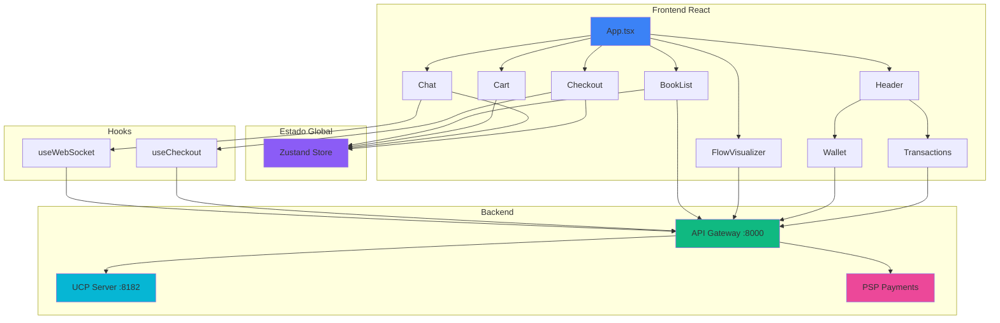
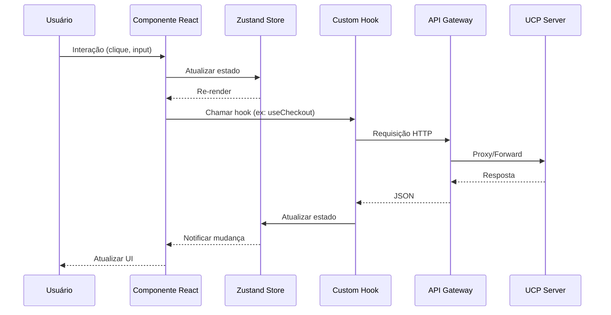
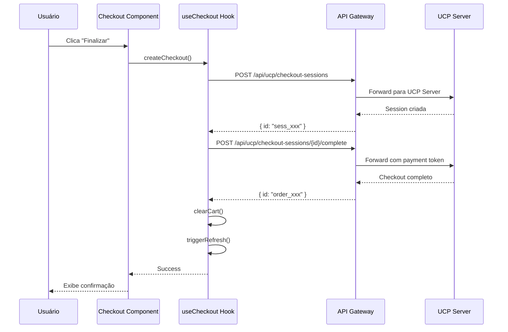
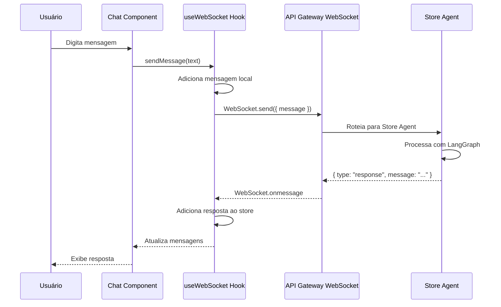
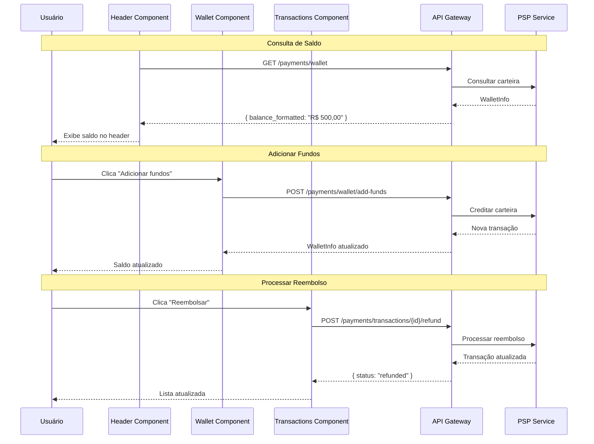
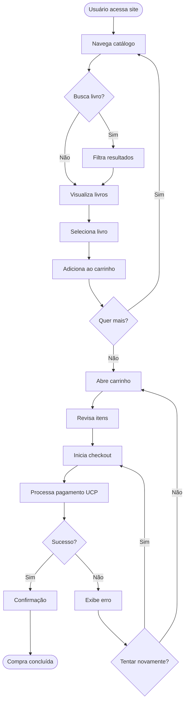
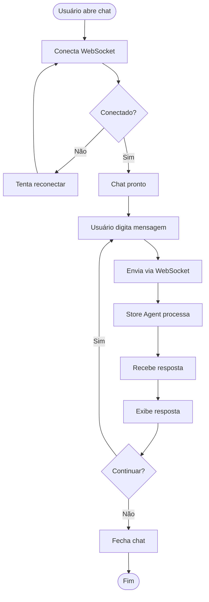

# Frontend - Livraria Virtual UCP

Documentação completa do frontend React da Livraria Virtual UCP.

---

## 📋 Visão Geral

O frontend é uma aplicação React moderna construída com **Vite**, **TypeScript** e **Tailwind CSS**. Ele fornece uma interface web completa para navegação do catálogo, gerenciamento de carrinho, checkout via UCP e chat em tempo real com o Store Agent via WebSocket.

### Características Principais

- **Catálogo de Livros**: Busca, filtros por categoria e visualização de produtos
- **Carrinho de Compras**: Gerenciamento de itens com persistência local
- **Checkout UCP**: Integração completa com Universal Commerce Protocol
- **Chat em Tempo Real**: Comunicação WebSocket com Store Agent (A2A)
- **Visualizador de Fluxo**: Demonstração interativa de venda real com UCP + A2A + AP2
- **Carteira Virtual**: Visualização de saldo e gerenciamento de fundos (PSP simulado)
- **Histórico de Transações**: Listagem, filtros e processamento de reembolsos
- **Design Responsivo**: Interface adaptável para desktop e mobile

---

## 🏗️ Arquitetura

### Estrutura de Diretórios

```
frontend/
├── src/
│   ├── main.tsx              # Entry point
│   ├── App.tsx               # Componente raiz
│   ├── index.css             # Estilos globais
│   │
│   ├── components/           # Componentes React
│   │   ├── Header.tsx        # Cabeçalho com navegação e saldo
│   │   ├── BookList.tsx      # Lista de livros com busca/filtro
│   │   ├── BookCard.tsx      # Card individual de livro
│   │   ├── Cart.tsx          # Drawer do carrinho
│   │   ├── Chat.tsx          # Widget de chat WebSocket
│   │   ├── Checkout.tsx      # Modal de checkout UCP
│   │   ├── FlowVisualizer.tsx # Visualizador de fluxo interativo
│   │   ├── Wallet.tsx        # Modal da carteira virtual
│   │   ├── Transactions.tsx  # Modal de histórico PSP
│   │   └── index.ts          # Exports centralizados
│   │
│   ├── hooks/                # Custom hooks
│   │   ├── useWebSocket.ts   # Hook para conexão WebSocket
│   │   └── useCheckout.ts    # Hook para checkout UCP
│   │
│   ├── store/                # Estado global (Zustand)
│   │   └── useStore.ts       # Store principal
│   │
│   └── types/                # Definições TypeScript
│       └── index.ts          # Tipos compartilhados
│
├── index.html                # HTML template
├── vite.config.ts            # Configuração Vite
├── tailwind.config.js        # Configuração Tailwind
├── tsconfig.json             # Configuração TypeScript
└── package.json              # Dependências
```

### Diagrama de Arquitetura



### Fluxo de Dados



---

## 🧩 Componentes Principais

### 1. App.tsx

Componente raiz da aplicação. Orquestra todos os componentes principais e gerencia o estado de abertura do FlowVisualizer.

**Responsabilidades:**
- Layout principal da aplicação
- Seção hero com informações sobre UCP
- Integração de todos os componentes
- Gerenciamento de modais/drawers

**Estrutura:**
```typescript
function App() {
  const [isFlowPanelOpen, setFlowPanelOpen] = useState(false);
  
  return (
    <div>
      <Header />
      <main>
        {/* Hero Section */}
        {/* Catálogo */}
        {/* Sobre UCP */}
      </main>
      <Cart />
      <Chat />
      <FlowVisualizer />
    </div>
  );
}
```

### 2. Header.tsx

Cabeçalho fixo com navegação, saldo da carteira e ações principais.

**Funcionalidades:**
- Logo e título da livraria
- Links de navegação (Catálogo, Categorias, Sobre)
- Exibição do saldo da carteira (desktop)
- Botão da carteira virtual
- Botão de transações PSP
- Botão do carrinho com contador de itens
- Menu mobile (preparado)

**Estado:**
- Usa `useStore` para acessar `cartItems`, `toggleCart` e `refreshTrigger`
- Estado local para `walletInfo`, `isWalletOpen`, `isTransactionsOpen`

**Endpoints:**
- `GET /payments/wallet` - Atualiza saldo periodicamente (30s)

**Integração:**
- Observa `refreshTrigger` para atualizar saldo após checkout
- Abre modais `Wallet` e `Transactions` via estado local

### 3. BookList.tsx

Lista de livros com busca e filtros.

**Funcionalidades:**
- Busca por título, autor ou descrição
- Filtro por categoria
- Carregamento de livros via API (`/api/books`)
- Atualização automática após checkout (via `refreshTrigger`)
- Grid responsivo de cards

**Estado Local:**
- `books`: Lista completa de livros
- `filteredBooks`: Livros filtrados
- `categories`: Lista de categorias únicas
- `selectedCategory`: Categoria selecionada
- `searchTerm`: Termo de busca
- `loading`: Estado de carregamento

**Integração:**
- Observa `refreshTrigger` do store para atualizar após checkout
- Faz fetch para `/api/books` (proxied para `http://localhost:8000/api/books`)

### 4. BookCard.tsx

Card individual de livro no catálogo.

**Funcionalidades:**
- Exibição de informações do livro (título, autor, descrição, preço)
- Badge de categoria
- Indicador de estoque
- Botão "Adicionar ao carrinho"
- Botão opcional "Ver detalhes"

**Props:**
```typescript
interface BookCardProps {
  book: Book;
  onViewDetails?: (book: Book) => void;
}
```

**Integração:**
- Usa `useStore().addToCart` para adicionar ao carrinho

### 5. Cart.tsx

Drawer lateral para gerenciamento do carrinho.

**Funcionalidades:**
- Lista de itens do carrinho
- Ajuste de quantidades (+/-)
- Remoção de itens
- Cálculo automático do total
- Botão "Finalizar" que abre modal de checkout
- Persistência local (via Zustand persist middleware)

**Estado:**
- Usa `useStore` para:
  - `cartItems`, `cartTotal`
  - `isCartOpen`, `toggleCart`
  - `removeFromCart`, `updateQuantity`, `clearCart`

**Layout:**
- Drawer deslizante da direita
- Overlay escuro quando aberto
- Footer fixo com total e ações

### 6. Chat.tsx

Widget de chat em tempo real com Store Agent.

**Funcionalidades:**
- Conexão WebSocket automática (`/ws/chat`)
- Envio e recebimento de mensagens
- Indicador de status de conexão
- Renderização de Markdown nas respostas do agente
- Auto-scroll para última mensagem
- FAB (Floating Action Button) para abrir/fechar
- Layout responsivo (fullscreen mobile, floating desktop)

**Estado:**
- Usa `useStore` para:
  - `messages`, `isChatOpen`, `toggleChat`, `isConnected`
- Usa `useWebSocket` hook para:
  - `sendMessage`, `isConnected`

**Layout:**
- Mobile: Fullscreen quando aberto
- Desktop: Janela flutuante no canto inferior direito (396x600px)
- Header com status de conexão
- Área de mensagens com scroll
- Input com botão de envio

### 7. Checkout.tsx

Modal de checkout integrado com UCP.

**Funcionalidades:**
- Resumo do pedido
- Processamento via UCP (`/api/ucp/checkout-sessions`)
- Estados: review → processing → success/error
- Limpeza automática do carrinho após sucesso
- Atualização de estoque (via `triggerRefresh`)

**Fluxo:**
1. **Review**: Exibe itens e total
2. **Processing**: Cria checkout session → Completa checkout
3. **Success**: Exibe confirmação com ID do pedido
4. **Error**: Permite tentar novamente

**Integração:**
- Usa `useCheckout` hook para processar checkout
- Chama `/api/ucp/checkout-sessions` (POST)
- Chama `/api/ucp/checkout-sessions/{id}/complete` (POST)

### 8. FlowVisualizer.tsx

Visualizador interativo de fluxo de comunicação UCP + A2A + AP2.

**Funcionalidades:**
- Diagrama em árvore animado
- Execução de venda real durante a demonstração
- Log de mensagens em tempo real
- Animações de partículas viajando entre nós
- Controles de play/pause/reset
- Exibição de estoque antes/depois da venda

**Nós do Diagrama:**
- User Agent (azul)
- A2A (roxo)
- Store Agent (índigo)
- AP2 (verde)
- UCP (ciano)
- Database (âmbar)
- Checkout (esmeralda)

**Fluxo de Mensagens:**
1. Conexão A2A
2. Handshake
3. Discovery UCP
4. Busca de produtos
5. Seleção de item
6. Mandatos AP2 (Intent, Cart, Payment)
7. Criação de checkout
8. Completação com mandato
9. Atualização de estoque
10. Confirmação

**Integração:**
- Executa venda real no passo 12
- Busca livro disponível
- Cria checkout session
- Completa checkout
- Verifica estoque atualizado

### 9. Wallet.tsx

Modal da carteira virtual com gerenciamento de saldo e transações.

**Funcionalidades:**
- Exibição de saldo formatado
- Adicionar fundos (simulado)
- Histórico de transações recentes
- Indicadores de status por tipo de transação
- Atualização de dados em tempo real

**Props:**
```typescript
interface WalletProps {
  isOpen: boolean;
  onClose: () => void;
}
```

**Endpoints:**
- `GET /payments/wallet` - Obter informações da carteira
- `GET /payments/transactions` - Listar transações
- `POST /payments/wallet/add-funds` - Adicionar fundos

**Layout:**
- Modal centralizado com overlay
- Header gradiente com saldo destacado
- Limite de crédito (se aplicável)
- Lista de transações com ícones por tipo
- Botão para adicionar fundos (demo)

**Tipos de Transação:**
| Tipo | Ícone | Cor |
|------|-------|-----|
| `payment` | TrendingDown | Vermelho |
| `refund` | RefreshCw | Azul |
| `credit` | TrendingUp | Verde |

### 10. Transactions.tsx

Modal com histórico completo de transações do PSP com filtros e reembolso.

**Funcionalidades:**
- Listagem paginada de transações
- Filtros por status (todas, concluídas, pendentes, falhas, reembolsadas)
- Detalhes expandidos por transação
- Processamento de reembolso
- Indicadores de status com ícones

**Props:**
```typescript
interface TransactionsProps {
  isOpen: boolean;
  onClose: () => void;
}
```

**Endpoints:**
- `GET /payments/transactions?status=` - Listar transações filtradas
- `POST /payments/transactions/{id}/refund` - Processar reembolso

**Layout:**
- Modal amplo (max-w-2xl) para exibir detalhes
- Header com botões de atualização e fechar
- Filtros de status como pills
- Lista expansível com detalhes
- Botão de reembolso para transações elegíveis

**Status das Transações:**
| Status | Ícone | Cor | Label |
|--------|-------|-----|-------|
| `completed` | CheckCircle | Verde | Concluído |
| `failed` | XCircle | Vermelho | Falhou |
| `pending` | Clock | Amarelo | Pendente |
| `processing` | RefreshCw | Azul | Processando |
| `refunded` | Undo2 | Roxo | Reembolsado |
| `partially_refunded` | Undo2 | Laranja | Parcial |

**Detalhes Expandidos:**
- ID da transação
- Carteira associada
- Sessão de checkout
- Mandato AP2
- Datas de criação e conclusão
- Valor reembolsado (se aplicável)

---

## 🎣 Hooks Customizados

### useWebSocket.ts

Hook para gerenciar conexão WebSocket com o chat.

**Funcionalidades:**
- Conexão automática na montagem
- Reconexão automática após desconexão (3s)
- Envio de mensagens
- Recebimento e parsing de respostas
- Integração com Zustand store

**API:**
```typescript
const { sendMessage, isConnected, reconnect } = useWebSocket();
```

**Eventos:**
- `connected`: Define session_id
- `response`: Adiciona mensagem do assistente
- `onclose`: Reconecta após 3s
- `onerror`: Log de erro

**Integração com Store:**
- Atualiza `messages`, `sessionId`, `isConnected`
- Detecta checkout completo para trigger refresh

### useCheckout.ts

Hook para processar checkout via UCP.

**Funcionalidades:**
- Criação de checkout session
- Completação de checkout
- Gerenciamento de loading/error
- Limpeza de carrinho após sucesso
- Trigger de refresh para atualizar estoque

**API:**
```typescript
const { createCheckout, loading, error, cartTotal, itemCount } = useCheckout();
```

**Fluxo:**
1. Valida carrinho não vazio
2. Cria checkout session (`POST /api/ucp/checkout-sessions`)
3. Completa checkout (`POST /api/ucp/checkout-sessions/{id}/complete`)
4. Limpa carrinho
5. Trigger refresh

---

## 📦 Estado Global (Zustand)

### useStore.ts

Store principal usando Zustand com persistência.

**Estrutura do Estado:**

```typescript
interface AppState {
  // Cart
  cartItems: CartItem[];
  cartTotal: number;
  addToCart: (book: Book) => void;
  removeFromCart: (bookId: string) => void;
  updateQuantity: (bookId: string, quantity: number) => void;
  clearCart: () => void;

  // Chat
  messages: Message[];
  sessionId: string | null;
  isConnected: boolean;
  addMessage: (message: Message) => void;
  setSessionId: (id: string) => void;
  setConnected: (connected: boolean) => void;
  clearMessages: () => void;

  // Search
  searchQuery: string;
  searchResults: Book[];
  setSearchQuery: (query: string) => void;
  setSearchResults: (results: Book[]) => void;

  // UI
  isChatOpen: boolean;
  isCartOpen: boolean;
  toggleChat: () => void;
  toggleCart: () => void;

  // Refresh trigger
  refreshTrigger: number;
  triggerRefresh: () => void;
}
```

**Persistência:**
- Apenas `cartItems` e `cartTotal` são persistidos
- Storage key: `'livraria-storage'`
- Usa `localStorage` por padrão

**Ações Principais:**

1. **addToCart**: Adiciona livro ou incrementa quantidade
2. **removeFromCart**: Remove item do carrinho
3. **updateQuantity**: Atualiza quantidade (remove se <= 0)
4. **addMessage**: Adiciona mensagem ao chat
5. **triggerRefresh**: Incrementa contador para forçar refresh

---

## 📝 Tipos TypeScript

### types/index.ts

Definições de tipos compartilhados.

```typescript
// Livro
interface Book {
  id: string;
  title: string;
  author: string;
  description: string;
  price: number;        // em centavos
  category: string;
  isbn: string;
  stock: number;
}

// Item do carrinho
interface CartItem {
  book: Book;
  quantity: number;
}

// Carrinho
interface Cart {
  items: CartItem[];
  total: number;
}

// Mensagem do chat
interface Message {
  id: string;
  role: 'user' | 'assistant' | 'system';
  content: string;
  timestamp: Date;
  metadata?: {
    agent?: string;
    results_count?: number;
  };
}

// Sessão de checkout UCP
interface CheckoutSession {
  id: string;
  status: 'pending' | 'ready_for_payment' | 'completed' | 'cancelled';
  lineItems: Array<{
    productId: string;
    quantity: number;
    price: number;
  }>;
  totals: Array<{
    type: string;
    amount: number;
  }>;
  currency: string;
}

// Resultado de busca
interface SearchResult {
  id: string;
  title: string;
  author: string;
  price: number;
  price_formatted: string;
  category: string;
}

// Resposta genérica da API
interface ApiResponse<T> {
  data?: T;
  error?: string;
}

// Informações da carteira virtual
interface WalletInfo {
  wallet_id: string;
  balance: number;
  balance_formatted: string;
  credit_limit: number;
  available_credit: number;
  created_at: string;
  last_transaction_at?: string;
}

// Transação da carteira
interface WalletTransaction {
  id: string;
  wallet_id: string;
  type: 'payment' | 'refund' | 'credit';
  amount: number;
  description?: string;
  reference_id?: string;
  status: 'pending' | 'processing' | 'completed' | 'failed' | 'refunded' | 'partially_refunded';
  created_at: string;
  completed_at?: string;
}
```

---

## 🔌 Integração com Backend

### Proxy de Desenvolvimento

O Vite está configurado para fazer proxy de requisições:

```typescript
// vite.config.ts
server: {
  proxy: {
    '/api': {
      target: 'http://localhost:8000',
      changeOrigin: true,
    },
    '/ws': {
      target: 'ws://localhost:8000',
      ws: true,
    },
  },
}
```

**Endpoints Utilizados:**

| Endpoint | Método | Descrição |
|----------|--------|-----------|
| `/api/books` | GET | Lista todos os livros |
| `/api/books/{id}` | GET | Detalhes de um livro |
| `/api/ucp/checkout-sessions` | POST | Criar checkout session |
| `/api/ucp/checkout-sessions/{id}/complete` | POST | Completar checkout |
| `/ws/chat` | WebSocket | Chat com Store Agent |
| `/payments/wallet` | GET | Informações da carteira |
| `/payments/wallet/add-funds` | POST | Adicionar fundos (simulado) |
| `/payments/transactions` | GET | Listar transações |
| `/payments/transactions?status=` | GET | Filtrar transações por status |
| `/payments/transactions/{id}/refund` | POST | Processar reembolso |

### Fluxo de Checkout



### Fluxo de Chat



### Fluxo de Wallet e Pagamentos



---

## 🎨 Estilização

### Tailwind CSS

O projeto usa **Tailwind CSS** para estilização utilitária.

**Configuração:**
- `tailwind.config.js`: Configuração padrão
- `postcss.config.js`: Plugin autoprefixer
- `index.css`: Estilos globais e customizações

**Classes Customizadas:**
- `.line-clamp-2`: Limita texto a 2 linhas
- `.prose`: Estilos para renderização de Markdown
- `.animate-fade-in`: Animação de fade in

### Design System

**Cores Principais:**
- Azul (`blue-600`): Ações primárias, User Agent
- Roxo (`purple-600`): A2A, gradientes
- Verde (`green-600`): Sucesso, preços, AP2
- Ciano (`cyan-600`): UCP
- Âmbar (`amber-600`): Database, avisos

**Componentes Reutilizáveis:**
- Cards com sombra e hover
- Botões com estados (hover, disabled)
- Inputs com focus ring
- Modals e drawers com overlay
- Badges e tags coloridas

---

## 🚀 Configuração e Build

### Desenvolvimento

```bash
# Instalar dependências
npm install

# Iniciar servidor de desenvolvimento
npm run dev

# Acessar em http://localhost:5173
```

### Build de Produção

```bash
# Build
npm run build

# Preview do build
npm run preview
```

### Linting

```bash
# Executar ESLint
npm run lint
```

### Estrutura de Build

```
dist/
├── index.html
├── assets/
│   ├── index-{hash}.js
│   └── index-{hash}.css
```

---

## 📊 Fluxos de Uso

### Fluxo de Compra



### Fluxo de Chat



---

## 🔧 Dependências Principais

### Runtime

| Pacote | Versão | Uso |
|--------|--------|-----|
| **react** | ^18.2.0 | Framework UI |
| **react-dom** | ^18.2.0 | Renderização DOM |
| **react-router-dom** | ^6.22.0 | Roteamento (preparado) |
| **zustand** | ^4.5.0 | Estado global |
| **axios** | ^1.6.0 | Cliente HTTP |
| **socket.io-client** | ^4.7.0 | WebSocket (não usado, usa WebSocket nativo) |
| **react-markdown** | ^9.0.0 | Renderização Markdown |
| **lucide-react** | ^0.330.0 | Ícones |
| **clsx** | ^2.1.0 | Classes condicionais |

### Desenvolvimento

| Pacote | Versão | Uso |
|--------|--------|-----|
| **vite** | ^5.0.0 | Build tool |
| **typescript** | ^5.3.0 | Type checking |
| **tailwindcss** | ^3.4.0 | CSS framework |
| **@vitejs/plugin-react** | ^4.2.0 | Plugin React para Vite |
| **eslint** | ^8.56.0 | Linter |

---

## 🎯 Funcionalidades Avançadas

### FlowVisualizer - Demonstração Interativa

O `FlowVisualizer` é um componente único que demonstra visualmente o fluxo completo de uma venda usando UCP + A2A + AP2.

**Características:**
- **Diagrama em Árvore**: Visualização hierárquica dos componentes
- **Animações**: Partículas viajando entre nós, nós pulsando
- **Venda Real**: Executa uma venda real durante a demonstração
- **Log de Mensagens**: Exibe todas as mensagens trocadas
- **Controles**: Play, pause, reset
- **Estoque**: Mostra estoque antes e depois da venda

**Uso:**
1. Clique no botão "Demonstração Interativa" na página inicial
2. Clique em "Iniciar Venda Real"
3. Observe o fluxo animado
4. Veja o log de mensagens no painel direito
5. Confira o estoque sendo atualizado

### Persistência de Carrinho

O carrinho é persistido automaticamente no `localStorage` usando o middleware `persist` do Zustand.

**Comportamento:**
- Carrinho salvo automaticamente ao adicionar/remover itens
- Restaurado ao recarregar a página
- Limpo apenas após checkout bem-sucedido ou ação manual

### Atualização Automática de Estoque

Após um checkout bem-sucedido:
1. `useCheckout` chama `triggerRefresh()`
2. `BookList` observa `refreshTrigger` via `useStore`
3. `BookList` faz novo fetch de `/api/books`
4. Estoque atualizado é exibido

---

## 🐛 Troubleshooting

### WebSocket não conecta

**Sintoma:** Chat mostra "Desconectado"

**Soluções:**
1. Verificar se API Gateway está rodando (porta 8000)
2. Verificar proxy no `vite.config.ts`
3. Verificar console do navegador para erros
4. Tentar reconectar manualmente (fechar e abrir chat)

### Carrinho não persiste

**Sintoma:** Itens desaparecem ao recarregar

**Soluções:**
1. Verificar se `localStorage` está habilitado
2. Verificar console para erros de serialização
3. Limpar `localStorage` e tentar novamente

### Checkout falha

**Sintoma:** Erro ao finalizar compra

**Soluções:**
1. Verificar se UCP Server está rodando (porta 8182)
2. Verificar se carrinho não está vazio
3. Verificar console para erros de API
4. Verificar se produto tem estoque disponível

### Build falha

**Sintoma:** Erro ao executar `npm run build`

**Soluções:**
1. Verificar versão do Node.js (18+)
2. Limpar `node_modules` e reinstalar
3. Verificar erros de TypeScript
4. Verificar se todas as dependências estão instaladas

---

## 📚 Referências

- **React**: https://react.dev/
- **Vite**: https://vitejs.dev/
- **TypeScript**: https://www.typescriptlang.org/
- **Tailwind CSS**: https://tailwindcss.com/
- **Zustand**: https://zustand-demo.pmnd.rs/
- **React Markdown**: https://github.com/remarkjs/react-markdown
- **Lucide Icons**: https://lucide.dev/

---

## 🔗 Integração com Outros Módulos

- **Backend API Gateway**: [`backend/src/main.py`](../backend/src/main.py)
- **UCP Server**: [`backend/src/ucp_server/ucp.md`](../backend/src/ucp_server/ucp.md)
- **Store Agents**: [`backend/src/agents/agents.md`](../backend/src/agents/agents.md)
- **Guia de Instalação**: [`docs/guide.md`](../docs/guide.md)

---

*Última atualização: 2026-02-04*
