# Módulo Agent - User Agent (Agente Pessoal Genérico)

Este módulo implementa o **User Agent**, um agente pessoal autônomo e genérico que atua como assistente do usuário. O User Agent pode descobrir e interagir com agentes A2A, lojas UCP, usar ferramentas MCP e realizar compras autônomas com pagamento AP2.

## Visão Geral

O User Agent é um agente inteligente que:

- **Conversa** com o usuário de forma natural
- **Descobre e conecta** a agentes A2A e lojas UCP
- **Busca produtos** em múltiplas lojas
- **Gerencia carrinho** multi-loja
- **Compara preços** entre lojas
- **Realiza compras autônomas** com pagamento AP2 (3 mandatos)
- **Usa ferramentas MCP** para ações externas
- **Delega tarefas** para agentes especializados

---

## Arquitetura do Módulo

```
user_agent/src/agent/
├── __init__.py     # Exports públicos do módulo
├── state.py        # Estado compartilhado (UserAgentState)
├── graph.py        # Grafo LangGraph e Runner
├── llm.py          # Integração com LLM (Gemini/OpenAI)
├── agent.md        # Esta documentação
└── nodes/          # Nodes especializados
    ├── discovery.py    # Descoberta de lojas UCP
    ├── shopping.py     # Carrinho e checkout
    ├── compare.py      # Comparação de preços
    └── chat.py         # Conversa via A2A
```

### Diagrama de Arquitetura Geral


### Fluxo de Processamento


---

## Componentes Principais

### 1. State (`state.py`)

Define o estado compartilhado do User Agent usando TypedDict.

#### Diagrama de Estado

```mermaid
classDiagram
    class UserAgentState {
        <<TypedDict>>
        +str session_id
        +str user_name
        +str user_email
        +List~Message~ messages
        +str current_intent
        +Dict intent_params
        +float intent_confidence
        +bool llm_enabled
        +Dict~str,AgentInfo~ connected_agents
        +str active_agent_url
        +Dict~str,StoreInfo~ discovered_stores
        +str active_store_url
        +Dict~str,A2ASession~ a2a_sessions
        +str active_a2a_session
        +Dict~str,MCPToolInfo~ mcp_tools
        +List~str~ mcp_servers
        +str search_query
        +List~Dict~ search_results
        +List~Dict~ comparison_items
        +List~CartItem~ cart_items
        +int cart_total
        +str applied_discount
        +int discount_amount
        +bool checkout_in_progress
        +str checkout_store
        +str checkout_session_id
        +int checkout_total
        +AP2MandateInfo ap2_mandate
        +List~Dict~ recommendations
        +str next_action
        +str error
        +bool waiting_for_confirmation
        +Dict confirmation_context
    }
    
    class UserIntent {
        <<Enum>>
        QUESTION
        CHAT
        HELP
        DISCOVER_AGENT
        LIST_AGENTS
        TALK_TO_AGENT
        DISCOVER
        SEARCH
        COMPARE
        BUY
        ADD_TO_CART
        REMOVE_FROM_CART
        VIEW_CART
        CHECKOUT
        APPLY_DISCOUNT
        RECOMMEND
        USE_TOOL
        LIST_TOOLS
    }
    
    class AgentInfo {
        <<TypedDict>>
        +str url
        +str name
        +str description
        +str version
        +List~str~ skills
        +bool connected
    }
    
    class StoreInfo {
        <<TypedDict>>
        +str url
        +str name
        +str version
        +bool connected
        +List~str~ capabilities
        +bool a2a_connected
    }
    
    class CartItem {
        <<TypedDict>>
        +str store_url
        +str product_id
        +str title
        +int price
        +int quantity
    }
    
    class A2ASession {
        <<TypedDict>>
        +str store_url
        +str agent_id
        +bool connected
        +str last_message_id
        +List~str~ pending_responses
    }
    
    class AP2MandateInfo {
        <<TypedDict>>
        +str intent_mandate_id
        +str cart_mandate_id
        +str cart_mandate_jwt
        +str payment_mandate_id
        +str payment_mandate_jwt
        +int total_authorized
        +str currency
    }
    
    UserAgentState --> UserIntent
    UserAgentState --> AgentInfo
    UserAgentState --> StoreInfo
    UserAgentState --> CartItem
    UserAgentState --> A2ASession
    UserAgentState --> AP2MandateInfo
```



#### Categorias de Estado

```mermaid
flowchart TB
    subgraph State["UserAgentState"]
        subgraph ID["Identificação"]
            session_id
            user_name
            user_email
        end
        
        subgraph Conv["Conversa"]
            messages
            current_intent
            intent_params
            intent_confidence
        end
        
        subgraph Agents["Agentes A2A"]
            connected_agents
            active_agent_url
            a2a_sessions
            active_a2a_session
        end
        
        subgraph Stores["Lojas UCP"]
            discovered_stores
            active_store_url
        end
        
        subgraph Tools["Ferramentas MCP"]
            mcp_tools
            mcp_servers
        end
        
        subgraph Search["Busca"]
            search_query
            search_results
            comparison_items
        end
        
        subgraph Cart["Carrinho Multi-Loja"]
            cart_items
            cart_total
            applied_discount
            discount_amount
        end
        
        subgraph Checkout["Checkout"]
            checkout_in_progress
            checkout_store
            checkout_session_id
            checkout_total
            ap2_mandate
        end
        
        subgraph Flow["Controle"]
            next_action
            error
            waiting_for_confirmation
            confirmation_context
        end
    end
```



#### Intenções Suportadas

| Categoria | Intenção | Descrição |
|-----------|----------|-----------|
| **Geral** | `question` | Pergunta geral |
| **Geral** | `chat` | Conversa casual |
| **Geral** | `help` | Ajuda |
| **A2A** | `discover_agent` | Descobrir agente por URL |
| **A2A** | `list_agents` | Listar agentes conectados |
| **A2A** | `talk_to_agent` | Falar com agente específico |
| **UCP** | `discover` | Descobrir loja UCP |
| **UCP** | `search` | Buscar produtos |
| **UCP** | `compare` | Comparar produtos |
| **UCP** | `add_to_cart` | Adicionar ao carrinho |
| **UCP** | `remove_from_cart` | Remover do carrinho |
| **UCP** | `view_cart` | Ver carrinho |
| **UCP** | `checkout` | Finalizar compra |
| **UCP** | `apply_discount` | Aplicar cupom |
| **UCP** | `recommend` | Pedir recomendações |
| **MCP** | `use_tool` | Usar ferramenta MCP |
| **MCP** | `list_tools` | Listar ferramentas |

---

### 2. Graph (`graph.py`)

Configura e executa o grafo LangGraph do User Agent.

#### Diagrama do Grafo


#### Função `create_user_agent_graph()`


#### Detecção de Intenção com LLM

O router node usa LLM para detectar intenções de forma inteligente:


#### Classe `UserAgentRunner`

Runner principal que gerencia estado e executa o grafo.


##### Métodos Principais

| Método | Parâmetros | Retorno | Descrição |
|--------|------------|---------|-----------|
| `initialize` | session_id, user_name?, user_email? | void | Inicializar estado |
| `process_message` | message | str | Processar mensagem do usuário |
| `get_status` | - | Dict | Obter status geral |
| `connect_agent` | agent_url | bool | Conectar a agente A2A |
| `connect_store_a2a` | store_url | bool | Conectar a loja via A2A |
| `register_mcp_server` | server_url | bool | Registrar servidor MCP |

##### Fluxo `process_message`


---

### 3. LLM Module (`llm.py`)

Módulo de integração com LLMs (Gemini/OpenAI) para melhorar a experiência conversacional.

#### Funcionalidades

- **Detecção de Intenção** - Usa LLM para detectar intenções de forma inteligente
- **Geração de Respostas** - Gera respostas naturais e contextualizadas
- **Formatação de Resultados** - Formata resultados de busca de forma amigável
- **Fallback para Keywords** - Usa regras baseadas em keywords quando LLM não disponível

#### Diagrama de Integração


#### Funções Principais

| Função | Descrição | Retorno |
|--------|-----------|---------|
| `detect_intent_with_llm(message, agents, stores, ...)` | Detecta intenção usando LLM | Dict com intent, params, confidence |
| `generate_response(message, context, system_prompt)` | Gera resposta natural | str |
| `format_search_results_with_llm(results, query)` | Formata resultados de busca | str |
| `is_llm_enabled()` | Verifica se LLM está configurado | bool |
| `get_llm()` | Obtém instância do LLM | ChatGoogleGenerativeAI \| ChatOpenAI \| None |

#### System Prompt

O User Agent usa um system prompt específico que define suas capacidades:

```
Você é um assistente pessoal inteligente chamado User Agent.
Você é o agente autônomo do usuário, capaz de realizar diversas tarefas.

Suas capacidades principais:
1. CONVERSAÇÃO GERAL
2. DESCOBERTA DE AGENTES (A2A)
3. COMÉRCIO AUTÔNOMO (UCP)
4. FERRAMENTAS EXTERNAS (MCP)

Você é o representante autônomo do usuário. Quando precisar fazer uma compra,
VOCÊ gera o mandato de pagamento (AP2) - a autorização está com você.
```

#### Fluxo de Detecção de Intenção


---

## Submódulos

### Nodes (Nodes Especializados)

O submódulo `nodes/` contém os nodes especializados do User Agent.


| Node | Responsabilidade | Intenções |
|------|------------------|-----------|
| **discovery** | Descobrir lojas UCP, buscar produtos | discover, search, recommend |
| **shopping** | Carrinho multi-loja, checkout, AP2 | add_to_cart, remove_from_cart, view_cart, checkout, apply_discount |
| **compare** | Comparar preços entre lojas | compare |
| **chat** | Conversa via A2A com Store Agents | talk_to_agent, chat |

#### Discovery Node

Responsável por descobrir lojas UCP e buscar produtos.

**Funcionalidades:**
- Descobrir lojas por URL via UCP discovery
- Buscar produtos em lojas conectadas
- Formatar resultados de busca

**Fluxo:**


#### Shopping Node

Gerencia carrinho multi-loja e checkout com AP2.

**Funcionalidades:**
- Adicionar/remover itens do carrinho (multi-loja)
- Aplicar cupons de desconto
- Criar checkout sessions via UCP
- Executar pagamento com AP2 (3 mandatos)
- Integração com VirtualWallet para controle de saldo

**Integração com Wallet:**
O shopping_node usa a VirtualWallet para verificar saldo e debitar compras:

```python
from user_agent.src.wallet import get_wallet

wallet = get_wallet()

# Verificar se pode pagar
if wallet.can_pay(checkout_total):
    # Gerar token de pagamento
    token = wallet.generate_payment_token(session_id)
    # Completar checkout...
    # Debitar carteira
    wallet.debit(checkout_total, f"Compra {session_id}")
```

**Fluxo de Checkout:**


#### Compare Node

Compara produtos entre lojas para encontrar melhores preços.

**Funcionalidades:**
- Comparar produtos por índices dos resultados
- Comparação automática de produtos similares
- Formatação de comparação com melhor preço destacado

#### Chat Node

Conversa via A2A com Store Agents.

**Funcionalidades:**
- Conectar via A2A a lojas
- Enviar mensagens ao Store Agent
- Processar respostas e manter contexto
- Fallback para busca direta se A2A falhar

---

## Exports do Módulo

O `__init__.py` exporta os seguintes componentes:

```python
from user_agent.src.agent import (
    # Estado
    UserAgentState,
    create_initial_state,
    Message,
    CartItem,
    StoreInfo,
    AgentInfo,
    MCPToolInfo,
    A2ASession,
    AP2MandateInfo,
    UserIntent,
    
    # Grafo
    user_agent_graph,
    UserAgentRunner,
    
    # LLM
    is_llm_enabled,
    get_llm,
    detect_intent_with_llm,
)
```

### Diagrama de Exports


---

## Fluxos de Uso

### Fluxo de Descoberta de Loja


### Fluxo de Busca e Compra


### Fluxo de Conversa A2A


---

## Gerenciamento de Estado

### Ciclo de Vida do Estado


### Estado Multi-Loja

O User Agent mantém estado separado para múltiplas lojas:


---

## Integração com Outros Módulos

```mermaid
flowchart TB
    subgraph Agent["Módulo Agent"]
        Runner
        Graph
        State
        Nodes
    end
    
    subgraph Integrations["Integrações"]
        A2AClient["clients/A2AClient<br/>Comunicação A2A"]
        UCPClient["clients/UCPClient<br/>Comunicação UCP"]
        MCPClient["clients/MCPClient<br/>Ferramentas MCP"]
        AP2Client["security/AP2Client<br/>Pagamento Autônomo"]
    end
    
    subgraph External["Externo"]
        CLI["CLI Interface"]
        A2AAgents["Agentes A2A"]
        UCPStores["Lojas UCP"]
        MCPServers["Servidores MCP"]
    end
    
    CLI --> Runner
    Runner --> Graph
    Graph --> State
    Graph --> Nodes
    
    Nodes --> A2AClient
    Nodes --> UCPClient
    Nodes --> MCPClient
    Nodes --> AP2Client
    
    A2AClient --> A2AAgents
    UCPClient --> UCPStores
    MCPClient --> MCPServers
    AP2Client --> UCPStores
```

---

## Instâncias Globais

O módulo exporta uma instância global do grafo:

```python
# Grafo compilado (imutável)
user_agent_graph = create_user_agent_graph()
```

### Uso Recomendado

```python
from user_agent.src.agent import UserAgentRunner

# Criar runner
runner = UserAgentRunner()
runner.initialize(session_id="sess_123", user_name="João")

# Processar mensagem
response = await runner.process_message("buscar livros de python")

# Verificar status
status = runner.get_status()
print(f"Lojas: {status['stores_count']}, Carrinho: {status['cart_count']}")
```

---

## Dependências

```mermaid
flowchart TB
    subgraph External["Externas"]
        langgraph["langgraph<br/>StateGraph, END"]
        structlog["structlog<br/>Logging"]
        langchain["langchain-google-genai<br/>ChatGoogleGenerativeAI"]
        langchain_openai["langchain-openai<br/>ChatOpenAI"]
    end
    
    subgraph Internal["Internas"]
        clients["../clients/<br/>A2AClient, UCPClient, MCPClient"]
        security["../security/<br/>AP2Client"]
        config["../config<br/>settings"]
    end
    
    subgraph Agent["Módulo Agent"]
        state["state.py"]
        graph["graph.py"]
        llm["llm.py"]
        nodes["nodes/"]
    end
    
    graph --> langgraph
    graph --> structlog
    graph --> state
    graph --> nodes
    graph --> llm
    
    nodes --> state
    nodes --> clients
    nodes --> security
    
    llm --> langchain
    llm --> langchain_openai
    llm --> config
```

---

## Referências

- **Clients:** [`../clients/client.md`](../clients/client.md)
- **Security:** [`../security/`](../security/)
- **Config:** [`../config.py`](../config.py)
- **LangGraph Docs:** https://langchain-ai.github.io/langgraph/
- **Google Gemini:** https://ai.google.dev/
- **OpenAI:** https://platform.openai.com/
