# Módulo Clients - Clientes de Protocolo

Este módulo implementa os clientes para comunicação com diferentes protocolos utilizados pelo User Agent. Fornece interfaces de alto nível para interagir com lojas UCP, agentes A2A e servidores MCP.

## Visão Geral

O módulo Clients fornece três clientes principais:

- **UCPClient** - Cliente para Universal Commerce Protocol (comércio)
- **A2AClient** - Cliente para Agent-to-Agent Protocol (comunicação entre agentes)
- **MCPClient** - Cliente para Model Context Protocol (ferramentas)

Todos os clientes são assíncronos e suportam context managers (`async with`).

---

## Arquitetura do Módulo

```
user_agent/src/clients/
├── __init__.py     # Exports públicos do módulo
├── client.md       # Esta documentação
├── ucp_client.py   # Cliente UCP
├── a2a_client.py   # Cliente A2A
└── mcp_client.py   # Cliente MCP
```

### Diagrama de Arquitetura Geral

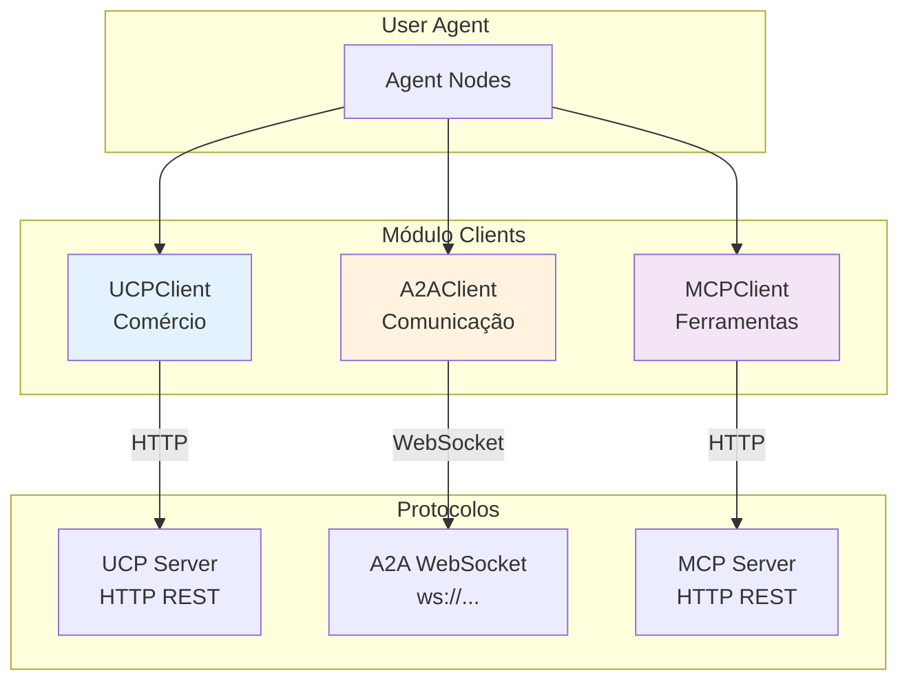
```mermaid
flowchart TB
    subgraph UserAgent["User Agent"]
        Nodes["Agent Nodes"]
    end

    subgraph Clients["Módulo Clients"]
        UCP["UCPClient<br/>Comércio"]
        A2A["A2AClient<br/>Comunicação"]
        MCP["MCPClient<br/>Ferramentas"]
    end

    subgraph Protocols["Protocolos"]
        UCPProto["UCP Server<br/>HTTP REST"]
        A2AProto["A2A WebSocket<br/>ws://..."]
        MCPProto["MCP Server<br/>HTTP REST"]
    end

    Nodes --> UCP
    Nodes --> A2A
    Nodes --> MCP
    
    UCP -->|HTTP| UCPProto
    A2A -->|WebSocket| A2AProto
    MCP -->|HTTP| MCPProto
    
    style UCP fill:#e3f2fd
    style A2A fill:#fff3e0
    style MCP fill:#f3e5f5
```

### Fluxo de Uso

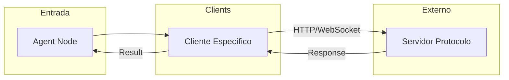
```mermaid
flowchart LR
    subgraph Entry["Entrada"]
        Node["Agent Node"]
    end

    subgraph Clients["Clients"]
        Client["Cliente Específico"]
    end

    subgraph External["Externo"]
        Server["Servidor Protocolo"]
    end

    Node --> Client
    Client -->|HTTP/WebSocket| Server
    Server -->|Response| Client
    Client -->|Result| Node
```

---

## Componentes Principais

### 1. UCPClient (`ucp_client.py`)

Cliente para Universal Commerce Protocol - permite descobrir lojas, buscar produtos e realizar checkout.

#### Diagrama de Classes

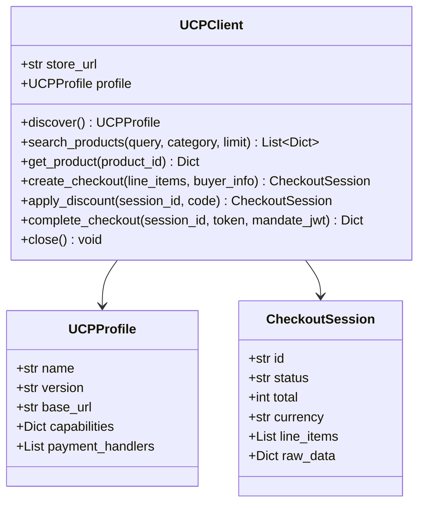
```mermaid
classDiagram
    class UCPClient {
        +str store_url
        +UCPProfile profile
        +discover() UCPProfile
        +search_products(query, category, limit) List~Dict~
        +get_product(product_id) Dict
        +create_checkout(line_items, buyer_info) CheckoutSession
        +apply_discount(session_id, code) CheckoutSession
        +complete_checkout(session_id, token, mandate_jwt) Dict
        +close() void
    }
    
    class UCPProfile {
        +str name
        +str version
        +str base_url
        +Dict capabilities
        +List payment_handlers
    }
    
    class CheckoutSession {
        +str id
        +str status
        +int total
        +str currency
        +List line_items
        +Dict raw_data
    }
    
    UCPClient --> UCPProfile
    UCPClient --> CheckoutSession
```

#### Funcionalidades Principais

| Método | Descrição | Retorno |
|--------|-----------|---------|
| `discover()` | Descobrir loja via `/.well-known/ucp` | UCPProfile \| None |
| `search_products(query, category, limit)` | Buscar produtos | List[Dict] |
| `get_product(product_id)` | Obter detalhes de produto | Dict \| None |
| `create_checkout(line_items, buyer_info)` | Criar sessão de checkout | CheckoutSession \| None |
| `apply_discount(session_id, code)` | Aplicar cupom de desconto | CheckoutSession \| None |
| `complete_checkout(session_id, token, mandate_jwt)` | Completar checkout com pagamento | Dict |

#### Fluxo de Descoberta UCP

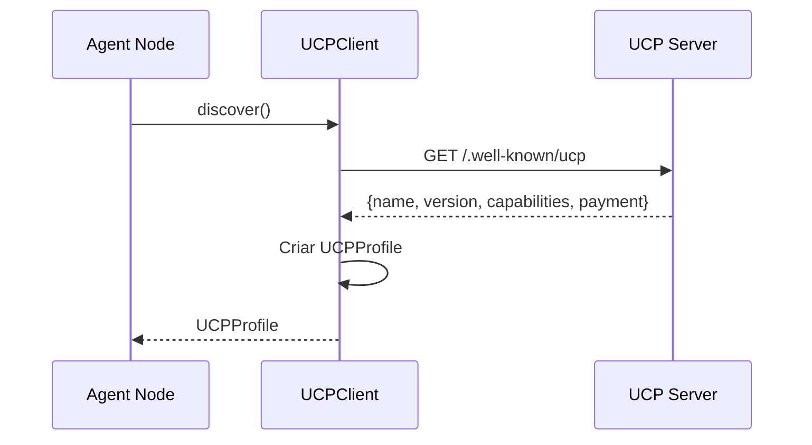
```mermaid
sequenceDiagram
    participant Node as Agent Node
    participant UCP as UCPClient
    participant Store as UCP Server

    Node->>UCP: discover()
    UCP->>Store: GET /.well-known/ucp
    Store-->>UCP: {name, version, capabilities, payment}
    UCP->>UCP: Criar UCPProfile
    UCP-->>Node: UCPProfile
```

#### Fluxo de Checkout Completo

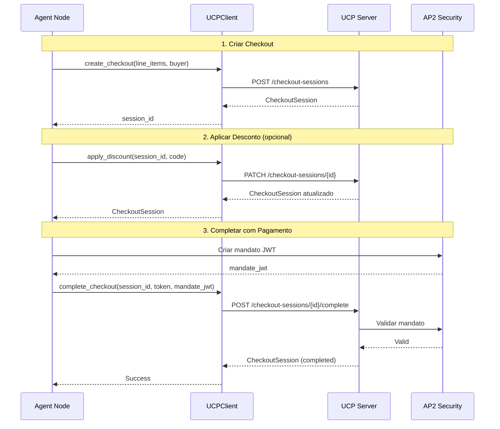
```mermaid
sequenceDiagram
    participant Node as Agent Node
    participant UCP as UCPClient
    participant Store as UCP Server
    participant AP2 as AP2 Security

    Note over Node,AP2: 1. Criar Checkout
    Node->>UCP: create_checkout(line_items, buyer)
    UCP->>Store: POST /checkout-sessions
    Store-->>UCP: CheckoutSession
    UCP-->>Node: session_id

    Note over Node,AP2: 2. Aplicar Desconto (opcional)
    Node->>UCP: apply_discount(session_id, code)
    UCP->>Store: PATCH /checkout-sessions/{id}
    Store-->>UCP: CheckoutSession atualizado
    UCP-->>Node: CheckoutSession

    Note over Node,AP2: 3. Completar com Pagamento
    Node->>AP2: Criar mandato JWT
    AP2-->>Node: mandate_jwt
    Node->>UCP: complete_checkout(session_id, token, mandate_jwt)
    UCP->>Store: POST /checkout-sessions/{id}/complete
    Store->>AP2: Validar mandato
    AP2-->>Store: Valid
    Store-->>UCP: CheckoutSession (completed)
    UCP-->>Node: Success
```

#### Exemplo de Uso

```python
from user_agent.src.clients import UCPClient

async with UCPClient("http://localhost:8182") as client:
    # Descobrir loja
    profile = await client.discover()
    print(f"Loja: {profile.name}, Versão: {profile.version}")
    
    # Buscar produtos
    products = await client.search_products("python", limit=10)
    
    # Criar checkout
    session = await client.create_checkout(
        line_items=[{"product_id": "book_001", "quantity": 1}],
        buyer_info={"name": "João", "email": "joao@example.com"}
    )
    
    # Completar checkout
    result = await client.complete_checkout(
        session_id=session.id,
        payment_token="mock_token",
        mandate_jwt="eyJ..."
    )
```

#### Integração com Wallet

Para checkout completo com controle de saldo, use junto com VirtualWallet:

```python
from user_agent.src.clients import UCPClient
from user_agent.src.security import get_ap2_client
from user_agent.src.wallet import get_wallet

wallet = get_wallet()
ap2 = get_ap2_client()

async with UCPClient(store_url) as client:
    await client.discover()
    
    # Criar checkout
    session = await client.create_checkout(items, buyer)
    
    # Verificar saldo
    if not wallet.can_pay(session.total):
        print("Saldo insuficiente!")
        return
    
    # Gerar token da carteira
    token = wallet.generate_payment_token(session.id)
    
    # Gerar mandato AP2
    mandate = ap2.create_payment_mandate(
        cart_id=session.id,
        cart_total=session.total,
        currency="BRL",
        merchant_id=store_url
    )
    
    # Completar checkout
    result = await client.complete_checkout(session.id, token, mandate.jwt)
    
    # Debitar carteira se sucesso
    if result.get("status") == "completed":
        wallet.debit(session.total, f"Compra {session.id}")
```

---

### 2. A2AClient (`a2a_client.py`)

Cliente para Agent-to-Agent Protocol - comunicação bidirecional via WebSocket com Store Agents.

#### Diagrama de Classes

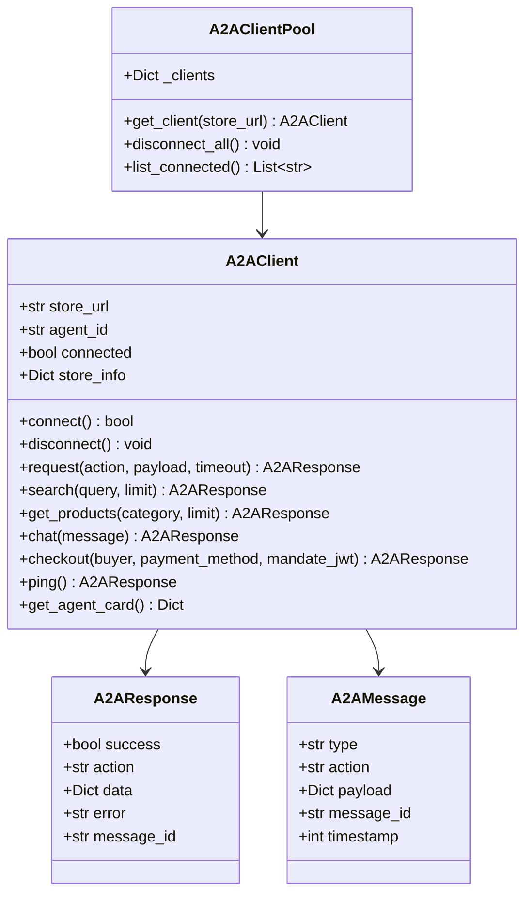
```mermaid
classDiagram
    class A2AClient {
        +str store_url
        +str agent_id
        +bool connected
        +Dict store_info
        +connect() bool
        +disconnect() void
        +request(action, payload, timeout) A2AResponse
        +search(query, limit) A2AResponse
        +get_products(category, limit) A2AResponse
        +chat(message) A2AResponse
        +checkout(buyer, payment_method, mandate_jwt) A2AResponse
        +ping() A2AResponse
        +get_agent_card() Dict
    }
    
    class A2AResponse {
        +bool success
        +str action
        +Dict data
        +str error
        +str message_id
    }
    
    class A2AMessage {
        +str type
        +str action
        +Dict payload
        +str message_id
        +int timestamp
    }
    
    class A2AClientPool {
        +Dict _clients
        +get_client(store_url) A2AClient
        +disconnect_all() void
        +list_connected() List~str~
    }
    
    A2AClient --> A2AResponse
    A2AClient --> A2AMessage
    A2AClientPool --> A2AClient
```

#### Funcionalidades Principais

| Método | Descrição | Retorno |
|--------|-----------|---------|
| `connect(timeout)` | Conectar via WebSocket | bool |
| `disconnect()` | Desconectar do servidor | void |
| `request(action, payload, timeout)` | Enviar requisição A2A | A2AResponse |
| `get_agent_card()` | Obter Agent Card via HTTP | Dict \| None |
| `search(query, limit)` | Buscar produtos | A2AResponse |
| `chat(message)` | Enviar mensagem de chat | A2AResponse |
| `checkout(buyer, payment_method, mandate_jwt)` | Finalizar checkout | A2AResponse |
| `ping()` | Verificar conectividade | A2AResponse |

#### Fluxo de Conexão A2A

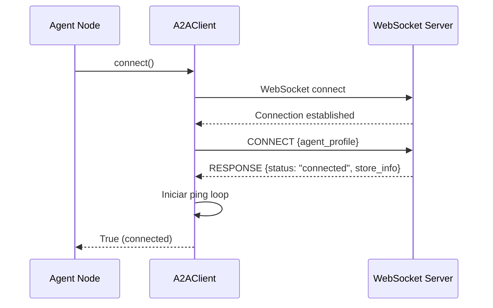
```mermaid
sequenceDiagram
    participant Node as Agent Node
    participant A2A as A2AClient
    participant WS as WebSocket Server

    Node->>A2A: connect()
    A2A->>WS: WebSocket connect
    WS-->>A2A: Connection established
    
    A2A->>WS: CONNECT {agent_profile}
    WS-->>A2A: RESPONSE {status: "connected", store_info}
    
    A2A->>A2A: Iniciar ping loop
    A2A-->>Node: True (connected)
```

#### Fluxo de Requisição A2A

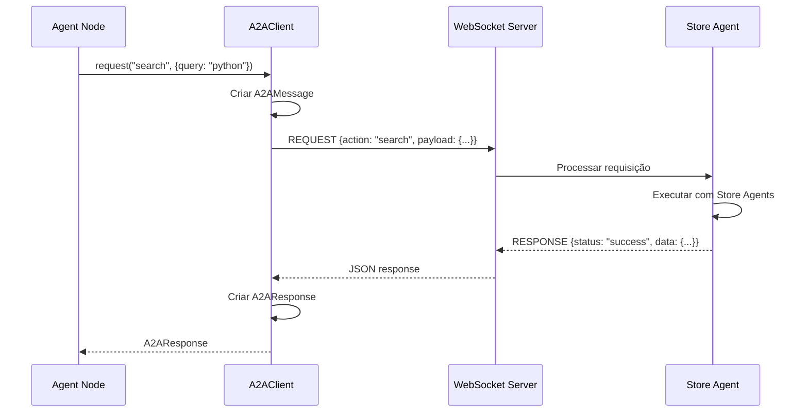
```mermaid
sequenceDiagram
    participant Node as Agent Node
    participant A2A as A2AClient
    participant WS as WebSocket Server
    participant Store as Store Agent

    Node->>A2A: request("search", {query: "python"})
    A2A->>A2A: Criar A2AMessage
    A2A->>WS: REQUEST {action: "search", payload: {...}}
    WS->>Store: Processar requisição
    Store->>Store: Executar com Store Agents
    Store-->>WS: RESPONSE {status: "success", data: {...}}
    WS-->>A2A: JSON response
    A2A->>A2A: Criar A2AResponse
    A2A-->>Node: A2AResponse
```

#### Recursos Avançados

**Reconexão Automática:**

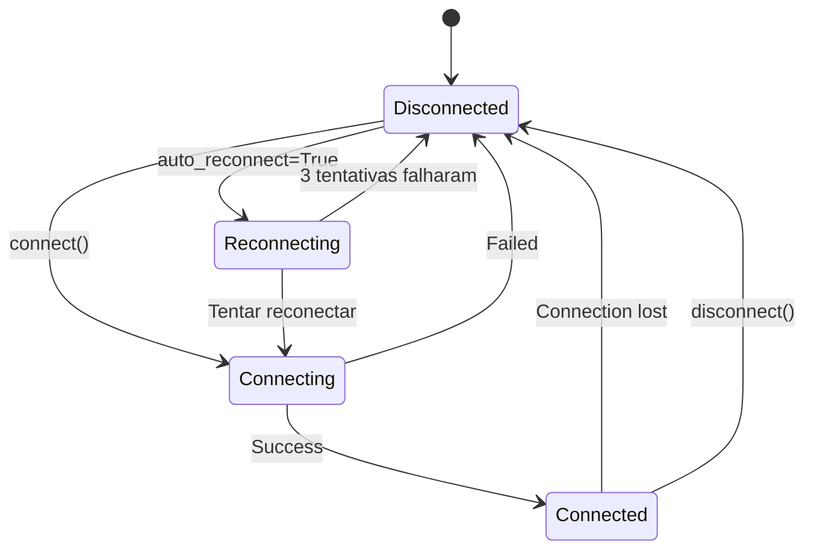
```mermaid
stateDiagram-v2
    [*] --> Disconnected
    Disconnected --> Connecting: connect()
    Connecting --> Connected: Success
    Connecting --> Disconnected: Failed
    
    Connected --> Disconnected: Connection lost
    Disconnected --> Reconnecting: auto_reconnect=True
    Reconnecting --> Connecting: Tentar reconectar
    Reconnecting --> Disconnected: 3 tentativas falharam
    
    Connected --> Disconnected: disconnect()
```

**Keep-Alive (Ping):**

O cliente mantém a conexão ativa enviando pings periódicos:

```python
# Ping automático a cada ping_interval segundos
client = A2AClient(store_url, ping_interval=30.0)
```

**A2AClientPool:**

Pool para gerenciar múltiplas conexões A2A:

```python
from user_agent.src.clients.a2a_client import get_a2a_pool

pool = get_a2a_pool()

# Obter cliente para loja (reutiliza se já conectado)
client = await pool.get_client("http://localhost:8000")

# Listar lojas conectadas
connected = pool.list_connected()

# Desconectar todas
await pool.disconnect_all()
```

#### Exemplo de Uso

```python
from user_agent.src.clients import A2AClient

# Conectar via WebSocket
async with A2AClient("http://localhost:8000") as client:
    # Obter Agent Card (HTTP)
    card = await client.get_agent_card()
    print(f"Agente: {card['name']}")
    
    # Conectar via WebSocket
    connected = await client.connect()
    
    if connected:
        # Buscar produtos
        response = await client.search("python", limit=5)
        if response.success:
            products = response.data.get("products", [])
        
        # Conversar com Store Agent
        response = await client.chat("tem livros de machine learning?")
        if response.success:
            print(response.data.get("message"))
```

---

### 3. MCPClient (`mcp_client.py`)

Cliente para Model Context Protocol - executa ferramentas MCP em servidores remotos.

#### Diagrama de Classes

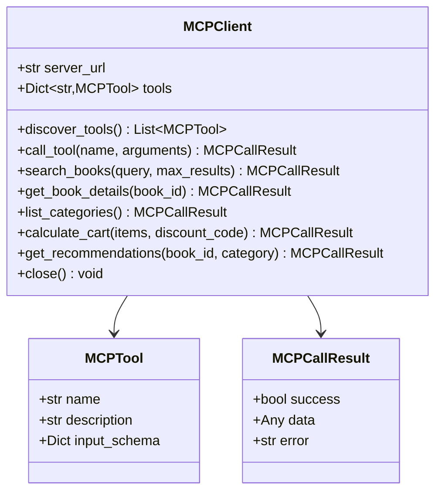
```mermaid
classDiagram
    class MCPClient {
        +str server_url
        +Dict~str,MCPTool~ tools
        +discover_tools() List~MCPTool~
        +call_tool(name, arguments) MCPCallResult
        +search_books(query, max_results) MCPCallResult
        +get_book_details(book_id) MCPCallResult
        +list_categories() MCPCallResult
        +calculate_cart(items, discount_code) MCPCallResult
        +get_recommendations(book_id, category) MCPCallResult
        +close() void
    }
    
    class MCPTool {
        +str name
        +str description
        +Dict input_schema
    }
    
    class MCPCallResult {
        +bool success
        +Any data
        +str error
    }
    
    MCPClient --> MCPTool
    MCPClient --> MCPCallResult
```

#### Funcionalidades Principais

| Método | Descrição | Retorno |
|--------|-----------|---------|
| `discover_tools()` | Descobrir ferramentas disponíveis | List[MCPTool] |
| `call_tool(name, arguments)` | Chamar ferramenta MCP | MCPCallResult |
| `search_books(query, max_results)` | Helper: Buscar livros | MCPCallResult |
| `get_book_details(book_id)` | Helper: Detalhes de livro | MCPCallResult |
| `list_categories()` | Helper: Listar categorias | MCPCallResult |
| `calculate_cart(items, discount_code)` | Helper: Calcular carrinho | MCPCallResult |
| `get_recommendations(book_id, category)` | Helper: Recomendações | MCPCallResult |

#### Fluxo de Descoberta de Ferramentas

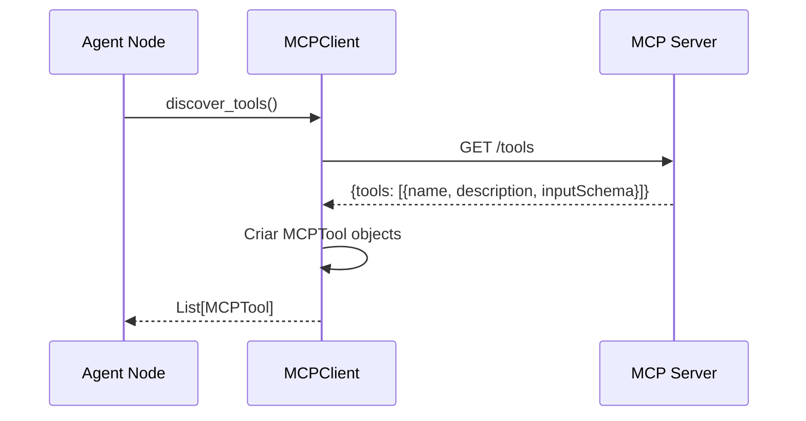
```mermaid
sequenceDiagram
    participant Node as Agent Node
    participant MCP as MCPClient
    participant Server as MCP Server

    Node->>MCP: discover_tools()
    MCP->>Server: GET /tools
    Server-->>MCP: {tools: [{name, description, inputSchema}]}
    MCP->>MCP: Criar MCPTool objects
    MCP-->>Node: List[MCPTool]
```

#### Fluxo de Chamada de Ferramenta

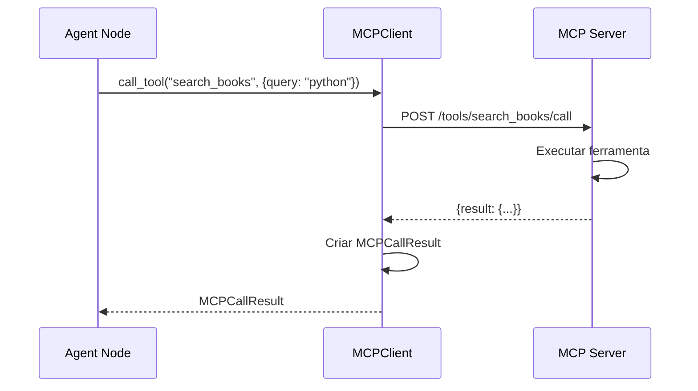
```mermaid
sequenceDiagram
    participant Node as Agent Node
    participant MCP as MCPClient
    participant Server as MCP Server

    Node->>MCP: call_tool("search_books", {query: "python"})
    MCP->>Server: POST /tools/search_books/call
    Server->>Server: Executar ferramenta
    Server-->>MCP: {result: {...}}
    MCP->>MCP: Criar MCPCallResult
    MCP-->>Node: MCPCallResult
```

#### Exemplo de Uso

```python
from user_agent.src.clients import MCPClient

async with MCPClient("http://localhost:8183") as client:
    # Descobrir ferramentas
    tools = await client.discover_tools()
    print(f"Ferramentas disponíveis: {[t.name for t in tools]}")
    
    # Chamar ferramenta específica
    result = await client.call_tool("search_books", {
        "query": "python",
        "max_results": 10
    })
    
    if result.success:
        books = result.data.get("books", [])
    else:
        print(f"Erro: {result.error}")
    
    # Usar helpers
    result = await client.search_books("machine learning", max_results=5)
    result = await client.get_book_details("book_001")
    result = await client.calculate_cart([{"id": "book_001", "quantity": 1}])
```

---

## Exports do Módulo

O `__init__.py` exporta os seguintes componentes:

```python
from user_agent.src.clients import (
    # UCP
    UCPClient,
    UCPProfile,
    CheckoutSession,
    
    # A2A
    A2AClient,
    A2AResponse,
    
    # MCP
    MCPClient,
    MCPTool,
    MCPCallResult,
)
```

### Diagrama de Exports

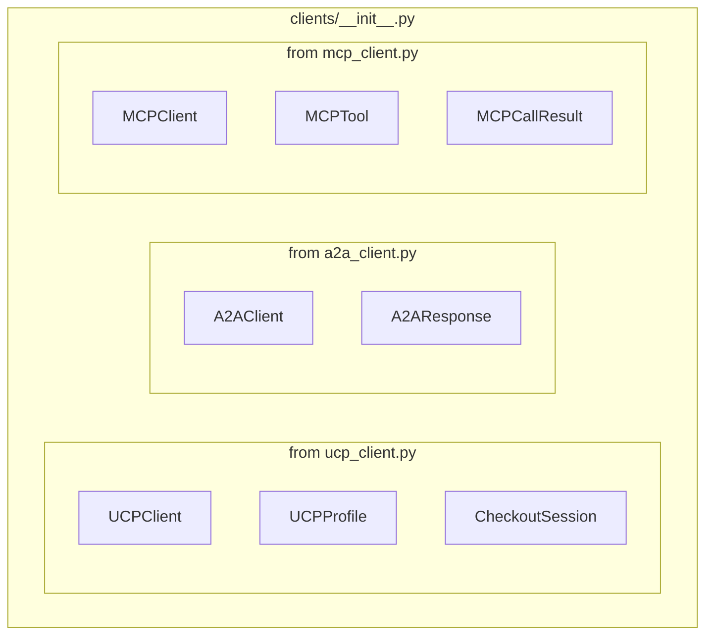
```mermaid
flowchart TB
    subgraph Module["clients/__init__.py"]
        subgraph UCP["from ucp_client.py"]
            UCPClient
            UCPProfile
            CheckoutSession
        end
        
        subgraph A2A["from a2a_client.py"]
            A2AClient
            A2AResponse
        end
        
        subgraph MCP["from mcp_client.py"]
            MCPClient
            MCPTool
            MCPCallResult
        end
    end
```

---

## Fluxos de Integração

### Fluxo Completo de Compra Multi-Loja

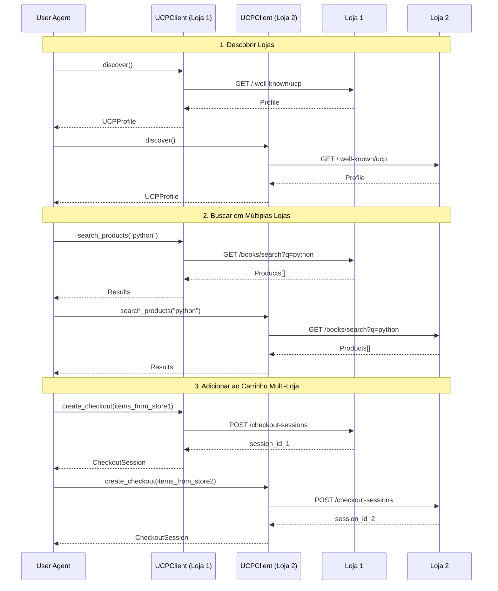
```mermaid
sequenceDiagram
    participant User as User Agent
    participant UCP1 as UCPClient (Loja 1)
    participant UCP2 as UCPClient (Loja 2)
    participant Store1 as Loja 1
    participant Store2 as Loja 2

    Note over User,Store2: 1. Descobrir Lojas
    User->>UCP1: discover()
    UCP1->>Store1: GET /.well-known/ucp
    Store1-->>UCP1: Profile
    UCP1-->>User: UCPProfile
    
    User->>UCP2: discover()
    UCP2->>Store2: GET /.well-known/ucp
    Store2-->>UCP2: Profile
    UCP2-->>User: UCPProfile

    Note over User,Store2: 2. Buscar em Múltiplas Lojas
    User->>UCP1: search_products("python")
    UCP1->>Store1: GET /books/search?q=python
    Store1-->>UCP1: Products[]
    UCP1-->>User: Results
    
    User->>UCP2: search_products("python")
    UCP2->>Store2: GET /books/search?q=python
    Store2-->>UCP2: Products[]
    UCP2-->>User: Results

    Note over User,Store2: 3. Adicionar ao Carrinho Multi-Loja
    User->>UCP1: create_checkout(items_from_store1)
    UCP1->>Store1: POST /checkout-sessions
    Store1-->>UCP1: session_id_1
    UCP1-->>User: CheckoutSession
    
    User->>UCP2: create_checkout(items_from_store2)
    UCP2->>Store2: POST /checkout-sessions
    Store2-->>UCP2: session_id_2
    UCP2-->>User: CheckoutSession
```

### Fluxo de Conversa A2A com Fallback

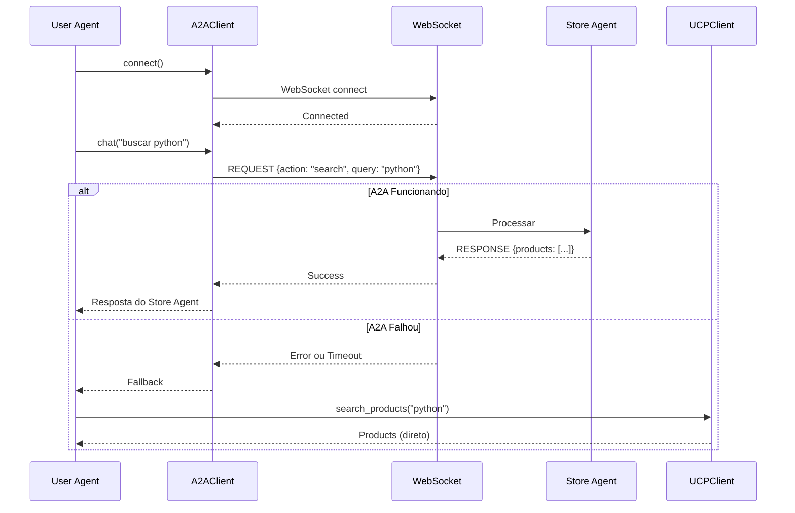
```mermaid
sequenceDiagram
    participant User as User Agent
    participant A2A as A2AClient
    participant WS as WebSocket
    participant Store as Store Agent
    participant UCP as UCPClient

    User->>A2A: connect()
    A2A->>WS: WebSocket connect
    WS-->>A2A: Connected
    
    User->>A2A: chat("buscar python")
    A2A->>WS: REQUEST {action: "search", query: "python"}
    
    alt A2A Funcionando
        WS->>Store: Processar
        Store-->>WS: RESPONSE {products: [...]}
        WS-->>A2A: Success
        A2A-->>User: Resposta do Store Agent
    else A2A Falhou
        WS-->>A2A: Error ou Timeout
        A2A-->>User: Fallback
        User->>UCP: search_products("python")
        UCP-->>User: Products (direto)
    end
```

---

## Gerenciamento de Conexões

### UCPClient - Context Manager

```python
# Uso recomendado com context manager
async with UCPClient("http://localhost:8182") as client:
    profile = await client.discover()
    products = await client.search_products("python")
    # Conexão fechada automaticamente ao sair do bloco
```

### A2AClient - Conexão Persistente

```python
# Conexão WebSocket persistente
client = A2AClient("http://localhost:8000", auto_reconnect=True)

await client.connect()  # Conecta via WebSocket

try:
    # Múltiplas requisições na mesma conexão
    response1 = await client.search("python")
    response2 = await client.chat("tem mais livros?")
    response3 = await client.get_categories()
finally:
    await client.disconnect()  # Fechar conexão
```

### A2AClientPool - Pool de Conexões

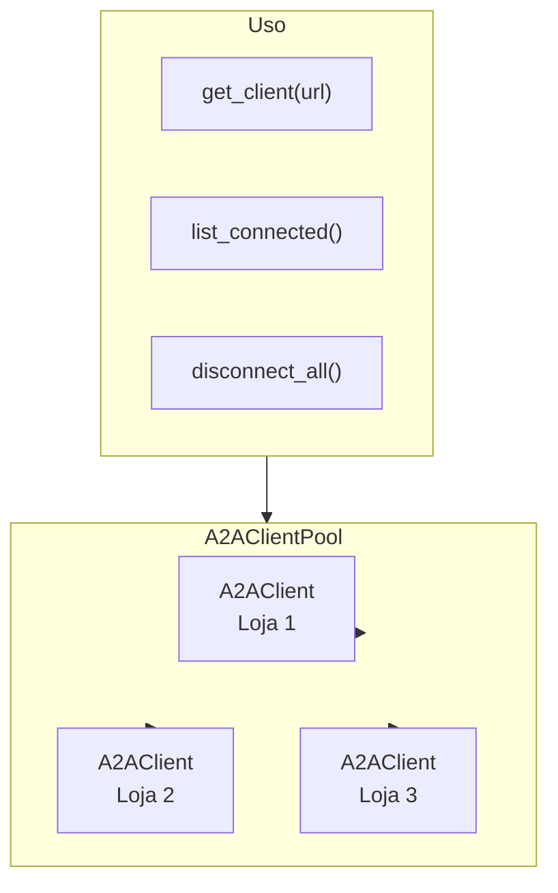
```mermaid
flowchart TB
    subgraph Pool["A2AClientPool"]
        Client1["A2AClient<br/>Loja 1"]
        Client2["A2AClient<br/>Loja 2"]
        Client3["A2AClient<br/>Loja 3"]
    end
    
    subgraph Usage["Uso"]
        Get["get_client(url)"]
        List["list_connected()"]
        Disconnect["disconnect_all()"]
    end
    
    Usage --> Pool
    Pool --> Client1
    Pool --> Client2
    Pool --> Client3
```

---

## Tratamento de Erros

### Padrão de Resposta

Todos os clientes seguem padrões consistentes:

**UCPClient:**
- Retorna `None` em caso de erro
- Logs de erro via `structlog`
- Exceções HTTP são capturadas

**A2AClient:**
- Retorna `A2AResponse` com `success=False` em caso de erro
- Campo `error` contém mensagem de erro
- Reconexão automática se `auto_reconnect=True`

**MCPClient:**
- Retorna `MCPCallResult` com `success=False` em caso de erro
- Campo `error` contém mensagem de erro
- Logs de erro via `structlog`

### Exemplo de Tratamento

```python
# UCPClient
async with UCPClient(url) as client:
    session = await client.create_checkout(items, buyer)
    if session is None:
        print("Erro ao criar checkout")
        return
    
    result = await client.complete_checkout(session.id, token)
    if "error" in result:
        print(f"Erro: {result['error']}")

# A2AClient
response = await client.search("python")
if not response.success:
    print(f"Erro A2A: {response.error}")
else:
    products = response.data.get("products", [])

# MCPClient
result = await client.call_tool("search_books", {"query": "python"})
if not result.success:
    print(f"Erro MCP: {result.error}")
else:
    books = result.data.get("books", [])
```

---

## Headers e Autenticação

### UCP Headers

O `UCPClient` gera automaticamente headers UCP:

```python
{
    "UCP-Agent": "user-agent/1.0",
    "request-id": "<uuid>",
    "idempotency-key": "<uuid>",
    "ucp-timestamp": "<unix_timestamp>"
}
```

### A2A Headers

O `A2AClient` inclui informações no payload:

```python
{
    "type": "a2a.request",
    "message_id": "<uuid>",
    "timestamp": <unix_timestamp>,
    "agent_id": "<agent_id>",
    "action": "<action>",
    "payload": {...}
}
```

### MCP Headers

O `MCPClient` usa headers HTTP padrão:

```python
{
    "Content-Type": "application/json"
}
```

---

## Dependências

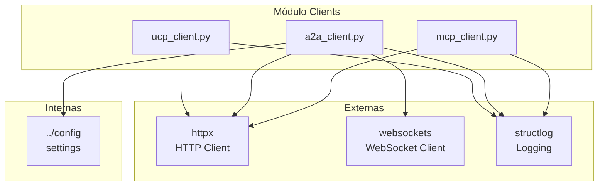
```mermaid
flowchart TB
    subgraph External["Externas"]
        httpx["httpx<br/>HTTP Client"]
        websockets["websockets<br/>WebSocket Client"]
        structlog["structlog<br/>Logging"]
    end
    
    subgraph Internal["Internas"]
        config["../config<br/>settings"]
    end
    
    subgraph Clients["Módulo Clients"]
        ucp["ucp_client.py"]
        a2a["a2a_client.py"]
        mcp["mcp_client.py"]
    end
    
    ucp --> httpx
    ucp --> structlog
    
    a2a --> httpx
    a2a --> websockets
    a2a --> structlog
    a2a --> config
    
    mcp --> httpx
    mcp --> structlog
```

---

## Instâncias Globais

### A2AClientPool

O módulo A2A fornece um pool global para reutilização de conexões:

```python
from user_agent.src.clients.a2a_client import get_a2a_pool

pool = get_a2a_pool()

# Obter cliente (reutiliza se já existe)
client = await pool.get_client("http://localhost:8000")

# Listar conectados
connected_stores = pool.list_connected()

# Desconectar todas
await pool.disconnect_all()
```

---

## Referências

- **Agent Module:** [`../agent/agent.md`](../agent/agent.md)
- **Security Module:** [`../security/`](../security/)
- **Config:** [`../config.py`](../config.py)
- **UCP Specification:** Universal Commerce Protocol
- **A2A Specification:** Agent-to-Agent Protocol
- **MCP Specification:** Model Context Protocol
