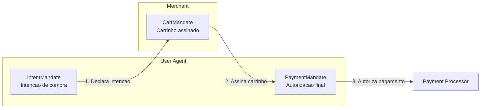
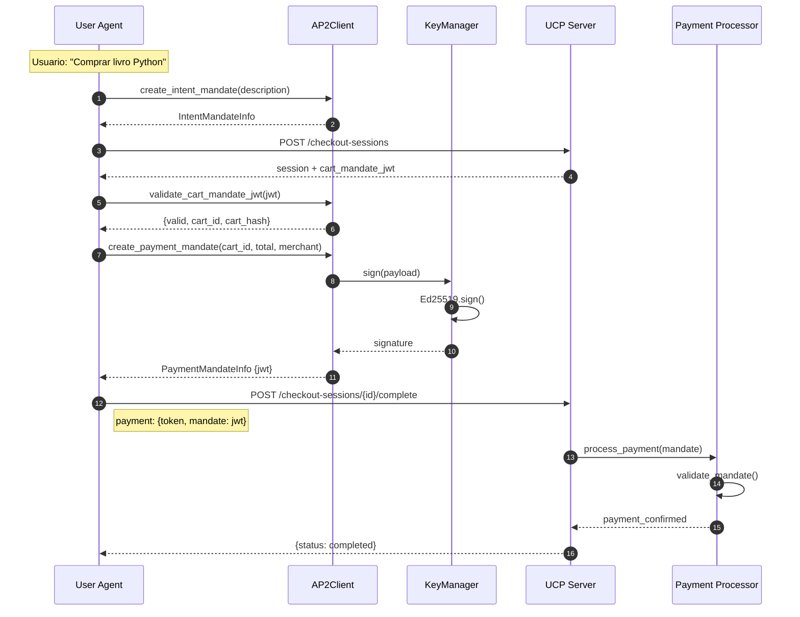

# AP2 Client - Pagamentos Autonomos

Cliente AP2 (Agent Payments Protocol v2) para o User Agent.

Implementa o fluxo de 3 mandatos para pagamentos autonomos.

---

## Visao Geral

O AP2 permite que o User Agent autorize pagamentos de forma autonoma, sem intervencao humana a cada compra.



---

## Fluxo de 3 Mandatos

### 1. IntentMandate (Usuario)

Usuario expressa intencao de compra em linguagem natural.

```python
intent = ap2.create_intent_mandate(
    description="Quero comprar livros de Python ate R$ 100",
    merchants=["http://livraria.local"],
    requires_confirmation=True,
    expiry_minutes=60
)
```

**Campos:**
- `description`: Intencao em linguagem natural
- `allowed_merchants`: Lojas permitidas
- `allowed_skus`: SKUs permitidos (opcional)
- `requires_user_confirmation`: Exigir confirmacao
- `supports_refund`: Suportar reembolso
- `intent_expiry`: Expiracao ISO8601

### 2. CartMandate (Merchant)

Merchant assina o carrinho com garantia de preco.

```python
# Recebido do servidor apos criar checkout
cart_mandate_jwt = session.get("cart_mandate")

# Validar
validation = ap2.validate_cart_mandate_jwt(cart_mandate_jwt)
if validation["valid"]:
    cart_id = validation["cart_id"]
    cart_hash = validation["cart_hash"]
```

### 3. PaymentMandate (Usuario)

Usuario autoriza pagamento final.

```python
payment = ap2.create_payment_mandate(
    cart_id="sess_123",
    cart_total=3990,
    currency="BRL",
    merchant_id="http://livraria.local",
    cart_hash=cart_hash,
    expiry_seconds=300
)

# Enviar JWT para completar checkout
jwt = payment.jwt
```

---

## Classes

### MandateInfo (Legado)

Formato de mandato legado (compatibilidade).

```python
@dataclass
class MandateInfo:
    jwt: str              # JWT assinado
    max_amount: int       # Valor maximo em centavos
    currency: str         # BRL, USD
    beneficiary: str      # URL do merchant
    expires_at: int       # Timestamp de expiracao
    key_id: str           # ID da chave usada
```

### IntentMandateInfo

Informacoes do IntentMandate.

```python
@dataclass
class IntentMandateInfo:
    mandate: IntentMandate  # Mandato
    created_at: datetime    # Criacao
    expires_at: datetime    # Expiracao
```

### PaymentMandateInfo

Informacoes do PaymentMandate.

```python
@dataclass
class PaymentMandateInfo:
    mandate_id: str      # pm_xxxxxxxxxxxx
    jwt: str             # JWT assinado
    cart_id: str         # ID do carrinho
    total: int           # Total em centavos
    currency: str        # Moeda
    merchant: str        # URL do merchant
    created_at: datetime # Criacao
```

---

## Metodos do AP2Client

### Fluxo de 3 Mandatos

| Metodo | Descricao |
|--------|-----------|
| `create_intent_mandate()` | Criar IntentMandate |
| `validate_cart_mandate_jwt()` | Validar CartMandate do merchant |
| `create_payment_mandate()` | Criar PaymentMandate final |
| `get_full_mandate_flow()` | Gerar fluxo completo |

### Mandato Legado

| Metodo | Descricao |
|--------|-----------|
| `create_mandate()` | Criar mandato simples |
| `create_mandate_for_checkout()` | Mandato com margem de seguranca |

### Utilitarios

| Metodo | Descricao |
|--------|-----------|
| `is_sdk_available()` | Verificar se SDK oficial esta disponivel |

---

## Estrutura JWT

### Header

```json
{
  "alg": "EdDSA",
  "typ": "JWT",
  "kid": "user_agent_key_abc123"
}
```

### Payload (PaymentMandate)

```json
{
  "iss": "user-agent",
  "sub": "payment-authorization",
  "aud": "http://livraria.local",
  "iat": 1706976000,
  "exp": 1706976300,
  "nonce": "pm_abc123def456",
  "payment_mandate_id": "pm_abc123def456",
  "cart_id": "sess_123",
  "amount": 3990,
  "currency": "BRL",
  "transaction_data": ["cart_hash_xyz"]
}
```

### Payload (Legado)

```json
{
  "iss": "user-agent",
  "sub": "agent-autonomous-action",
  "aud": "http://livraria.local",
  "iat": 1706976000,
  "exp": 1706979600,
  "scope": "ucp:payment",
  "mandate": {
    "max_amount": 4389,
    "currency": "BRL"
  }
}
```

---

## Diagrama de Sequencia



---

## Exemplo Completo

```python
from user_agent.src.security import get_ap2_client
from user_agent.src.clients import UCPClient

ap2 = get_ap2_client()

async def buy_with_ap2(store_url: str, product_id: str):
    """Comprar usando fluxo AP2 completo."""
    
    # 1. Criar IntentMandate
    intent = ap2.create_intent_mandate(
        description="Comprar livro de programacao",
        merchants=[store_url]
    )
    print(f"Intent criado, expira em: {intent.expires_at}")
    
    async with UCPClient(store_url) as client:
        await client.discover()
        
        # 2. Criar checkout
        session = await client.create_checkout(
            line_items=[{"item": {"id": product_id}, "quantity": 1}],
            buyer_info={"full_name": "User", "email": "user@agent.local"}
        )
        
        # 3. Validar CartMandate (se disponivel)
        cart_mandate = session.get("cart_mandate_jwt")
        cart_hash = None
        if cart_mandate:
            validation = ap2.validate_cart_mandate_jwt(cart_mandate)
            if validation["valid"]:
                cart_hash = validation["cart_hash"]
        
        # 4. Criar PaymentMandate
        payment = ap2.create_payment_mandate(
            cart_id=session.id,
            cart_total=session.total,
            currency="BRL",
            merchant_id=store_url,
            cart_hash=cart_hash
        )
        print(f"PaymentMandate: {payment.mandate_id}")
        
        # 5. Completar checkout
        result = await client.complete_checkout(
            session.id,
            "success_token",
            payment.jwt
        )
        
        if result.get("status") == "completed":
            print(f"Compra realizada! Pedido: {result.get('order_id')}")
        
        return result
```

---

## Compatibilidade SDK

O cliente verifica automaticamente se o SDK oficial do AP2 esta disponivel:

```python
if ap2.is_sdk_available():
    # Usa tipos do SDK oficial
    from ap2.types.mandate import IntentMandate, CartMandate, PaymentMandate
else:
    # Usa tipos locais (fallback)
    pass
```

Para instalar o SDK oficial:

```bash
pip install -e ../sdk/ap2-repo
```

---

## Singleton

Para obter a instancia global:

```python
from user_agent.src.security import get_ap2_client

ap2 = get_ap2_client()
```

---

## Dependencias

O AP2Client usa o `UserKeyManager` para assinar JWTs:

```python
from user_agent.src.security.key_manager import get_user_key_manager

key_manager = get_user_key_manager()
# Chaves Ed25519 persistidas em ~/.user_agent/keys/
```
