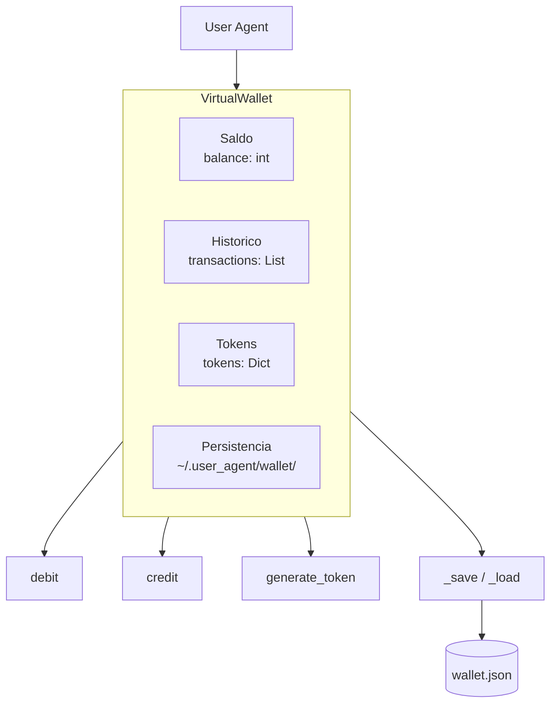
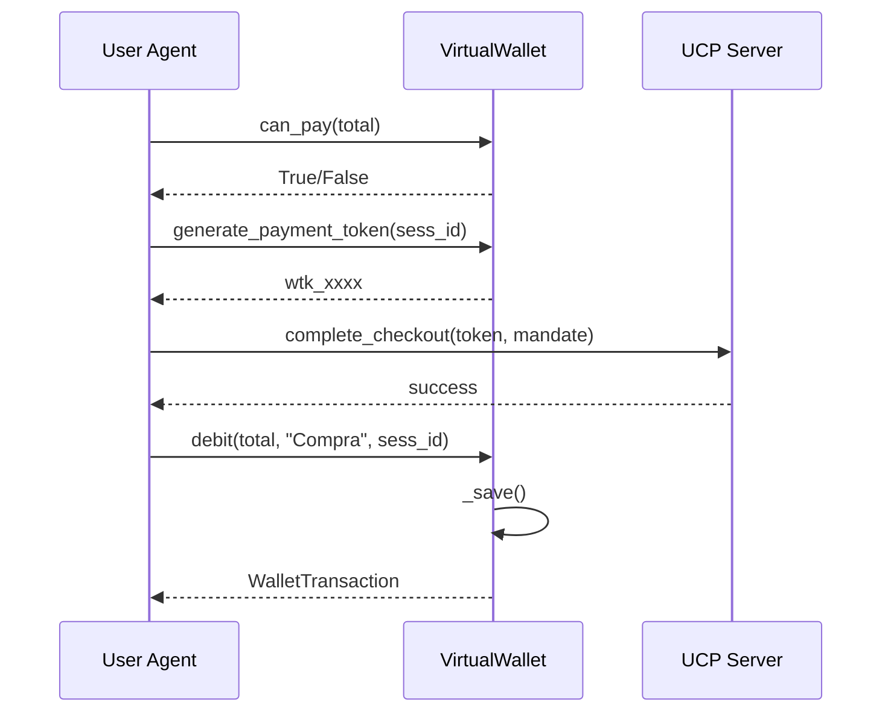

# Carteira Virtual do User Agent

Modulo de gerenciamento de saldo, transacoes e tokens de pagamento.

---

## Visao Geral

A **VirtualWallet** e a carteira local do User Agent que:
- Gerencia saldo em centavos (BRL)
- Registra historico de transacoes
- Gera tokens para pagamento
- Persiste dados em arquivo JSON



---

## Classes

### WalletTransaction

Representa uma transacao registrada na carteira.

```python
@dataclass
class WalletTransaction:
    id: str                           # wtxn_xxxxxxxx
    type: str                         # debit, credit, refund
    amount: int                       # Valor em centavos
    description: str                  # Descricao
    timestamp: datetime               # Data/hora
    psp_transaction_id: Optional[str] # ID no PSP
    checkout_session_id: Optional[str] # ID do checkout
    balance_after: int                # Saldo apos transacao
```

### WalletToken

Token gerado para pagamento.

```python
@dataclass
class WalletToken:
    token: str                        # wtk_xxxxxxxxxxxxxxxx
    created_at: datetime              # Data de criacao
    used: bool                        # Se ja foi usado
    checkout_session_id: Optional[str] # Checkout associado
```

### VirtualWallet

Classe principal da carteira.

```python
class VirtualWallet:
    def __init__(
        self,
        wallet_id: str = "user_agent_wallet",
        initial_balance: int = 50000,  # R$ 500,00
        currency: str = "BRL",
        data_dir: Optional[str] = None
    ): ...
```

---

## Metodos Principais

### Consultas

| Metodo | Retorno | Descricao |
|--------|---------|-----------|
| `balance` | `int` | Saldo em centavos |
| `balance_formatted` | `str` | Saldo formatado (R$ X,XX) |
| `transactions` | `List[WalletTransaction]` | Copia do historico |
| `can_pay(amount)` | `bool` | Verifica se pode pagar |
| `get_info()` | `Dict` | Informacoes completas |
| `get_recent_transactions(limit)` | `List` | Ultimas transacoes |

### Operacoes

#### `generate_payment_token(checkout_session_id)`

Gera token unico para usar em pagamento.

```python
token = wallet.generate_payment_token("sess_123")
# Retorna: "wtk_a1b2c3d4e5f6g7h8"
```

#### `debit(amount, description, psp_transaction_id, checkout_session_id)`

Debita valor da carteira.

```python
txn = wallet.debit(
    amount=3990,           # R$ 39,90
    description="Compra livro Python",
    checkout_session_id="sess_123"
)
# Retorna: WalletTransaction ou None (saldo insuficiente)
```

#### `credit(amount, description, psp_transaction_id)`

Credita valor na carteira.

```python
txn = wallet.credit(
    amount=5000,           # R$ 50,00
    description="Reembolso pedido #456"
)
# Retorna: WalletTransaction
```

#### `add_funds(amount)`

Adiciona fundos (para demo/testes).

```python
txn = wallet.add_funds(10000)  # R$ 100,00
```

---

## Persistencia

A carteira persiste dados em arquivo JSON:

```
~/.user_agent/wallet/user_agent_wallet.json
```

### Estrutura do Arquivo

```json
{
  "wallet_id": "user_agent_wallet",
  "balance": 46010,
  "currency": "BRL",
  "transactions": [
    {
      "id": "wtxn_a1b2c3d4",
      "type": "debit",
      "amount": 3990,
      "description": "Compra livro Python",
      "timestamp": "2026-02-03T10:30:00",
      "checkout_session_id": "sess_123",
      "balance_after": 46010
    }
  ],
  "updated_at": "2026-02-03T10:30:00"
}
```

---

## Singleton

Para obter a instancia global:

```python
from user_agent.src.wallet import get_wallet

wallet = get_wallet()
print(wallet.balance_formatted)  # R$ 460,10
```

---

## Fluxo de Pagamento



---

## Integracao com AP2

A carteira trabalha junto com o cliente AP2:

```python
from user_agent.src.wallet import get_wallet
from user_agent.src.security import get_ap2_client

wallet = get_wallet()
ap2 = get_ap2_client()

# Verificar saldo
if wallet.can_pay(checkout_total):
    # Gerar token
    token = wallet.generate_payment_token(session_id)
    
    # Gerar mandato AP2
    mandate = ap2.create_payment_mandate(
        cart_id=session_id,
        cart_total=checkout_total,
        currency="BRL",
        merchant_id=store_url
    )
    
    # Completar pagamento
    result = await ucp_client.complete_checkout(
        session_id, token, mandate.jwt
    )
    
    # Debitar carteira
    if result.get("status") == "completed":
        wallet.debit(checkout_total, f"Compra {session_id}")
```

---

## Exemplo Completo

```python
from user_agent.src.wallet import VirtualWallet

# Criar carteira com saldo inicial
wallet = VirtualWallet(
    wallet_id="minha_carteira",
    initial_balance=100000  # R$ 1.000,00
)

print(f"Saldo: {wallet.balance_formatted}")
# Saldo: R$ 1.000,00

# Gerar token
token = wallet.generate_payment_token("sess_001")

# Debitar compra
txn = wallet.debit(
    amount=4990,
    description="Livro: Clean Code",
    checkout_session_id="sess_001"
)

print(f"Novo saldo: {wallet.balance_formatted}")
# Novo saldo: R$ 950,10

# Ver transacoes
for t in wallet.get_recent_transactions(5):
    print(f"{t.type}: R$ {t.amount/100:.2f} - {t.description}")

# Adicionar fundos
wallet.add_funds(20000)  # R$ 200,00
print(f"Saldo atualizado: {wallet.balance_formatted}")
# Saldo atualizado: R$ 1.150,10
```
