# User Agent - Agente Pessoal Autônomo

Este diretório contém o código fonte do **User Agent**, um agente pessoal autônomo e genérico que atua como assistente do usuário. O User Agent pode descobrir e interagir com agentes A2A, lojas UCP, usar ferramentas MCP e realizar compras autônomas com pagamento AP2.

## Visão Geral

O User Agent é um agente inteligente que:

- **Conversa** com o usuário de forma natural usando LLM
- **Descobre e conecta** a agentes A2A e lojas UCP
- **Busca produtos** em múltiplas lojas simultaneamente
- **Gerencia carrinho** multi-loja
- **Compara preços** entre lojas diferentes
- **Realiza compras autônomas** com pagamento AP2 (3 mandatos)
- **Usa ferramentas MCP** para ações externas
- **Delega tarefas** para agentes especializados

---

## Arquitetura do User Agent

```
user_agent/
├── src/
│   ├── __init__.py          # Exports principais
│   ├── cli.py               # Interface CLI (Typer)
│   ├── config.py            # Configurações
│   │
│   ├── agent/               # Agente Principal (LangGraph)
│   │   ├── agent.md         # → Documentação completa
│   │   ├── state.py         # Estado compartilhado
│   │   ├── graph.py         # Grafo LangGraph
│   │   ├── llm.py           # Integração LLM
│   │   └── nodes/           # Nodes especializados
│   │       ├── discovery.py
│   │       ├── shopping.py
│   │       ├── compare.py
│   │       └── chat.py
│   │
│   ├── clients/             # Clientes de Protocolo
│   │   ├── client.md        # → Documentação completa
│   │   ├── ucp_client.py    # Cliente UCP
│   │   ├── a2a_client.py    # Cliente A2A
│   │   └── mcp_client.py    # Cliente MCP
│   │
│   ├── security/            # Segurança AP2
│   │   ├── ap2.md           # → Documentação AP2
│   │   ├── ap2_client.py    # Cliente AP2 (3 mandatos)
│   │   └── key_manager.py   # Gerenciamento de chaves Ed25519
│   │
│   └── wallet/              # Carteira Virtual
│       ├── wallet.md        # → Documentação Wallet
│       ├── __init__.py      # Exports
│       └── wallet.py        # VirtualWallet
│
├── .env                     # Configurações locais
├── pyproject.toml           # Dependências Python
├── requirements.txt         # Requirements
└── userAgent.md            # Esta documentação
```

### Diagrama de Arquitetura Completo

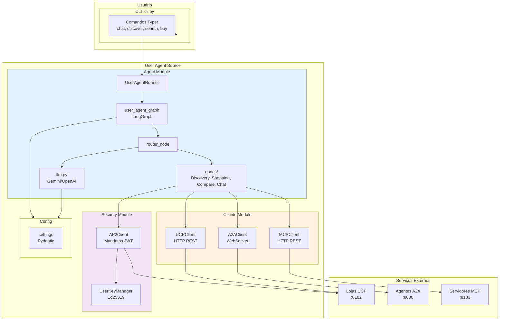

---

## Componentes Principais

### 1. CLI (`cli.py`)

Interface de linha de comando usando Typer e Rich para uma experiência interativa.

#### Comandos Disponíveis

| Comando | Descrição | Uso |
|---------|-----------|-----|
| `chat` | Iniciar chat interativo | `user-agent chat [--store URL] [--agent URL]` |
| `discover` | Descobrir loja UCP | `user-agent discover <url>` |
| `search` | Buscar produtos | `user-agent search <query> [--store URL]` |
| `buy` | Comprar produto diretamente | `user-agent buy <product_id> [--store URL]` |
| `info` | Mostrar informações do agente | `user-agent info` |

#### Estrutura do CLI

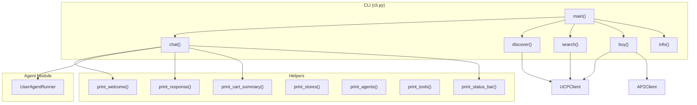

#### Fluxo de Chat Interativo

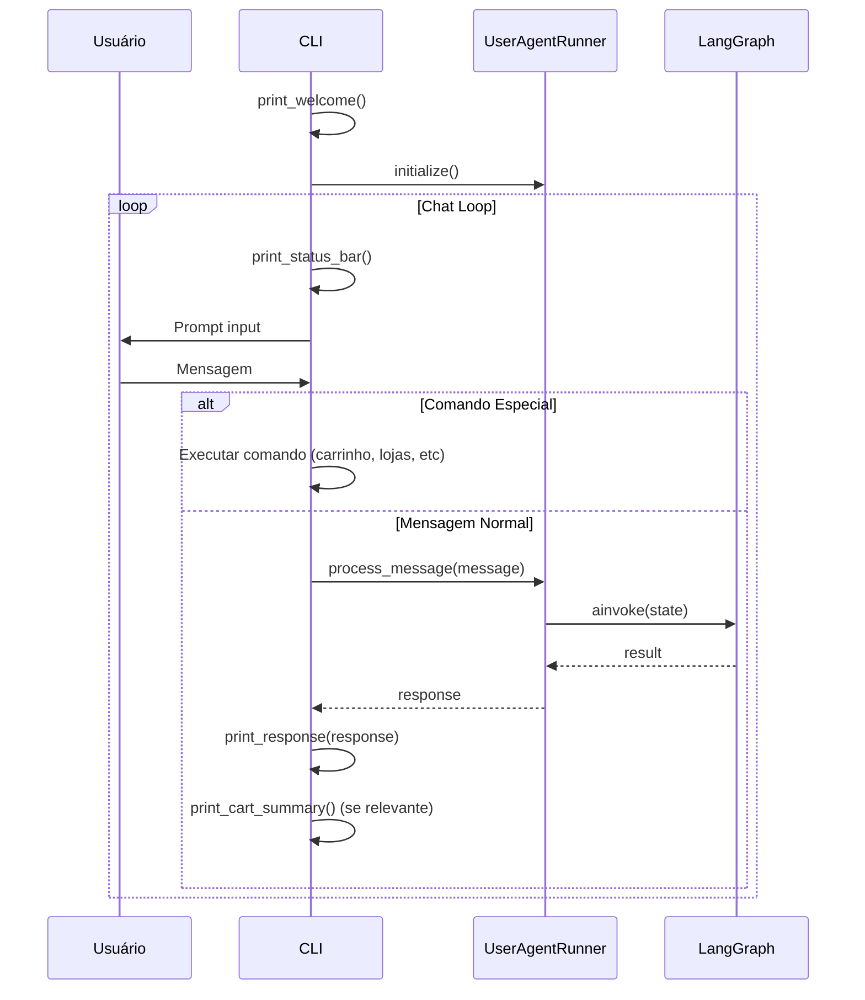

---

### 2. Agent Module (`agent/`)

Sistema de agentes inteligentes usando LangGraph.

📄 **Documentação completa:** [`src/agent/agent.md`](src/agent/agent.md)

#### Visão Geral

O módulo Agent implementa o agente pessoal usando LangGraph com:

- **State** - Estado compartilhado (`UserAgentState`)
- **Graph** - Grafo LangGraph orquestrador
- **Router** - Detecção de intenção inteligente (LLM/keywords)
- **Nodes** - Nodes especializados (Discovery, Shopping, Compare, Chat)

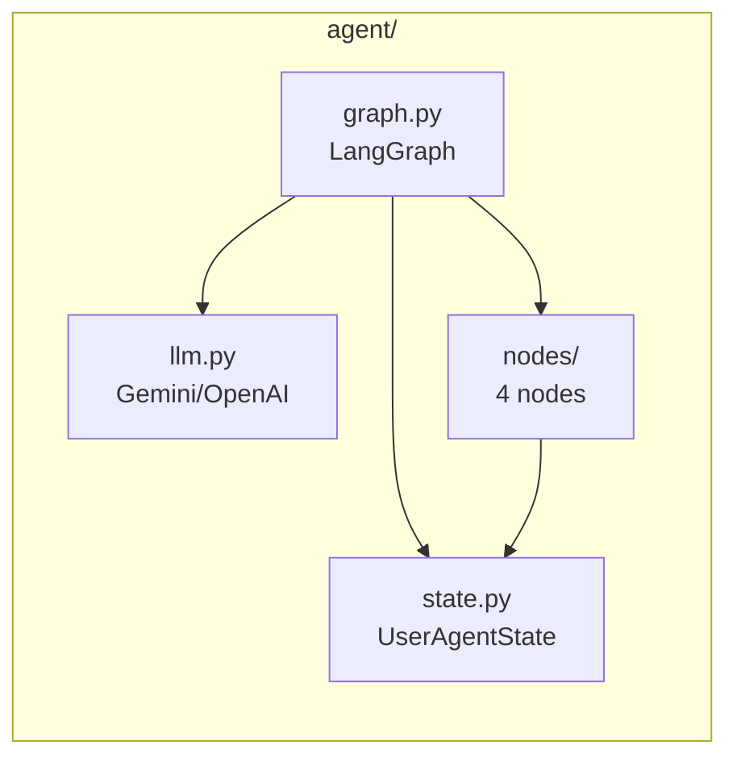

#### Nodes Disponíveis

| Node | Responsabilidade | Intenções |
|------|------------------|-----------|
| **router** | Detectar intenção e rotear | Todas |
| **question** | Responder perguntas gerais | question |
| **agents** | Gerenciar agentes A2A | discover_agent, list_agents |
| **discovery** | Descobrir lojas e buscar produtos | discover, search, recommend |
| **shopping** | Carrinho e checkout | add_to_cart, checkout, apply_discount |
| **compare** | Comparar preços | compare |
| **chat** | Conversa via A2A | talk_to_agent, chat |
| **mcp** | Ferramentas MCP | use_tool, list_tools |
| **help** | Ajuda | help |

---

### 3. Clients Module (`clients/`)

Clientes para comunicação com protocolos externos.

📄 **Documentação completa:** [`src/clients/client.md`](src/clients/client.md)

#### Visão Geral

O módulo Clients fornece três clientes principais:

- **UCPClient** - Cliente para Universal Commerce Protocol
- **A2AClient** - Cliente para Agent-to-Agent Protocol
- **MCPClient** - Cliente para Model Context Protocol

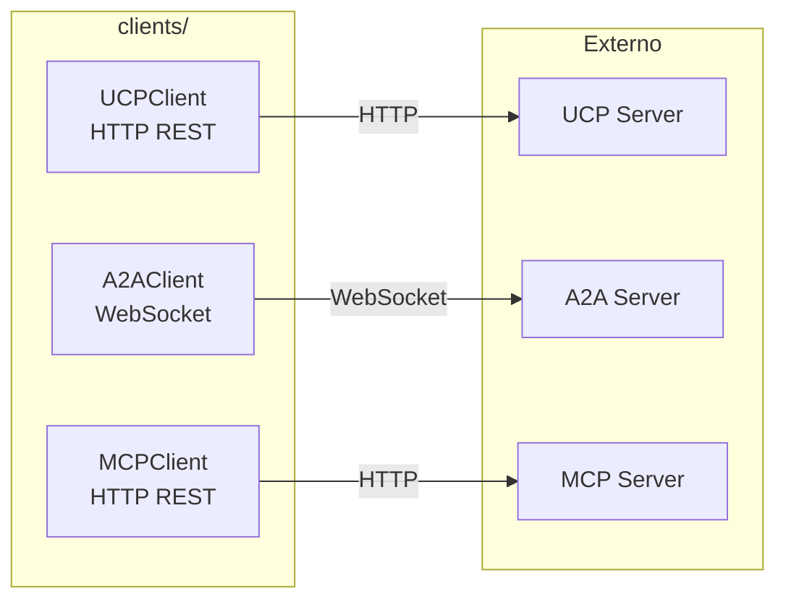

#### Funcionalidades por Cliente

**UCPClient:**
- Descoberta de lojas (`discover()`)
- Busca de produtos (`search_products()`)
- Criação de checkout (`create_checkout()`)
- Aplicação de descontos (`apply_discount()`)
- Completar checkout (`complete_checkout()`)

**A2AClient:**
- Conexão WebSocket persistente (`connect()`)
- Requisições A2A (`request()`)
- Reconexão automática
- Keep-alive (ping)
- Pool de conexões (`A2AClientPool`)

**MCPClient:**
- Descoberta de ferramentas (`discover_tools()`)
- Chamada de ferramentas (`call_tool()`)
- Helpers específicos (search_books, get_book_details, etc.)

---

### 4. Security Module (`security/`)

Segurança AP2 e gerenciamento de chaves para pagamentos autônomos.

📄 **Documentação:** [`src/security/ap2.md`](src/security/ap2.md)

#### Componentes

- **AP2Client** - Geração de mandatos JWT para pagamentos autônomos
- **UserKeyManager** - Gerenciamento de chaves Ed25519 do usuário

#### Fluxo de 3 Mandatos AP2

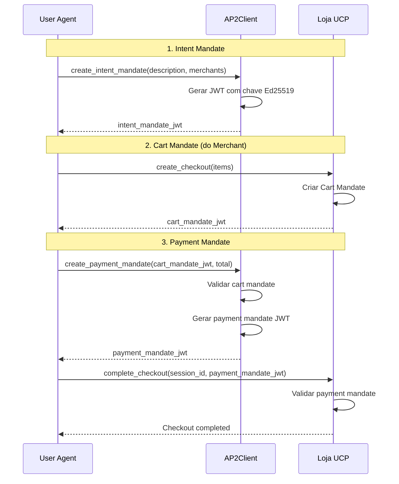

---

## Fluxos Principais

### Fluxo de Descoberta e Compra

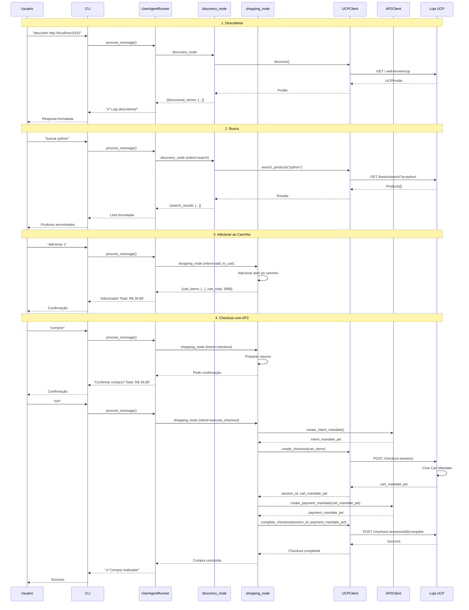

### Fluxo de Conversa A2A

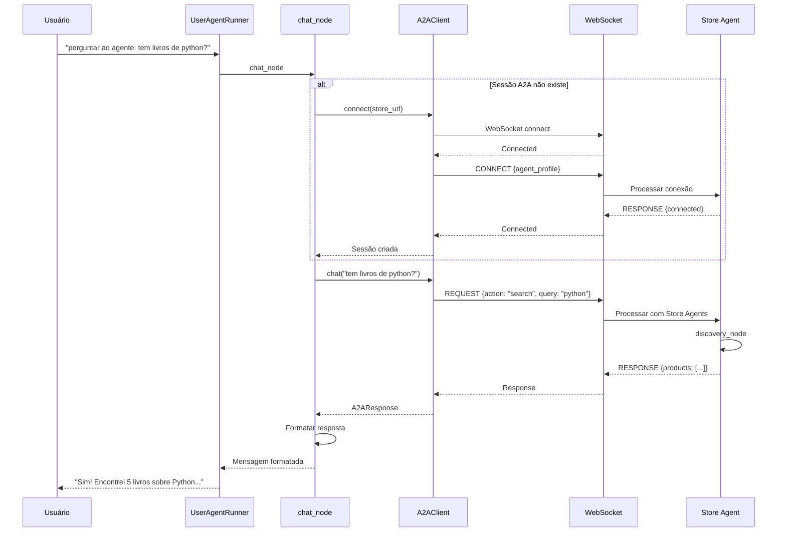

### Fluxo Multi-Loja

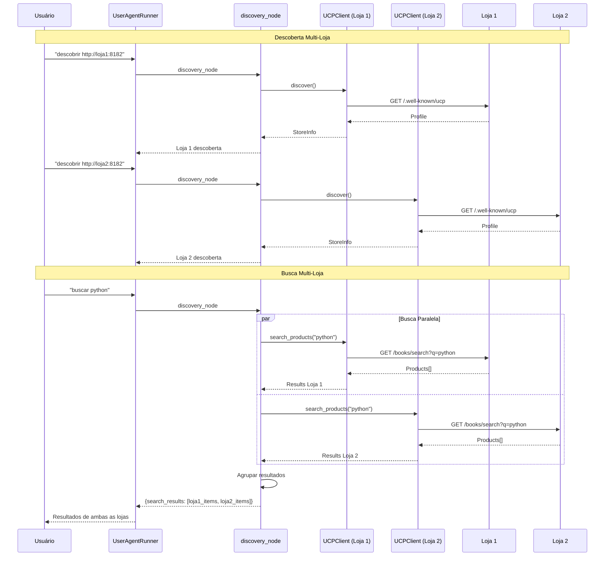

---

## Configuração e Variáveis de Ambiente

### Arquivo `.env`

```bash
# LLM - Gemini (prioritário)
GOOGLE_API_KEY=sua-chave-aqui
GEMINI_MODEL=gemini-2.0-flash-lite

# LLM - Fallback
OPENAI_API_KEY=sk-...
ANTHROPIC_API_KEY=sk-ant-...
LLM_MODEL=gpt-4-turbo-preview

# HTTP
HTTP_TIMEOUT=30.0

# A2A
A2A_RECONNECT_INTERVAL=5.0
A2A_PING_INTERVAL=30.0

# Default Stores
DEFAULT_STORES=http://localhost:8182
API_GATEWAY_URL=http://localhost:8000
UCP_SERVER_URL=http://localhost:8182

# Security
JWT_EXPIRY_SECONDS=3600
USER_KEY_ID=user-agent-key-001

# Debug
DEBUG=True
LOG_LEVEL=INFO
```

### Configurações Principais

| Categoria | Configuração | Padrão | Descrição |
|-----------|--------------|--------|-----------|
| **LLM** | `GOOGLE_API_KEY` | - | Chave da API do Google (Gemini) |
| **LLM** | `GEMINI_MODEL` | `gemini-2.0-flash-lite` | Modelo Gemini |
| **A2A** | `A2A_RECONNECT_INTERVAL` | `5.0` | Intervalo de reconexão (segundos) |
| **A2A** | `A2A_PING_INTERVAL` | `30.0` | Intervalo de ping (segundos) |
| **Security** | `USER_KEY_ID` | `user-agent-key-001` | ID da chave Ed25519 |
| **Debug** | `DEBUG` | `True` | Modo debug |

---

## Execução

### Instalação

```bash
# Instalar dependências
pip install -r requirements.txt

# Ou via pip
pip install -e .
```

### Uso via CLI

```bash
# Chat interativo
user-agent chat

# Chat com loja pré-conectada
user-agent chat --store http://localhost:8182

# Chat com agente pré-conectado
user-agent chat --agent http://localhost:8000

# Descobrir loja
user-agent discover http://localhost:8182

# Buscar produtos
user-agent search python --store http://localhost:8182

# Comprar produto diretamente
user-agent buy book_001 --store http://localhost:8182 --qty 2

# Informações do agente
user-agent info
```

### Uso Programático

```python
from user_agent.src.agent import UserAgentRunner

# Criar runner
runner = UserAgentRunner()
runner.initialize(session_id="sess_123", user_name="João")

# Processar mensagem
response = await runner.process_message("buscar livros de python")
print(response)

# Verificar status
status = runner.get_status()
print(f"Lojas: {status['stores_count']}, Carrinho: {status['cart_count']}")

# Conectar a loja
await runner.connect_store_a2a("http://localhost:8182")

# Obter carrinho
cart = runner.get_cart_summary()
print(f"Total: R$ {cart['total'] / 100:.2f}")
```

---

## Integração entre Módulos

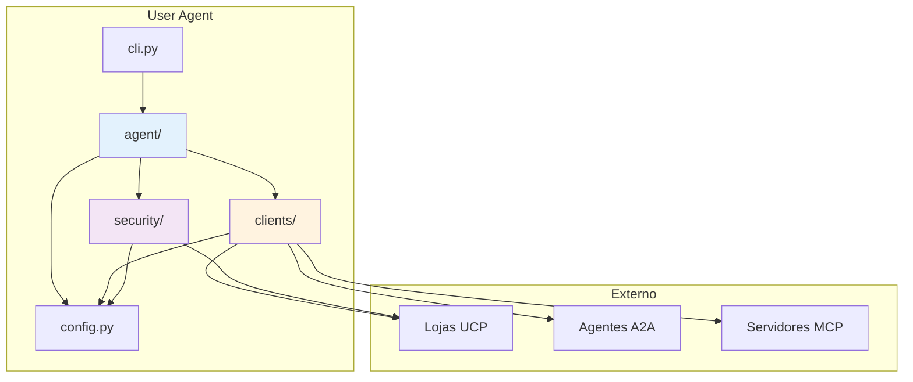

### Tabela de Dependências

| Módulo | Usa | Via |
|--------|-----|-----|
| **cli.py** | agent | `UserAgentRunner` |
| **agent/** | clients | `UCPClient`, `A2AClient`, `MCPClient` |
| **agent/** | security | `AP2Client`, `UserKeyManager` |
| **agent/** | config | `settings` |
| **clients/** | config | `settings` (timeouts, URLs) |
| **security/** | config | `settings` (key_id, jwt_expiry) |

---

## Logging

O User Agent usa `structlog` para logging estruturado:

```python
logger.info("Event", field1=value1, field2=value2)
logger.warning("Warning", error=error_message)
logger.error("Error", error=str(e))
```

### Eventos Logados

| Módulo | Eventos |
|--------|---------|
| **cli.py** | Comandos executados, respostas do usuário |
| **agent/** | Detecção de intenção, processamento de nodes |
| **clients/** | Requisições HTTP/WebSocket, respostas, erros |
| **security/** | Criação de mandatos, assinaturas, validações |

---

## Referências para Documentação Detalhada

### Módulos Principais

- **Agent:** [`src/agent/agent.md`](src/agent/agent.md)
  - Sistema de agentes LangGraph
  - Estado compartilhado (`UserAgentState`)
  - Nodes especializados
  - Integração com LLM

- **Clients:** [`src/clients/client.md`](src/clients/client.md)
  - UCPClient (comércio)
  - A2AClient (comunicação)
  - MCPClient (ferramentas)
  - Pool de conexões

- **Security:** [`src/security/ap2.md`](src/security/ap2.md)
  - AP2Client (mandatos JWT)
  - UserKeyManager (chaves Ed25519)
  - Fluxo de 3 mandatos

---

## Protocolos Suportados

| Protocolo | Cliente | Descrição |
|-----------|---------|-----------|
| **UCP** | `UCPClient` | Universal Commerce Protocol (comércio) |
| **A2A** | `A2AClient` | Agent-to-Agent Protocol (comunicação) |
| **MCP** | `MCPClient` | Model Context Protocol (ferramentas) |
| **AP2** | `AP2Client` | Agent Payments Protocol v2 (pagamento autônomo) |

---

## Arquitetura de Camadas

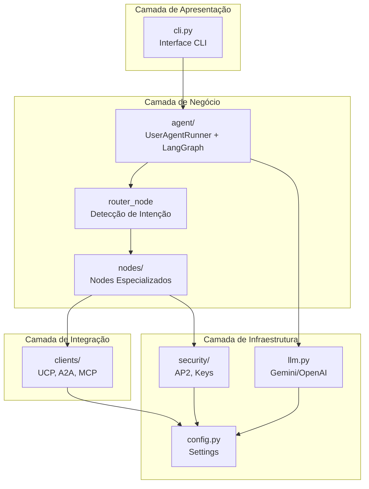

---

## Exemplos de Uso

### Exemplo 1: Descoberta e Busca

```bash
# Iniciar chat
user-agent chat

# Descobrir loja
> descobrir http://localhost:8182
✅ Loja descoberta: Livraria Virtual UCP

# Buscar produtos
> buscar python
📚 Encontrei 5 livros sobre Python:
1. Python para Todos - R$ 39,90
2. Clean Code em Python - R$ 49,90
...

# Adicionar ao carrinho
> adicionar 1
✅ Adicionado! Total: R$ 39,90
```

### Exemplo 2: Compra Autônoma com AP2

```bash
# Ver carrinho
> carrinho
🛒 Carrinho:
  Python para Todos x1 - R$ 39,90
  TOTAL: R$ 39,90

# Finalizar compra
> comprar
📋 Resumo da Compra:
  Total: R$ 39,90
  Confirmar? (sim/não)

> sim
🔐 Gerando mandato AP2...
💳 Processando pagamento...
✅ Compra realizada! Pedido #12345
```

### Exemplo 3: Conversa A2A

```bash
# Descobrir agente
> descobrir agente http://localhost:8000
✅ Agente descoberto: Livraria Virtual UCP
Skills: search, recommend, checkout

# Conversar com agente
> perguntar ao agente: tem livros de machine learning?
🤖 Store Agent: Sim! Encontrei 3 livros sobre Machine Learning...
```

---

## Referências

- **Documentação dos Módulos:**
  - [`src/agent/agent.md`](src/agent/agent.md) - Agente Principal (LangGraph)
  - [`src/clients/client.md`](src/clients/client.md) - Clientes de Protocolo (UCP, A2A, MCP)
  - [`src/security/ap2.md`](src/security/ap2.md) - Segurança AP2 (3 Mandatos)
  - [`src/wallet/wallet.md`](src/wallet/wallet.md) - Carteira Virtual

- **Documentação Externa:**
  - [`../backend/src/src.md`](../backend/src/src.md) - Backend (lojas UCP)
  - [`../docs/architecture/`](../docs/architecture/) - Arquitetura geral

- **Especificações:**
  - Universal Commerce Protocol (UCP)
  - Agent-to-Agent Protocol (A2A)
  - Model Context Protocol (MCP)
  - Agent Payments Protocol v2 (AP2)
